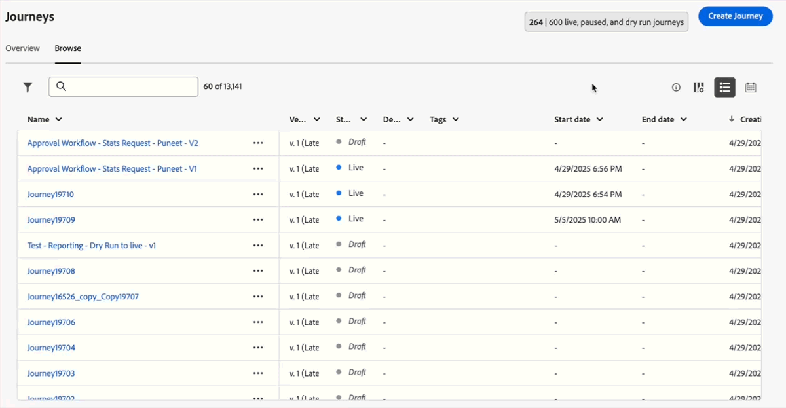

# Versionshinweise {#release-notes}

>[!CONTEXTUALHELP]
>id="ajo_homepage_card1"
>title="Neue Funktionen"
>abstract="**Adobe Journey Optimizer** bietet kontinuierlich neue Funktionen, Verbesserungen vorhandener Funktionen und Fehlerbehebungen. Alle Änderungen werden in der letzten Woche jedes Monats in diesen Versionshinweisen konsolidiert."

[!DNL Adobe Journey Optimizer] bietet kontinuierlich neue Funktionen, Verbesserungen vorhandener Funktionen und Fehlerbehebungen. Alle Änderungen werden in der letzten Woche jedes Monats in diesen Versionshinweisen konsolidiert. [!DNL Adobe Journey Optimizer] setzt nativ auf [!DNL Adobe Experience Platform] auf und profitiert von den neuesten Innovationen und Verbesserungen. Weitere Informationen zu diesen Änderungen finden Sie in den [Versionshinweisen zu Adobe Experience Platform](https://experienceleague.adobe.com/docs/experience-platform/release-notes/latest.html?lang=de){target="_blank"}.

## Updates vom 25. September {#sep-updates}

### Neue Funktionen {#Sep-25-features}

<table>
<thead>
<tr>
<th><strong>Dunkler Modus im E-Mail-Designer</strong> </th>
</tr>
</thead>
<tbody>
<tr>
<td>

Der E-Mail-Designer von Journey Optimizer bietet jetzt die Möglichkeit, in die Ansicht „Dunkler Modus“ zu wechseln, in der Sie zusätzlich bestimmte benutzerdefinierte Einstellungen definieren können, die nur Empfängerinnen und Empfängern angezeigt werden, die ihre E-Mails im dunklen Modus lesen.

Beachten Sie dabei Folgendes:

<ul>
<li>Das endgültige Rendern des dunklen Modus weicht möglicherweise ab und hängt vom E-Mail-Client der Empfängerinnen und Empfänger ab.</li>
<li>Nicht alle E-Mail-Clients unterstützen einen benutzerdefinierten dunklen Modus. Darüber hinaus wenden einige E-Mail-Clients ausschließlich ihren eigenen standardmäßigen dunklen Modus auf alle empfangenen E-Mails an. In beiden Fällen können die im E-Mail-Designer definierten benutzerdefinierten Einstellungen nicht gerendert werden.</li>
</ul>

Weitere Informationen finden Sie in der <a href="../email/dark-mode.md">ausführlichen Dokumentation</a>.

 
Verfügbarkeitsdatum: 16. September 2025

</td>
</tr>
</tbody>
</table>

<table>
<thead>
<tr>
<th><strong>Journey-Pfadoptimierung</strong> </th>
</tr>
</thead>
<tbody>
<tr>
<td>

Verwenden Sie den neuen Optimierungsknoten, um bestimmte Zielgruppen anzusprechen, oder führen Sie A/B-Tests durch, um den besten Pfad zum Erreichen Ihrer geschäftsbezogenen KPIs zu ermitteln.

Mit diesem Tool können Sie Kommunikation, Sequenzierung und Timing testen und variieren sowie anpassen, um Ihre Kundschaft optimal zu erreichen.

Diese Funktion ist nur eingeschränkt verfügbar. Wenden Sie sich an den Adobe-Support, um Zugang zu erhalten.

Weitere Informationen finden Sie in der <a href="../building-journeys/optimize.md">ausführlichen Dokumentation</a>.

Verfügbarkeitsdatum: 4. September 2025

</td>
</tr>
</tbody>
</table>

<table>
<thead>
<tr>
<th><strong>Benutzerdefinierte Methode zur Delegierung von Subdomains</strong> </th>
</tr>
</thead>
<tbody>
<tr>
<td>

Neben der vollständigen Delegierung und CNAME-Methode ist nun eine neue Methode zur Subdomain-Konfiguration verfügbar: die benutzerdefinierte Delegierung, mit der Sie alle Aspekte von DNS, die für den Versand, das Rendern und das Tracking von Nachrichten erforderlich sind, vollständig kontrollieren und verwalten können.

Diese Funktion ist nur eingeschränkt verfügbar. Wenden Sie sich an den Adobe-Support, um Zugang zu erhalten.

Weitere Informationen finden Sie in der <a href="../configuration/delegate-custom-subdomain.md">ausführlichen Dokumentation</a>.

Verfügbarkeitsdatum: 4. September 2025

</td>
</tr>
</tbody>
</table>

<table>
<thead>
<tr>
<th><strong>Verwenden von Adobe Experience Platform-Daten für Personalisierung und Entscheidungsfindung - Eingeschränkte Verfügbarkeit</strong> </th>
</tr>
</thead>
<tbody>
<tr>
<td>

Diese Funktion wurde bereits in der öffentlichen Beta-Version veröffentlicht und steht nun allen Umgebungen mit eingeschränkter Verfügbarkeit zur Verfügung. Mit dieser Version wurden die folgenden Verbesserungen eingeführt:

<ul><li>Unterstützung für die Personalisierung der Datensatzsuche in eingehenden Kanälen.</li>
<li>Die Hilfsfunktion „datasetLookup“ kann jetzt in Ausdrucksfragmenten verwendet werden. Derzeit ist diese Funktion nur für eine begrenzte Anzahl von Kunden verfügbar. Um Zugriff zu erhalten, wenden Sie sich an den Adobe-Support.</li>
<li>Eine Option in der Oberfläche zur Datensatzverwaltung ermöglicht es Ihnen jetzt, auf Datensätzen basierende Datensätze für die Lookup-Personalisierung zu aktivieren, ohne einen API-Aufruf durchführen zu müssen.</li>
<li>Verbesserte Überwachung, um den Datenaufnahmestatus zu verfolgen und zu wissen, wann Datensätze für die Suche bereit sind.</li>
<li>Aktualisierte Nutzungsrichtlinien und Leitplanken, um eine optimale Leistung und Zuverlässigkeit sicherzustellen.</li>
<li>Adobe Experience Platform-Datensätze können jetzt in Entscheidungsbegrenzungsregeln genutzt werden.</li></ul>

Weitere Informationen finden Sie in der <a href="../data/lookup-aep-data.md">ausführlichen Dokumentation</a>.

Verfügbarkeitsdatum: 1. September 2025

</td>
</tr>
</tbody>
</table>

### Verbesserungen {#Sep-25-improv}

* **Stündliches Zurücksetzen der Begrenzungsfrequenz** – Sie können jetzt eine Begrenzung auf stündlicher Basis für Kanalregelsätze anwenden. Zuvor in eingeschränkter Verfügbarkeit verfügbar, ist diese Funktion jetzt für alle Umgebungen verfügbar und ermöglicht Ihnen die Auswahl von 1 Stunde (zuvor 3 Stunden). [Weitere Informationen](../conflict-prioritization/channel-capping.md). Verfügbarkeitsdatum: 17. September

* **Unterstützung dynamischer Domains** - Journey Optimizer unterstützt jetzt die vollständige/Basis-URL-Personalisierung für vordefinierte Domains, die von Adobe akzeptiert werden. [Weitere Informationen](../personalization/personalization-build-expressions.md#where) <!--Availability date: September 12-->

  >[!NOTE]
  >
  >Diese Funktion ist für eine Reihe von Kunden in begrenzter Verfügbarkeit verfügbar.

* **Ausdruck für Entscheidungs-Begrenzungsregeln** - Sie können jetzt eigene Ausdrücke erstellen, um den Schwellenwert einer Begrenzungsregel für ein Entscheidungselement zu definieren. [Weitere Informationen](../experience-decisioning/items.md#capping)

  >[!NOTE]
  >
  >Diese Funktion ist derzeit nur in begrenztem Umfang für alle Benutzer verfügbar.

* **Warnhinweise zur Überwachung der Kanalkonfiguration** - Sie können jetzt Systemwarnungen abonnieren, entweder per E-Mail oder im Journey Optimizer-Benachrichtigungszentrum, falls ein E-Mail-Kanalkonfigurationsfehler beim Verwenden der benutzerdefinierten Subdomain-Delegierung auftritt. [Weitere Informationen](../reports/alerts.md#alert-dns-record-missing)

## Versionshinweise für August 2025 {#25-8-rn}

**Veröffentlichungsdatum**: 19. August 2025

### Neue Funktionen {#Aug-25-8-features}

Im Folgenden werden die neuen Funktionen dieser Version beschrieben.

<table>
<thead>
<tr>
<th><strong>Pausieren und Fortsetzen von Journeys</strong> </th>
</tr>
</thead>
<tbody>
<tr>
<td>

Sie können Ihre Journeys jetzt pausieren und fortsetzen. Diese Funktion gibt Journey-Anwendenden mehr Kontrolle und Flexibilität, da Live-Journeys vorübergehend ausgesetzt werden können, ohne das Kundenerlebnis zu stören. Während der Pause werden keine Nachrichten gesendet und die Profile verbleiben in einem ausgesetzten Zustand, bis die Journey fortgesetzt wird.

Sie können nur eine Journey pausieren und fortsetzen oder Vorgänge zur Massenpause und -fortsetzung von einer Gruppe von Journeys durchführen.

Darüber hinaus können Sie globale Filter auf pausierte Journeys anwenden, um Profile auf der Grundlage ihrer Attribute auszuschließen.

Diese Funktion war zuvor nur eingeschränkt verfügbar, steht aber nun für alle Umgebungen zur Verfügung (allgemeine Verfügbarkeit).

Weitere Informationen finden Sie in der <a href="../building-journeys/journey-pause.md">ausführlichen Dokumentation</a>.

</td>
</tr>
</tbody>
</table>

<table>
<thead>
<tr>
<th><strong>Kalenderansicht</strong> </th>
</tr>
</thead>
<tbody>
<tr>
<td>

Eine Kalenderansicht ist nun in den Journey- und Kampagnenlisten verfügbar. Damit können Sie alle Journey- und Kampagnenaktivierungen in den jeweiligen Listen visualisieren.

Diese Funktion war zuvor nur eingeschränkt verfügbar, steht nun aber für alle Umgebungen zur Verfügung. Im Rahmen dieser allgemein verfügbaren Version bietet die Funktion:

<ul>
<li>Design-Verbesserungen für die Datumsnavigation</li>
<li>Die Möglichkeit, Kampagnenentwürfe anzuzeigen, wenn ein Start- und Enddatum festgelegt wurde</li>
<li>Eine neue Einstellung zum Aus-/Einblenden von Kalenderelementen, die über einen langen Zeitraum ausgeführt werden</li>
</ul>

Weitere Informationen finden Sie in der <a href="../building-journeys/journey-ui.md#calendar">ausführlichen Dokumentation</a>.

</td>
</tr>
</tbody>
</table>

<!--table>
<thead>
<tr>
<th><strong>Use Adobe Experience Platform data for personalization</strong> </th>
</tr>
</thead>
<tbody>
<tr>
<td>

Leverage data from [!DNL Adobe Experience Platform] in the personalization editor to personalize your content and decision attributes. In particular, this allows you to extend the definition of your attributes to additional data in datasets for bulk updates that change periodically without having to manually update the attributes one at a time.

With this release, the following enhancements have been introduced:

<ul>
<li>Support of inbound channels,</li>
<li>The "datasetLookup" helper function can now be used within expression and visual fragments to personalize content using data from Adobe Experience Platform datasets,</li>
<li>An option in the dataset now allows you to enable datasets for lookup personalization, without having to perform an API call.</li>
</ul>

This capability is available in Limited Availability. Contact your Adobe representative to gain access.

For more information, refer to the <a href="../personalization/aep-data-perso.md">detailed documentation</a>

</td>
</tr>
</tbody>
</table-->

<!--table>
<thead>
<tr>
<th><strong>Use Decisioning in email channel</strong> </th>
</tr>
</thead>
<tbody>
<tr>
<td>

You can now add Decision policies into email journeys and campaigns. Decision policies are containers for your offers that leverage the Decisioning engine to dynamically return the best content to deliver for each audience member.

Previously released in Limited Availability, this capability is now available to all environments (General Availability).

<For more information, refer to the <a href="../FILE.md">detailed documentation</a>

</td>
</tr>
</tbody>
</table-->

<table>
<thead>
<tr>
<th><strong>Aktionsaktivität in Journeys</strong> </th>
</tr>
</thead>
<tbody>
<tr>
<td>

Journey Optimizer unterstützt eine neue generische Aktionsaktivität, mit der Sie sowohl einzelne als auch eingehende Aktionsgruppen mit mehreren Aktionen konfigurieren können, was eine optimierte Aktionskonfiguration innerhalb der Journey-Arbeitsfläche ermöglicht. Diese neue Funktion ermöglicht insbesondere Folgendes:

<ul>
<li>Eine vereinfachte, native Aktionskonfiguration innerhalb der Journey-Arbeitsfläche</li>
<li>Die Möglichkeit, eingehende Aktionsgruppen mit mehreren Aktionen zu erstellen</li>
<li>Die Möglichkeit, jeder integrierten Kanalaktion eine Optimierung hinzuzufügen</li>
<li>Die Möglichkeit, jeder Aktion sowohl experimentelle als auch mehrsprachige Optionen hinzuzufügen</li>
</ul>

Diese Funktion ist nur eingeschränkt verfügbar. Wenden Sie sich an den Adobe-Support, um Zugang zu erhalten.

Weitere Informationen finden Sie in der <a href="../building-journeys/journey-action.md">ausführlichen Dokumentation</a>.

</td>
</tr>
</tbody>
</table>

<table>
<thead>
<tr>
<th><strong>PDF-Anhänge an E-Mails</strong> </th>
</tr>
</thead>
<tbody>
<tr>
<td>

Sie können jetzt eine statische PDF-Datei an eine mit Journey Optimizer gesendete E-Mail anhängen.

<ul>
<li>Pro Profil können pro Jahr bis zu 6 Nachrichten mit einem PDF-Anhang gesendet werden.</li>
<li>Die maximale Dateigröße pro Anhang beträgt 5 MB.</li>
<li>Für zusätzliche Größen oder Volumen können Sie ein Zusatzpaket erwerben. Weitere Informationen erhalten Sie beim Adobe-Support.</li>
</ul>

Diese Funktion ist nur eingeschränkt verfügbar. Wenden Sie sich an den Adobe-Support, um Zugang zu erhalten.

Weitere Informationen finden Sie in der <a href="../email/pdf-attachments.md">ausführlichen Dokumentation</a>.

</td>
</tr>
</tbody>
</table>

<!--
<table>
<thead>
<tr>
<th><strong>Landing page custom forms</strong> </th>
</tr>
</thead>
<tbody>
<tr>
<td>

With [!DNL Journey Optimizer], you can now capture profile attributes though your landing pages.

Create, design and manage custom forms tailored to your needs based on a specific dataset. You can then leverage these forms in landing pages to add the profile attributes of your choice into the dataset defined for each form.

This capability is currently in beta version and only available to beta customers. To join the beta program, contact your Adobe representative.

For more information, refer to the <a href="../FILE.md">detailed documentation</a>

</td>
</tr>
</tbody>
</table>
-->

<table>
<thead>
<tr>
<th><strong>Optimierung in Kampagnen</strong> </th>
</tr>
</thead>
<tbody>
<tr>
<td>

Mit Journey Optimizer verfügen Sie jetzt über die Tools, um Ihrer Zielgruppe personalisierte und optimierte Inhalte bereitzustellen. Sie können damit Inhaltsexperimente durchführen, regelbasiertes Targeting erstellen und beide Funktionen in komplexen Kombinationen einsetzen, um die Effektivität Ihrer Kampagnen und Journeys zu maximieren.

Mit der Optimierung können Sie:

<ul>
<li>Mehrere Inhaltsvarianten testen, um das effektivste Messaging zu identifizieren.</li>
<li>Personalisierte Inhalte auf Basis von Benutzerattributen und kontextuellen Daten bereitstellen.</li>
<li>Targeting und Experimente für erweiterte Strategien kombinieren.</li>
<li>Benutzende herausfiltern, die nicht den Variantenkriterien entsprechen.</li>
<li>Fallback-Mechanismen zur Aufrechterhaltung der Benutzerinteraktion sicherstellen.</li>
</ul>

Sobald die Journey oder Kampagne live ist, werden Profile anhand der definierten Kriterien bewertet und ihnen werden entsprechend den Übereinstimmungskriterien die passenden Erlebnisse oder Inhalte bereitgestellt.

Diese Funktion, die zuvor am 8. August nur für Kampagnen veröffentlicht wurde, ist nun seit dem 22. August auch für Journeys verfügbar.

Weitere Informationen finden Sie in der <a href="../campaigns/campaigns-message-optimization.md">ausführlichen Dokumentation</a>.

</td>
</tr>
</tbody>
</table>

### Verbesserungen {#Aug-25-8-improv}

Im Folgenden sind die Verbesserungen dieser Version aufgeführt.

* **Administration**

   * **Warnhinweise zur Kanalkonfiguration** – Sie können nun Systemwarnungen per E-Mail oder im Journey Optimizer- Benachrichtigungszentrum abonnieren, falls <!--a channel configuration failure happens or if -->ein DNS-Eintrag fehlt. [Weitere Informationen](../reports/alerts.md#alert-dns-record-missing)

* **KI-Assistent**

   * **Inhaltserstellung in mehreren Sprachen** – Inhalte können jetzt auf Französisch, Spanisch, Deutsch, Italienisch, Japanisch, Schwedisch, Niederländisch und Norwegisch generiert werden. [Weitere Informationen](../content-management/generative-uc.md#languages)

     Verfügbarkeitsdatum: 25. August

* **Kampagnen**

   * **Ratensteuerung in ausgehenden Kampagnen** – Sie können jetzt die Ratensteuerung für ausgehende Kampagnen (E-Mail, SMS, Push-Benachrichtigungen) aktivieren, um eine Überlastung nachgelagerter Systeme wie Landingpages oder Kundendienstplattformen zu verhindern. [Weitere Informationen](../campaigns/campaign-schedule.md#rate-control)

   * **Kampagnenplanung für Aktionen**: Die täglichen, wöchentlichen und monatlichen Kampagnenplaner wurden aktualisiert, um eine detailliertere Kontrolle über wiederkehrende Zeitpläne zu ermöglichen:

      * **Wöchentliches Intervall**: Sie können die Kampagne jetzt wöchentlich oder alle zwei Wochen wiederholen und die Wochentage auswählen, an denen sie ausgeführt werden soll.

      * **Monatliches Intervall**: Sie können die Kampagne jetzt jeden Monat oder jeden zweiten Monat wiederholen und den Tag des Monats auswählen, an dem sie ausgeführt werden soll.

      * **Tägliche, wöchentliche oder monatliche Zeitpläne**: Sie können angeben, ob der wiederkehrende Zeitplan an einem bestimmten Datum oder nach einer bestimmten Anzahl von Wiederholungen beendet werden soll.

   * **Geplante Transaktionsaktionskampagnen** :Geplante Transaktionsaktionskampagnen sind jetzt zum Senden von zielgruppenbasierten Batch-Transaktionsnachrichten über E-Mail-, SMS- und Push-Kanäle verfügbar.

* **Kanal – Inhaltskarten**

   * **Layout-Vorlagen für Inhaltskarten** – Der Kanal für Inhaltskarten bietet jetzt vordefinierte Nachrichten-Layouts, die Ihr Authoring-Erlebnis optimieren. Diese Version umfasst die Layout-Vorlagen „Kleines Bild“, „Großes Bild“ und „Nur Bild“. [Weitere Informationen](../content-card/design-content-card.md)

* **Kanal – Push**

   * **Ablaufdatum für Push-Benachrichtigungen**: Sie können nun für jede Push-Benachrichtigung ein Ablaufdatum angeben, wodurch verhindert wird, dass zeitkritische Nachrichten (z. B. zum Black Friday Sale) nach einem bestimmten Datum gesendet werden, und somit eine schlechte Kundenerfahrung vermieden wird.

* **Kanal – SMS**

   * **Unpräzises Opt-out**: Wenn diese Option aktiviert ist, erkennt das **unpräzise Opt-out** eingehende Nachrichten, die definierten Opt-out-Schlüsselwörtern sehr ähnlich sind (z. B. „CANCIL“), und sendet automatisch eine Bestätigungsantwort, um die Abmeldeabsicht der Benutzenden zu überprüfen. Wenn die Benutzenden über den definierter Prompt bestätigen, wird das Abonnement gekündigt. [Weitere Informationen](../sms/sms-configuration-sinch.md)

     >[!NOTE]
     >
     >Beachten Sie, dass **Unpräzises Opt-out** nur mit Sinch und Infobip verfügbar ist.

   * **SMS-Verbindung überprüfen** – Sie können nun Ihre SMS-API-Anmeldedaten ganz einfach in Adobe Journey Optimizer testen und überprüfen, indem Sie eine Beispielnachricht an ein bestimmtes Gerät senden. [Weitere Informationen](../sms/sms-configuration-sinch.md)

* **Konfiguration**

   * **Unterstützung benutzerdefinierter Attribute mit einer URL zum Abmelden mit einem Klick**: Bei Journey Optimizer können Sie einen externen, benutzerdefinierten Endpunkt festlegen, indem Sie einen individuellen Link zum Abmelden mit einem Klick in der E-Mail-Konfiguration definieren, wenn das Einverständnis außerhalb von Adobe verwaltet wird. Wenn Ihre Empfängerinnen oder Empfänger auf den Link zum Abmelden klicken, fügt Journey Optimizer standardmäßige profilspezifische Parameter an das Einverständnisaktualisierungsereignis an.

     Um einen Link zum Abmelden mit einem Klick weiter zu personalisieren, können Sie jetzt benutzerdefinierte Attribute definieren, die an das Einverständnisereignis angehängt werden. [Weitere Informationen](../email/list-unsubscribe.md#custom-attributes)

* **Datensätze**

   * **Repository der Erlebnis-Entscheidungs-Objekte – personalisierte Angebotselemente**: Der integrierte Exportdatensatz erfasst jetzt alle Angebotsattribute und den Lebenszyklusstatus und ermöglicht so eine vollständige Personalisierung und ein vollständiges Reporting. [Weitere Informationen](../data/export-datasets.md)

   * Die Versionsüberprüfung über das Feld `etag` wurde eingeführt, um die Konsistenz zu verbessern und Änderungen zu verfolgen, sodass Elemente zuverlässiger angeboten werden können.

* **Entscheidungsfindung**

   * **Anhängen von Fragmenten an Entscheidungselemente** – Journey Optimizer bietet jetzt die Möglichkeit, Fragmente an Entscheidungselemente anzuhängen, die in Code-basierten Erlebniskampagnen über Entscheidungsrichtlinien genutzt werden können. Diese Funktion ist für eine Reihe von Kunden in begrenzter Verfügbarkeit verfügbar. [Weitere Informationen](../experience-decisioning/create-decision.md#fragments)

* **Journeys**

   * **Journey-Massenvorgänge**: Sie können nun mehrere Elemente aus der Liste Ihrer Journeys auswählen. Nach der Auswahl können Sie bis zu 10 Journeys gleichzeitig anhalten oder fortsetzen.

   * **Unterstützung von Umleitungen (302) in benutzerdefinierten Aktionen**: Benutzerdefinierte Aktionen können jetzt HTTP-302-Umleitungen jeweils pro Anfrage verarbeiten. Dadurch können Journeys mit APIs integriert werden, die Anfragen an lokalisierte oder regionsspezifische URLs umleiten. Umleitungen werden automatisch befolgt, damit sichergestellt ist, dass der richtige Inhalt ohne zusätzliche Konfiguration bereitgestellt wird.

   * **Mehrere eingehende Aktionen in Journeys** – Um die Orchestrierung Ihrer Journeys zu vereinfachen, können Sie jetzt mehrere eingehende Aktionen in einer einzigen Journey definieren. Diese Funktion, die zuvor in Kampagnen verfügbar war, ermöglicht es Ihnen, mehrere Code-basierte Erlebnisse, In-App-Nachrichten, Inhaltskarten oder Web-Aktionen gleichzeitig an verschiedenen Orten bereitzustellen, wobei jede Aktion einen bestimmten Inhalt enthält. [Weitere Informationen](../building-journeys/journey-action.md#multi-action)

## Kampagnenorchestrierung

**Verfügbarkeitsdatum**: 4. August 2025

Journey Optimizer enthält jetzt die neue Funktion **Kampagnenorchestrierung**, die speziell für markeninitiierte Batch-Kampagnen entwickelt wurde. Diese Version führt eine Arbeitsfläche für die Kampagnenorchestrierung und eine verbesserte Datenmodellierung ein, was es Marketing-Fachleuten ermöglicht, personalisierte Cross-Channel-Kampagnen zu planen, auf eine Zielgruppe anzupassen und bereitzustellen.

>[!IMPORTANT]
>
>Für einen Zugriff auf die Kampagnenorchestrierung muss die Lizenz entweder das Paket **Journey Optimizer – Kampagnen und Journeys** oder das Paket **Journey Optimizer – Kampagnen** enthalten. Wenden Sie sich an den Adobe-Support, um Ihre Lizenz zu bestätigen und bei Bedarf zu aktualisieren.

Dazu gehören [relationale Schemata und Datensätze](#oc-relational) und eine [Kampagnenarbeitsfläche](#oc-canvas). Gemeinsam ermöglichen diese beiden Innovationen einen neuen Standard für die Orchestrierung von Batch-Kampagnen in Journey Optimizer. Die wichtigsten Funktionen sind unten aufgeführt.

### Wichtige Funktionen {#oc-capabilities}

* **Mehrstufige Workflows**

  Fördern Sie anspruchsvolle Multi-Channel-Batch-Kampagnen mit der neuen, speziell entwickelten Arbeitsfläche für die Kampagnenorchestrierung.

* **On-Demand-Zielgruppen**

  Segmentieren Sie Zielgruppen nach Bedarf, um sie sofort zu aktivieren.

* **Segmentierung mehrerer Entitäten**

  Erstellen Sie Zielgruppen auf Grundlage von Geschäftskontexten (Nicht-Personen-Dimensionen) wie Produkten, Ladengeschäften, Erneuerungen, Reservierungen und mehr.

* **Sichtbarkeit vor dem Senden**

  Überprüfen, verfeinern und optimieren Sie Zielgruppen und Kampagnen vor dem Start sowie während er Ausführung von Kampagnen.

### Kampagnenarbeitsfläche {#oc-canvas}

Eine brandneue visuelle Orchestrierungsoberfläche, die speziell für Batch-Kampagnen entwickelt wurde. Diese Arbeitsfläche ermöglicht Folgendes:

* Visuelle Planung von mehrstufigen Multi-Channel-Kampagnenflüssen

* Unterstützung für aus relationalen Abfragen erstellte On-Demand-Zielgruppen

* Erweiterte Zielgruppenaufspaltung, Wartezeiten und bedingte Logik

* Präzise Zählung vor dem Senden nach Anwendung von Geschäftsregeln und Filtern

### Relationale Schemata und Datensätze {#oc-relational}

Adobe Journey Optimizer unterstützt jetzt relationale Entitäten (z. B. Produkte, Ladengeschäfte, Buchungen, Verträge), die mit personenbasierten Profilen verknüpft sind. Dies ermöglicht die Segmentierung und Personalisierung über mehrdimensionale Datenstrukturen hinweg und ermöglicht Anwendungsfälle wie:

* Eine Nachricht pro Buchung, Abonnement oder Vertrag

* Segmentierung basierend auf zugehörigen Entitätsattributen (z. B. Produktkategorie oder Geschäftsstandort)

* Verbesserte Adressierbarkeit (z. B. Senden an alle bekannten, mit einer Entität verknüpften Kontakte)

### Warum dies wichtig ist

Diese Version gibt Marketing-Fachleuten die volle Kontrolle über markeninitiiertes, zielgruppenbasiertes Batch-Marketing, indem sie flexible Datenmodellierung mit einem speziell entwickelten Orchestrierungserlebnis kombiniert. Sie wurde speziell für die Batch-Kampagnenorchestrierung von Echtzeit-Journeys entwickelt und bietet gleichzeitig erweiterte Personalisierung und Skalierbarkeit.

### Weitere Informationen

Weitere Informationen finden Sie in der [Dokumentation zur Kampagnenorchestrierung](../orchestrated/gs-orchestrated-campaigns.md).

