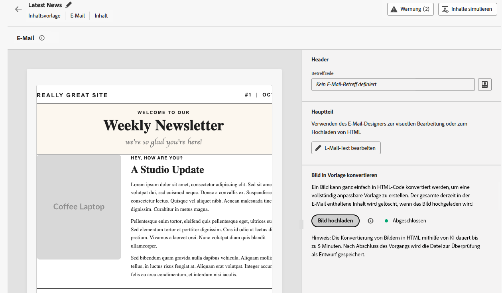

# Versionshinweise {#release-notes}

>[!CONTEXTUALHELP]
>id="ajo_homepage_card1"
>title="Neue Funktionen"
>abstract="**Adobe Journey Optimizer** bietet kontinuierlich neue Funktionen, Verbesserungen vorhandener Funktionen und Fehlerbehebungen. Alle Änderungen werden in der letzten Woche jedes Monats in diesen Versionshinweisen konsolidiert."

[!DNL Adobe Journey Optimizer] verwendet ein kontinuierliches Bereitstellungsmodell, das es Adobe ermöglicht, laufend neue Funktionen, Verbesserungen und Fehlerbehebungen bereitzustellen. Dieser Ansatz ermöglicht ein skalierbares Rollout von Funktionen in Phasen, um die Leistung und Stabilität aller Umgebungen sicherzustellen.

Aufgrund dieses Modells werden die Versionshinweise zwischen den monatlichen Versionen aktualisiert.  Im dedizierten Abschnitt [Neueste Aktualisierungen](#latest-updates) werden neue Funktionen und Verbesserungen bei ihrer Bereitstellung in der Produktion erläutert, sodass Sie immer in Echtzeit über alle Änderungen informiert sind. Ausführliche Informationen zum Veröffentlichungszyklus und zur Verfügbarkeitsphase finden Sie unter [Veröffentlichungszyklus für Journey Optimizer](releases.md).

[!DNL Adobe Journey Optimizer] setzt nativ auf [!DNL Adobe Experience Platform] auf und profitiert von den neuesten Innovationen und Verbesserungen. Weitere Informationen zu diesen Änderungen finden Sie in den [Versionshinweisen zu Adobe Experience Platform](https://experienceleague.adobe.com/docs/experience-platform/release-notes/latest.html?lang=de){target="_blank"}.

## Neueste Aktualisierungen {#latest-updates}

Nachfolgend sind die in den letzten Wochen veröffentlichten neuen Funktionen und Verbesserungen mit ihrem Verfügbarkeitsdatum aufgeführt. Sie werden Ende des Monats mit dem Inhalt der nächsten Versionshinweise gruppiert. Siehe auch die neuesten [Versionshinweise unten](#latest-rn).

### Neue Funktionen {#features}

<table>
<thead>
<tr>
<th><strong>Neue API zum Abrufen von Aktionskampagnen</strong> </th>
</tr>
</thead>
<tbody>
<tr>
<td>

Eine neue Journey Optimizer-API ist jetzt verfügbar, mit der Sie kampagnenbezogene Daten wie Details, Versionen und Konfigurationen programmgesteuert abrufen und überprüfen können.

Weitere Informationen finden Sie in der <a href="https://developer.adobe.com/journey-optimizer-apis/references/campaigns-retrieve/">ausführlichen Dokumentation</a>.

Verfügbarkeitsdatum: Dienstag, 24. November 2025

</td>
</tr>
</tbody>
</table>

<table>
<thead>
<tr>
<th><strong>Neue Journey-Warnhinweise</strong> </th>
</tr>
</thead>
<tbody>
<tr>
<td>

Drei neue Journey-Warnhinweise sind jetzt verfügbar, mit denen Sie Journey-Lebenszyklusereignisse und die Leistung benutzerdefinierter Aktionen überwachen und verfolgen können:

<ul>
<li><strong>Journey veröffentlicht</strong>: Erhalten Sie Benachrichtigungen, wenn eine Journey von einer Person auf der Journey-Arbeitsfläche veröffentlicht wird.</li>
<li><strong>Journey abgeschlossen</strong>: Erhalten Sie Warnhinweise, wenn eine Journey abgeschlossen ist, wobei bestimmte Definitionen vom Journey-Typ abhängen (Zielgruppe lesen oder ereignisgesteuert).</li>
<li><strong>Begrenzung benutzerdefinierter Aktionen ausgelöst</strong>: Lassen Sie sich benachrichtigen, wenn die Begrenzung für den Endpunkt einer benutzerdefinierten Aktion aktiviert ist.</li>
</ul>

Diese Warnhinweise können auf Organisationsebene oder für bestimmte Journeys abonniert werden.

Weitere Informationen finden Sie in der <a href="../reports/alerts.md#journey-alerts">ausführlichen Dokumentation</a>.

Verfügbarkeitsdatum: 5. November 2025

</td>
</tr>
</tbody>
</table>

<table>
<thead>
<tr>
<th><strong>Designs im E-Mail-Designer</strong> </th>
</tr>
</thead>
<tbody>
<tr>
<td>

Sie können jetzt schnell vorab genehmigte Designs anwenden, um Markenkonsistenz über alle E-Mails hinweg sicherzustellen, den Prozess der Kampagnenerstellung zu beschleunigen und eigenständig hochwertige E-Mails zu erstellen, während Sie die Abhängigkeit von Designteams reduzieren.

Diese Funktion wurde bereits in der Beta-Version veröffentlicht und ist jetzt für ausgewählte Organisationen verfügbar (eingeschränkte Verfügbarkeit). Um Zugriff zu erhalten, wenden Sie sich an den Adobe-Support.

Weitere Informationen finden Sie in der <a href="../email/apply-email-themes.md">ausführlichen Dokumentation</a>.

Verfügbarkeitsdatum: 5. November 2025

</td>
</tr>
</tbody>
</table>

## Versionshinweise für Oktober 2025 {#latest-rn}

### Neue Funktionen {#oct-25-10-features}

<table>
<thead>
<tr>
<th><strong>Bild-zu-HTML-Converter</strong> </th>
</tr>
</thead>
<tbody>
<tr>
<td>

Der Bild-zu-HTML-Converter ist eine KI-gestützte Funktion, die statische Bildentwürfe in vollständig anpassbare, modulare HTML-E-Mail-Inhaltsvorlagen konvertiert. Dieses Code-freie Tool ermöglicht es Marketing-Experten, visuelle Designs in responsive, bearbeitbare E-Mail-Vorlagen umzuwandeln, ohne dass technisches Know-how erforderlich ist. Es eignet sich perfekt für die Plattformmigration, die schnelle Erstellung von Vorlagen und die Erstellung wiederverwendbarer Vorlagenbibliotheken.

Diese Funktion ist nur eingeschränkt verfügbar. Wenden Sie sich an den Adobe-Support, um Zugriff zu erhalten.

Weitere Informationen finden Sie in der <a href="../email/image-to-html.md">ausführlichen Dokumentation</a>.

Verfügbarkeitsdatum: 30. Oktober 2025

</td>
</tr>
</tbody>
</table>

<table>
<thead>
<tr>
<th><strong>Überwachung und Reporting für benutzerdefinierte Aktionen</strong> </th>
</tr>
</thead>
<tbody>
<tr>
<td>

Diese Funktion bietet einen besseren Einblick in den Zustand und die Leistung von Endpunkten für benutzerdefinierte Aktionen. Ein neues Dashboard zur Überwachung benutzerdefinierter Aktionen und die entsprechenden Felder im Datensatz der Journey-Schrittereignisse helfen Ihnen, erfolgreiche Aufrufe, Fehler, Durchsatz, Antwortzeit und Wartezeit in der Warteschlange für Ihre Endpunkte für benutzerdefinierte Aktionen zu überwachen. Sie können jetzt schnell nachvollziehen, wann, wo und warum eine ungewöhnliche Situation in einer benutzerdefinierten Aktion auftritt.

Diese Funktion wird derzeit mit eingeschränkter Verfügbarkeit für Kundinnen und Kunden veröffentlicht.

Weitere Informationen finden Sie in der <a href="../action/reporting.md">ausführlichen Dokumentation</a>.

Verfügbarkeitsdatum: 28. Oktober 2025

</td>
</tr>
</tbody>
</table>

<table>
<thead>
<tr>
<th><strong>Benutzerdefinierte Formulare für Landingpages</strong> </th>
</tr>
</thead>
<tbody>
<tr>
<td>

Mit [!DNL Journey Optimizer] können Sie jetzt Profilattribute über Ihre Landingpages erfassen.

Erstellen, entwerfen und verwalten Sie benutzerdefinierte Formulare, die auf Ihre Anforderungen zugeschnitten sind und auf einem bestimmten Datensatz basieren. Sie können diese Formulare dann in Landingpages nutzen, um die Profilattribute Ihrer Wahl zu dem für jedes Formular definierten Datensatz hinzuzufügen.

Diese Funktion ist derzeit nur für Kundinnen und Kunden in den USA und Australien verfügbar. Wenden Sie sich an den Adobe-Support, um Zugriff zu erhalten.

Weitere Informationen finden Sie in der <a href="../landing-pages/lp-forms.md">ausführlichen Dokumentation</a>.

Verfügbarkeitsdatum: 23. Oktober 2025

</td>
</tr>
</tbody>
</table>

<table>
<thead>
<tr>
<th><strong>Ruhezeiten und zeitbasierte Ausschlüsse</strong> </th>
</tr>
</thead>
<tbody>
<tr>
<td>

Mithilfe von Ruhezeiten können Sie zeitbasierte Ausschlüsse für E-Mail-, SMS-, Push- und WhatsApp-Kanäle definieren. Sie stellen sicher, dass während bestimmter Zeiträume keine Nachrichten gesendet werden, und helfen Ihnen so, Kundenpräferenzen und Compliance-Anforderungen zu erfüllen.

Ruhezeiten können über Regelsätze angewendet werden, die zur präzisen Steuerung Einzelaktionen in Kampagnen oder Journeys zugewiesen werden können. 

Regeln für ruhige Stunden sind derzeit nur für ausgewählte Organisationen verfügbar (eingeschränkte Verfügbarkeit).  Sie werden in zukünftigen Versionen schrittweise für alle Kunden verfügbar sein.

Weitere Informationen finden Sie in der <a href="../conflict-prioritization/quiet-hours.md">ausführlichen Dokumentation</a>.

Verfügbarkeitsdatum: 22. Oktober 2025

</td>
</tr>
</tbody>
</table>

<!--table>
<thead>
<tr>
<th><strong>RCS Basic Messaging</strong> </th>
</tr>
</thead>
<tbody>
<tr>
<td>

With the new RCS Basic add-on offering, you can now deliver basic Rich Communication Services (RCS) messaging in Journey Optimizer, enabling the following enhanced messaging capabilities subject to provider and geographical support:

<ul>
<li><strong>Branded and verified sender support:</strong> Send messages using verified business profiles with branding elements (logo, sender name, etc.).</li>
<li><strong>Message delivery insights:</strong> Receive detailed delivery reports including message status updates (e.g., sent, delivered, read).</li>
<li><strong>Link tracking:</strong> Embed and track URLs within RCS messages for engagement analytics.</li>
<li><strong>Fallback to SMS:</strong> Automatic fallback to SMS when the recipient's device does not support RCS or is temporarily unreachable via RCS.</li>
<li><strong>Basic message composition:</strong> Send basic text-based RCS messages.</li>
</ul>
<!--img src="assets/do-not-localize/FILE.gif"-->
<!-- p>For more information, refer to the <a href="../FILE.md">detailed documentation</a>.

<!--/td>
</tr>
</tbody>
</table-->

<!--table>
<thead>
<tr>
<th><strong>Direct mail channel in Orchestrated campaigns</strong> </th>
</tr>
</thead>
<tbody>
<tr>
<td>

Direct mail channel is now available in orchestrated campaigns. The Direct mail activity facilitates direct mail sending within your Orchestrated campaign, for both one-time and recurring messages. It serves to automate the process of generating the extraction file required by direct mail providers. You can combine channel activities into the Orchestrated campaign canvas to create cross-channel campaigns that can trigger actions based on customer behavior and data.

<!--img src="assets/do-not-localize/FILE.gif"-->
<!-- p>For more information, refer to the <a href="../FILE.md">detailed documentation</a>.

<!--/td>
</tr>
</tbody>
</table-->

<!--table>
<thead>
<tr>
<th><strong>Direct Mail channel in journeys</strong> </th>
</tr>
</thead>
<tbody>
<tr>
<td>

Previously limited to Campaigns, Direct Mail channel is now available on the journey canvas, enabling you to incorporate Direct Mail into your journeys. Direct Mail can now be used in both batch and 1:1 journey scenarios, with support for file extraction configuration and time-based frequency settings.

 Previously released in Limited Availability, this capability is now available to all environments (General Availability).

<!--img src="assets/do-not-localize/FILE.gif"-->
<!-- p>For more information, refer to the <a href="../FILE.md">detailed documentation</a>.

<!--/td>
</tr>
</tbody>
</table-->

<!--<table>
<thead>
<tr>
<th><strong>New source connectors for loyalty apps</strong> </th>
</tr>
</thead>
<tbody>
<tr>
<td>

New source connectors are now available in Adobe Experience Platform for the Talon.One, Capillary and Kobie loyalty Apps. These connectors let you seamlessly stream loyalty data into Adobe Experience Platform and leverage these data in Journey Optimizer.

For more information, refer to the <a href="../start/get-started-sources.md">detailed documentation</a>.

Availability date: October 22, 2025

</td>
</tr>
</tbody>
</table>-->

<!--table>
<thead>
<tr>
<th><strong>Decisioning support in email channel</strong> </th>
</tr>
</thead>
<tbody>
<tr>
<td>

You can now add Decision policies into email journeys and campaigns. Decision policies are containers for your offers that leverage the Decisioning engine to dynamically return the best content to deliver for each audience member.

Previously released in Limited Availability, this capability is now available to all environments (General Availability).

For more information, refer to the <a href="../FILE.md">detailed documentation</a>.

Availability date: October 22, 2025

</td>
</tr>
</tbody>
</table-->

<table>
<thead>
<tr>
<th><strong>Messaging mit hohem Durchsatz für durch API ausgelöste E-Mail-Kampagnen</strong> </th>
</tr>
</thead>
<tbody>
<tr>
<td>

Für Kampagnen, die durch API ausgelöst werden, ist jetzt ein neuer Transaktions-Messaging-Modus verfügbar. Dieser Modus ist für groß angelegtes Transaktions-Messaging in Echtzeit konzipiert und unterstützt bis zu 5.000 Transaktionen pro Sekunde mit einer höheren Verfügbarkeit. Dieser Modus unterstützt auch Transaktionsnachrichten ohne Verweis auf oder Erstellung von Kundenprofilen, wie z. B. Gast-Checkout, Bestellbestätigung, Zurücksetzen des Passworts, Sicherheitsbenachrichtigungen und andere Service-/Betriebsbenachrichtigungen.

Diese Funktion ist nur für den E-Mail-Kanal verfügbar und steht Unternehmen zur Verfügung, die das Adobe-Add-on für Transaktionsnachrichten mit hohem Durchsatz erworben haben. Weitere Informationen erhalten Sie beim Adobe-Support.

Weitere Informationen finden Sie in der <a href="../campaigns/api-triggered-high-throughput.md">ausführlichen Dokumentation</a>.

Verfügbarkeitsdatum: 22. Oktober 2025

</td>
</tr>
</tbody>
</table>

<table>
<thead>
<tr>
<th><strong>Wiederverwendbare Targeting-Regeln</strong> </th>
</tr>
</thead>
<tbody>
<tr>
<td>

Um Zeit und Aufwand zu sparen, können Sie mit Journey Optimizer jetzt wiederverwendbare Regeln über ein dediziertes Benutzeroberflächenmenü erstellen und beim Erstellen von Targeting nutzen, entweder im Rahmen der Inhaltsoptimierung in einer Kampagne oder Journey oder in der Aktivität „Journey optimieren“.

Targeting-Regeln sind derzeit nur eingeschränkt verfügbar. Wenden Sie sich an den Adobe-Support, um Zugriff zu erhalten. Beachten Sie, dass diese Funktion nur für Organisationen verfügbar ist, die das Entscheidungsfindungs-Add-on erworben haben. Sie wird nach und nach für alle Kundinnen und Kunden eingeführt.

Weitere Informationen finden Sie in der <a href="../experience-decisioning/rules.md">ausführlichen Dokumentation</a>.

Verfügbarkeitsdatum: 22. Oktober 2025

</td>
</tr>
</tbody>
</table>

<table>
<thead>
<tr>
<th><strong>Neue Journey-Warnhinweise</strong> </th>
</tr>
</thead>
<tbody>
<tr>
<td>

Neue vorkonfigurierte Warnhinweise sind für die Überwachung der Journey-Ausführung verfügbar:

<ul><li><a href="../reports/alerts.md#alert-discard-rate">Verwerfungsrate für Profile überschritten</a>: Das Verhältnis von verworfenen Profilen zu eingetretenen Profilen in den letzten 5 Minuten hat den Schwellenwert überschritten</li>
<li><a href="../reports/alerts.md#alert-custom-action-error-rate">Fehlerrate für benutzerdefinierte Aktion überschritten</a>: Das Verhältnis von Fehlern bei benutzerdefinierten Aktionen zu erfolgreichen HTTP-Aufrufen in den letzten 5 Minuten hat den Schwellenwert überschritten</li>
<li><a href="../reports/alerts.md#alert-profile-error-rate">Fehlerrate für Profile überschritten</a>: Das Verhältnis von fehlerhaften Profilen zu eingetretenen Profilen in den letzten 5 Minuten hat den Schwellenwert überschritten</li></ul> 
Sie können Schwellenwerte anpassen und Warnhinweise entweder auf Journey-Ebene oder global abonnieren.

Weitere Informationen finden Sie in der <a href="../reports/alerts.md">ausführlichen Dokumentation</a>.

Verfügbarkeitsdatum: 14. Oktober 2025

</td>
</tr>
</tbody>
</table>

<table>
<thead>
<tr>
<th><strong>Hilfsfunktion „Ausführungsmetadaten“</strong> </th>
</tr>
</thead>
<tbody>
<tr>
<td>

Die neue Hilfsfunktion „executionMetadata“ ist im Personalisierungseditor verfügbar. Damit können Sie kontextuelle Informationen an jede native Aktion anhängen und sie für den Export in externe Systeme in einem Datensatz erfassen.

Diese Funktion ist nur eingeschränkt verfügbar. Wenden Sie sich an den Adobe-Support, um Zugriff zu erhalten.

Weitere Informationen finden Sie in der <a href="../personalization/functions/helpers.md#execution-metadata">ausführlichen Dokumentation</a>.

Verfügbarkeitsdatum: 13. Oktober 2025

</td>
</tr>
</tbody>
</table>

<table>
<thead>
<tr>
<th><strong>Experimentation Accelerator mit Experimentation Agent</strong> </th>
</tr>
</thead>
<tbody>
<tr>
<td>

Journey Optimizer Experimentation Accelerator enthält jetzt Experimentation Agent, ein KI-gestütztes, dialogorientiertes Tool, mit dem Sie mit Ihren Experimenten, Erkenntnissen und Möglichkeiten interagieren können. Dies verbessert das Journey Optimizer Experimentation Accelerator-Erlebnis, sodass Sie Experimente effizienter durchführen sowie herausfinden können, was funktioniert und wo als Nächstes optimiert werden sollte.

Weitere Informationen finden Sie in der <a href="https://experienceleague.adobe.com/docs/experience-cloud-ai/experience-cloud-ai/agents/agent-experiment.html?lang=de" target="_blank">ausführlichen Dokumentation</a>.

Verfügbarkeitsdatum: 10. Oktober 2025

</td>
</tr>
</tbody>
</table>

<table>
<thead>
<tr>
<th><strong>PDF-Anhänge an E-Mails</strong> </th>
</tr>
</thead>
<tbody>
<tr>
<td>

Sie können jetzt eine statische PDF-Datei an eine mit Journey Optimizer gesendete E-Mail anhängen.

<ul>
<li>Pro Profil können pro Jahr bis zu 6 Nachrichten mit einem PDF-Anhang gesendet werden.</li>
<li>Die maximale Dateigröße pro Anhang beträgt 5 MB.</li>
<li>Für zusätzliche Größen oder Volumen können Sie das Add-on für PDF-Anhänge erwerben. Weitere Informationen erhalten Sie beim Adobe-Support.</li>
</ul>

Diese Funktion war zuvor nur eingeschränkt verfügbar, steht aber nun für alle Umgebungen zur Verfügung (allgemeine Verfügbarkeit).

Weitere Informationen finden Sie in der <a href="../email/pdf-attachments.md">ausführlichen Dokumentation</a>.

Verfügbarkeitsdatum: 30. September 2025

</td>
</tr>
</tbody>
</table>

<table>
<thead>
<tr>
<th><strong>Öffentliche API zum Abrufen von Journeys</strong> </th>
</tr>
</thead>
<tbody>
<tr>
<td>

Eine neue Journey Optimizer-API ist jetzt verfügbar, um Journeys und ihre zugehörigen Objekte wie Kampagnen und Oberflächen abzurufen.

Weitere Informationen finden Sie in der <a href="https://developer.adobe.com/journey-optimizer-apis/references/journeys-retrieve/">ausführlichen Dokumentation</a>.

Verfügbarkeitsdatum: 25. September 2025

</td>
</tr>
</tbody>
</table>

### Verbesserungen {#updates-improvements}

**Ausführungsfeld für WhatsApp-Kanal**

Zusätzlich zu E-Mail und SMS können Sie das Standardausführungsfeld für Ihre WhatsApp-Sendungen auf Sandbox-Ebene aktualisieren. Es ist auch möglich, das global eingestellte Ausführungsfeld zu überschreiben, indem es in den erweiterten Parametern der WhatsApp-Journey-Aktivität oder in der WhatsApp-Kanalkonfiguration geändert wird. [Weitere Informationen](../configuration/primary-email-addresses.md)

Verfügbarkeitsdatum: 22. Oktober 2025

**Unterstützung benutzerdefinierter Attribute für Adresse für „E-Mail an (abmelden)“**

Wenn das Einverständnis außerhalb von Adobe verwaltet wird, können Sie in Journey Optimizer externe, benutzerdefinierte Endpunkte festlegen, indem Sie einen individuellen Link zum Abmelden mit einem Klick und eine benutzerdefinierte Abmelde-E-Mail-Adresse in der E-Mail-Konfiguration definieren. Wenn Ihre Empfängerinnen oder Empfänger auf den Link zum Abmelden klicken, fügt Journey Optimizer standardmäßige profilspezifische Parameter an das Einverständnisaktualisierungsereignis an.

Um Ihre benutzerdefinierten Endpunkte weiter zu personalisieren, können Sie jetzt benutzerdefinierte Attribute definieren, die an das Einverständnisereignis angehängt werden. [Weitere Informationen](../email/list-unsubscribe.md#custom-attributes)

>[!AVAILABILITY]
>
>Diese Funktion ist bereits seit August 2025 für die benutzerdefinierte **[!UICONTROL URL zum Abmelden mit einem Klick]** verfügbar und wird jetzt für die Option **[!UICONTROL E-Mail an (abmelden)]** in eingeschränkter Verfügbarkeit veröffentlicht. Wenden Sie sich an den Adobe-Support, um Zugriff zu erhalten.

Verfügbarkeitsdatum: 6. Oktober 2025

<!--
### Coming soon {#oct-25-10-soon}

In the next few days, the following capabilities and enhancements are scheduled for release. **Information is subject to change**. Updated links, screens, and documentation will be shared once these updates are live in production.

#### New capabilities {#oct-25-10-soon-features}

<table>
<thead>
<tr>
<th><strong>Themes in the Email Designer</strong> </th>
</tr>
</thead>
<tbody>
<tr>
<td>

You can now quickly apply pre-approved themes to ensure brand consistency across all emails, speed up your campaign creation process, and independently produce high-quality emails while reducing dependency on design teams.

Previously released in beta version, this capability is now available for a set of organizations (Limited Availability). To gain access, contact your Adobe representative.

For more information, refer to the <a href="../email/apply-email-themes.md">detailed documentation</a>.

Availability date: November 4, 2025

</td>
</tr>
</tbody>
</table>

#### Improvements {#oct-25-10-soon-improvements}

**Decisioning in emails through AI models**

You can now use AI models to optimize the best content in your email through the use of Decisioning. For example, this capability allows you to offer the best content based on custom events such as Purchases, Button Clicks, Add to Cart, etc.
-->

<!--
<table>
<thead>
<tr>
<th><strong>New Web Push notifications channel</strong> </th>
</tr>
</thead>
<tbody>
<tr>
<td>

Adobe Journey Optimizer now supports Web Push notifications, expanding the push channel beyond mobile. You can seamlessly deliver notifications to both mobile and desktop browsers, enabling you to reach customers directly on their devices without requiring an app.

This enhancement allows you to engage users with timely, personalized messages in real time, leveraging the same authoring workflows and targeting capabilities already available for mobile push.

For more information, refer to the <a href="../FILE.md">detailed documentation</a>

Availability date: Sept XX, 2025

</td>
</tr>
</tbody>
</table>

<table>
<thead>
<tr>
<th><strong>Custom action monitoring and reporting</strong> </th>
</tr>
</thead>
<tbody>
<tr>
<td>

Custom action monitoring and reporting is now available. This capability provides better visibility into journey health and execution, including lifecycle status and performance alerts. You can now quickly understand when, where, and why an anomalous situation is occurring in a custom action.

For more information, refer to the <a href="../FILE.md">detailed documentation</a>

Availability date: Sept XX, 2025

</td>
</td>
</tr>
</tbody>
</table>

<table>
<thead>
<tr>
<th><strong>New source connectors for loyalty apps</strong> </th>
</tr>
</thead>
<tbody>
<tr>
<td>

New source connectors are now available in Adobe Experience Platform for the Talon.One, Capillary, and Kobie loyalty apps. These connectors let you seamlessly stream loyalty data into Adobe Experience Platform and leverage these data in Journey Optimizer.

</td>
</tr>
</tbody>
</table>

-->
