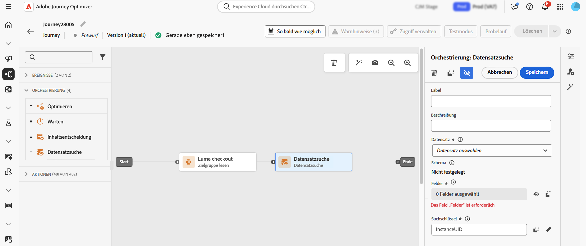

# Versionshinweise {#release-notes}

>[!CONTEXTUALHELP]
>id="ajo_homepage_card1"
>title="Neue Funktionen"
>abstract="**Adobe Journey Optimizer** liefert kontinuierlich neue Funktionen, Verbesserungen vorhandener Funktionen und Fehlerbehebungen. Alle Änderungen werden in der letzten Woche jedes Monats in diesen Versionshinweisen konsolidiert."

[!DNL Adobe Journey Optimizer] folgt einem kontinuierlichen Bereitstellungsmodell, sodass Adobe kontinuierlich neue Funktionen, Verbesserungen und Fehlerbehebungen bereitstellen kann. Dieser Ansatz ermöglicht ein skalierbares Rollout von Funktionen in Phasen, um die Leistung und Stabilität aller Umgebungen sicherzustellen.

Aufgrund dieses Modells werden die Versionshinweise zwischen den monatlichen Versionen aktualisiert.  Ausführliche Informationen zum Veröffentlichungszyklus und zur Verfügbarkeitsphase finden Sie unter [Veröffentlichungszyklus für Journey Optimizer](releases.md).

[!DNL Adobe Journey Optimizer] setzt nativ auf [!DNL Adobe Experience Platform] auf und profitiert von den neuesten Innovationen und Verbesserungen. Weitere Informationen zu diesen Änderungen finden Sie in den [Versionshinweisen zu Adobe Experience Platform](https://experienceleague.adobe.com/docs/experience-platform/release-notes/latest.html?lang=de){target="_blank"}.

## Versionshinweise März 2026 {#march-26-rn}

Die Abschnitte [Neue Funktionen](#march-26-features) und [Verbesserungen](#march-26-improv) decken bereits verfügbare Funktionen ab. Der [Demnächst](#coming-soon) Abschnitt enthält Funktionen und Verbesserungen, die im März veröffentlicht werden sollen.

<!--
**The pre-release notes below are subject to change without prior notice until the release availability date**. Links, screens and updated documentation are published in the release notes, at the release date.

See also [Adobe Experience Platform pre-release notes](https://experienceleague.adobe.com/en/docs/experience-platform/release-notes/pre-release-notes){target="_blank"}.-->

**Veröffentlichungsdatum**: 24.-25. März 2026

### Neue Funktionen {#march-26-features}

<table>
<thead>
<tr>
<th><strong>Benutzerdefinierte Formulare für Landingpages</strong> </th>
</tr>
</thead>
<tbody>
<tr>
<td>

Mit [!DNL Journey Optimizer] können Sie Profilattribute über Ihre Landingpages erfassen.

Erstellen, entwerfen und verwalten Sie benutzerdefinierte Formulare, die auf Ihre Anforderungen zugeschnitten sind und auf einem bestimmten Datensatz basieren. Sie können diese Formulare dann in Landingpages nutzen, um die Profilattribute Ihrer Wahl zu dem für jedes Formular definierten Datensatz hinzuzufügen.

Diese Funktion wurde bisher in den USA und Australien nur für Kunden mit begrenzter Verfügbarkeit veröffentlicht und steht nun allen Umgebungen zur Verfügung (allgemeine Verfügbarkeit).

Weitere Informationen finden Sie in der <a href="../landing-pages/lp-forms.md">ausführlichen Dokumentation</a>.

Verfügbarkeit: 26. März 2026.

</td>
</tr>
</tbody>
</table>

<table>
<thead>
<tr>
<th><strong>Testaktivität in koordinierten Kampagnen</strong> </th>
</tr>
</thead>
<tbody>
<tr>
<td>

Eine neue <strong>Test</strong>-Aktivität ist jetzt in orchestrierten Kampagnen verfügbar. Diese Aktivität leitet die Workflow-Ausführung basierend auf definierten Bedingungen an verschiedene Verzweigungen weiter, sodass Sie Kampagnenlogik und -konfigurationen vor der Aktivierung von Live-Sendungen validieren können.

Weitere Informationen finden Sie in der <a href="../orchestrated/activities/test.md">ausführlichen Dokumentation</a>.

</td>
</tr>
</tbody>
</table>

<table>
<thead>
<tr>
<th><strong>Unterstützung der Datensatzsuche in Journey</strong> </th>
</tr>
</thead>
<tbody>
<tr>
<td>

Eine neue Aktivität <strong>Datensatzsuche</strong> in Journey ermöglicht das dynamische Abrufen von Daten aus Adobe Experience Platform-Datensatzdatensätzen zur Laufzeit. Dadurch erhalten Sie Zugriff auf Informationen, die nicht zur Profil- oder Ereignis-Payload gehören, sodass Kundeninteraktionen relevant und zeitnah bleiben.

Diese Funktion war zuvor nur eingeschränkt verfügbar, steht aber nun für alle Umgebungen zur Verfügung (allgemeine Verfügbarkeit). 

Weitere Informationen finden Sie in der <a href="../building-journeys/dataset-lookup.md">ausführlichen Dokumentation</a>.

</td>
</tr>
</tbody>
</table>

<table>
<thead>
<tr>
<th><strong>Native Kanalaktionsaktivitäten werden nicht mehr unterstützt</strong> </th>
</tr>
</thead>
<tbody>
<tr>
<td>

Nach der allgemeinen Verfügbarkeit der <strong>Aktionsaktivität</strong> im Februar 2026 werden alte native Kanalaktivitäten (E-Mail, Push, SMS, In-App, Web, Code-basiertes Erlebnis und Inhaltskarte) auf der Journey-Arbeitsfläche jetzt nicht mehr unterstützt.

Sie verwenden jetzt eine einzelne <strong>Aktionsaktivität</strong> um alle Kanalaktionen zu konfigurieren, sodass keine separaten kanalspezifischen Knoten mehr erforderlich sind.
Bestehende Journey, die ältere Kanalaktivitäten verwenden, funktionieren weiterhin, ohne dass Änderungen oder eine Migration erforderlich sind.

Weitere Informationen finden Sie in der <a href="../building-journeys/journey-action.md">ausführlichen Dokumentation</a>.

</td>
</tr>
</tbody>
</table>

<table>
<thead>
<tr>
<th><strong>Erweiterter HTML-Editor für E-Mail-Vorlagen</strong> </th>
</tr>
</thead>
<tbody>
<tr>
<td>

Im erweiterten HTML-Modus für E-Mail-Inhaltsvorlagen können Sie die HTML-Quelle Ihres Inhalts in der E-Mail-Designer bearbeiten, erweiterte Ausdrücke (z. B. Bedingungen) in der Quelle hinzufügen und zwischen der HTML-Ansicht und der Desktop-Ansicht wechseln, ohne Ihre Änderungen zu verlieren.

Diese Funktion ist nur für den E-Mail-Kanal in Inhaltsvorlagen verfügbar. Sie ist derzeit nur eingeschränkt verfügbar. Wenden Sie sich an Ihren Adobe-Support-Mitarbeiter, um Zugang zu erhalten.

Weitere Informationen finden Sie in der <a href="../content-management/email-template-expert-mode.md">ausführlichen Dokumentation</a>.

Verfügbarkeitsdatum: Mittwoch, 10. März 2026

</td>
</tr>
</tbody>
</table>

<table>
<thead>
<tr>
<th><strong>Integration von benutzerdefinierten Firefly-Modellen und Drittanbieter-Image-Generierungsmodellen</strong> </th>
</tr>
</thead>
<tbody>
<tr>
<td>

Ermöglichen Sie die nahtlose Integration von standardmäßigen und benutzerdefinierten Firefly-Modellen zusammen mit genehmigten Bildmodellen von Drittanbietern, um die Flexibilität, Kontrolle und Markenausrichtung beim Erzeugen von Bildern zu verbessern.

Wählen Sie das richtige Modell für Ihre Anforderungen:

<ul><li> <strong>Adobe-Modell</strong> (unterstützt von Firefly Image Model 4) für die sofortige Bildgenerierung ohne zusätzliche Einrichtung</li><li> <strong>Partnermodell</strong> (unterstützt von Gemini 2.5 Flash) für spezielle Funktionen</li><li><strong>Benutzerdefinierte Modelle</strong> (markenspezifische Modelle, die auf Ihren eigenen Assets trainiert wurden) für die Generierung innerhalb der Marke, die genau auf Ihre Markenidentität, Ihren Stil und Ihre visuellen Richtlinien abgestimmt ist.</li></ul>

Weitere Informationen finden Sie in der <a href="../content-management/generative-models.md">ausführlichen Dokumentation</a>.

Verfügbarkeitsdatum: Dienstag, 2. März 2026

</td>
</tr>
</tbody>
</table>

<table>
<thead>
<tr>
<th><strong>Live-Aktivität für iOS</strong> </th>
</tr>
</thead>
<tbody>
<tr>
<td>

Mit der <strong>iOS Live Activity&rbrace; in Adobe Journey Optimizer können Sie Ihren Kunden Echtzeit-Erlebnisse direkt auf Lock Screens und </strong> Island bieten. Live-Updates bereitstellen, von der Bestellverfolgung und dem Flugstatus bis hin zu Zählungen von Ereignissen, Live-Scores und Versandfortschritt, ohne dass Benutzer Ihre App öffnen müssen. Halten Sie Ihr Publikum zum richtigen Zeitpunkt und an der richtigen Stelle auf dem Laufenden und engagieren Sie sich aktiv.

Diese Funktion wurde bereits in der Beta-Version veröffentlicht und steht nun allen Umgebungen zur Verfügung (allgemeine Verfügbarkeit).

Weitere Informationen finden Sie in der <a href="../mobile-live/get-started-mobile-live.md">ausführlichen Dokumentation</a>.

Verfügbarkeitsdatum: Mittwoch, 3. März 2026

</td>
</tr>
</tbody>
</table>

<table>
<thead>
<tr>
<th><strong>Journey Agent: Kanalinhalte erstellen</strong> </th>
</tr>
</thead>
<tbody>
<tr>
<td>

Mit <strong>Adobe Experience Platform Agent Orchestrator </strong> ist <strong>Journey Agent</strong> in Journey Optimizer verfügbar und ermöglicht es Ihnen, Journey über eine natürliche Sprachschnittstelle zu analysieren. Sie können jetzt auch kanalspezifische Inhalte direkt in Journey Agent generieren und verwalten, Inhalte für Kanäle wie E-Mail und Push erstellen, Vorlagen anwenden und in der Vorschau anzeigen, Ton und Stil durch Eingabeaufforderungen verfeinern und Inhalte in <strong>Content Designer</strong> zur kontextbezogenen Bearbeitung öffnen.

Diese Funktion ist nur für eine Gruppe von Organisationen verfügbar (eingeschränkte Verfügbarkeit). Um Zugriff zu erhalten, wenden Sie sich an den Adobe-Support.

Weitere Informationen finden Sie in der <a href="https://experienceleague.adobe.com/docs/experience-cloud-ai/experience-cloud-ai/agents/ajo-agent.html" target="_blank">ausführlichen Dokumentation</a>.

Verfügbarkeitsdatum: Donnerstag, 4. März 2026

</td>
</tr>
</tbody>
</table>

<table>
<thead>
<tr>
<th><strong>KI-Modellüberwachung</strong> </th>
</tr>
</thead>
<tbody>
<tr>
<td>

Mit Journey Optimizer können Sie jetzt den Zustand, den Trainingsstatus und die Leistung Ihrer KI-Modelle für die Entscheidungsfindung überwachen. Auf diese Weise können Sie den Schulungserfolg überprüfen, Fehler beheben und die Auswirkungen auf Ihre Ergebnisse verstehen, um mithilfe von KI die besten Angebote für jeden Kunden auszuwählen. Beachten Sie, dass diese Funktion nur für <strong>Decisioning</strong> verfügbar ist (nicht für ältere Entscheidungs-Management-Modelle).

Diese Funktion ist derzeit nur für Modelle <strong>personalisierte Optimierung</strong> verfügbar (nicht für die automatische Optimierung).

Weitere Informationen finden Sie in der <a href="../experience-decisioning/ranking/ai-model-observability.md">ausführlichen Dokumentation</a>.

Verfügbarkeitsdatum: Dienstag, 9. März 2026

</td>
</tr>
</tbody>
</table>

### Verbesserungen {#march-26-improv}

Im Folgenden sind die Verbesserungen dieser Version aufgeführt.

<!--
#### Reporting

* **Send-Time Optimization: updated controls location and new lift report** - Send-Time Optimization (STO) controls have been relocated to the Action configuration menu. Additionally, a new lift report is now available in Journeys reports to measure the impact of STO on your campaign performance metrics.

* **Exclude bot clicks for email and SMS reporting** - Email and SMS reporting now automatically filters out bot clicks from click metrics, providing more accurate engagement data and preventing automated traffic from inflating your performance figures.

#### Email Designer

* **Email Designer displayed in Unified Shell** - The Email Designer is now displayed within the Unified Shell experience, providing a consistent navigation and header experience that aligns with other Adobe applications.

* **Text mode support in fragments** - To support text-based email workflows, you can now create and manage text versions of your visual fragments for optimal use in the plain text version of emails that include that fragment.

  **Caution:** When using a fragment that was created before the current release, the fragment text version may be incorrectly rendered—both in the Email Designer and in the final email delivered to your recipients. For best results with older fragments, edit, save and republish each fragment.-->
<!--
#### Decisioning

* **Optional fragments in decision items** - When using fragments in decision items, you can now make a fragment optional so that if it is temporarily unavailable on Edge, it is skipped and the journey or campaign continues rendering instead of failing.
-->

#### Konfiguration

<!--* **Folders for journeys and campaigns** - You can now organize your journeys and campaigns into folders, enabling structured navigation and easier management for teams working with large volumes of content. This capability is only available for a set of organizations (Limited Availability). To gain access, contact your Adobe representative.-->

* **Umbenennen des Ereignisdatensatzes mit Sekundärem AJO-Empfängerfeedback** - Der `AJO Email BCC Feedback Event` wurde in `AJO Secondary Recipient Feedback Event` Datensatz umbenannt. Die Auswirkungen variieren je nach Ihrer Situation:

   * **Vorhandene Benutzer**: Nur der Anzeigename wird aktualisiert. Der zugrunde liegende Tabellenname bleibt unverändert.
   * **Neue Benutzer und Sandboxes**: Sowohl der Anzeigename als auch der Tabellenname spiegeln den neuen Namen wider.
   * **Vorhandene Benutzer mit neuen Sandboxes**: Sowohl der Anzeigename als auch der Tabellenname werden auf den neuen Namen aktualisiert.

  Verfügbarkeitsdatum: Dienstag, 2. März 2026

#### Journeys

* **Aktion Profil aktualisieren: Unterstützung für mehrere Profilattribute** - Die Aktionsaktivität **Profil aktualisieren** unterstützt jetzt die Aktualisierung von bis zu fünf Profilattributen in einem einzelnen Knoten. Zuvor konnte jede Aktion jeweils nur ein Attribut aktualisieren, sodass mehrere Knoten mehrere Attribute aktualisieren mussten. Verwenden Sie die neue Schaltfläche **Weiteres Feld aktualisieren**, um zusätzliche Feld/Wert-Paare hinzuzufügen, wodurch die Komplexität der Arbeitsfläche reduziert und die Leistung verbessert wird. [Weitere Informationen](../building-journeys/update-profiles.md)

* **Senden ausgehender Nachrichten in Journey** - Sie können jetzt den Versand von Nachrichten aus Journey Optimizer Journey in kontrollierten Batches über einen bestimmten Zeitraum planen. [Weitere Informationen](../building-journeys/send-using-waves.md)

  Diese Funktion wurde bereits in eingeschränkter Verfügbarkeit für den Einsatz in Journey veröffentlicht und steht nun allen Umgebungen zur Verfügung (allgemeine Verfügbarkeit).

  Verfügbarkeitsdatum: Dienstag, 16. März 2026

* **Pause- und Fortsetzungsdetails beim Journey technischer Details** - Die Journey **technischen Details** enthalten jetzt zusätzliche Informationen zu Pause und Wiederaufnahme: das Datum und die Uhrzeit der letzten Pause und Wiederaufnahme, den Anzeigenamen und die interne Kennung des Benutzers, der die jeweilige Aktion ausgeführt hat, sowie einen vollständigen Satz von Einstellungen für das pausierte Journey wie Pausenverhalten, die maximale Pausendauer und den Status der automatischen Wiederaufnahme. [Weitere Informationen](../building-journeys/journey-properties.md)

  Verfügbarkeitsdatum: Dienstag, 2. März 2026

## Demnächst {#coming-soon}

Die folgenden Funktionen und Verbesserungen sind für März/Anfang April geplant. Veröffentlichungstermine und Umfang können **ohne vorherige Ankündigung ändern**.

### Funktionen

<table>
<thead>
<tr>
<th><strong>Konvertieren von Bildern in E-Mail-Inhaltsvorlagen</strong> </th>
</tr>
</thead>
<tbody>
<tr>
<td>

Sie können jetzt Bilder direkt in Journey Optimizer in E-Mail-Inhaltsvorlagen konvertieren. Verwenden Sie die KI-gestützte Analyse, um automatisch strukturierte HTML-Vorlagen aus visuellen Referenzen zu generieren, wodurch die E-Mail-Design-Zeit erheblich verkürzt wird.

Diese Funktion wurde bereits in eingeschränkter Verfügbarkeit veröffentlicht und steht nun allen Umgebungen zur Verfügung (allgemeine Verfügbarkeit). <a href="../content-management/image-to-html.md">Weitere Informationen</a>

Verfügbarkeitsdatum: Freitag, 26. März 2026

</td>
</tr>
</tbody>
</table>

<table>
<thead>
<tr>
<th><strong>Transaktionskategorie in koordinierten Kampagnen</strong> </th>
</tr>
</thead>
<tbody>
<tr>
<td>

In orchestrierten Kampagnen können Sie jetzt eine Kanalaktivität auf die Kategorie <strong>Transaktion“ </strong>. Dies gilt für Konfigurationen von Transaktionskanälen für diese Aktivität und ist nützlich, wenn keine Geschäftsregeln gelten sollten oder wenn das Opt-in der Kundschaft nicht erforderlich ist.

Verfügbarkeitsdatum: Mittwoch, 31. März 2026

</td>
</tr>
</tbody>
</table>

<table>
<thead>
<tr>
<th><strong>URL-Parameterverschlüsselung</strong> </th>
</tr>
</thead>
<tbody>
<tr>
<td>

URL-Parameter in Tracking-Links und Landingpages können jetzt verschlüsselt werden, was eine zusätzliche Sicherheitsebene für vertrauliche Parameterdaten bietet.

<ul>
<li>Registrieren und verwalten Sie Verschlüsselungsschlüssel in einer dedizierten <strong>Administration</strong> Registrierung.</li>
<li>Verwenden Sie den neuen Verschlüsselungs-Helper in -Ausdrücken, um sensible Daten in Tracking-Links und Landingpage-URLs für die Abfrageparameter zu verschlüsseln, die Sie zum Zeitpunkt der Wiedergabe schützen möchten.</li>
</ul>

Diese Funktion ist nur für eine Gruppe von Organisationen verfügbar (eingeschränkte Verfügbarkeit). Um Zugriff zu erhalten, wenden Sie sich an den Adobe-Support.

Verfügbarkeitsdatum: Mittwoch, 31. März 2026

</td>
</tr>
</tbody>
</table>

<table>
<thead>
<tr>
<th><strong>Posteingang</strong> </th>
</tr>
</thead>
<tbody>
<tr>
<td>

<strong>Posteingang</strong> ist eine Funktion für Mobilgeräte, die mit Inhaltskarten verfügbar ist und es Kunden ermöglicht, einen zentralen Ort in ihrer App oder Website zu erstellen, um Nachrichten anzuzeigen, die an ihre Benutzer gesendet werden. Dies verlängert die Lebensdauer der Marketing-Kommunikation, indem sichergestellt wird, dass Nachrichten auch nach ihrer Beendigung zugänglich bleiben.

Verfügbarkeitsdatum: Mittwoch, 31. März 2026

</td>
</tr>
</tbody>
</table>

<table>
<thead>
<tr>
<th><strong>Trigger hat Kampagnen mithilfe eines Signals orchestriert</strong> </th>
</tr>
</thead>
<tbody>
<tr>
<td>

Orchestrierte Kampagnen können jetzt über ein <strong>API-Signal“ ausgelöst </strong>. Um dies einzurichten, konfigurieren Sie die Zielkampagne als <strong>Ausgelöst durch ein Signal</strong>, veröffentlichen Sie sie und lösen Sie sie dann mithilfe eines API-Aufrufs aus. Alle im API-Aufruf enthaltenen Parameter sind als Variablen innerhalb der laufenden Kampagne verfügbar. Beachten Sie, dass signalgesteuerte orchestrierte Kampagnen (<strong>) bleiben </strong> sich von API-ausgelösten Kampagnen unterscheiden.

Verfügbarkeitsdatum: Donnerstag, 1. April 2026

</td>
</tr>
</tbody>
</table>

<table>
<thead>
<tr>
<th><strong>Journey-Pfadoptimierung</strong> </th>
</tr>
</thead>
<tbody>
<tr>
<td>

Verwenden Sie den neuen Knoten Optimieren , um bestimmte Zielgruppen anzusprechen, oder führen Sie A/B-Tests durch, um den besten Pfad zur Erfüllung Ihrer geschäftsorientierten KPIs zu ermitteln.
Mit diesem Tool können Sie Kommunikation, Sequenzierung und Timing testen und variieren sowie anpassen, um Ihre Kundschaft optimal zu erreichen.

Diese Funktion wurde bereits in eingeschränkter Verfügbarkeit veröffentlicht und steht nun allen Umgebungen zur Verfügung (allgemeine Verfügbarkeit). <a href="../building-journeys/optimize.md">Weitere Informationen</a>

Verfügbarkeitsdatum: Samstag, 3. April 2026

</td>
</tr>
</tbody>
</table>

<table>
<thead>
<tr>
<th><strong>Unterstützung von Entscheidungen im E-Mail-Kanal</strong> </th>
</tr>
</thead>
<tbody>
<tr>
<td>

Sie können jetzt <strong>Decisioning</strong> verwenden, um den Inhalt Ihrer E-Mail-Nachrichten zu personalisieren und zu optimieren. Nutzen Sie Prioritätswerte, Formeln oder KI-Modelle, um jedem Empfänger die relevantesten Angebote und Inhalte anzuzeigen.

Diese Funktion wurde bereits in eingeschränkter Verfügbarkeit veröffentlicht und steht nun allen Umgebungen zur Verfügung (allgemeine Verfügbarkeit). Mit dieser Version zur allgemeinen Verfügbarkeit werden nun Mirrorseiten unterstützt.

<!--
For more information, refer to the <a href="../experience-decisioning/create-decision-policy.md">detailed documentation</a>.
-->

Verfügbarkeitsdatum: Samstag, 3. April 2026

</td>
</tr>
</tbody>
</table>

<!--WAITING RELEASE DATE CONFIRMATION * **Target dimension simplification in Orchestrated Campaigns** - The active targeting dimension is now shown on the workflow canvas, so you can see which dimension is used by a channel activity. The multi-entity segmentation flow is simpler as you no longer need a separate "Change dimension" activity. Moreover, you can now choose explicitly whether messages are sent at the profile level or at a secondary dimension level.-->
