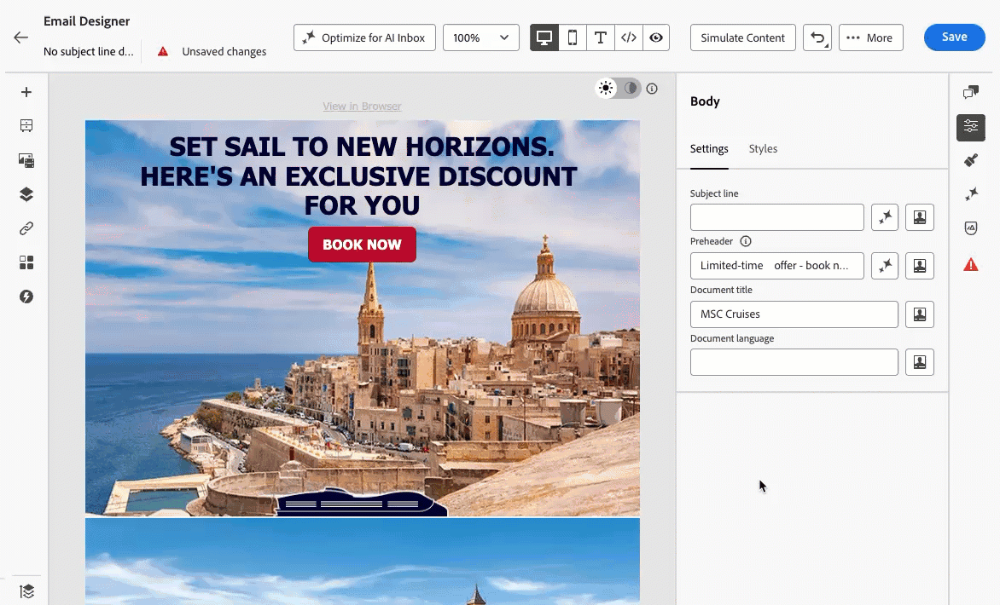

# Versionshinweise {#release-notes}

>[!CONTEXTUALHELP]
>id="ajo_homepage_card1"
>title="Neue Funktionen"
>abstract="**Adobe Journey Optimizer** stellt regelmäßig neue Funktionen, Verbesserungen vorhandener Funktionen und Fehlerbehebungen zur Verfügung. Alle Änderungen werden in der letzten Woche jedes Monats in diesen Versionshinweisen konsolidiert."

[!DNL Adobe Journey Optimizer] verwendet ein kontinuierliches Bereitstellungsmodell, das es Adobe ermöglicht, laufend neue Funktionen, Verbesserungen und Fehlerbehebungen bereitzustellen. Dieser Ansatz ermöglicht ein skalierbares Rollout von Funktionen in Phasen, um die Leistung und Stabilität aller Umgebungen sicherzustellen. Aufgrund dieses Modells werden die Versionshinweise zwischen den monatlichen Versionen aktualisiert. Ausführliche Informationen zum Veröffentlichungszyklus und zur Verfügbarkeitsphase finden Sie unter [Veröffentlichungszyklus für Journey Optimizer](releases.md).

[!DNL Adobe Journey Optimizer] setzt nativ auf [!DNL Adobe Experience Platform] auf und profitiert von den neuesten Innovationen und Verbesserungen. Weitere Informationen zu diesen Änderungen finden Sie in den [Versionshinweisen zu Adobe Experience Platform](https://experienceleague.adobe.com/docs/experience-platform/release-notes/latest.html?lang=de){target="_blank"}.

>[!NOTE]
>
>Die in diesen Versionshinweisen aufgeführten Funktionen umfassen ein **Verfügbarkeitsdatum**, das angibt, wann jede Änderung in Ihrer Umgebung verfügbar wird. Einträge in den Akkordeons **Demnächst verfügbar** werden in den kommenden Tagen oder Wochen erwartet. Informationen in diesen Abschnitten können Änderungen unterliegen.

## Versionshinweise Juni 2026 {#june-26-rn}

### Journeys {#june-26-journeys}

Die folgenden Funktionen und Verbesserungen wurden in dieser Version zu Journeys hinzugefügt. Weitere Änderungen werden auch in den kommenden Tagen oder Wochen erwartet.

<table>
<thead>
<tr>
<th><strong>Journey-Simulation (allgemeine Verfügbarkeit)</strong> </th>
</tr>
</thead>
<tbody>
<tr>
<td>

Sie können Ihre Journey jetzt auf „Simulation“ setzen. In diesem Modus können Sie Ihre Logik mithilfe von simulierten Benutzenden überprüfen. Dies sind temporäre, speziell für die Simulation erstellte Profile, mit denen Sie frei testen können. So müssen Sie keine dauerhaften Testprofile in Adobe Experience Platform verwalten. 

Journey-Simulation wurde zuvor mit eingeschränkter Verfügbarkeit veröffentlicht und steht nun allen Umgebungen zur Verfügung. Mit dieser allgemeinen Verfügbarkeit können Sie jetzt Journey Agent verwenden, um simulierte Benutzende und Ereignisse direkt im Simulationsmenü zu generieren.

Weitere Informationen finden Sie im <a href="../building-journeys/simulate-journey-gs.md">entsprechenden Handbuch</a>.

Verfügbarkeitsdatum: 9. Juni 2026

</td>
</tr>
</tbody>
</table>

<table>
<thead>
<tr>
<th><strong>Journey-Fragmente (allgemeine Verfügbarkeit)</strong> </th>
</tr>
</thead>
<tbody>
<tr>
<td>

Sie können jetzt <strong>Journey-Fragmente</strong> in Adobe Journey Optimizer erstellen. Journey-Fragmente sind wiederverwendbare Sätze von Journey-Knoten, die Sie einmal erstellen und in einer beliebigen Journey in Ihrer Sandbox ablegen können. Unabhängig davon, ob es sich um eine Eignungsprüfung, eine bevorzugte Kanal-Routing-Logik oder eine Begrüßungssequenz handelt, helfen Fragmente Teams dabei, schneller und konsistent zu arbeiten, ohne dieselbe Logik jedes Mal von Grund auf neu zu erstellen.

Nach der Erstellung werden Fragmente in einem dedizierten <strong>Fragmentinventar</strong> gespeichert und können mithilfe der Aktivität <strong>Journey-Fragmente</strong> in Journeys eingefügt werden.

Diese Funktion war bisher nur begrenzt verfügbar und steht nun allen Kundinnen und Kunden zur Verfügung. Journey-Fragmente unterstützen auch <strong>Sandbox-Tools</strong>, mit denen Sie Fragmente über Sandboxes hinweg zu Paketen hinzufügen und exportieren können.

Weitere Informationen finden Sie im <a href="../building-journeys/journey-fragments.md">entsprechenden Handbuch</a>.

Verfügbarkeitsdatum: 9. Juni 2026

</td>
</tr>
</tbody>
</table>

<table>
<thead>
<tr>
<th><strong>Journey-Pfadoptimierung – Targeting (allgemeine Verfügbarkeit)</strong> </th>
</tr>
</thead>
<tbody>
<tr>
<td>

Die <strong>Optimierungsaktivität</strong> unterstützt jetzt <strong>Targeting-Regeln</strong>, mit denen Sie spezifische Kriterien definieren können, die Kundinnen und Kunden erfüllen müssen, um sich basierend auf Zielgruppensegmenten oder Profilattributen für einen bestimmten Journey-Pfad zu qualifizieren.

Im Gegensatz zu Experimenten, bei denen Kundinnen und Kunden nach dem Zufallsprinzip Pfaden zugewiesen werden, wird beim Targeting deterministische Logik verwendet, um sicherzustellen, dass die entsprechende Zielgruppe oder das entsprechende Kundenprofil zum gewünschten Pfad weitergeleitet wird.

Diese Funktion war zuvor nur eingeschränkt verfügbar, steht aber nun für alle Umgebungen zur Verfügung (allgemeine Verfügbarkeit).

Weitere Informationen finden Sie im <a href="../building-journeys/path-targeting.md">entsprechenden Handbuch</a>.

Verfügbarkeitsdatum: 8. Juni 2026

</td>
</tr>
</tbody>
</table>

<table>
<thead>
<tr>
<th><strong>KI-Assistent für Journey-Ausdrücke (öffentliche Beta)</strong> </th>
</tr>
</thead>
<tbody>
<tr>
<td>

Der KI-Assistent arbeitet jetzt im erweiterten Ausdruckseditor von Journeys, um Prompts in natürlicher Sprache in gültige Ausdrücke und Bedingungslogik zu konvertieren. Beschreiben Sie die gewünschte Personalisierung und die KI generiert einsatzbereiten Code, den Sie sofort anwenden oder durch Folge-Prompts verfeinern können.

Diese Funktion steht allen Kundinnen und Kunden als öffentliche Beta-Version zur Verfügung.

Weitere Informationen finden Sie im <a href="../building-journeys/expression/expression-agent.md">entsprechenden Handbuch</a>.

Verfügbarkeitsdatum: 3. Juni 2026
 
</td>
</tr>
</tbody>
</table>

* [!BADGE Einstellung]{type=Negative} **Batch-Zielgruppen im Zielgruppen-Qualifizierungsknoten nicht mehr unterstützt** - Ab **August 2026** blockiert Journey Optimizer die Veröffentlichung für alle Journey, die eine Batch-Zielgruppe in einem **Zielgruppen-Qualifizierungsknoten** verwenden. Auf der Journey-Arbeitsfläche wurde bereits eine Validierungswarnung angezeigt. Bestehende Live-Journey sind davon nicht betroffen. Neue, entworfene und duplizierte Journey, die diese Konfiguration enthalten, müssen vor August 2026 aktualisiert werden. Verwenden Sie eine Streaming-Zielgruppe im Knoten Zielgruppenqualifizierung oder wechseln Sie zu einer Aktivität **Zielgruppe lesen**. [Erfahren Sie, wie Sie Ihre Journey migrieren](../building-journeys/aq-batch-audiences-migration.md)

* **Anhaltende Journey direkt anhalten** - Sie können eine Journey jetzt direkt aus dem Status **Angehalten“**. Zuvor musste eine angehaltene Journey erneut unter **Live** gespeichert werden, bevor sie angehalten werden konnte. [Weitere Informationen](../building-journeys/journey-pause.md#stop-close-paused)

  Verfügbarkeitsdatum: 18.-22. Juni 2026

* **Zusätzliche Kennungsunterstützung für externe Zielgruppen** – Zusätzliche Kennungen in Journeys werden jetzt für externe Zielgruppen unterstützt, einschließlich Zielgruppen, die aus einer CSV-Datei importiert wurden, und Zielgruppen, die mit der Komposition föderierter Zielgruppen erstellt wurden. Sie können ein beliebiges Nicht-Identitätsattribut oder ein beliebiges Identitätsattribut aus der Zielgruppe als zusätzliche ID festlegen. Eine Schemakennzeichnung ist nicht erforderlich. [Weitere Informationen](../building-journeys/supplemental-identifier.md)

  Verfügbarkeitsdatum: 11. Juni 2026

* **Automatisches Anhalten für nicht wiederkehrende Journeys des Typs „Zielgruppe lesen“** – Nicht wiederkehrende Journeys des Typs **Zielgruppe lesen** wechseln jetzt automatisch zum Status **Angehalten**, sobald das letzte aktive Profil ausgestiegen ist. Zuvor blieben diese Journeys bis zum Ablauf der 91-tägigen globalen maximalen Wartezeit **live**, selbst wenn sie nicht mehr von Profilen durchlaufen wurden. Mit dieser Verbesserung spiegelt der Journey-Status den tatsächlichen Ausführungsstatus nach Abschluss wider, sodass der Journey-Bestand ohne manuelles Eingreifen stets korrekt ist.

  Beachten Sie, dass dieses Verhalten nicht für Journeys mit Knoten gilt, die Wartezeiten verursachen, z. B. Warteknoten, Reaktionsknoten oder durch Ereignisse ausgelöste Transitionen. Diese Journeys unterliegen weiterhin dem standardmäßigen globalen Timeout von 91 Tagen. [Weitere Informationen](../building-journeys/end-journey.md#auto-stop-non-recurring)

  Verfügbarkeitsdatum: 9. Juni 2026

* **Zertifikatbasierte benutzerdefinierte Authentifizierung in benutzerdefinierten Aktionen** – Benutzerdefinierte Aktionen unterstützen jetzt die zertifikatbasierte benutzerdefinierte Authentifizierung. Durch das Hinzufügen von `subType: "certificateCredential"` zu einer benutzerdefinierten Autorisierungskonfiguration verwendet Journey Optimizer das verwaltete Zertifikat von Adobe, um eine JWT-Client-Bestätigung zu signieren und sie gegen ein Zugriffstoken einzutauschen – kein Client-Geheimnis erforderlich. Entwickelt für Unternehmens-APIs, die eine zertifikatsbasierte Identitätsüberprüfung erzwingen, z. B. Microsoft Entra ID. [Weitere Informationen](../datasource/external-data-sources.md#certificate-credential)

  Verfügbarkeitsdatum: 4. Juni 2026

* **Erhöhtes Live-Journey-Limit und neue Schutzmechanismen** – Sie können jetzt über bis zu **200 aktive Journeys** verfügen. Das bisherige Limit von 100 wurde erhöht. [Weitere Informationen](../start/guardrails.md#journeys-guardrails-journeys)

  Verfügbarkeit: 18. Juni 2026. Diese Funktion wird in den nächsten Tagen schrittweise für alle Regionen eingeführt.

+++ Demnächst verfügbar - **Informationen unten können sich ändern.**

* **Start- und Enddatum im Journey-Header** – Wenn Start- und/oder Enddatum in einer Live-Journey konfiguriert sind, werden sie jetzt im **Journey-Header** neben dem Live-Status-Badge angezeigt. Das angezeigte Label passt sich an, je nachdem, ob ein Datum bevorsteht oder bereits vergangen ist.

+++

### Orchestrierte Kampagnen {#june-26-oc}

Die folgenden Funktionen und Verbesserungen wurden in dieser Version zu orchestrierten Kampagnen hinzugefügt.

+++ Demnächst verfügbar - **Informationen unten können sich ändern.**

<table>
<thead>
<tr>
<th><strong>Dateibasiertes Targeting in koordinierten Kampagnen</strong> </th>
</tr>
</thead>
<tbody>
<tr>
<td>

Orchestrierte Kampagnen unterstützen jetzt das Laden einer <strong>CSV- oder TXT-Datei</strong> direkt in die Kampagnen-Arbeitsfläche als Zielgruppe, ohne die Datei zuerst in Adobe Experience Platform aufzunehmen. Die Dateidaten werden zur Ausführungszeit genutzt und nicht als Adobe Experience Platform-Datensatz beibehalten. Während der Dateieinrichtung können Sie Spaltenzuordnungen, Datentypen, die NULL-Verarbeitung und Fehlerrichtlinien pro Spalte definieren. Zeilen, die bei der Validierung fehlschlagen, werden abgelehnt und protokolliert, bevor die Kampagne ausgeführt wird. Dadurch wird die Zielgruppe ohne manuelle Vorverarbeitung sauber gehalten. Dies eignet sich besonders für Ad-hoc-Sendungen oder Partnerlisten-Kampagnen, bei denen der Aufbau einer vollständigen Aufnahme-Pipeline nicht praktisch ist.

Diese Funktion ist nur für eine Gruppe von Organisationen verfügbar (eingeschränkte Verfügbarkeit). Um Zugriff zu erhalten, wenden Sie sich an den Adobe-Support.

 Verfügbarkeitsdatum: 30. Juni 2026

</td>
</tr>
</tbody>
</table>

* **Schleifenbasierte Personalisierung für relationale Daten** - Der Personalisierungseditor unterstützt jetzt einen Schleifenblock, der relationale Sammlungen wie Bestellungen, Konten oder Buchungen durchläuft und einen Inhaltsblock pro Datensatz in einer einzelnen E-Mail oder SMS rendert. Sammlungen werden über die Datenauswahl mithilfe von Personalisierungs-Tokens konfiguriert, ohne dass ein Ausdruck erstellt werden muss. [Weitere Informationen](../orchestrated/add-personalization.md#enrichment-collections)

  Verfügbarkeitsdatum: Ende Juni 2026

+++

### Entscheidungsfindung {#june-26-decisioning}

In dieser Version wurden die folgenden Funktionen und Verbesserungen zur Entscheidungsfindung hinzugefügt.

<table>
<thead>
<tr>
<th><strong>Unterstützung von Entscheidungen im Direkt-Mail-Kanal</strong> </th>
</tr>
</thead>
<tbody>
<tr>
<td>

Sie können jetzt Entscheidungsrichtlinien zu Direkt-Mail-Journeys und -Kampagnen hinzufügen. Entscheidungsrichtlinien sind Container für Angebote, die die Entscheidungs-Engine nutzen, um für jedes Zielgruppenmitglied die besten Inhalte bereitzustellen. Die Direkt-Mail-Entscheidungsfindung unterstützt auch Anwendungsfälle für Batch-Entscheidungen, mit denen Sie die entsprechenden Angebotselemente für jedes Profil in einer bestimmten Adobe Experience Platform-Zielgruppe exportieren können. 

Weitere Informationen finden Sie im <a href="../experience-decisioning/use-decision-policy.md">entsprechenden Handbuch</a>.

Verfügbarkeitsdatum: 3. Juni 2026

</td>
</tr>
</tbody>
</table>

* **Nutzen von Adobe Experience Manager-Inhaltsfragmenten in Decisioning** - Sie können jetzt Adobe Experience Manager-Inhaltsfragmente Entscheidungselementen in Decisioning zuordnen und sie in Entscheidungsrichtlinien nutzen, um das richtige Fragment zum richtigen Zeitpunkt für den richtigen Kunden bereitzustellen. Diese Funktion war zuvor nur eingeschränkt verfügbar, steht aber nun für alle Umgebungen zur Verfügung (allgemeine Verfügbarkeit). [Weitere Informationen](../experience-decisioning/fragments-decision-policies.md)

  Verfügbarkeitsdatum: 18. Juni 2026

+++ Demnächst verfügbar - **Informationen unten können sich ändern.**

* **Dynamische Elementattribute** – Benutzerdefinierte Attribute von Entscheidungselementen können jetzt zur Versandzeit mithilfe von Profil-, Kontext- und Zielgruppendaten personalisiert werden. Dadurch entfällt die Notwendigkeit, doppelte Angebote für kleinere Inhaltsvarianten zu verwalten, sodass Marketing-Fachleute weniger und flexiblere Entscheidungselemente verwalten können.

  Verfügbarkeitsdatum: Ende Juni 2026

+++

### Content-Management {#june-26-content}

In dieser Version wurden die folgenden Funktionen und Verbesserungen zum Content-Management hinzugefügt.

<table>
<thead>
<tr>
<th><strong>Simulieren von Inhaltsvarianten – Generieren aktualisierter Erlebnisse und KI-Varianten</strong> </th>
</tr>
</thead>
<tbody>
<tr>
<td>

Für den Workflow <strong>Inhalt simulieren</strong> sind jetzt zwei Aktualisierungen verfügbar:

<ul>
<li><strong>Neuer Standardpfad</strong> – Wenn Sie auf <strong>Inhalt simulieren</strong> klicken, wird jetzt standardmäßig das Erlebnis <strong>Inhaltsvarianten simulieren</strong> geöffnet. Auf einem einzigen Bildschirm können Sie Beispieleingaben manuell oder aus einer CSV-/JSON-Datei hinzufügen, simulierte Benutzende wiederverwenden, das Rendering in der Vorschau anzeigen und den Testversand durchführen. Um eine Vorschau mit Adobe Experience Platform-Testprofilen anzuzeigen, den Testversand mit Testprofildaten durchzuführen oder das Rendering des E-Mail-Posteingangs und Spam-Berichte zu überprüfen, klicken Sie auf <strong>Inhalt simulieren</strong> und wählen Sie dann <strong>Inhalt simulieren (AEP-Profile)</strong> aus der Dropdown-Liste aus.</li>
<li><strong>KI-generierte Inhaltsvarianten</strong> – Klicken Sie im Erlebnis <strong>Inhaltsvarianten simulieren</strong> auf <strong>Generieren</strong>, um KI zum automatischen Erstellen von Inhaltsvarianten zu verwenden. Das System analysiert Ihre Nachricht, erkennt Personalisierungsfelder und bedingte Verzweigungen und gibt realistische Werte ein, sodass Sie das Rendering überprüfen können, ohne jede Variante von Hand erstellen zu müssen.</li>
</ul>

Weitere Informationen finden Sie im <a href="../test-approve/simulate-sample-input.md">entsprechenden Handbuch</a>.

Verfügbarkeitsdatum: 9. Juni 2026

</td>
</tr>
</tbody>
</table>

+++ Demnächst verfügbar - **Informationen unten können sich ändern.**

<table>
<thead>
<tr>
<th><strong>Simulieren von Inhaltsvarianten – Generieren aktualisierter Erlebnisse und KI-Varianten</strong> </th>
</tr>
</thead>
<tbody>
<tr>
<td>

Für den Workflow <strong>Inhalt simulieren</strong> sind jetzt zwei Aktualisierungen verfügbar:

<ul>
<li><strong>Neuer Standardpfad</strong> – Wenn Sie auf <strong>Inhalt simulieren</strong> klicken, wird jetzt standardmäßig das Erlebnis <strong>Inhaltsvarianten simulieren</strong> geöffnet. Auf einem einzigen Bildschirm können Sie Beispieleingaben manuell oder aus einer CSV-/JSON-Datei hinzufügen, simulierte Benutzende wiederverwenden, das Rendering in der Vorschau anzeigen und den Testversand durchführen. Um eine Vorschau mit Adobe Experience Platform-Testprofilen anzuzeigen, den Testversand mit Testprofildaten durchzuführen oder das Rendering des E-Mail-Posteingangs und Spam-Berichte zu überprüfen, klicken Sie auf <strong>Inhalt simulieren</strong> und wählen Sie dann <strong>Inhalt simulieren (AEP-Profile)</strong> aus der Dropdown-Liste aus.</li>
<li><strong>KI-generierte Inhaltsvarianten</strong> – Klicken Sie im Erlebnis <strong>Inhaltsvarianten simulieren</strong> auf <strong>Generieren</strong>, um KI zum automatischen Erstellen von Inhaltsvarianten zu verwenden. Das System analysiert Ihre Nachricht, erkennt Personalisierungsfelder und bedingte Verzweigungen und gibt realistische Werte ein, sodass Sie das Rendering überprüfen können, ohne jede Variante von Hand erstellen zu müssen.</li>
</ul>

Weitere Informationen finden Sie im <a href="../test-approve/simulate-sample-input.md">entsprechenden Handbuch</a>.

Verfügbarkeitsdatum: Ende Juni 2026

</td>
</tr>
</tbody>
</table>

<table>
<thead>
<tr>
<th><strong>Verbesserungen an Adobe Experience Manager-Inhaltsfragmenten in Journey Optimizer</strong> </th>
</tr>
</thead>
<tbody>
<tr>
<td>

Diese Version bietet mehrere Verbesserungen, um <strong>Adobe Experience Manager-Inhaltsfragmente</strong> innerhalb von Journey Optimizer-Authoring-Workflows nutzbarer, besser kontrollierbar und produktionsbereiter zu machen:

<ul>
<li>Journey Optimizer unterstützt jetzt das Abrufen von Inhaltsfragmenten aus mehreren Adobe Experience Manager-Konfigurationen, einschließlich der Autoren-, Veröffentlichungs- und authentifizierten Veröffentlichungsebene.</li>
<li>Sobald ein Fragment ausgewählt wurde, wird sein Kontext in der gesamten Nachricht beibehalten, sodass Autorinnen und Autoren Fragmentfelder über Inhaltsblöcke hinweg wiederverwenden können, ohne die Auswahl erneut durchzuführen.</li>
<li>In Journey Optimizer wurde eine neue spezielle Seite zur Auflistung von Inhaltsfragmenten eingeführt, um die Lebenszyklusverwaltung zu verbessern. Benutzende können nicht synchronisierte Fragmente identifizieren und manuelle Synchronisierungen auslösen, um auf dem neuesten Stand zu bleiben.</li>
<li>Durch die Unterstützung von Gebietsschemata und Varianten können Marketing-Fachleute jetzt gezielter mit alternativen Versionen desselben Inhaltsfragments arbeiten.</li>
<li>Sie haben nun die Flexibilität zu bestimmen, wie Adobe Journey Optimizer auf Ihre Adobe Experience Manager-Inhalte zugreift. Mit dieser Version wird die Möglichkeit eingeführt, das <strong>Quell-Repository</strong> für die in Ihren Journeys und Kampagnen verwendeten Inhaltsfragmente zu wechseln.</li>
<li>Da die Funktion jetzt mit <b>Managed Services</b> kompatibel ist, können Sie Adobe Experience Manager-Inhaltsfragmente zwecks Personalisierung direkt in Journey Optimizer anzeigen, aufrufen und verwenden. Fügen Sie einfach die URL Ihres Adobe Experience Manager Managed Services-Repositorys in den Konfigurationseinstellungen als einmaliges Setup hinzu.</li>
</ul>
</td>
</tr>
</tbody>
</table>

<table>
<thead>
<tr>
<th><strong>Integration des KI-Assistenten mit Adobe Experience Manager Asset Essentials</strong> </th>
</tr>
</thead>
<tbody>
<tr>
<td>

Der KI-Assistent ruft jetzt automatisch <b>markenkonforme Bilder</b> direkt aus Adobe Experience Manager Assets ab, wenn E-Mails, Web-Seiten und Push-Benachrichtigungen generiert werden. Dadurch entfällt die Notwendigkeit, die Assets manuell zu durchsuchen oder auf generische KI-Fallbacks zurückzugreifen, um sicherzustellen, dass jedes Bild absolut präzise und markenkonform ist.

</td>
</tr>
</tbody>
</table>

<table>
<thead>
<tr>
<th><strong>KI-Assistent für Verbesserungen bei der Inhaltsgenerierung</strong> </th>
</tr>
</thead>
<tbody>
<tr>
<td>

Diese Version verbessert das Erlebnis bei der Generierung von Inhalten mit dem <strong>KI-Assistenten</strong> durch leistungsfähigere Bildbearbeitung, zuverlässigere Extraktion der Marke und Unterstützung der Authentizität von Inhalten im Bildfluss:

<ul>
<li><strong>KI-Bildbearbeitung</strong> ist jetzt im Bildgenerierungsfluss verfügbar, einschließlich Unterstützung für Firefly-Drittanbietermodelle, sodass Sie Quellbilder verfeinern können, ohne den Assistenten zu verlassen.</li>
<li><strong>Markensignalextraktion</strong> liefert qualitativ höherwertige Ergebnisse. Wenn für ausgewählte Seiten kein ausreichendes Signal vorhanden ist, werden durch verbesserte Fallbacks nun Farben, Typografie, Schreibrichtlinien und andere Markenattribute aufgefüllt.</li>
<li><strong>Web-basierte Markenextraktion</strong> ist zuverlässiger. Die verbesserte Timeout-Verwaltung verhindert, dass langsame Seiten, Popups und Cookie-Banner die Extraktion blockieren.</li>
<li><strong>Content Authenticity (CAI)</strong> wird jetzt im Bildfluss unterstützt. Diese Version behebt außerdem Probleme beim Hochladen von Referenzbildern und verbessert die Handhabung von Bildern ohne vorhandenes C2PA-Manifest.</li>
</ul>
</td>
</tr>
</tbody>
</table>

+++

### E-Mail-Kanal {#june-26-email}

In dieser Version wurden die folgenden Verbesserungen zum E-Mail-Kanal hinzugefügt.

* **URL-Parameterverschlüsselung** – Sie können jetzt URL-Parameter in Tracking- und Landingpage-Links verschlüsseln, die Ihren E-Mail-Nachrichten hinzugefügt werden. Dies bietet eine zusätzliche Sicherheitsebene für vertrauliche Parameterdaten. Diese Funktion war zuvor nur eingeschränkt verfügbar, steht aber nun für alle Umgebungen zur Verfügung (allgemeine Verfügbarkeit). [Weitere Informationen](../personalization/url-parameter-encryption.md)

  Verfügbarkeitsdatum: 1. Juni 2026

* **Neue Berechtigungen für die Schlüsselregistrierung** – Für den Zugriff auf und die Verwaltung der für die URL-Parameterverschlüsselung erforderlichen Schlüssel sind jetzt zwei neue Berechtigungen erforderlich: **Schlüsselregistrierung verwalten** und **Schlüsselregistrierung anzeigen**. [Weitere Informationen](../administration/high-low-permissions.md#administration-permissions)

  Verfügbarkeitsdatum: 1. Juni 2026

<table>
<thead>
<tr>
<th><strong>Rich Text in bearbeitbaren Feldern für Fragmente</strong> </th>
</tr>
</thead>
<tbody>
<tr>
<td>

Sie können jetzt Rich Text zu anpassbaren Fragmenten hinzufügen, die in Ihren E-Mail-Inhalten verwendet werden.

Wenn Sie beispielsweise die Textkomponente als bearbeitbares Feld im E-Mail-Designer verwenden, können Sie den Inhalt direkt formatieren (z. B. fett und kursiv) und Hyperlinks einfügen.

Weitere Informationen finden Sie im <a href="../content-management/customizable-fragments.md#rich-text-visual">entsprechenden Handbuch</a>.

Verfügbarkeitsdatum: 19. Juni 2026

</td>
</tr>
</tbody>
</table>

<table>
<thead>
<tr>
<th><strong>Inhaltsprüfung in der E-Mail-Designer</strong> </th>
</tr>
</thead>
<tbody>
<tr>
<td>

Journey Optimizer bietet jetzt eine automatisierte technische Validierung direkt im E-Mail-Designer, mit der Sie HTML- und CSS-Probleme vor dem Versand erfassen können.

Die Prüfungen umfassen nicht unterstützte Elemente wie <code>&lt;script&gt;</code>- und <code>&lt;base&gt;</code>-Tags, leere Divs, die das Layout in Microsoft Outlook beschädigen können, HTML-Meta-Aktualisierungs-Tags sowie CSS- oder HTML-Größenschwellenwerte, die in Gmail Rendering-Fehler verursachen.

Ergebnisse werden direkt im Authoring-Panel als Fehler, Warnungen oder informative Hinweise angezeigt. Dort sind kontextuelle Details und Fehlerbehebungen mit einem Klick verfügbar, sodass Probleme gelöst werden können, ohne den Editor zu verlassen.

Weitere Informationen finden Sie im <a href="../email/content-check.md">entsprechenden Handbuch</a>.

Verfügbarkeitsdatum: 18. Juni 2026

</td>
</tr>
</tbody>
</table>

* **Verbesserter Bild-zu-HTML-Converter** – Eine neue Version der Funktion „Bild-zu-HTML-Converter“ ist jetzt verfügbar und bietet eine höhere Genauigkeit bei der HTML-Generierung. Diese Aktualisierung nutzt höherstufige LLM-Modelle, um eine präzisere und zuverlässigere HTML-Ausgabe aus Bildeingaben zu ermöglichen.

  Verfügbarkeitsdatum: 18. Juni 2026

+++ Demnächst verfügbar - **Informationen unten können sich ändern.**

<table>
<thead>
<tr>
<th><strong>Aktivieren der Reduzierung der E-Mail-Größe</strong> </th>
</tr>
</thead>
<tbody>
<tr>
<td>

Journey Optimizer bietet jetzt eine Option, mit der Sie die Größe des HTML-Codes Ihrer E-Mails reduzieren können, indem unnötige Leerzeichen, Kommentare und redundanter Code entfernt werden – ohne dass dies Auswirkungen auf die Darstellung der E-Mails hat.

Dies kann die Zustellbarkeit verbessern, indem Größenschwellenwerte vermieden werden, die einige E-Mail-Anbieter zum Kennzeichnen oder Ablehnen von Nachrichten verwenden, und kann die Ladezeit für Empfängerinnen bzw. Empfänger verkürzen.

Verfügbarkeitsdatum: Ende Juni 2026

</td>
</tr>
</tbody>
</table>

<table>
<thead>
<tr>
<th><strong>Dunkler Modus im E-Mail-Designer</strong> </th>
</tr>
</thead>
<tbody>
<tr>
<td>

Der E-Mail-Designer enthält jetzt eine Bibliothek einsatzbereiter Layout-Module – beispielsweise Kopfzeilen, Produktkarten, Informationsblöcke und Fußzeilen –, die Sie per Drag-and-Drop direkt in Ihre E-Mail-Arbeitsfläche ziehen können.

Jedes Modul ist mit bearbeitbaren Eigenschaften (Bild, Titel, Text, Schaltfläche, Links) vorkonfiguriert und kann über die WYSIWYG-Benutzeroberfläche vollständig angepasst werden. Dadurch wird die E-Mail-Erstellung beschleunigt, ohne dass Sie Strukturen von Grund auf neu erstellen müssen.

Verfügbarkeitsdatum: Ende Juni 2026

</td>
</tr>
</tbody>
</table>

+++

### Inhalte und Integrationen {#june-26-integration}

In dieser Version wurden die folgenden Funktionen und Verbesserungen zum Content-Management und zu Integrationen hinzugefügt.

<table>
<thead>
<tr>
<th><strong>Verbesserungen an Adobe Experience Manager-Inhaltsfragmenten in Journey Optimizer</strong> </th>
</tr>
</thead>
<tbody>
<tr>
<td>

Diese Version bietet mehrere Verbesserungen, um <strong>Adobe Experience Manager-Inhaltsfragmente</strong> innerhalb von Journey Optimizer-Authoring-Workflows nutzbarer, besser kontrollierbar und produktionsbereiter zu machen:

<ul>
<li>Journey Optimizer unterstützt jetzt das Abrufen von Inhaltsfragmenten aus mehreren Adobe Experience Manager-Konfigurationen, einschließlich der Autoren-, Veröffentlichungs- und authentifizierten Veröffentlichungsebene.</li>
<li>Sobald ein Fragment ausgewählt wurde, wird sein Kontext in der gesamten Nachricht beibehalten, sodass Autorinnen und Autoren Fragmentfelder über Inhaltsblöcke hinweg wiederverwenden können, ohne die Auswahl erneut durchzuführen.</li>
<li>In Journey Optimizer wurde eine neue spezielle Seite zur Auflistung von Inhaltsfragmenten eingeführt, um die Lebenszyklusverwaltung zu verbessern. Benutzende können nicht synchronisierte Fragmente identifizieren und manuelle Synchronisierungen auslösen, um auf dem neuesten Stand zu bleiben.</li>
<li>Durch die Unterstützung von Gebietsschemata und Varianten können Marketing-Fachleute jetzt gezielter mit alternativen Versionen desselben Inhaltsfragments arbeiten.</li>
<li>Sie haben nun die Flexibilität zu bestimmen, wie Adobe Journey Optimizer auf Ihre Adobe Experience Manager-Inhalte zugreift. Mit dieser Version wird die Möglichkeit eingeführt, das <strong>Quell-Repository</strong> für die in Ihren Journeys und Kampagnen verwendeten Inhaltsfragmente zu wechseln.</li>
<li>Da die Funktion jetzt mit <b>Managed Services</b> kompatibel ist, können Sie Adobe Experience Manager-Inhaltsfragmente zwecks Personalisierung direkt in Journey Optimizer anzeigen, aufrufen und verwenden. Fügen Sie einfach die URL Ihres Adobe Experience Manager Managed Services-Repositorys in den Konfigurationseinstellungen als einmaliges Setup hinzu.</li>
</ul>

Weitere Informationen finden Sie im <a href="../integrations/aem-fragments-gs.md">entsprechenden Handbuch</a>.

Verfügbarkeitsdatum: 18. Juni 2026

</td>
</tr>
</tbody>
</table>

+++ Demnächst verfügbar - **Informationen unten können sich ändern.**

<table>
<thead>
<tr>
<th><strong>Integration des KI-Assistenten mit Adobe Experience Manager Asset Essentials</strong> </th>
</tr>
</thead>
<tbody>
<tr>
<td>

Der KI-Assistent ruft jetzt automatisch <b>markenkonforme Bilder</b> direkt aus Adobe Experience Manager Assets ab, wenn E-Mails, Web-Seiten und Push-Benachrichtigungen generiert werden. Dadurch entfällt die Notwendigkeit, die Assets manuell zu durchsuchen oder auf generische KI-Fallbacks zurückzugreifen, um sicherzustellen, dass jedes Bild absolut präzise und markenkonform ist.

</td>
</tr>
</tbody>
</table>

<table>
<thead>
<tr>
<th><strong>KI-Assistent für Verbesserungen bei der Inhaltsgenerierung</strong> </th>
</tr>
</thead>
<tbody>
<tr>
<td>

Diese Version verbessert das Erlebnis bei der Generierung von Inhalten mit dem <strong>KI-Assistenten</strong> durch leistungsfähigere Bildbearbeitung, zuverlässigere Extraktion der Marke und Unterstützung der Authentizität von Inhalten im Bildfluss:

<ul>
<li><strong>KI-Bildbearbeitung</strong> ist jetzt im Bildgenerierungsfluss verfügbar, einschließlich Unterstützung für Firefly-Drittanbietermodelle, sodass Sie Quellbilder verfeinern können, ohne den Assistenten zu verlassen.</li>
<li><strong>Markensignalextraktion</strong> liefert qualitativ höherwertige Ergebnisse. Wenn für ausgewählte Seiten kein ausreichendes Signal vorhanden ist, werden durch verbesserte Fallbacks nun Farben, Typografie, Schreibrichtlinien und andere Markenattribute aufgefüllt.</li>
<li><strong>Web-basierte Markenextraktion</strong> ist zuverlässiger. Die verbesserte Timeout-Verwaltung verhindert, dass langsame Seiten, Popups und Cookie-Banner die Extraktion blockieren.</li>
<li><strong>Content Authenticity (CAI)</strong> wird jetzt im Bildfluss unterstützt. Diese Version behebt außerdem Probleme beim Hochladen von Referenzbildern und verbessert die Handhabung von Bildern ohne vorhandenes C2PA-Manifest.</li>
</ul>
</td>
</tr>
</tbody>
</table>

+++

### Berichterstellung {#june-26-reporting}

Die folgenden Verbesserungen wurden in dieser Version zum Reporting hinzugefügt.

* **Neue geschätzte Klickmetriken für E-Mail-Reporting** - Um eine genauere Übersicht über die tatsächliche Kundeninteraktion zu erhalten, sind jetzt neue geschätzte Metriken in Journey-, Kampagnen- und Kanalberichten verfügbar.

   * **Geschätzte CTR** (Clickthrough-Rate): Berechnet als geschätzte Klicks im Verhältnis zur Gesamtzahl der zugestellten Nachrichten.

   * **Geschätzter CTOR** (Klick-zum-Öffnen-Rate): Berechnet als geschätzte Klicks relativ zur Gesamtzahl der geschätzten Öffnungen.

  Verfügbarkeitsdatum: 25. Juni 2026

### Administration {#june-26-administration}

In dieser Version wurden die folgenden Verbesserungen zur Verwaltung und Datenverwaltung hinzugefügt.

* [!BADGE Wichtig]{type=Informative} **Ereignisdatensatz für Feedback zur AJO-Nachricht wechselt zur Batch-Aufnahme** – Der **Ereignisdatensatz für Feedback zur AJO-Nachricht** wechselt von der Streaming-Aufnahme zur Batch-Aufnahme. Rechnen Sie daher für diesen Datensatz mit einer Datenlatenz von bis zu 2 Stunden. Wenn Sie Berichte in Customer Journey Analytics erstellt haben oder Abfragen mithilfe dieses Datensatzes ausführen, berücksichtigen Sie in Zukunft diese erhöhte Latenz. [Weitere Informationen](../data/datasets-query-examples.md#message-feedback-event-dataset)

  Verfügbarkeitsdatum: 10. Juni 2026

* **Kundenwarnungen für Kampagnen-Lebenszyklus-Ereignisse** – Neue Systemwarnungen benachrichtigen Sie jetzt über wichtige Lebenszyklus-Ereignisse für Aktionen und durch API ausgelöste Kampagnen. Abonnieren Sie auf Sandbox-Ebene. [Weitere Informationen](../reports/alerts.md)

  Verfügbarkeitsdatum: 1. Juni 2026

+++ Demnächst verfügbar – **Die Informationen unten können sich ändern**

* **Web Application Firewall (WAF)-IP-Whitelisting** – Adobe Journey Optimizer unterstützt jetzt das Web Application Firewall (WAF)-IP-Whitelisting für Landingpages, sodass Organisationen durchsetzen können, dass alle eingehenden Anfragen ausschließlich über ihre konfigurierte WAF-Infrastruktur weitergeleitet werden. Mit dieser Verbesserung können Kundinnen und Kunden Journey Optimizer so konfigurieren, dass direkte Anfragen, die die WAF-Ebene umgehen, abgelehnt werden. So wird sichergestellt, dass in Tools wie Imperva definierte Sicherheitsrichtlinien konsistent angewendet werden. Diese Funktion verbessert die Sicherheitslage für Unternehmen mit strengen Anforderungen an den Netzwerkzugriff und gibt ihnen die volle Kontrolle über den Traffic-Fluss zu ihren von AJO gehosteten Landingpages.

  Verfügbarkeitsdatum: Ende Juni 2026

+++

### Mobile Messaging (SMS, MMS, RCS und LINE) {#june-26-mobile}

In dieser Version wurden folgende Verbesserungen an Mobile Messaging vorgenommen.

* **Eindeutige Klicks für SMS-Berichte** – Für SMS-Berichte wurde das neue Modul **Eindeutige Klicks** eingeführt, wodurch die Leistung von SMS nun genauso präzise verfolgt wird wie bei E-Mail-Berichten.

* **SMS – Anzeigen von Nutzungsmetriken** – Für Kundinnen und Kunden, die SMS direkt über Adobe Journey Optimizer erwerben, wurde ein neues **SMS-Nutzungs-Dashboard** eingeführt. Sie können jetzt die Metriken zum Nachrichtenversand der letzten 90 Tage anzeigen und verfolgen, die nach von Mobilgeräten ausgehenden (MO) und auf Mobilgeräten eingehenden (MT) Nachrichten kategorisiert sind. Diese Daten können auch über CSV heruntergeladen werden, was eine bessere Sichtbarkeit und Kontrolle über Ihre SMS-Ausgaben ermöglicht. [Weitere Informationen](../mobile/sms-usage-report.md)

* **Bericht „Geschätzte Klicks für SMS** - Eine neue Metrik „Geschätzte Klicks“ ist jetzt in Journey-, Kampagnen- und Kanalberichten für E-Mail und SMS verfügbar. Diese Metrik schließt identifizierten Bot-Traffic und Traffic aus nicht-menschlicher Interaktion (Non-Human Interaction, NHI) aus, um einen klareren Überblick über die echte Kundeninteraktion zu erhalten. Die bisherige Metrik „Klicks“ bleibt verfügbar und erfasst weiterhin die Gesamtzahl der Klicks.

+++ Demnächst verfügbar - **Informationen unten können sich ändern.**

* **LINE-Kanal – Authoring-Änderungen**: Die Benutzeroberfläche des LINE-Kanals wurde mit erweiterten Funktionen zur Nachrichtenerstellung aktualisiert. Diese Version bietet Unterstützung für **mehrere Nachrichtenformate** einschließlich Text, Bild, Imagemap, Carousel und Flex (JSON-Editor) sowie Gerätevorschau in Echtzeit. Benutzende können jetzt gruppierte Nachrichten mit bis zu fünf sortierten Nachrichten verwalten (mit den Steuerelementen „Hinzufügen“, „Entfernen“ und „Neu anordnen“) und den integrierten Personalisierungseditor für validierte, dynamische Nachrichten nutzen.

+++

### Verbesserungen der Benutzerfreundlichkeit {#june-26-usability}

+++ Demnächst verfügbar - **Informationen unten können sich ändern.**

* **Ordner für Journeys und Kampagnen** – Sie können Ihre Journeys und Kampagnen jetzt in **Ordnern** organisieren, um die Navigation und Verwaltung in der Benutzeroberfläche zu verbessern.

+++

<!--
+++ Coming soon — **Information below is subject to change.**

* **Override the default execution field in campaigns** - Previously available at the journey level, you can now override the default execution field set globally for your Email, SMS and WhatsApp deliveries in the campaign parameters.

  Availability date: Early June, 2026

+++
-->
