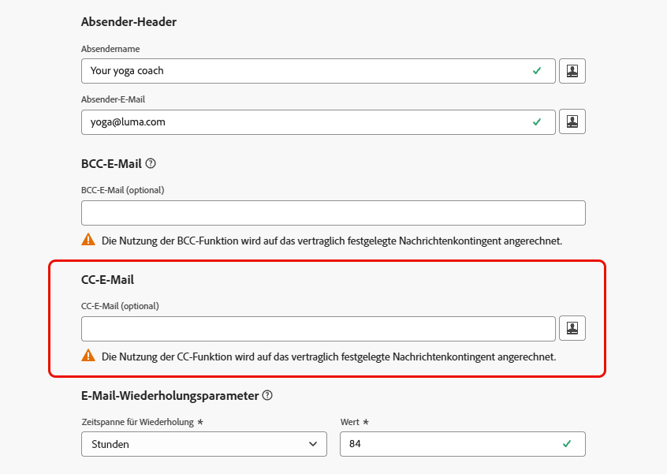
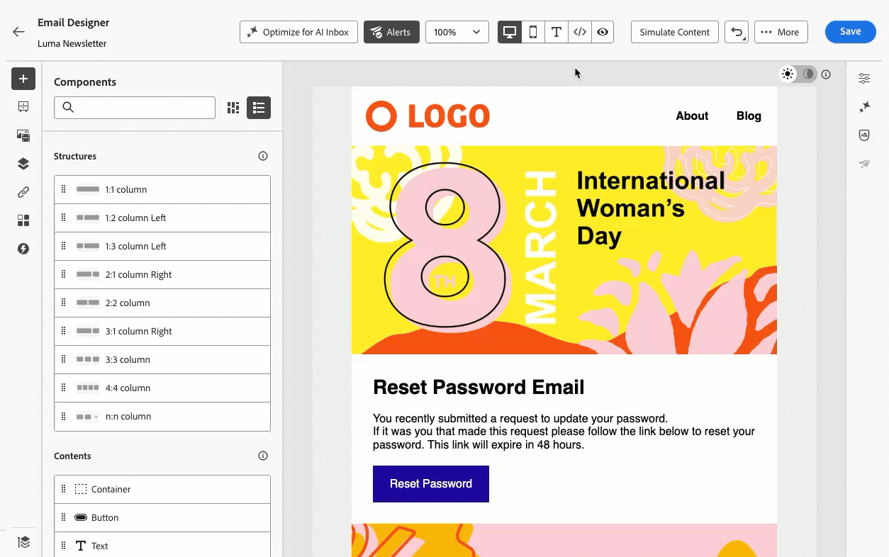
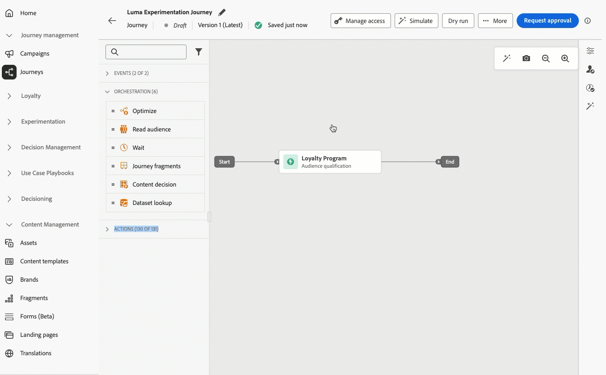

# Versionshinweise {#release-notes}

>[!CONTEXTUALHELP]
>id="ajo_homepage_card1"
>title="Neue Funktionen"
>abstract="**Adobe Journey Optimizer** stellt regelmäßig neue Funktionen, Verbesserungen vorhandener Funktionen und Fehlerbehebungen zur Verfügung. Alle Änderungen werden in der letzten Woche jedes Monats in diesen Versionshinweisen konsolidiert."

[!DNL Adobe Journey Optimizer] verwendet ein kontinuierliches Bereitstellungsmodell, das es Adobe ermöglicht, laufend neue Funktionen, Verbesserungen und Fehlerbehebungen bereitzustellen. Dieser Ansatz ermöglicht ein skalierbares Rollout von Funktionen in Phasen, um die Leistung und Stabilität aller Umgebungen sicherzustellen.

Aufgrund dieses Modells werden die Versionshinweise zwischen den monatlichen Versionen aktualisiert. Ausführliche Informationen zum Veröffentlichungszyklus und zur Verfügbarkeitsphase finden Sie unter [Veröffentlichungszyklus für Journey Optimizer](releases.md).

[!DNL Adobe Journey Optimizer] setzt nativ auf [!DNL Adobe Experience Platform] auf und profitiert von den neuesten Innovationen und Verbesserungen. Weitere Informationen zu diesen Änderungen finden Sie in den [Versionshinweisen zu Adobe Experience Platform](https://experienceleague.adobe.com/docs/experience-platform/release-notes/latest.html?lang=de){target="_blank"}.

## Updates vom Mai 2026 {#may-26-rn}

<table>
<thead>
<tr>
<th><strong>Deeplinks im E-Mail-Designer</strong> </th>
</tr>
</thead>
<tbody>
<tr>
<td>

Es ist jetzt möglich, über eine dedizierte Option im E-Mail-Designer Deeplinks zu Ihren E-Mail-Inhalten hinzuzufügen.

Dadurch wird sichergestellt, dass Benutzende direkt zu den richtigen In-App-Inhalten weitergeleitet werden, anstatt zu Browsern oder App-Stores, wodurch der Kontext und die Interaktion erhalten bleiben.

Weitere Informationen finden Sie in der <a href="../email/deeplinks.md">ausführlichen Dokumentation</a>.

Verfügbarkeitsdatum: 12. Mai 2026

</td>
</tr>
</tbody>
</table>

<table>
<thead>
<tr>
<th><strong>Journey-Simulation</strong> </th>
</tr>
</thead>
<tbody>
<tr>
<td>

Sie können Ihre Journey jetzt auf <strong>Simulation</strong> setzen. In diesem Modus können Sie Ihre Logik mithilfe von <strong>simulierten Benutzenden</strong> überprüfen. Dies sind temporäre, speziell für die Simulation erstellte Profile, mit denen Sie frei testen können. So müssen Sie keine dauerhaften Testprofile in Adobe Experience Platform verwalten.

Die Hauptfunktionen dieser Funktion sind derzeit eingeschränkt für alle Benutzenden verfügbar.

Weitere Informationen finden Sie in der <a href="../building-journeys/simulate-journey.md">ausführlichen Dokumentation</a>.

Verfügbarkeitsdatum: 5. Mai 2026

</td>
</tr>
</tbody>
</table>

<table>
<thead>
<tr>
<th><strong>Entscheidungsregeln und KI-Optimierung der Rangfolgenformel</strong> </th>
</tr>
</thead>
<tbody>
<tr>
<td>

[!DNL Adobe Journey Optimizer] verwendet jetzt KI, um Entscheidungsregeln und Rangfolgenformeln zu erkennen, die vereinfacht werden können. Im Bestand wird für jede Regel, für die die KI eine Optimierungsmöglichkeit identifiziert hat, ein roter Indikator angezeigt. Wenn Sie auf den Indikator klicken, wird der ursprüngliche Ausdruck zusammen mit der von KI vorgeschlagenen Version angezeigt. Dort können Sie eine Datei herunterladen, um zu überprüfen, wie simulierte Profile von jeder Version ausgewertet werden, und zu bestätigen, dass sie sich identisch verhalten, und dann den Ausdruck durch den optimierten Ausdruck ersetzen.

Weitere Informationen finden Sie in der <a href="../start/ai-features.md#decisioning-optimization">ausführlichen Dokumentation</a>.

Verfügbarkeitsdatum: 5. Mai 2026

</td>
</tr>
</tbody>
</table>

<table>
<thead>
<tr>
<th><strong>Integrationen</strong> </th>
</tr>
</thead>
<tbody>
<tr>
<td>

Mit der Funktion <b>Integrationen</b> können Sie Datenquellen von Drittanbietern direkt mit Adobe Journey Optimizer verbinden. Diese Funktion vereinfacht das Einbinden externer Daten und <b>zusammenstellbarer Inhalte</b> und erleichtert so die Bereitstellung personalisierter, dynamischer Nachrichten auf allen Kanälen.

Diese Funktion wurde zuvor als Beta-Version veröffentlicht, steht aber nun für alle Umgebungen zur Verfügung (allgemeine Verfügbarkeit).

Weitere Informationen finden Sie in der <a href="../integrations/integrations.md">ausführlichen Dokumentation</a>.

Verfügbarkeitsdatum: 4. Mai 2026

</td>
</tr>
</tbody>
</table>

### Verbesserungen {#may-26-improv}

#### Entscheidungsfindung

* **Decisioning-Migrations-Workflow**-APIs - Der API-Vertrag zum Erstellen von Abhängigkeitsanalysen und Migrations-Workflows wurde aktualisiert: Übergeben Sie **`request-level`** als **Abfrageparameter** an die Anfrage-URL (`sandbox`, `offer` oder `decision`). Anfrageebene darf nicht mehr im JSON-Text gesendet werden. [Weitere Informationen](../experience-decisioning/decisioning-migration-api.md)

  Verfügbarkeitsdatum: 6. Mai 2026

#### SMS

<!--
* **Opt-out and consent at phone number and sender** - For SMS, Journey Optimizer now records marketing consent and opt-out at the level of both the profile's phone number and short code. 

  This capability is currently only available for Sinch SMS configurations. [Read more](../sms/sms-configuration-sinch.md)
-->

* **Zeichenanzahl**: In Adobe Journey Optimizer können Sie jetzt die Zeichenanzahl verwenden, um die Länge Ihrer SMS-Nachrichten in Echtzeit zu überwachen. Auf diese Weise lässt sich erkennen, wann eine Nachricht in mehrere Segmente aufgeteilt wird. So kann die Formatierung besser verwaltet und ein unerwartetes Ansteigen der Versandkosten vermieden werden. [Weitere Informationen](../sms/create-sms.md)

* **SMS-Eingänge in einen benutzerdefinierten Datensatz**: Leiten Sie in **SMS-API-Anmeldedaten** **eingehende SMS** an einen ausgewählten **benutzerdefinierten, profilaktivierten Erlebnisereignisdatensatz** weiter, anstatt nur an den Standard-Tracking-Datensatz. [Weitere Informationen](../sms/sms-webhook.md)

* **Verbesserung der Webhook-Oberfläche**: Die Benutzeroberfläche zur Konfiguration von SMS-Webhooks enthält jetzt ein integriertes Einrichtungshandbuch mit praktischen Beispielen, das die Abstimmung von Anbieter-Payloads und die Fehlerbehebung erleichtert, da der Konfigurationsfluss nicht verlassen werden muss. [Weitere Informationen](../sms/sms-webhook.md)

#### WhatsApp

* **Unterstützung und Tracking von WhatsApp-Schaltflächen** - WhatsApp-Vorlagen unterstützen jetzt **Schnellantwort**, **Call to action - URL** und **Call to action - Telefon**, **Code kopieren** wird nicht unterstützt. Journey Optimizer sendet unterstützte Schaltflächen und verfolgt Interaktionen zusammen mit Ihren anderen Kanalberichten.

## Demnächst {#coming-soon}

Die Veröffentlichung der folgenden Funktionen und Verbesserungen ist für die nächsten Tage geplant. **Informationen können Änderungen unterliegen**. Aktualisierte Links, Bildschirme und Dokumentationen werden freigegeben, sobald diese Aktualisierungen live in der Produktion verfügbar sind.

### Neue Funktionen {#comming-soon-features}

<table>
<thead>
<tr>
<th><strong>Journey Fragments</strong> </th>
</tr>
</thead>
<tbody>
<tr>
<td>

Sie können jetzt <strong>Journey-Fragmente</strong> in Adobe Journey Optimizer erstellen. Journey-Fragmente sind wiederverwendbare Sets von Journey-Knoten, die Sie einmal erstellen und in einer beliebigen Journey in Ihrer Sandbox ablegen können. Unabhängig davon, ob es sich um eine Eignungsprüfung, eine bevorzugte Kanal-Routing-Logik oder eine Begrüßungssequenz handelt, helfen Fragmente Teams dabei, schneller und konsistent zu arbeiten - ohne jedes Mal dieselbe Logik von Grund auf neu zu erstellen.

Nach der Erstellung werden Fragmente in einem dedizierten <strong>Fragmentinventar) </strong> können mithilfe der Aktivität <strong>Journey-Fragmente&rbrace; in </strong> Journey eingefügt werden.

<!--

-->

Diese Funktion steht nur einer Reihe von Organisationen zur Verfügung (eingeschränkte Verfügbarkeit). Um Zugriff zu erhalten, wenden Sie sich an den Adobe-Support.

<!--p>For more information, refer to the <a href="../building-journeys/journey-fragments.md">detailed documentation</a>.</p-->

Verfügbarkeitsdatum: 12. Mai 2026

</td>
</tr>
</tbody>
</table>

## Versionshinweise April &#39;26 {#april-26-rn}

<!--
**The pre-release notes below are subject to change without prior notice until the release availability date**. Links, screens and updated documentation are published in the release notes, at the release date.

See also [Adobe Experience Platform Pre-release notes](https://experienceleague.adobe.com/de/docs/experience-platform/release-notes/pre-release-notes){target="_blank"}.
-->

Neue Funktionen und Verbesserungen, die Anfang April veröffentlicht wurden, werden mit ihrem Verfügbarkeitsdatum aufgeführt.

**Veröffentlichungsdatum**: 28.–29. April 2026

### Neue Funktionen {#april-26-features}

<table>
<thead>
<tr>
<th><strong>Aktivität „Inkrementelle Abfrage“ in orchestrierten Kampagnen</strong> </th>
</tr>
</thead>
<tbody>
<tr>
<td>

<strong>Orchestrierte Kampagnen</strong> unterstützen jetzt eine Aktivität vom Typ <strong>Inkrementelle Abfrage</strong>, die nur Profile oder Ereignisse anspricht, die sich seit der letzten Ausführung neu qualifiziert haben.

Dadurch bleiben wiederkehrende Kampagnen auf neue Zielgruppen ausgerichtet (neue Anmeldungen, neu qualifizierte Mitglieder des Treueprogramms und ähnliche Segmente) und Abfrage-Workloads werden reduziert und redundante Sendungen im Laufe der Zeit vermieden.

Weitere Informationen finden Sie in der <a href="../orchestrated/activities/incremental-query.md#incremental-query-configuration">ausführlichen Dokumentation</a>.

Verfügbarkeitsdatum: 30. April 2026

</td>
</tr>
</tbody>
</table>

<table>
<thead>
<tr>
<th><strong>Absenderparameter im E-Mail-Header</strong> </th>
</tr>
</thead>
<tbody>
<tr>
<td>

Mit Journey Optimizer können Sie jetzt E-Mails senden, bei denen sich die sendende Entität (Absender) von der erstellenden Entität (Von) unterscheidet. Unterstützende E-Mail-Clients rendern dies normalerweise als „Absenderin bzw. Absender im Namen von Von“ oder zeigen einen „Über“-Hinweis an. Füllen Sie die optionalen Felder <strong>Absender-Header</strong> in den Einstellungen des E-Mail-Kanals aus, um diese Funktion zu konfigurieren.

Weitere Informationen finden Sie in der <a href="../email/header-parameters.md#sender-header">ausführlichen Dokumentation</a>.

</td>
</tr>
</tbody>
</table>

<table>
<thead>
<tr>
<th><strong>CC-Feld in E-Mail-Kanaleinstellungen</strong> </th>
</tr>
</thead>
<tbody>
<tr>
<td>

Sie können jetzt ein optionales CC-Feld (Carbon Copy) in den Einstellungen für den E-Mail-Kanal konfigurieren. Im Gegensatz zu BCC sind CC-Empfangende für die primäre Empfängerin bzw. den primären Empfänger sichtbar, was eine transparente Kommunikation und eine klarere Eigentümerschaft ermöglicht.

Auf diese Weise können Sie automatisch die richtige Stakeholderin bzw. den richtigen Stakeholder für jede Nachricht kopieren (z. B. eine Beziehungs-Managerin bzw. einen Beziehungs-Manager oder eine Kontoinhaberin bzw. einen Kontoinhaber) und gleichzeitig sicherstellen, dass die Kundschaft weiß, an wen sie sich zwecks weiterer Kommunikation wenden muss.

Das CC-Feld unterstützt Personalisierung, sodass eine einzelne Konfiguration Kopien basierend auf Profildaten dynamisch weiterleiten kann und sie so ohne zusätzliche Einrichtung für mehrere Anwendungsfälle skalierbar ist.

Weitere Informationen finden Sie in der <a href="../configuration/cc-email-field.md">ausführlichen Dokumentation</a>.

</td>
</tr>
</tbody>
</table>

<table>
<thead>
<tr>
<th><strong>Kopieren orchestrierter Kampagnen in Sandboxes</strong> </th>
</tr>
</thead>
<tbody>
<tr>
<td>

Die Sandbox-Tools unterstützen jetzt das Verpacken und Kopieren orchestrierter Kampagnen von einer Sandbox in eine andere. Dadurch entfällt die Notwendigkeit, Kampagnen in jeder Umgebung manuell neu zu erstellen. Wenn eine Kampagne in einem Paket zusammengefasst wird, werden ihre abhängigen Kernobjekte wie Zusammenführungsrichtlinien und Nachrichten automatisch einbezogen, sodass die importierte Kampagne bereit für die Konfiguration und Validierung ist. Zum Schutz der Produktionsumgebungen landen alle importierten Kampagnen im Entwurfsstatus in der Ziel-Sandbox, d. h. vor der Live-Schaltung der Kampagne durchlaufen Teams einen Prüfungs- und Genehmigungsschritt.

Weitere Informationen finden Sie in der <a href="../configuration/copy-objects-to-sandbox.md">ausführlichen Dokumentation</a>.

</td>
</tr>
</tbody>
</table>

<table>
<thead>
<tr>
<th><strong>AI Agent-Integration in Journey Optimizer über MCP</strong> </th>
</tr>
</thead>
<tbody>
<tr>
<td>

Adobe Journey Optimizer bietet jetzt einen <strong>MCP (Model Context Protocol)-Server</strong> der Kampagnen-, Kanalkonfigurations- und Sandbox-Vorgänge direkt in jeder MCP-kompatiblen Anwendung aufbereitet. Mit dieser Integration können verschiedene Personas basierend auf denselben Orchestrierungsdaten zusammenarbeiten. Anstatt Abfragen für die Adobe Journey Optimizer-REST-API zu schreiben oder durch mehrere Bildschirme der Benutzeroberfläche zu navigieren, können Sie Ihre Absicht im Gespräch beschreiben und das LLM die entsprechenden MCP-Tools aufrufen lassen. Diese Funktion ist derzeit in Claude Web und Desktop verfügbar.

Diese Funktion steht allen Kundinnen und Kunden als öffentliche Beta-Version zur Verfügung.

Weitere Informationen finden Sie in der <a href="../integrations/ajo-mcp.md">ausführlichen Dokumentation</a>.

</td>
</tr>
</tbody>
</table>

<table>
<thead>
<tr>
<th><strong>Journey-Schlichtung – KI-Modelle</strong> </th>
</tr>
</thead>
<tbody>
<tr>
<td>

Sie können jetzt <strong>KI-Modelle</strong> in Ihren Rangfolgeformeln verwenden, um die Journey-Prioritätswerte basierend auf Kundenprofilattributen und kontextuellen Faktoren automatisch zu erhöhen, sodass Kundinnen und Kunden in die relevantesten Journeys eintreten.

Diese Funktion ist nur für eine Gruppe von Organisationen verfügbar (eingeschränkte Verfügbarkeit). Um Zugriff zu erhalten, wenden Sie sich an den Adobe-Support.

Weitere Informationen finden Sie in der <a href="../conflict-prioritization/journey-ai-models.md">ausführlichen Dokumentation</a>.

</td>
</tr>
</tbody>
</table>

<table>
<thead>
<tr>
<th><strong>Adobe Express-Integration</strong> </th>
</tr>
</thead>
<tbody>
<tr>
<td>

Durch die <b>Adobe Express-Integration</b> in Adobe Journey Optimizer können Sie die Bearbeitungs-Tools von Adobe Express direkt während der Inhaltserstellung verwenden und so die Größe von Assets ändern, ihre Hintergründe entfernen, sie zuschneiden und sie in JPEG oder PNG konvertieren.

Diese Funktion war zuvor nur eingeschränkt verfügbar, steht aber nun für alle Umgebungen zur Verfügung (allgemeine Verfügbarkeit).

Weitere Informationen finden Sie in der <a href="../integrations/express.md">ausführlichen Dokumentation</a>.

Verfügbarkeitsdatum: 23. April 2026

</td>
</tr>
</tbody>
</table>

<table>
<thead>
<tr>
<th><strong>Optimieren von E-Mails für KI-Posteingänge</strong> </th>
</tr>
</thead>
<tbody>
<tr>
<td>

Adobe Journey Optimizer bietet jetzt eine neue Funktion, mit der sichergestellt wird, dass Ihre E-Mails für KI-gestützte Posteingänge wie Apple Intelligence und Google Gemini in Gmail optimal strukturiert sind.

KI-Assistenten steuern zunehmend, wie Empfängerinnen und Empfänger E-Mails lesen und auf sie reagieren. Diese Funktion hilft Ihnen bei der Generierung und Erstellung von Inhalten, die optimal auf nachgelagerte KI-Aufgaben zugeschnitten sind, einschließlich Zusammenfassung, Klassifizierung, Priorisierung und Extraktion von Absichten.

Weiterführende Informationen finden Sie unter <a href="../email/llm-email-optimizer.md">Optimieren von E-Mails für KI-Posteingänge</a>.

Verfügbarkeitsdatum: 17. April 2026

</td>
</tr>
</tbody>
</table>

<table>
<thead>
<tr>
<th><strong>KI-Assistent für Personalisierungsausdrücke</strong> </th>
</tr>
</thead>
<tbody>
<tr>
<td>

[!DNL Adobe Journey Optimizer] enthält jetzt <strong>KI-Assistent</strong> direkt im Personalisierungseditor und die E-Mail-Designer, die Eingabeaufforderungen in natürliche Sprachen in gültige Personalisierungsausdrücke und bedingte Logik umwandelt, sodass kein Syntaxwissen erforderlich ist. Beschreiben Sie die gewünschte Personalisierung und die KI generiert einsatzbereiten Code, den Sie sofort anwenden oder durch Folge-Prompts verfeinern können.

Der Assistent arbeitet auch rückwärts. Wählen Sie einen vorhandenen Ausdruck aus und bitten Sie ihn, die Logik zu erklären, Probleme zu identifizieren oder Verbesserungen vorzuschlagen. Dies ist nicht nur für das Erstellen neuer Ausdrücke nützlich, sondern auch für die Überprüfung und das Debugging vorhandener Ausdrücke in Ihrem Team.

Weitere Informationen finden Sie unter <a href="../content-management/generative-personalization-expressions.md">KI-Assistent für Personalisierungsausdrücke</a>.

Verfügbarkeitsdatum: 13. April 2026

</td>
</tr>
</tbody>
</table>

<table>
<thead>
<tr>
<th><strong>Journey-Pfadexperiment</strong> </th>
</tr>
</thead>
<tbody>
<tr>
<td>

Verwenden Sie den neuen <strong>Optimierungsknoten</strong>, um A/B-Tests oder Multi-Armed-Bandit-Experimente durchzuführen und so den besten Pfad zum Erreichen Ihrer geschäftsbezogenen KPIs zu ermitteln. Mit diesem Tool können Sie Kommunikation, Sequenzierung und Timing testen und variieren sowie anpassen, um Ihre Kundschaft optimal zu erreichen.

Diese Funktion war zuvor nur eingeschränkt verfügbar, steht aber nun für alle Umgebungen zur Verfügung (allgemeine Verfügbarkeit).

Diese Version macht die Auswahl des <strong>Experimenttyps</strong> (A/B oder Multi-Armed-Bandit) und die <strong>Skalierung des Gewinners</strong> für unitäre Journeys allgemein verfügbar.

Weitere Informationen finden Sie in der <a href="../building-journeys/path-experimentation.md">ausführlichen Dokumentation</a>.

Verfügbarkeitsdatum: 7. April 2026

</td>
</tr>
</tbody>
</table>

<table>
<thead>
<tr>
<th><strong>Posteingang</strong> </th>
</tr>
</thead>
<tbody>
<tr>
<td>

Der <strong>Posteingang</strong> ist eine Funktion für Mobilgeräte, die mit Inhaltskarten verfügbar ist und es Kundinnen und Kunden ermöglicht, einen zentralen Ort in ihrer App oder auf ihrer Website zum Anzeigen der an Benutzende gesendeten Nachrichten zu erstellen. Dies verlängert die Lebensdauer der Marketing-Kommunikation, da sichergestellt wird, dass der Zugriff auf Nachrichten bestehen bleibt, auch nachdem diese verworfen wurden.

Weitere Informationen finden Sie in der <a href="../inbox/inbox-gs.md">ausführlichen Dokumentation</a>.

Verfügbarkeitsdatum: 7. April 2026

</td>
</tr>
</tbody>
</table>

<table>
<thead>
<tr>
<th><strong>Unterstützung der Entscheidungsfindung im E-Mail-Kanal</strong> </th>
</tr>
</thead>
<tbody>
<tr>
<td>

Sie können jetzt die Inhalte Ihrer E-Mail-Nachrichten mit <strong>Entscheidungsfindung</strong> personalisieren und optimieren. Nutzen Sie Prioritätswerte, Formeln oder KI-Modelle, um allen Empfangenden die relevantesten Angebote und Inhalte anzuzeigen.

Diese Funktion war zuvor nur eingeschränkt verfügbar, steht aber nun für alle Umgebungen zur Verfügung (allgemeine Verfügbarkeit). Mit dieser allgemein verfügbaren Version werden nun Mirror-Seiten unterstützt.

Weitere Informationen finden Sie in der <a href="../experience-decisioning/create-decision-policy.md">ausführlichen Dokumentation</a>.

Verfügbarkeitsdatum: 6. April 2026

</td>
</tr>
</tbody>
</table>

### Verbesserungen {#april-26-improv}

#### KI

<!--
* **Brand alignment score in Campaign dashboard** - You can now assess your brand alignment score directly within your Campaign dashboard to ensure content stays on-brand. This allows you to verify guidelines at a glance without having to open the content designer.
-->

* **Verbesserung des Prompt-Assistenten**: Der Prompt-Assistent verbessert die KI-Inhaltsgenerierung, indem er Benutzer-Prompts in Echtzeit analysiert und Lücken bezüglich Klarheit, Vollständigkeit und Kontext erkennt. Es schlägt verbesserte Neufassungen vor und bietet praktische Anleitungen, um Prompts mit wichtigen Details wie Zielgruppe, Ton und Absicht anzureichern. Die Funktion stellt außerdem gezielte klärende Fragen, um Benutzenden zu helfen, ihre Eingaben vor der Generierung zu verfeinern. Dies führt zu genaueren, hochwertigeren Ausgaben in weniger Durchläufen. [Weitere Informationen](../content-management/ai-assistant-prompting-guide.md#prompt-assistant)

  Verfügbarkeitsdatum: 5. Mai 2026

#### Push-Benachrichtigung

* **Personalisieren der App-ID in Kanaleinstellungen**: In den Konfigurationseinstellungen für den Push-Kanal können Sie jetzt das Feld **App-ID** personalisieren, damit alle Empfangenden basierend auf ihren Profilinformationen eine Push-Benachrichtigung von der passenden Marke erhalten können. [Weitere Informationen](../push/push-configuration.md#app-id-personalization)

#### Entscheidungsfindung

* **Decisioning-Migrations-Workflow**-APIs - Der API-Vertrag zum Erstellen von Abhängigkeitsanalysen und Migrations-Workflows wurde aktualisiert: Übergeben Sie **`request-level`** als **Abfrageparameter** an die Anfrage-URL (`sandbox`, `offer` oder `decision`). Anfrageebene darf nicht mehr im JSON-Text gesendet werden. [Weitere Informationen](../experience-decisioning/decisioning-migration-api.md)

  Verfügbarkeitsdatum: 6. Mai 2026

* **Anhängen von Fragmenten an Entscheidungselemente**: Journey Optimizer bietet jetzt die Möglichkeit, Fragmente an Entscheidungselemente anzuhängen, die in Code-basierten Erlebniskampagnen über Entscheidungsrichtlinien genutzt werden können. [Weitere Informationen](../experience-decisioning/fragments-decision-policies.md)

  Diese Funktion war zuvor nur eingeschränkt verfügbar, steht aber nun für alle Umgebungen zur Verfügung (allgemeine Verfügbarkeit).

* **Überspringen von vorübergehend nicht verfügbaren Fragmenten**: Bei der Verwendung von Fragmenten in Entscheidungselementen wird ein Fragment übersprungen, wenn es vorübergehend auf Edge nicht verfügbar ist, und die Journey oder Kampagne wird weiter gerendert, anstatt fehlzuschlagen. [Weitere Informationen](../experience-decisioning/fragments-decision-policies.md#temporary-unavailable-fragments)

  Verfügbarkeitsdatum: 14. April 2026

#### Adobe Experience Manager-Integrationen

* **Unterstützung von Adobe Experience Manager-Inhaltsfragmentvarianten**: Sie können beim Einfügen von Adobe Experience Manager-Inhaltsfragmenten **Inhaltsfragmentvarianten** (z. B. Sprach- oder Kanalvarianten) auswählen. Die Handhabung von Gebietsschema und mehrsprachigen Szenarien wurde hierfür verbessert. [Weitere Informationen](../integrations/aem-fragments.md#aem-variations)

  Diese Funktion war zuvor nur eingeschränkt verfügbar, steht aber nun für alle Umgebungen zur Verfügung (allgemeine Verfügbarkeit).

* **Adobe Experience Manager-Inhaltsfragmentkontext beim Authoring**: Ihre Inhaltsfragmentauswahl bleibt beim Wechseln zwischen Textfeldern und Inhaltsblöcken aktiv, sodass Sie weitere Fragmentfelder hinzufügen können, ohne die **AEM-Content-Beratung** jedes Mal erneut öffnen zu müssen. [Weitere Informationen](../integrations/aem-fragments.md)

  Diese Funktion war zuvor nur eingeschränkt verfügbar, steht aber nun für alle Umgebungen zur Verfügung (allgemeine Verfügbarkeit).

#### E-Mail-Design

* **Erweiterter HTML-Editor für E-Mail-Inhalt**: Im erweiterten HTML-Modus können Sie die HTML-Quelle Ihres Inhalts im E-Mail-Designer bearbeiten, erweiterte Ausdrücke (wie Bedingungen) in der Quelle hinzufügen und zwischen HTML- und Desktop-Ansicht wechseln, ohne Ihre Änderungen zu verlieren.

  Diese Funktion war bisher nur für E-Mail-Inhaltsvorlagen verfügbar und wird jetzt zusätzlich zu E-Mail-Inhaltsvorlagen für **E-Mail**-Inhalte im E-Mail-Designer bereitgestellt (z. B. E-Mails, die in Journeys und Kampagnen erstellt wurden). Sie ist derzeit nur eingeschränkt verfügbar. Wenden Sie sich an den Adobe-Support, um Zugang zu erhalten. [Weitere Informationen](../email/email-expert-mode.md)

  Verfügbarkeitsdatum: 9. April 2026

#### Journeys

* **Aktuelle Journey-Payload-Größe in den Journey-Eigenschaften sichtbar** - Im Bedienfeld &quot;Journey-Eigenschaften“ wird nun die aktuelle Größe der Journey-Payload im Vergleich zum konfigurierten Limit angezeigt - z. B. *1,5 MB (von 2 MB)*. Dieser schreibgeschützte Indikator hilft Ihnen, die Journey-Komplexität vor der Veröffentlichung zu überwachen und Fehler zu vermeiden, die durch die Überschreitung der Payload-Größenbeschränkung verursacht werden. [Weitere Informationen](../building-journeys/journey-properties.md#journey-payload-size)

  Verfügbarkeitsdatum: 30. April 2026

#### Journey-Pfadoptimierung

* **Experimenttyp**: Bei der Konfiguration eines Pfadexperiments können Sie jetzt zwischen A/B-Experiment (feste Aufspaltung am Beginn) oder Multi-Armed-Bandit (automatische Aufspaltung mit wöchentlichen Gewichtungsaktualisierungen) wählen. [Weitere Informationen](../building-journeys/path-experimentation.md)

  Verfügbarkeitsdatum: 7. April 2026

* **Pfadexperiment – Skalieren des Gewinners**: Sie können jetzt den erfolgreichsten Pfad eines Experiments automatisch oder manuell für Ihre gesamte Zielgruppe einführen. Sobald ein Gewinner bestimmt wurde, können Sie die Reichweite und Wirkung steigern, ohne das Experiment ständig überwachen zu müssen. [Weitere Informationen](../building-journeys/path-experimentation.md#scale-winner)

  Diese Funktion ist nur in unitären Journeys verfügbar (durch Ereignis ausgelöst und Zielgruppenqualifikationen). Sie ist nicht für Journeys des Typs „Zielgruppe lesen“ verfügbar.

  Verfügbarkeitsdatum: 7. April 2026

* **Bedingungen**: Die Aktivität [Optimieren](../building-journeys/optimize.md) ist die neue Möglichkeit zum Erstellen bedingter Pfade in Journeys. Sie ersetzt die frühere Aktivität **Bedingung**, die aus der Benutzeroberfläche entfernt wurde. Die gesamte Bedingungslogik wird beibehalten und jetzt über die Bedingungen der Aktivität **Optimieren** verarbeitet. [Weitere Informationen](../building-journeys/conditions.md)

  Diese Funktion war zuvor nur eingeschränkt verfügbar, steht aber nun für alle Umgebungen zur Verfügung (allgemeine Verfügbarkeit).

  Verfügbarkeitsdatum: 7. April 2026

#### Orchestrierte Kampagnen

* **Globale Variablen in orchestrierten Kampagnen**: Orchestrierte Kampagnen unterstützen jetzt globale Variablen, die einmal definiert und über alle Aktivitäten innerhalb eines Workflows hinweg wiederverwendet werden können, um die Konfiguration zu vereinfachen und die Konsistenz von dynamischen Werten, Ausdrücken und der Personalisierung von Inhalten sicherzustellen. [Weitere Informationen](../orchestrated/global-variables.md)
* **Verbesserungen des Daten-Modelers**: Orchestrierte relationale Schemata unterstützen jetzt zusammengesetzte Schlüssel, die mehrere Felder umfassen. Beim Laden eines Schemas aus einer DDL-Datei werden auch Auflistungen importiert und beim Laden aus einer DDL- oder einer Excel-Datei werden automatisch zusammengesetzte Beziehungen erstellt. In der Ansicht der Entitätsbeziehung zeigen zusammengesetzte Verknüpfungen jetzt den vollständigen Satz an Feldpaaren zwischen Tabellen an, nachdem eine Datei hochgeladen wurde. [Weitere Informationen](../orchestrated/gs-schemas.md)

