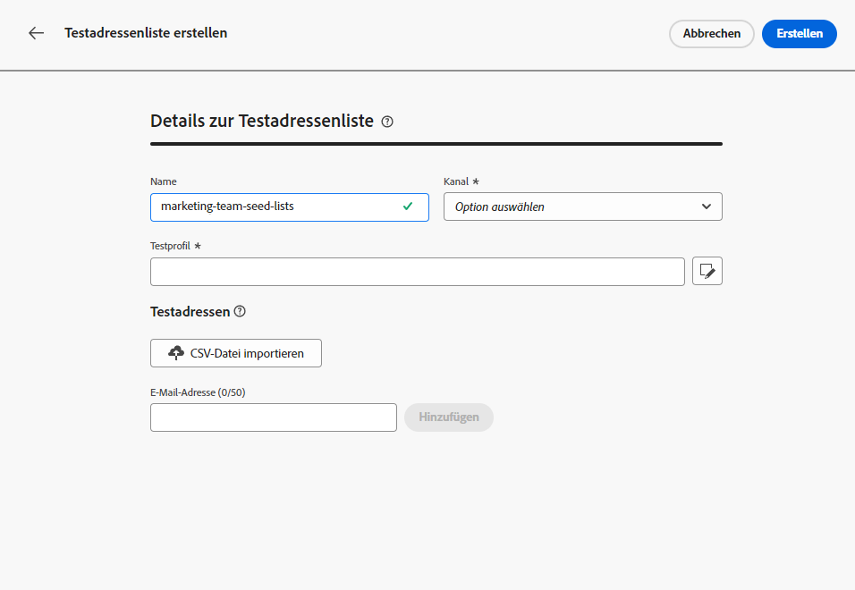
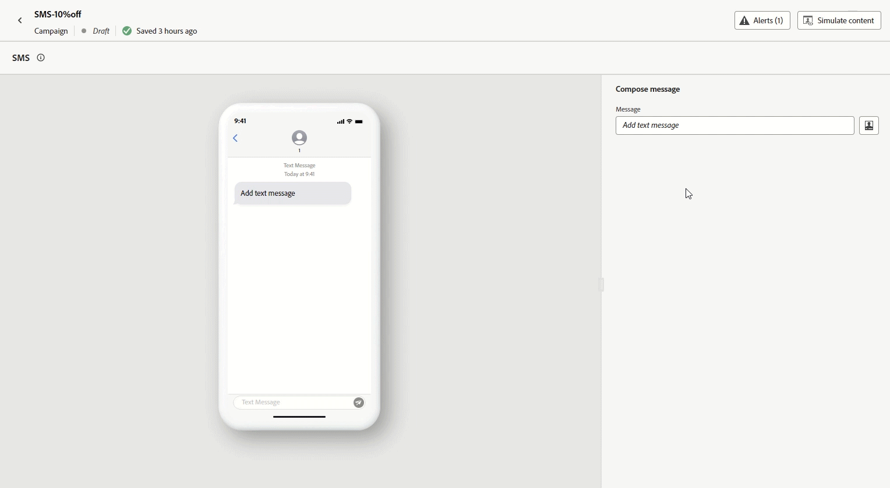

# Versionshinweise {#release-notes}

[!DNL Adobe Journey Optimizer] bietet kontinuierlich neue Funktionen, Verbesserungen vorhandener Funktionen und Fehlerbehebungen. Alle Änderungen werden in der letzten Woche jedes Monats in diesen Versionshinweisen konsolidiert.

Frühere Versionshinweise finden Sie auf [dieser Seite](release-notes-2022.md). Auf der Seite [Letzte Dokumentations-Updates](documentation-updates.md) finden Sie weitere Änderungsmöglichkeiten.

[!DNL Adobe Journey Optimizer] setzt nativ auf [!DNL Adobe Experience Platform] auf und profitiert von den neuesten Innovationen und Verbesserungen von Platform. Weitere Informationen zu diesen Änderungen finden Sie unter [Versionshinweise zu Adobe Experience Platform](https://experienceleague.adobe.com/docs/experience-platform/release-notes/latest.html?lang=de){target="_blank"}.

 Registrieren Sie sich noch heute für den [vierteljährlichen Adobe Journey Optimizer-Newsletter](https://www.adobe.com/subscription/Adobe_Journey_Optimizer_NL.html){target="_blank"}, um jedes Quartal die neuesten Produktaktualisierungen, spannende Geschichten, Anwendungsbeispiele, Tipps und vieles mehr direkt in Ihrem Posteingang zu erhalten.

## Versionshinweise vom September 2023 {#sept-rn-2023}

### Neue Funktionen{#sept-2023-features}

Mit dieser Version werden die unten aufgeführten neuen Funktionen eingeführt.

<table>
<thead>
<tr>
<th><strong>Berechnete Attribute</strong> </th>
</tr>
</thead>
<tbody>
<tr>
<td>

Berechnete Attribute ermöglichen eine einfache Zusammenfassung von Ereignisdaten in Profilattributen über eine intuitive Benutzeroberfläche für eine verbesserte verhaltensbasierte Segmentierung, Personalisierung und Aktivierung. Mit dieser Funktion können Sie berechnete Attribute selbstständig erstellen, verwalten und in Segmentierung, Echtzeit-Kundenprofilzielen oder Journey Optimizer verwenden.  
Darüber hinaus werden durch berechnete Attribute die Segmentierung und Journey-Workflows vereinfacht, sodass Sie relevante Erlebnisse nahtlos bereitstellen können. Weitere Informationen finden Sie unter <a href="../audience/computed-attributes.md">Detaillierte Dokumentation</a>.

</tr>
</tbody>
</table>

<table>
<thead>
<tr>
<th><strong>Konsolidierte Kanalberichte</strong> </th>
</tr>
</thead>
<tbody>
<tr>
<td>

Die Funktion Kanalbericht bietet Analysten und Marketingexperten einen umfassenden Überblick über Traffic- und Interaktionsmetriken auf Kanalebene.

So greifen Sie auf die <b>Bericht</b> Menü, müssen Sie über die <b>Anzeigen von Kanalberichten</b> -Berechtigung.

Weitere Informationen finden Sie im Abschnitt <a href="../reports/channel-report.md">Detaillierte Dokumentation</a>, und <a href="../reports/channel-report.md#how-to-video-channel-report-video">Anleitungsvideo</a>.

</tr>
</tbody>
</table>

<table>
<thead>
<tr>
<th><strong>Datensatzexport-Ziele (GA)</strong> </th>
</tr>
</thead>
<tbody>
<tr>
<td>

Der Export von Journey Optimizer-Datensätzen in Cloud-Speicher-Ziele ist jetzt allgemein verfügbar. Diese Funktion ermöglicht es Ihnen, eine Live-Verbindung mit Zielen im Cloud-Speicher herzustellen, um den Inhalt Ihrer Datensätze zu exportieren.

Weitere Informationen finden Sie in der <a href="../data/export-datasets.md">ausführlichen Dokumentation</a>.

</td>
</tr>
</tbody>
</table>

<table>
<thead>
<tr>
<th><strong>Speicherung der Anmeldeinformationen von Per-Sandbox-Mobile Apps</strong> </th>
</tr>
</thead>
<tbody>
<tr>
<td>

Mit dieser neuen Funktion können Sie Push-Anmeldeinformationen einfach in App-Oberflächen verwalten und mit einer dedizierten Sandbox verknüpfen.

Weitere Informationen finden Sie in der <a href="../in-app/inapp-configuration.md">ausführlichen Dokumentation</a>.

</tr>
</tbody>
</table>

### Verbesserungen {#sept-2023-improvements}

Diese Version enthält die unten aufgeführten Verbesserungen.

<!--**Personalization**

* In addition to visual fragments, it is now possible to create, save and reuse expression fragments from the Journey Optimizer interface through the Expression Editor. Expression fragments replace the previously saved expressions.-->

<!--
**Alerting**

* A new type of system alert has been introduced. You can now get notified when a read audience fails.    -->

**Web-Kanal**

* Einzelseitenanwendungen (SPA) können jetzt im Web-Visual Editor erstellt werden, mit dem Sie auswählen können, auf welche spezifischen Ansichten Sie Ihre Webseitenänderungen anwenden möchten. Eine Ansicht kann als ganze Site oder eine Gruppe visueller Elemente auf einer Site definiert werden, z. B. als Startseite, die gesamte Produktseite oder den Rahmen für Versandvoreinstellungen auf allen Checkout-Seiten. Zur Definition der Ansichten in der Adobe Experience Platform Web SDK-Implementierung ist ein einmaliges Entwicklersetup erforderlich, damit Marketing-Experten Adobe Journey Optimizer-Webkampagnen auf SPA erstellen und ausführen können. [Weitere Informationen](../web/web-spa.md)

* Bei der Bearbeitung einer Seite mit dem Webdesigner können Sie neue Änderungen direkt im Bereich Änderungen hinzufügen, ohne eine Komponente auswählen und in der Designer-Oberfläche bearbeiten zu müssen. [Weitere Informationen](../web/manage-web-modifications.md#add-modifications)

* Beim Einrichten von Web-Subdomains haben Sie jetzt die Möglichkeit, Ihre eigene Subdomain hinzuzufügen - zusätzlich zur Verwendung einer Subdomain, die bereits an Adobe delegiert wurde. [Weitere Informationen](../web/web-delegated-subdomains.md#web-configure-new-subdomain)

**Journeys**

Beim Duplizieren einer Journey können Sie jetzt den Namen der Journey-Kopie definieren. [Weitere Informationen](../building-journeys/journey-gs.md#uplicate-a-journey)

<!--
* Support of custom action responses is now GA. This allows you to leverage API call responses in custom actions and orchestrate your journey based on these responses. In addition, a new guardrail has been added to limit all customs actions to 5000 calls/s per endpoint.
* The maximum duration that you can define in the Wait activity is now 29 days instead of 30.
-->

**E-Mail-Kanal**

Eine neue Option in der E-Mail-Oberflächenkonfiguration ermöglicht den Versand von Transaktionsnachrichten an Profile, selbst wenn sich deren E-Mail-Adressen auf der Adobe befinden [!DNL Journey Optimizer] Unterdrückungsliste. [Weitere Informationen](../email/email-settings.md#send-to-suppressed-email-addresses)

**SMS-Kanal**

Zwei neue Felder, **Opt-in-Nachricht** und **Hilfemeldung** wurden zum API-Konfigurationsbildschirm hinzugefügt, sodass Benutzer Antworten für eingehende Suchbegriffe anpassen können. Beachten Sie, dass dies nur für einzelne SMS-Provider verfügbar ist. [Weitere Informationen](../sms/sms-configuration.md)

**Briefpost-Kanal**

Sie können jetzt Dateien verschlüsseln, die für Ihre Briefpost-Dienstleister bestimmt sind, wenn sie auf einen Server übertragen werden. Zu diesem Zweck ist im Konfigurationsbildschirm für das Dateirouting ein neues Feld verfügbar, über das Sie Ihren Verschlüsselungsschlüssel kopieren und einfügen können. [Weitere Informationen](../direct-mail/direct-mail-configuration.md)

**Reporting**

Sie können jetzt Journey Optimizer-Berichte als CSV-Datei exportieren. Weitere Informationen finden Sie unter [Detaillierte Dokumentation](../reports/global-report.md#export-reports) und [Anleitungsvideo](../reports/global-report.md#video-csv).

**Assets**

Mit einer neuen Option für Assets können Sie das Repository für Ihre Assets in Journey Optimizer auswählen. Sie können sich für ein Assets Essentials-Repository oder ein as a Cloud Service Asset-Repository entscheiden, sofern Sie über diese Lösung verfügen. [Weitere Informationen](../content-management/assets-essentials.md)

<!--**Decision management**

Enhancements have been made to the audience picker in journeys or campaigns, with the addition of new columns displaying the origin and update frequency of audiences.    -->

## Versionshinweise für August 2023 {#aug-rn-2023}

### Neue Funktionen{#aug-2023-features}

Mit dieser Version werden die unten aufgeführten neuen Funktionen eingeführt.

<table>
<thead>
<tr>
<th><strong>Senden von In-App-Nachrichten in Ihren Journeys</strong> </th>
</tr>
</thead>
<tbody>
<tr>
<td>

Es können nun innerhalb einer Journey personalisierte In-App-Nachrichten an Benutzende Ihrer App gesendet werden. Mit Journey Optimizer können Benachrichtigungen entworfen und das Nachrichten-Layout, die Anzeige, der Text und die Schaltflächen angepasst werden, um ein nahtloses Erlebnis zu schaffen.

Weitere Informationen finden Sie in der <a href="../in-app/create-in-app.md">ausführlichen Dokumentation</a>.

</tr>
</tbody>
</table>

<table>
<thead>
<tr>
<th><strong>Validieren von E-Mails mit Testadressenlisten</strong> </th>
</tr>
</thead>
<tbody>
<tr>
<td>

Sie können in Journey Optimizer jetzt Testadressenlisten erstellen und verwalten. Eine Testadressenliste besteht aus internen Adressen, die zu Ihrer eigentlichen Zielgruppe hinzugefügt werden können und zum Zeitpunkt der Versandausführung genau die gleiche Nachricht wie die angesprochenen Profile erhalten. Mit dieser Funktion können Sie die gesendeten Kommunikationen überwachen und sicherstellen, dass alle Anzeigeformate, URLs, Bilder und Links korrekt sind.

Weitere Informationen finden Sie in der <a href="../configuration/seed-lists.md">ausführlichen Dokumentation</a>.

</td>
</tr>
</tbody>
</table>

<!--table>
<thead>
<tr>
<th><strong>Generate text and images with the Content assistant</strong> </th>
</tr>
</thead>
<tbody>
<tr>
<td>

Once you have created and personalized your message, take your content to the next level with the Content assistant. You can now use the Content assistant to optimize your message's impact by experimenting with different main titles, and images. Each variant is managed as a unique Treatment, to measure and compare which title effectively generates more clicks.

This capability is currently available as a private beta.

For more information, refer to the <a href="../start/search-filter-categorize.md#tags">detailed documentation</a>.

</td>
</tr>
</tbody>
</table-->

### Verbesserungen {#aug-2023-improvements}

Diese Version enthält die unten aufgeführten Verbesserungen.

<!--
**APIs**

A new API to create and manage Content Fragments is now available. [Learn more](https://developer.adobe.com/journey-optimizer-apis/references/content-templates/#tag/Content-fragment-API){target="_blank"}.-->

<!--**Email channel**

A new option is available in the email surface settings to include email addresses suppressed due to spam complaint in your transactional messages audiences. Even if they marked marketing messages as spam, these profiles can then receive transactional messages, such as password reset or account statements. This option is disabled by default.-->

**Journeys**

* Sie können jetzt API-Aufrufantworten in benutzerdefinierten Aktionen nutzen und Ihre Journey basierend auf diesen Antworten koordinieren. Diese Funktion ist als private Betaversion verfügbar. [Weitere Informationen](../action/action-response.md).
* Eine neue Art von Systemwarnung wurde eingeführt. Sie können sich jetzt benachrichtigen lassen, wenn eine benutzerdefinierte Aktion fehlschlägt. [Weitere Informationen](../reports/alerts.md).
  <!--* When duplicating a journey, you can now define the name of the journey copy.-->

**Briefpost**

* Azure kann jetzt in der Konfiguration des Datei-Routings als Server-Typ ausgewählt werden. [Weitere Informationen](../direct-mail/direct-mail-configuration.md#file-routing-configuration)
* In den Einstellungen für die Briefpost-Oberfläche ist jetzt das kaufmännische Und-Zeichen als Spaltentrennfeld verfügbar. [Weitere Informationen](../direct-mail/direct-mail-configuration.md#direct-mail-surface)

## Versionshinweise vom Juli 2023 {#july-rn-2023}

### Neue Funktionen{#july-2023-features}

<table>
<thead>
<tr>
<th><strong>Zielgruppenkomposition</strong> </th>
</tr>
</thead>
<tbody>
<tr>
<td>

Sie können nun einen Kompositions-Workflow erstellen, um vorhandene Adobe Experience Platform-Zielgruppen in einer visuellen Arbeitsfläche zu kombinieren und verschiedene Aktivitäten (Aufteilung, Anreicherung …) zum Erstellen neuer Zielgruppen zu nutzen. Neu erstellte Zielgruppen werden zusammen mit vorhandenen Zielgruppen wieder in Adobe Experience Platform gespeichert und können in Journey Optimizer-Kampagnen zur Kundenansprache verwendet werden.

Weitere Informationen finden Sie in der <a href="../audience/get-started-audience-orchestration.md">ausführlichen Dokumentation</a>.

Die Zielgruppenkomposition ist vollständig in das neue Adobe Experience Platform-Menü „Zielgruppen“ integriert, das als zentralisiertes Portal für Zielgruppen dient. Sie können jetzt eine Seite zum Durchsuchen verwenden, die ein neues Dashboard mit Segmenttrends und Überschneidungen enthält, um neue Einblicke zu erhalten und Organisations-Tools für die Ordner- und Tagging-Verwaltung zu erkunden. Eingebettet in dieses Erlebnis sind Governance-Steuerelemente für standardisierte Zielgruppenbeschriftungen sowie Funktionen für das Management des Zielgruppen-Lebenszyklus, um Aktivierungs-Workflows zu verwalten. Mit diesem neuen Management-Erlebnis können Sie Zielgruppen jetzt einfach und sicher von einem Ort aus verwalten. Weitere Informationen sind in der <a href="https://experienceleague.adobe.com/docs/experience-platform/segmentation/ui/overview.html?lang=de" target="_blank">Dokumentation zu Adobe Experience Platform</a> verfügbar.

</td>
</tr>
</tbody>
</table>

<table>
<thead>
<tr>
<th><strong>Briefpost-Kanal</strong> </th>
</tr>
</thead>
<tbody>
<tr>
<td>

Sie können jetzt Ihren Kampagnen Briefpost-Nachrichten hinzufügen. Briefpost ist ein Offline-Kanal, mit dem Sie die Extraktionsdateien personalisieren und generieren können, die Briefpostanbieter zum Senden von Nachrichten an Ihre Kunden benötigen.

Wenn Sie einen Briefpost-Versand vorbereiten, erzeugt Journey Optimizer eine Datei, die alle Zielgruppenprofile und die ausgewählten Kontaktinformationen enthält (z. B. die Postanschrift). Dann senden Sie diese Datei an Ihren Briefpost-Dienstleister, der sich um den tatsächlichen Versand kümmert.

Derzeit ist der Kanal „Briefpost“ nicht für Organisationen verfügbar, die das Zusatzangebot Adobe Healthcare Shield erworben haben.

Weitere Informationen finden Sie in der <a href="../direct-mail/get-started-direct-mail.md">ausführlichen Dokumentation</a>.

</tr>
</tbody>
</table>

<table>
<thead>
<tr>
<th><strong>Konvertieren von HTML-Inhalten für den E-Mail-Designer</strong> </th>
</tr>
</thead>
<tbody>
<tr>
<td>

Sie können jetzt alle HTML-Inhalte in den E-Mail-Editor von Journey Optimizer importieren und dort konvertieren. Inhaltsbausteine werden automatisch identifiziert und stehen im E-Mail-Designer zur Verfügung: Nutzen Sie seine leistungsstarken Design-Funktionen, um sie zu aktualisieren und zu personalisieren!

Weitere Informationen finden Sie in der <a href="../email/existing-content.md">ausführlichen Dokumentation</a>.

</td>
</tr>
</tbody>
</table>

<table>
<thead>
<tr>
<th><strong>Verwenden von Tags in Journey Optimizer</strong> </th>
</tr>
</thead>
<tbody>
<tr>
<td>

Zusätzlich zu Kampagnen und Journeys können Sie Ihren Landingpages, Inhaltsvorlagen, Fragmenten und Abonnementlisten jetzt einheitliche Tags von Adobe Experience Platform zuweisen. Auf diese Weise können Sie sie einfach klassifizieren und die Suche und Navigation in allen Listen verbessern. 

Weitere Informationen finden Sie in der <a href="../start/search-filter-categorize.md#tags">ausführlichen Dokumentation</a>.

</td>
</tr>
</tbody>
</table>

<table>
<thead>
<tr>
<th><strong>APIs für Inhaltsvorlagen</strong> </th>
</tr>
</thead>
<tbody>
<tr>
<td>

Sie können jetzt Adobe Journey Optimizer-Inhaltsvorlagen mithilfe von dedizierten APIs erstellen und verwalten, um eine nahtlose Integration in Ihr vorhandenes Inhaltssystem zu ermöglichen.

Weitere Informationen finden Sie in der <a href="https://developer.adobe.com/journey-optimizer-apis/references/content/">ausführlichen Dokumentation</a>.

</td>
</tr>
</tbody>
</table>

### Verbesserungen {#july-2023-improvements}

Diese Version enthält die unten aufgeführten Verbesserungen.

**Kampagnen**

Kontextbezogene Ereignisse im Zusammenhang mit Kampagnen sind jetzt im Menü „Kontextuelle Attribute“ des Personalisierungseditors verfügbar.

**Zielgruppen**

Die Zielgruppenauswahl in Journeys oder Kampagnen wurde verbessert, indem neue Spalten hinzugefügt werden, die die Herkunft und Aktualisierungshäufigkeit von Zielgruppen anzeigen. Mit der Veröffentlichung des Portals „Zielgruppenkomposition“ haben Adobe Experience Platform und Adobe Journey Optimizer die Verwendung der Begriffe „Zielgruppen“ und „Segment“ im System und in der Dokumentation aktualisiert.

* Zielgruppe: eine Gruppe von Personen, Konten, Haushalten oder anderen Entitäten, die gemeinsame Merkmale und Verhaltensweisen aufweisen.
* Segmentdefinition: In Adobe Experience Platform sind dies die Regeln zur Beschreibung der Hauptmerkmale oder des Verhaltens einer Zielgruppe. Dieser Begriff war früher einfach als „Segment“ bekannt.

Daher wird in Adobe Journey Optimizer und auf der Benutzeroberfläche von Adobe Experience Platform „Segmente“ durch „Zielgruppen“ ersetzt, um diesen neuen Pfad der Zielgruppenerstellung und -verwaltung widerzuspiegeln.

**APIs**

Die JWT-Methode zum Generieren von Zugriffs-Token für die Authentifizierung von Adobe Journey Optimizer APIs wird nicht mehr unterstützt. Alle neuen Integrationen müssen mit der Authentifizierungsmethode OAuth-Server-zu-Server erstellt werden. Adobe empfiehlt auch, Ihre vorhandenen Integrationen zur OAuth-Methode zu migrieren. [Weitere Informationen](https://developer.adobe.com/journey-optimizer-apis/references/authentication/){target="_blank"}.

**Weitere Änderungen**

Der Export von Journey Optimizer-Datensätzen in Cloud-Speicher-Ziele ist jetzt für alle Kundinnen und Kunden als öffentliche Beta verfügbar. Diese Funktion ermöglicht es Ihnen, eine Live-Verbindung mit Zielen im Cloud-Speicher herzustellen, um den Inhalt Ihrer Datensätze zu exportieren. [Weitere Informationen](../data/export-datasets.md)

## Versionshinweise für Juni 2023 {#june-rn-2023}

<table>
<thead>
<tr>
<th><strong>API-ausgelöste Kampagnen für Marketing-Anwendungsfälle</strong> </th>
</tr>
</thead>
<tbody>
<tr>
<td>

Sie können jetzt APIs verwenden, um Marketing-Kampagnen in Adobe Journey Optimizer von einem externen System aus auszulösen.

Bis zu dieser Version bediente die Funktion für API-ausgelöste Kampagnen den Bedarf an verschiedenen operativen und transaktionalen Nachrichten, wie etwa Zurücksetzen des Passworts oder OTP-Token, sie konnte jedoch nicht zur Erstellung von Marketing-Kampagnen verwendet werden. Für API-ausgelöste Kampagnen stehen die Kanäle E-Mail, SMS und Push-Benachrichtigungen zur Verfügung.

Weitere Informationen finden Sie in der <a href="../campaigns/api-triggered-campaigns.md">ausführlichen Dokumentation</a>.
</td>
</tr>
</tbody>
</table>

<!--
### Improvements {#june-2023-improvements}

**Audiences**

Enhancements have been made to the audience picker in journeys or campaigns, with the addition of new columns displaying the origin and update frequency of audiences.

**Journeys**

You can now leverage API call responses in custom actions and orchestrate your journey based on these responses.
-->

<!--
## June 2023 early release notes {#june-rn-2023}

Information below is subject to change without prior notice until the release availability date. Updated documentation will be published at the release date, and direct links will be added in this page.

**Audiences**

Enhancements have been made to the audience picker in journeys or campaigns, with the addition of new columns displaying the origin and update frequency of audiences.    

**Journeys**

* You can now leverage API call responses in custom actions and orchestrate your journey based on these responses.     

* A new type of system alert has been introduced. You can now get notified when a custom action fails.
-->

## Versionshinweise Mai 2023 {#may-rn-2023}

### Neue Funktionen{#may-2023-features}

<table>
<thead>
<tr>
<th><strong>Inhaltsexperiment in Kampagnen</strong> </th>
</tr>
</thead>
<tbody>
<tr>
<td>

Adobe Journey Optimizer unterstützt jetzt Experimente in Kampagnen. Bei Experimenten handelt es sich um randomisierte Test, was im Rahmen von Online-Tests bedeutet, dass Sie einigen zufällig ausgewählten Benutzenden eine bestimmte Variante einer Nachricht anbieten und einer anderen zufällig ausgewählten Gruppe von Benutzenden eine andere Variante oder Abwandlung anbieten. Nach dem Angebot können Sie die Ihre gewünschten Ergebnismetriken messen, z. B. Öffnung von E-Mails, Abonnements oder Käufe.

Weitere Informationen finden Sie in der <a href="../campaigns/content-experiment.md">ausführlichen Dokumentation</a>.

</td>
</tr>
</tbody>
</table>

<!--
<table>
<thead>
<tr>
<th><strong>Objective reporting and performance measurement in campaigns</strong> </th>
</tr>
</thead>
<tbody>
<tr>
<td>

You can now measure the performance of your campaigns across inbound and outbound through dedicated reports. Adobe Journey Optimizer reports can retrieve additional metrics to use in the Objectives tab of your campaign reports.

For more information, refer to the <a href="../reports/campaign-global-report.md">detailed documentation</a>.

</td>
</tr>
</tbody>
</table>
-->

<table>
<thead>
<tr>
<th><strong>Erstellen und Verwenden von Fragmenten in E-Mail-Inhalten</strong> </th>
</tr>
</thead>
<tbody>
<tr>
<td>

Sie können jetzt Fragmente erstellen, verwenden und verwalten, um E-Mails und Inhaltsvorlagen schnell zusammenzustellen. Ein Fragment ist eine vordefinierte wiederverwendbare Komponente, die in Journey Optimizer-Kampagnen und -Journeys in mehreren E-Mails referenziert werden kann, um einen verbesserten und beschleunigten Design-Prozess zu ermöglichen.

Weitere Informationen finden Sie in der <a href="../email/fragments.md">ausführlichen Dokumentation</a>.

</td>
</tr>
</tbody>
</table>

<table>
<thead>
<tr>
<th><strong>Verwenden von Tags in Ihren Kampagnen (Beta)</strong> </th>
</tr>
</thead>
<tbody>
<tr>
<td>

Sie können nun Ihren Kampagnen einheitliche Adobe Experience Platform-Tags zuweisen. Dies ermöglicht eine einfache Klassifizierung und verbesserte Suche über die Kampagnenliste. Die Funktion für einheitliche Tags befindet sich derzeit in der Betaphase.

Weitere Informationen finden Sie in der <a href="../start/search-filter-categorize.md#tags">ausführlichen Dokumentation</a>.

</td>
</tr>
</tbody>
</table>

<table>
<thead>
<tr>
<th><strong>KI-Ranking-Modell für personalisierte Optimierung (allgemeine Verfügbarkeit)</strong> </th>
</tr>
</thead>
<tbody>
<tr>
<td>

KI-Ranking-Modelle für personalisierte Optimierung sind jetzt allgemein im Entscheidungs-Management verfügbar. Dieser neue Modelltyp ermöglicht die Optimierung und Personalisierung von Angeboten basierend auf Zielgruppen und der Angebotsleistung.

Weitere Informationen finden Sie in der <a href="../offers/ranking/personalized-optimization-model.md">ausführlichen Dokumentation</a>.

</td>
</tr>
</tbody>
</table>

### Verbesserungen {#may-2023-improvements}

**Zielgruppen**

* Zur Vorbereitung auf die allgemeine Verfügbarkeit der Audience Portal-Funktion aktualisiert Adobe Experience Platform die Verwendung von „Zielgruppen“ und „Segmenten“ innerhalb des Systems und der Dokumentation.

   * Zielgruppe: eine Gruppe von Personen, Konten, Haushalten oder anderen Entitäten, die gemeinsame Merkmale und Verhaltensweisen aufweisen.
   * Segmentdefinition: In Adobe Experience Platform sind dies die Regeln zur Beschreibung der Hauptmerkmale oder des Verhaltens einer Zielgruppe. Dieser Begriff war früher einfach als „Segment“ bekannt.

  Daher wird in Adobe Journey Optimizer und auf der Benutzeroberfläche von Adobe Experience Platform „Segmente“ durch „Zielgruppen“ ersetzt, um diesen neuen Pfad der Zielgruppenerstellung und -verwaltung widerzuspiegeln.

  Die Übersetzung des englischen Begriffs „Audience“ bei der Bezugnahme auf eine Gruppe von Profilen, die eine Nachricht erhalten sollen, wurde für einige Sprachen in allen Produkten von Digital Experience vereinheitlicht:

   * Deutsch: Zielgruppe
   * Brasilianisches Portugiesisch: público-alvo
   * Spanisch: público destinatario

<!--* Enhancements have been made to the audience picker in journeys or campaigns, with the addition of new columns displaying the origin and update frequency of audiences.-->

**SMS-Kanal**

* Bei der Konfiguration der Oberfläche Ihres SMS-Kanals wurde Infobip als Anbieterfirma hinzugefügt. [Weitere Informationen](../sms/sms-configuration.md)
* Twillio – Die Einrichtung von API-Anmeldedaten bietet jetzt die Möglichkeit, die Messaging-Service-SID für eine nahtlose Integration in Ihr Twillio-Konto hinzuzufügen. [Weitere Informationen](../sms/sms-configuration.md)

**In-App-Kanal**

* Es wurden neue Regeln für den Trigger von Nachrichten für den Adobe Places-Dienst hinzugefügt. [Weitere Informationen](../in-app/inapp-configuration.md)
* Es wurden neue Adobe Experience Platform-Sicherheitsfunktionen hinzugefügt, mit denen Geräteereignisse erfasst und als Trigger-Regeln hinzugefügt werden können.

<!--
**Journeys**

* You can now leverage API call responses in custom actions and orchestrate your journey based on these responses.
-->

**Kampagnen**

* Jetzt ist es möglich, eine Kampagne über den Inventarbildschirm mithilfe des Aktionsmenüs (drei Punkte) zu duplizieren. [Weitere Informationen](../campaigns/modify-stop-campaign.md#duplicate)
* Sie können jetzt Entwürfe von Änderungen an einer Live-Kampagne löschen.
* Die Schritte zur Aktivierung einer Kampagne sind jetzt optimiert. [Weitere Informationen](../campaigns/modify-stop-campaign.md)

**Entscheidungs-Management**

* Sie können jetzt die Frequenzlimitierung bearbeiten, wenn das Angebot den Status **[!UICONTROL Entwurf]** hat und noch nie zuvor mit aktivierter Frequenzlimitierung veröffentlicht wurde. [Weitere Informationen](../offers/offer-library/add-constraints.md#frequency-capping)

**Personalisierung**

* Sie können Verweise auf Assets jetzt direkt im Personalisierungs-Editor auswählen und einfügen, wenn Sie in HTML-Inhalten arbeiten.

### Fehlerbehebungen{#may-2023-fixes}

* In-App-Nachrichten – Es wurde ein Problem behoben, bei dem die Planung von Kampagnen mit den Häufigkeitseinstellungen für Nachrichten in Konflikt stand.

## Versionshinweise April 2023 {#apr-rn-2023}

<!--Information below is subject to change without prior notice until the release availability date. Updated documentation will be published at the release date, and direct links will be added in this page.

**Release date**: April 27, 2023-->

### Neue Funktionen{#apr-2023-features}

<table>
<thead>
<tr>
<th><strong>Web-Kanal (allgemeine Verfügbarkeit)</strong> </th>
</tr>
</thead>
<tbody>
<tr>
<td>

Adobe Journey Optimizer erweitert seine kanalübergreifenden Funktionen durch die Unterstützung des Web-Kanals. Sie können jetzt Web-Erlebnisse wie andere Kanäle über eine intelligente und intuitive visuelle Benutzeroberfläche erstellen, ändern und in der Vorschau anzeigen, um die Endbenutzererfahrung zu personalisieren. Beachten Sie, dass Sie derzeit in Journey Optimizer nur Web-Erlebnisse in Kampagnen erstellen können.

Weitere Informationen finden Sie in der <a href="../web/get-started-web.md">ausführlichen Dokumentation</a>.

</tr>
</tbody>
</table>

<table>
<thead>
<tr>
<th><strong>Schnellstart-Workflow für Mobile-Onboarding (Beta)</strong> </th>
</tr>
</thead>
<tbody>
<tr>
<td>

Der neue Schnellstart-Workflow für Mobile-Onboarding ist jetzt verfügbar. Verwenden Sie diese neue Produktfunktion, um das Mobile SDK schnell so zu konfigurieren, dass es mit der Erfassung und Validierung von Mobilereignisdaten beginnt und Push-Benachrichtigungen für Mobilgeräte mit Adobe Journey Optimizer sendet. Auf diese Funktion kann über die Startseite der Datenerfassung als öffentliche Beta-Version zugegriffen werden.

Weitere Informationen finden Sie in der <a href="../push/mobile-onboarding-wf.md">ausführlichen Dokumentation</a>.

</td>
</tr>
</tbody>
</table>

<table>
<thead>
<tr>
<th><strong>Neues Journey-Dashboard (Beta)</strong> </th>
</tr>
</thead>
<tbody>
<tr>
<td>

 Das Journey-Dashboard ist nun in zwei Registerkarten unterteilt:

<ul><li>Verwenden Sie die <strong>Übersicht</strong>, um auf ein neues Dashboard zuzugreifen, das wichtige Metriken zu Ihren Journeys anzeigt.</li>
<li>Verwenden Sie die Registerkarte <strong>Durchsuchen</strong>, um auf die Liste aller Journeys zuzugreifen.</li></ul>

Diese Funktion ist in allen Journeys als öffentliche Beta-Version verfügbar.

Weitere Informationen finden Sie in der <a href="../building-journeys/journey-gs.md#journey-access">ausführlichen Dokumentation</a>.

</td>
</tr>
</tbody>
</table>

### Verbesserungen {#april-2023-improvements}

**Journeys**

* Auf der Journey-Arbeitsfläche wird nun die Aktivitäts-ID für Nachrichtenaktivitäten und End-Tags angezeigt. Dies verbessert das Reporting und die erneute Zielgruppenbestimmung.
* Das Layout des Konfigurationsbereichs, der in Aktionen, Datenquellen, Ereignissen und Journeys angezeigt wird, wurde verbessert.
* Neue Erkenntnisse zur Anzahl der Knoten auf der Arbeitsfläche mit Sicherheitsvorkehrungen zur Unterstützung des Wachstums: Halten Sie Journeys leserfreundlich und führen Sie Qualitätssicherung und Fehlerbehebung mit einer maximalen Anzahl von 50 Knoten pro Journey durch. [Weitere Informationen](../start/guardrails.md#journeys-guardrails-journeys)
* Beim Hinzufügen einer [E-Mail](../email/create-email.md)-, [SMS](../sms/create-sms.md)- oder [Push](../push/create-push.md)-Aktion zu einer Journey ist die Oberfläche in der aktuellen Journey jetzt standardmäßig mit der zuletzt verwendeten Oberfläche für diesen Kanal vorausgefüllt.
* Sie können jetzt in Ihren benutzerdefinierten Aktionen statische oder dynamische Abfrageparameter definieren. [Weitere Informationen](../action/about-custom-action-configuration.md#url-configuration)

**Reporting**

* Sie können jetzt Journey Optimizer-Berichte als PDF exportieren. [Weitere Informationen](../reports/global-report.md#export-reports)

**Content Designer**

* Adobe Journey Optimizer Content Designer wurde aktualisiert und der Zugriff auf Design-Stile und -Komponenten ist jetzt einfacher. Diese neue Version bietet ein verbessertes Benutzererlebnis und verbesserte Leistung, teilweise Kompatibilität im Dunkelmodus und neue Unterstützung für Barrierefreiheitsstandards.

## März 2023 – Versionshinweise {#mar-2023}

### Neue Funktionen{#mar-2023-features}

<table>
<thead>
<tr>
<th><strong>In-App-Kanal (Allgemeine Verfügbarkeit)</strong> </th>
</tr>
</thead>
<tbody>
<tr>
<td>

Es können nun innerhalb einer Kampagne personalisierte In-App-Nachrichten an Benutzende Ihrer App gesendet werden. Mit Journey Optimizer können Benachrichtigungen entworfen und das Nachrichten-Layout, die Anzeige, der Text und die Schaltflächen angepasst werden, um ein nahtloses Erlebnis zu schaffen.

Weitere Informationen finden Sie in der <a href="../in-app/get-started-in-app.md">ausführlichen Dokumentation</a>.

</tr>
</tbody>
</table>

<table>
<thead>
<tr>
<th><strong>Klick-Tracking für SMS</strong> </th>
</tr>
</thead>
<tbody>
<tr>
<td>

Mit dem Klick-Tracking für SMS können Sie die Ergebnisse Ihrer gekürzten URLs überwachen, feststellen, wer auf sie geklickt hat, und diese Daten verwenden, um Kundinnen und Kunden mit nachfolgenden Kampagnen erneut anzusprechen.

Weitere Informationen finden Sie in der <a href="../sms/create-sms.md#sms-content">ausführlichen Dokumentation</a>.

</td>
</tr>
</tbody>
</table>

<table>
<thead>
<tr>
<th><strong>Verwenden von Tags in Ihren Journeys (Beta)</strong> </th>
</tr>
</thead>
<tbody>
<tr>
<td>

Als Anwenderin bzw. Anwender von Journey Optimizer können Sie Ihre Geschäftsobjekte jetzt mithilfe von Tags organisieren. Tags sind eine schnelle und einfache Möglichkeit, Objekte zu klassifizieren, um die Suche zu verbessern. Diese Funktion befindet sich derzeit in der Beta-Phase und steht nur für Journeys zur Verfügung.

Weitere Informationen finden Sie in der <a href="../start/search-filter-categorize.md#tags">ausführlichen Dokumentation</a>.

</td>
</tr>
</tbody>
</table>

### Verbesserungen {#mar-2023-improvements}

**Journeys**

* Die neue **Einschränkungs-API** ermöglicht es Ihnen, ein Limit für die Anzahl der pro Sekunde gesendeten Ereignisse festzulegen, wodurch überlastende Traffic-Spitzen auf Ihren externen Systemen oder in Ihrer API verhindert werden. Wenn das festgelegte Limit erreicht ist, werden alle nachfolgenden API-Aufrufe in der Reihenfolge, in der sie empfangen wurden, in die Warteschlange gestellt und so bald wie möglich verarbeitet. Beachten Sie, dass diese Funktion nur eine Einschränkungskonfiguration für alle Sandboxes unterstützt. [Weitere Informationen](../configuration/external-systems.md)
* Die Journey-Arbeitsfläche wurde verbessert, um das Benutzererlebnis zu vereinfachen und zu verbessern. Am Ende jedes Pfads auf der Arbeitsfläche wurden die leeren Platzhalter entfernt. Sie können Ihre Aktivitäten jetzt einfach hinzufügen, indem Sie sie an das Ende eines Pfads ziehen.
* Auf der Journey-Arbeitsfläche ist der Namen der vorherigen Aktivität nicht mehr automatisch als Titel des **Ende**-Tags festgelegt. Benutzerinnen und Benutzer können bei Bedarf manuell eine benutzerdefinierte Bezeichnung hinzufügen.
* Die standardmäßige Zeitüberschreitungs- und Fehlerdauer in den Journey-Eigenschaften wurde von 5 auf 30 Sekunden geändert. [Weitere Informationen](../configuration/external-systems.md#timeout)
* Die standardmäßige Einschränkungsrate in Aktivitäten vom Typ „Zielgruppe lesen“ wurde von 20.000 auf 5.000 Nachrichten pro Sekunde geändert. [Weitere Informationen](../building-journeys/read-audience.md#configuring-segment-trigger-activity)
* Dem Testmodus wurde ein Schutzmechanismus hinzugefügt, der nur Ereignisse überwacht, die über die Oberfläche gesendet werden. Ereignisse, die über ein externes Tool gesendet werden, werden nicht berücksichtigt. [Weitere Informationen](../building-journeys/testing-the-journey.md)

<!-- 
* When adding an Email, SMS or Push action in a journey, the surface is now pre-filled, by default, with the last used surface for that channel.
* A new type of system alert has been introduced. You can now get notified when a custom action fails. [Learn more](../reports/alerts.md)
* Timeout and error management has been improved in journeys. Timeout and error paths are now always added on the canvas. A new toolbar button is available to show/hide these paths. [Learn more](../building-journeys/journey-gs.md#timeout_and_error)
* The Journey dashboard is now split in two tabs:
    * Use the **Overview** tab to access a new dashboard which displays key metrics related to your journeys.
    * Use the **Browse** tab to access list of all journeys.
-->

**Entscheidungs-Management**

* Um eine mögliche Verwechslung mit der kürzlich veröffentlichten Tags-Funktion in Adobe Experience Platform zu vermeiden, wurden Entscheidungs-Management-Tags in „Sammlungsqualifizierer“ umbenannt.

  Beachten Sie, dass der Begriff „Tag“ zwar nicht mehr in der Benutzeroberfläche des Entscheidungs-Managements verwendet wird, aber weiterhin in Backend-Diensten wie APIs und Datensätzen zu finden ist.

* Sie können den Angebotsbegrenzungszähler auf täglicher, wöchentlicher oder monatlicher Basis zurücksetzen. [Weitere Informationen](../offers/offer-library/add-constraints.md#capping)

* Sie können auch festlegen, welches Adobe Experience Platform-Ereignis nach einer Entscheidungs-Management-Begrenzung geprüft werden soll. [Weitere Informationen](../offers/offer-library/add-constraints.md#capping)

* Im Erstellungsbildschirm für Platzierungen wurden zusätzliche Parameter hinzugefügt. Diese ermöglichen es Ihnen zu steuern, ob ein Angebot über mehrere Platzierungen hinweg dupliziert werden kann, und anzugeben, ob der Inhalt und die Metadaten des Angebots in die API-Antwort aufgenommen werden sollen. [Weitere Informationen](../offers/offer-library/creating-placements.md)

**Personalisierung**

* Sie können jetzt standardmäßigen Fallback-Text für zeichenfolgenbasierte Profilattribute im Ausdruckseditor einfügen. Diese Werte werden angezeigt, wenn die ausgewählten Attribute kein Ergebnis zurückgeben. [Weitere Informationen](../personalization/personalization-build-expressions.md#add)

**Reporting**

* Die Reporting-Widget-Funktionalität wurde verbessert und bietet jetzt Anpassungsmöglichkeiten dafür, wie Benutzerinnen und Benutzer ihre Daten anzeigen. Mit dieser Verbesserung können Benutzerinnen und Benutzer jetzt zwischen mehreren Visualisierungsoptionen wählen, einschließlich Diagramm-, Tabellen- und Ringdiagrammen.

  Um Zugriff auf die neuesten Widgets zu erhalten, müssen Sie die verschiedenen Reporting-Dashboards zurücksetzen. Weitere Informationen zur Anpassung von Dashboards finden Sie in der [entsprechenden Dokumentation](../reports/global-report.md#modify-dashboard).

## Februar 2023 – Versionshinweise {#feb-2023}

### Neue Funktionen{#feb-2023-features}

<table>
<thead>
<tr>
<th><strong>In-App-Kanal (Beta)</strong> </th>
</tr>
</thead>
<tbody>
<tr>
<td>

Es können nun innerhalb einer Kampagne personalisierte In-App-Nachrichten an Benutzende Ihrer App gesendet werden. Mit Journey Optimizer können Benachrichtigungen entworfen und das Nachrichten-Layout, die Anzeige, der Text und die Schaltflächen angepasst werden, um ein nahtloses Erlebnis zu schaffen.

<strong>Vorsicht</strong> – Diese Funktion befindet sich derzeit in der Beta-Version und steht nur der Beta-Kundschaft zur Verfügung. Wenden Sie sich an die Kundenunterstützung von Adobe, um am Beta-Programm teilzunehmen.

Weitere Informationen finden Sie in der <a href="../in-app/get-started-in-app.md">ausführlichen Dokumentation</a>.

</td>
</tr>
</tbody>
</table>

<table>
<thead>
<tr>
<th><strong>Exportieren von Journey Optimizer-Datensätzen in Cloud-Speicher-Ziele (Beta)</strong> </th>
</tr>
</thead>
<tbody>
<tr>
<td>

Es kann jetzt eine Live-Verbindung mit Cloud-Speicherorten hergestellt werden, um den Inhalt der Datensätze zu exportieren. Verfügbare Ziele sind: Amazon S3-Cloud-Speicherziele, Azure Blob, Azure Data Lake Gen 2, Data Landing Zone, Google Cloud Storage, SFTP.

<strong>Vorsicht</strong> – Diese Funktion befindet sich derzeit in der Beta-Phase und steht allen Adobe Journey Optimizer-Benutzenden zur Verfügung. Bitte wenden Sie sich an den Adobe-Support, um Zugang zu Zielen zu erhalten, falls Sie noch keinen Zugang haben.

Weitere Informationen finden Sie in der <a href="../data/export-datasets.md">ausführlichen Dokumentation</a>.

</td>
</tr>
</tbody>
</table>

<!--

<table>
<thead>
<tr>
<th><strong>Performance Measurement in campaigns</strong> </th>
</tr>
</thead>
<tbody>
<tr>
<td>

You can now measure the performance of your campaigns across inbound and outbound through dedicated reports. Adobe Journey Optimizer reports can retrieve additional metrics to use in the <strong>Objective</strong> tab of your campaign reports. 

For more information, refer to the <a href="../privacy/data-hygiene.md">detailed documentation</a>.

</td>
</tr>
</tbody>
</table>

+++ Learn more about Performance Measurement

The **[!UICONTROL Objective]** tab of your Campaign report allows you to better fine-tune your deliveries' reports by targeting one specific metric. With this feature, you can effectively track and analyze your campaign's performance and make informed decisions to improve your results.

The **[!UICONTROL Objectives]** listed are linked to **[!UICONTROL Datasets]** that define a connection to a system in order to retrieve additional information. A list of pre-configured **[!UICONTROL Objectives]** is available, but you can also customize your report by adding new **[!UICONTROL Datasets]** and defining your own objectives. 

By selecting the desired Objectives, the **[!UICONTROL Performance overview]** and **[!UICONTROL Campaign objective]** widgets provide a comprehensive and insightful summary of your delivery performance, allowing you to closely monitor and evaluate the success of your campaign.

With the **[!UICONTROL Campaign objective]** widget, you can also choose to compare your primary objective against another performance metric.

Note that each widget can be resized and deleted as needed.
+++

<table>
<thead>
<tr>
<th><strong>Use Tags in your Journeys</strong> </th>
</tr>
</thead>
<tbody>
<tr>
<td>

As a Journey Optimizer practitioner, you can now organize your business objects using tags. Tags are a quick and easy way of classifying objects to improve search. Tags are currently only available for Journeys.

</td>
</tr>
</tbody>
</table>

-->

### Verbesserungen {#feb-2023-improvements}

**Journeys**

* Das Feld **Wartezeit bis zum erneuten Eintritt** wurde zu den Journey-Eigenschaften hinzugefügt. In diesem Feld kann die Wartezeit definiert werden, bevor es einem Profil erlaubt wird, in unitären Journeys erneut in die Journey einzutreten (beginnend mit einem Ereignis oder einer Zielgruppen-Qualifizierung). Dadurch wird verhindert, dass Journeys fälschlicherweise mehrmals für dasselbe Ereignis ausgelöst werden. Standardmäßig ist das Feld auf 5 Minuten eingestellt. [Weitere Informationen](../building-journeys/journey-gs.md#entrance)

* Es wurden Verbesserungen in Bezug auf die **Start- und Enddaten einer Journey** vorgenommen. Wenn kein Startdatum angegeben wurde, wird es jetzt automatisch zum Veröffentlichungszeitpunkt hinzugefügt. Für **Zielgruppe lesen**-Journeys kann jetzt ein Enddatum hinzugefügt werden. Dadurch können Profile beim Erreichen des Datums automatisch die Journey verlassen. [Weitere Informationen](../building-journeys/journey-gs.md#dates)

<!--

* The Journey canvas has been enhanced for a simpler and improved user experience. At the end of each path in the canvas, the empty placeholders have been removed. You can now simply add your activities by dragging them anywhere between nodes. [Learn more](../building-journeys/using-the-journey-designer.md)

* Timeout and error management has been improved in journeys. Timeout and error paths are now always added on the canvas. A new toolbar button is available to show/hide these paths. [Learn more](../building-journeys/journey-gs.md#timeout_and_error)

* A new type of system alert has been introduced. You can now get notified when a custom action fails. [Learn more](../reports/alerts.md)

* The Journey dashboard is now split in two tabs:
    * Use the **Overview** tab to access a new dashboard which displays key metrics related to your journeys.
    * Use the **Browse** tab to access list of all journeys.
-->

**Administration**

* **Zulassungsliste** – Die Zulassungsliste kann jetzt als CSV-Datei heruntergeladen werden. [Weitere Informationen](../configuration/allow-list.md#download-allowed-list)

* **E-Mail-Oberfläche** – Eine zusätzliche Prüfung wurde zu den E-Mail-Oberflächeneinstellungen hinzugefügt: Wenn der MX-Eintrag für die in der **Antwortadresse (E-Mail)** oder der **BCC-E-Mail-Adresse** verwendete Subdomain nicht ordnungsgemäß konfiguriert ist, kann die E-Mail-Oberfläche nicht mehr erstellt werden. Sie müssen ihn konfigurieren oder einen anderen verwenden. [Weitere Informationen](../email/email-settings.md#reply-to-email)

* **E-Mail-Oberfläche** – Im Bereich **URL-Tracking-Parameter** in den E-Mail-Oberflächeneinstellungen wurde die Begrenzung für jedes **Wert**-Feld aus Gründen der Kompatibilität mit Adobe Analytics-Tracking von 255 Zeichen auf 5 KB aktualisiert. [Weitere Informationen](../email/email-settings.md#url-tracking)

**Entscheidungs-Management**

* **Platzierungen** – Im Bildschirm zur Erstellung von Platzierungen wurden zusätzliche Parameter hinzugefügt. Diese ermöglichen es Ihnen zu steuern, ob ein Angebot über mehrere Platzierungen hinweg dupliziert werden kann, und anzugeben, ob der Inhalt und die Metadaten des Angebots in die API-Antwort aufgenommen werden sollen. [Weitere Informationen](../offers/offer-library/creating-placements.md)

* **URL-Personalisierung** – Beim Hinzufügen von URLs als Inhalt zu den Darstellungen von Angeboten können diese URLs jetzt mit dem Ausdruckseditor personalisiert werden. [Weitere Informationen](../offers/offer-library/add-representations.md)

## Januar 2023 – Versionshinweise{#jan-2023-release}

### Neue Funktionen{#jan-2023-features}

<table>
<thead>
<tr>
<th><strong>Datenhygiene</strong> </th>
</tr>
</thead>
<tbody>
<tr>
<td>

Adobe Experience Platform bietet eine Reihe von Funktionen zur Datenhygiene, mit denen Sie Ihre gespeicherten Daten durch programmgesteuerte Löschungen der Aufzeichnungen und Datensätze von Kundinnen und Kunden verwalten können. Diese Funktion ist jetzt für Adobe Journey Optimizer verfügbar. 

Sie können Ihre Datenspeicher verwalten, um sicherzustellen, dass Informationen erwartungsgemäß verwendet werden, dass sie aktualisiert werden, wenn falsche Daten korrigiert werden müssen, und dass sie gelöscht werden, wenn dies aufgrund von Richtlinien der Organisation erforderlich ist.

<strong>Achtung</strong> – Die Funktionen zur Datenhygiene stehen derzeit nur Organisationen zur Verfügung, die die Zusatzangebote <strong>Healthcare Shield</strong> und <strong>Privacy and Security Shield</strong> erworben haben.

Weitere Informationen finden Sie in der <a href="../privacy/data-hygiene.md">ausführlichen Dokumentation</a>.
</td>
</tr>
</tbody>
</table>

<table>
<thead>
<tr>
<th><strong>E-Mail-Inhaltsvorlagen</strong> </th>
</tr>
</thead>
<tbody>
<tr>
<td>

Sie können jetzt eigenständige Inhaltsvorlagen erstellen, die schnell in Journeys und Kampagnen wiederverwendet werden können.
 

Wie Sie Inhaltsvorlagen erstellen, bearbeiten und verwenden, erfahren Sie in <a href="https://experienceleague.adobe.com/docs/journey-optimizer-learn/tutorials/email-channel/content-templates.html?lang=de">diesem Video</a>. Weitere Informationen finden Sie in der <a href="../email/content-templates.md">ausführlichen Dokumentation</a>.

</td>
</tr>
</tbody>
</table>

### Verbesserungen {#jan-2023-improvements}

**Journeys**

* Beim Hinzufügen einer **Zielgruppen-Qualifizierung** oder Aktivität vom Typ **Zielgruppe lesen** in einer Journey ist der Namespace jetzt standardmäßig mit dem zuletzt verwendeten Namespace vorausgefüllt. Weitere Informationen finden Sie in den Abschnitten zur [Zielgruppen-Qualifizierung](../building-journeys/audience-qualification-events.md#about-segment-qualification) und zur Aktivität [Zielgruppe lesen](../building-journeys/read-audience.md#configuring-segment-trigger-activity).

* Auf der Journey-Arbeitsfläche ist eine neue Schaltfläche in der Symbolleiste verfügbar, mit der Sie einen Screenshot Ihrer Journey herunterladen können.

**E-Mail-Designer**

* Sie können jetzt über das Menü **HTML exportieren** den E-Mail-Inhalt exportieren. Exportierte Dateien sind in einer ZIP-Archivdatei verfügbar.

**Administration**

* Ein neuer Unterabschnitt enthält Empfehlungen zum Erstellen der Adresse für **Antwort an (E-Mail)** und gewährleistet eine ordnungsgemäße Antwortverwaltung. [Weitere Informationen](../email/email-settings.md#reply-to-email)

* Beim Erstellen oder Bearbeiten von **IP-Pools** werden die zugehörigen PTR-Einträge jetzt in der IP-Liste angezeigt, und ebenfalls, wenn Sie den Mauszeiger über die ausgewählten IP-Adressen bewegen. [Weitere Informationen](../configuration/ip-pools.md#create-ip-pool)

* Nachdem ein IP-Pool auf einer Kanaloberfläche ausgewählt wurde, sind jetzt Informationen zum PTR-Eintrag sichtbar, wenn Sie den Mauszeiger über die IP-Adressen bewegen. [Weitere Informationen](../email/email-settings.md#subdomains-and-ip-pools)

* Die Benutzeroberfläche zur Bearbeitung von [PTR-Einträgen](../configuration/ptr-records.md#edit-ptr-record) und [Ausführungsfeldern](../configuration/primary-email-addresses.md) wurde aktualisiert.

* Die Benutzeroberfläche zum Erstellen und Bearbeiten von Subdomains wurde verbessert. [Weitere Informationen](../configuration/delegate-subdomain.md)

* Der Bildschirm **Letzte Uploads** der Unterdrückungsliste wurde aktualisiert. [Weitere Informationen](../configuration/manage-suppression-list.md#recent-uploads)

**Kampagnen**

* Eine Beispiel-cURL-Anfrage, die die Ausführung API-ausgelöster Kampagnen ermöglicht, wird jetzt automatisch generiert und im Kampagnenbildschirm bereitgestellt. [Weitere Informationen](../campaigns/api-triggered-campaigns.md)

**Personalisierung**

* Neue Hilfsfunktionen sind verfügbar: formatCurrency, charCodeAt, stringToDate, toString, formatNumber und toHexString. Darüber hinaus akzeptiert die Funktion toDateTimeOnly jetzt die Feldtypen string, date, long und int. [Weitere Informationen](../personalization/functions/functions.md)
