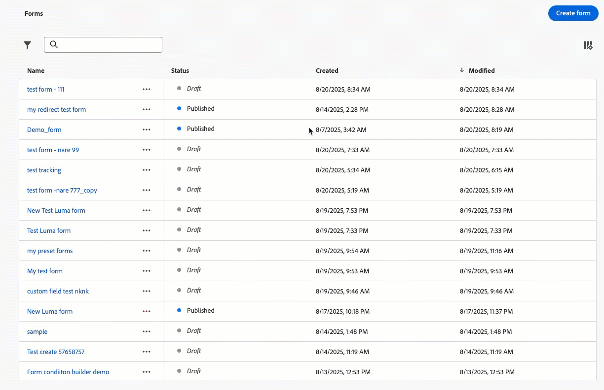

# Versionshinweise {#release-notes}

>[!CONTEXTUALHELP]
>id="ajo_homepage_card1"
>title="Neue Funktionen"
>abstract="**Adobe Journey Optimizer** bietet kontinuierlich neue Funktionen, Verbesserungen vorhandener Funktionen und Fehlerbehebungen. Alle Änderungen werden in der letzten Woche jedes Monats in diesen Versionshinweisen konsolidiert."

[!DNL Adobe Journey Optimizer] bietet kontinuierlich neue Funktionen, Verbesserungen vorhandener Funktionen und Fehlerbehebungen. Alle Änderungen werden in der letzten Woche jedes Monats in diesen Versionshinweisen konsolidiert. [!DNL Adobe Journey Optimizer] setzt nativ auf [!DNL Adobe Experience Platform] auf und profitiert von den neuesten Innovationen und Verbesserungen. Weitere Informationen zu diesen Änderungen finden Sie in den [Versionshinweisen zu Adobe Experience Platform](https://experienceleague.adobe.com/docs/experience-platform/release-notes/latest.html?lang=de){target="_blank"}.

## Versionshinweise September 2025 {#25-9-rn}

**Veröffentlichungsdatum**: 23.-24. September 2025

### Neue Funktionen {#sept-25-9-features}

<!--<table>
<thead>
<tr>
<th><strong>Public API to retrieve journeys</strong> </th>
</tr>
</thead>
<tbody>
<tr>
<td>

A new Journey Optimizer API is now available to retrieve journeys and their associated objects such as campaigns and surfaces.

</td>
</tr>
</tbody>
</table>-->

<!--table>
<thead>
<tr>
<th><strong>New Web Push notifications channel</strong> </th>
</tr>
</thead>
<tbody>
<tr>
<td>

Adobe Journey Optimizer now supports Web Push notifications, expanding the push channel beyond mobile. You can seamlessly deliver notifications to both mobile and desktop browsers, enabling you to reach customers directly on their devices without requiring an app.

This enhancement allows you to engage users with timely, personalized messages in real time, leveraging the same authoring workflows and targeting capabilities already available for mobile push.

</td>
</tr>
</tbody>
</table-->

<!--table>
<thead>
<tr>
<th><strong>Custom action monitoring and reporting</strong> </th>
</tr>
</thead>
<tbody>
<tr>
<td>

Custom action monitoring and reporting is now available. This capability provides better visibility into journey health and execution, including lifecycle status and performance alerts. You can now quickly understand when, where, and why an anomalous situation is occurring in a custom action.

</td>
</tr>
</tbody>
</table-->

<!--<table>
<thead>
<tr>
<th><strong>New source connectors for loyalty apps</strong> </th>
</tr>
</thead>
<tbody>
<tr>
<td>

New source connectors are now available in Adobe Experience Platform for the Talon.One, Capillary, and Kobie loyalty apps. These connectors let you seamlessly stream loyalty data into Adobe Experience Platform and leverage these data in Journey Optimizer.

</td>
</tr>
</tbody>
</table>-->

<table>
<thead>
<tr>
<th><strong>Journey Optimizer Experimentation Accelerator</strong> </th>
</tr>
</thead>
<tbody>
<tr>
<td>

Journey Optimizer Experimentation Accelerator ist ein KI-First-Produkt, das Ihre Experimente auf ein höheres Niveau bringt. Sie wurde für Adobe Journey Optimizer- und Adobe Target-Anwender entwickelt und vereinheitlicht das Experimentmanagement, liefert KI-gestützte Einblicke und Chancen und führt einen neuen Experimentationsagenten ein.

Freuen Sie sich auf:

<ul>
<li><strong>Einheitliches Experimentinventar:</strong> Schnelles Anzeigen, Filtern und Verwalten aller Experimente aus Adobe Journey Optimizer und Adobe Target in einem zentralen Arbeitsbereich.</li>
<li><strong>Einblicke und Chancen durch KI-Experimente:</strong> Mit GenAI-gestützten Einblicken und Empfehlungen über statistische Auslesewerte hinaus. Jedes Experiment bietet jetzt umsetzbare Möglichkeiten, einschließlich unterstützender Begründungen, sodass Teams sicherer entscheiden können, was als Nächstes getestet werden soll.</li>
<li><strong>Unterstützung für Multi-Armed Bandit (MAB) in Journey Optimizer:</strong> Maximieren Sie die Wirkung und reduzieren Sie den verschwendeten Traffic durch Multi-Armed Bandit-Experimente. Anstatt Zielgruppen gleichmäßig zu verteilen, ordnet MAB automatisch mehr Besucher in Echtzeit den leistungsstärksten Varianten zu, sodass Sie mehr Kunden bessere Erlebnisse bieten können, während Sie gleichzeitig lernen, was funktioniert.</li></ul>

Weitere Informationen finden Sie in der <a href="../content-management/experiment-accelerator.md">ausführlichen Dokumentation</a>.

</td>
</tr>
</tbody>
</table>

<!--table>
<thead>
<tr>
<th><strong>Landing page custom forms</strong> </th>
</tr>
</thead>
<tbody>
<tr>
<td>

With [!DNL Journey Optimizer], you can now capture profile attributes though your landing pages.

Create, design and manage custom forms tailored to your needs based on a specific dataset. You can then leverage these forms in landing pages to add the profile attributes of your choice into the dataset defined for each form.

This capability is available in Limited Availability. Contact your Adobe representative to gain access.

For more information, refer to the <a href="../landing-pages/lp-forms.md">detailed documentation</a>

</td>
</tr>
</tbody>
</table-->

<!--table>
<thead>
<tr>
<th><strong>PDF attachments to emails</strong> </th>
</tr>
</thead>
<tbody>
<tr>
<td>

You can now attach a static PDF file to an email message sent with Journey Optimizer.

<ul>
<li>You can send up to 6 messages with a PDF attachement per profile per year.</li>
<li>The maximum allowed file size for each attachment is 5 MB.</li>
<li>For any additional size or volume, you can purchase the PDF Attachments add-on. For more details, contact your Adobe representative.</li>
</ul>

Previously released in Limited Availability, this capability is now available to all environments (General Availability).

For more information, refer to the <a href="../email/pdf-attachments.md">detailed documentation</a>

</td>
</tr>
</tbody>
</table-->

<table>
<thead>
<tr>
<th><strong>Journey Agent ist da!</strong> </th>
</tr>
</thead>
<tbody>
<tr>
<td>

Mit <a href="https://experienceleague.adobe.com/en/docs/experience-cloud-ai/experience-cloud-ai/agents/agent-orchestrator" target="_blank">Adobe Experience Platform Agent Orchestrator </a> ist Journey Agent in Journey Optimizer verfügbar. Es ermöglicht die Analyse von Journey über eine natürliche Sprachschnittstelle. Der Agent erkennt Zielgruppen- oder Zeitplankonflikte und Profil-Abbrüche auf einer Journey und hilft Ihnen bei der Lösung. Bald werden Sie in der Lage sein, Journey mit agentischem Support zu erstellen.

<!--p>For more information, refer to the <a href="https://experienceleague.adobe.com/en/docs/experience-cloud-ai/experience-cloud-ai/agents/ajo-agent-analyze" target="_blank">detailed documentation</a></p-->
</td>
</tr>
</tbody>
</table>

<table>
<thead>
<tr>
<th><strong>Dunkler Modus im E-Mail-Designer</strong> </th>
</tr>
</thead>
<tbody>
<tr>
<td>

Der E-Mail-Designer von Journey Optimizer bietet jetzt die Möglichkeit, in die Ansicht „Dunkler Modus“ zu wechseln, in der Sie zusätzlich bestimmte benutzerdefinierte Einstellungen definieren können, die nur Empfängerinnen und Empfängern angezeigt werden, die ihre E-Mails im dunklen Modus lesen.

Beachten Sie dabei Folgendes:

<ul>
<li>Das endgültige Rendern des dunklen Modus weicht möglicherweise ab und hängt vom E-Mail-Client der Empfängerinnen und Empfänger ab.</li>
<li>Nicht alle E-Mail-Clients unterstützen einen benutzerdefinierten dunklen Modus. Darüber hinaus wenden einige E-Mail-Clients ausschließlich ihren eigenen standardmäßigen dunklen Modus auf alle empfangenen E-Mails an. In beiden Fällen können die im E-Mail-Designer definierten benutzerdefinierten Einstellungen nicht gerendert werden.</li>
</ul>

Weitere Informationen finden Sie in der <a href="../email/dark-mode.md">ausführlichen Dokumentation</a>.

 
Verfügbarkeitsdatum: 16. September 2025

</td>
</tr>
</tbody>
</table>

<table>
<thead>
<tr>
<th><strong>Journey-Pfadoptimierung</strong> </th>
</tr>
</thead>
<tbody>
<tr>
<td>

Verwenden Sie den neuen Optimierungsknoten, um bestimmte Zielgruppen anzusprechen, oder führen Sie A/B-Tests durch, um den besten Pfad zum Erreichen Ihrer geschäftsbezogenen KPIs zu ermitteln.

Mit diesem Tool können Sie Kommunikation, Sequenzierung und Timing testen und variieren sowie anpassen, um Ihre Kundschaft optimal zu erreichen.

Diese Funktion ist nur eingeschränkt verfügbar. Wenden Sie sich an den Adobe-Support, um Zugang zu erhalten.

Weitere Informationen finden Sie in der <a href="../building-journeys/optimize.md">ausführlichen Dokumentation</a>.

Verfügbarkeitsdatum: 4. September 2025

</td>
</tr>
</tbody>
</table>

<table>
<thead>
<tr>
<th><strong>Benutzerdefinierte Methode zur Delegierung von Subdomains</strong> </th>
</tr>
</thead>
<tbody>
<tr>
<td>

Neben der vollständigen Delegierung und CNAME-Methode ist nun eine neue Methode zur Subdomain-Konfiguration verfügbar: die benutzerdefinierte Delegierung, mit der Sie alle Aspekte von DNS, die für den Versand, das Rendern und das Tracking von Nachrichten erforderlich sind, vollständig kontrollieren und verwalten können.

Diese Funktion ist nur eingeschränkt verfügbar. Wenden Sie sich an den Adobe-Support, um Zugang zu erhalten.

Weitere Informationen finden Sie in der <a href="../configuration/delegate-custom-subdomain.md">ausführlichen Dokumentation</a>.

Verfügbarkeitsdatum: 4. September 2025

</td>
</tr>
</tbody>
</table>

<table>
<thead>
<tr>
<th><strong>Verwenden von Adobe Experience Platform-Daten für Personalisierung und Entscheidungsfindung</strong> </th>
</tr>
</thead>
<tbody>
<tr>
<td>

Diese Funktion wurde zuvor als Beta-Version veröffentlicht, steht aber nun für alle Umgebungen zur Verfügung (eingeschränkte Verfügbarkeit). Mit dieser Version wurden die folgenden Verbesserungen eingeführt:

<ul><li>Unterstützung für die Personalisierung bei der Datensatzsuche in eingehenden Kanälen.</li>
<li>Die Hilfsfunktion „datasetLookup“ kann jetzt in Ausdrucksfragmenten verwendet werden. Derzeit ist diese Funktion nur für eine begrenzte Anzahl von Kundinnen und Kunden verfügbar. Um Zugriff zu erhalten, wenden Sie sich an den Adobe-Support.</li>
<li>Mit einer Option in der Oberfläche für Datensatz-Management können Sie jetzt auf Einträgen basierende Datensätze für die Lookup-Personalisierung aktivieren, ohne dass ein API-Aufruf durchgeführt werden muss.</li>
<li>Verbesserte Überwachung, um den Datenaufnahmestatus zu verfolgen und zu verstehen, wann Datensätze für die Suche bereit sind.</li>
<li>Aktualisierte Nutzungsrichtlinien und Schutzmechanismen, um optimale Leistung und Zuverlässigkeit sicherzustellen.</li>
<li>Adobe Experience Platform-Datensätze können jetzt in Begrenzungsregeln für die Entscheidungsfindung genutzt werden.</li></ul>

Weitere Informationen finden Sie in der <a href="../data/lookup-aep-data.md">ausführlichen Dokumentation</a>.

Verfügbarkeitsdatum: 1. September 2025

</td>
</tr>
</tbody>
</table>

### Verbesserungen

* **Berechtigungen für Genehmigungsrichtlinien**
Beim Erstellen oder Festlegen einer Validierungsrichtlinie wurde eine Option hinzugefügt, um zu verhindern, dass Journey-/Kampagnenerstellende ihre eigenen Objekte validieren. [Weitere Informationen](../test-approve/approval-policies.md)

<!--
* **New Journey Alerts**  
  New pre-configured alerts are available for journeys:

  * [Profile Discard Rate Exceeded](../reports/alerts.md#profile-discard-rate-exceeded): Ratio of profile discards to entered profiles over the last 5 mins exceeded threshold.  
  * [Custom Action Error Rate Exceeded](../reports/alerts.md#custom-action-error-rate-exceeded): Ratio of custom action errors to successful HTTP calls over the last 5 mins exceeded threshold.  
  * [Profile Error Rate Exceeded](../reports/alerts.md#profile-error-rate-exceeded): Ratio of profiles-in-error to entered profiles over the last 5 mins exceeded threshold.

  You can modify threshold values and subscribe to individual journey-level alerts vs globally.
-->

* **Verschachtelte JSON-Textparameter werden jetzt in der benutzerdefinierten Authentifizierung unterstützt**\
  Beim Konfigurieren der benutzerdefinierten Authentifizierung für eine benutzerdefinierte Aktion werden jetzt verschachtelte JSON-Objekte (z. B. Unterobjekte innerhalb von `bodyParams`) unterstützt. [Weitere Informationen](../datasource/external-data-sources.md#custom-authentication-mode)

<!--
* **Custom attributes support with One-click unsubscribe URL**  
  With Journey Optimizer, if you are managing consent outside of Adobe, you can set an external custom endpoint by defining your own one-click unsubscribe link in the email configuration. When your recipients click the unsubscribe link, Journey Optimizer appends some default profile-specific parameters to the consent update event. 

  To further personalize the unsubscribe email address, you can now define custom attributes that will be appended to the consent event. This capability has already been available for the custom one-click unsubscribe link since the August 25 release.-->

* **mTLS-Unterstützung für SMS-Kanal**
Beim Einrichten eines benutzerdefinierten SMS-Anbieters haben Sie jetzt die Möglichkeit, die gegenseitige TLS-Authentifizierung (MTLS) zu aktivieren. Dazu müssen sowohl der Client als auch der Server die Identitäten der anderen Seite bestätigen, bevor eine sichere Verbindung hergestellt wird. [Weitere Informationen](../sms/sms-configuration-custom.md)

* **Modellbasierte Schemata**\
  Modellbasierte Schemata können jetzt von verwendet werden, um Ihre relationalen Modellierungsanforderungen in orchestrierten Kampagnen zu unterstützen. [Weitere Informationen](../orchestrated/gs-schemas.md)

* **Unterstützung der Datensatzsuche in Journey**\
  Eine neue Aktivität in Journey, **Datensatzsuche**, ermöglicht während der Laufzeit das dynamische Abrufen von Daten aus Adobe Experience Platform-Datensatzdatensätzen. Durch die Nutzung dieser Funktion können Sie auf Daten zugreifen, die sich möglicherweise nicht in der Profil- oder Ereignis-Payload befinden, um sicherzustellen, dass Ihre Kundeninteraktionen sowohl relevant als auch zeitnah sind. [Weitere Informationen](../building-journeys/dataset-lookup.md)

  Diese Aktivität ist nur für ausgewählte Organisationen verfügbar (eingeschränkte Verfügbarkeit). Um Zugriff zu erhalten, wenden Sie sich an den Adobe-Support.

* **Simulieren von Inhaltsvarianten für alle eingehenden Kanäle**\
  Zuvor nur für die Kanäle E-Mail, SMS und Push-Benachrichtigungen verfügbar, gilt die Simulation von Inhaltsvarianten jetzt auch für alle eingehenden Kanäle. [Weitere Informationen](../test-approve/simulate-sample-input.md)

<!--* **Webhook support for API triggered campaigns**  
  API triggered campaigns now support webhooks. Configure a webhook URL to receive real-time status updates for every message, improving observability and enabling seamless monitoring and automation.-->

* **Umleitungsunterstützung beim Journey benutzerdefinierter Aktionen**\
  Weiterleitungen (302) werden jetzt beim Journey benutzerdefinierter Aktionen unterstützt.

<!--* **High throughput mode for API triggered email campaigns**  
  A new High throughput mode is now available in API triggered campaigns. This mode is designed for large-scale, real-time messaging (up to 5000 transactions per second) and provides higher availability with lower latency.  
  This capability is only available for the email channel, for organizations that have purchased the Adobe High throughput transactional messaging add-on offering. Contact your Adobe representative for more details.-->

* **Abmeldeanfragen mit einem Klick** - Wir haben Verbesserungen eingeführt, die die Verarbeitung von Abmeldeanfragen mit einem Klick, die unter &quot;Adobe Managed“ konfiguriert wurden, weiter verbessern und eine zuverlässige und konsistente Verarbeitung gewährleisten.

* **Stündliches Zurücksetzen der Begrenzungsfrequenz** – Sie können jetzt eine Begrenzung auf stündlicher Basis für Kanalregelsätze anwenden. Zuvor in eingeschränkter Verfügbarkeit verfügbar, ist diese Funktion jetzt für alle Umgebungen verfügbar und ermöglicht Ihnen die Auswahl von 1 Stunde (zuvor 3 Stunden). [Mehr dazu](../conflict-prioritization/channel-capping.md) - Verfügbarkeitsdatum: 17. September

* **Unterstützung dynamischer Domains** – Journey Optimizer unterstützt jetzt die vollständige/Basis-URL-Personalisierung für vordefinierte Domains, die von Adobe akzeptiert werden. [Mehr dazu](../personalization/personalization-build-expressions.md#where) - Verfügbarkeitsdatum: 12. September

  Diese Funktion ist für eine Reihe von Kunden in begrenzter Verfügbarkeit verfügbar.

* **Ausdruck für Begrenzungsregeln bei der Entscheidungsfindung** – Sie können jetzt eigene Ausdrücke erstellen, um den Schwellenwert einer Begrenzungsregel für ein Entscheidungselement zu definieren. [Weitere Informationen](../experience-decisioning/items.md#capping)

  Diese Funktion ist derzeit im Rahmen einer eingeschränkten Verfügbarkeit für alle Benutzenden verfügbar. 

* **Warnhinweise zum Kanalkonfigurations-Monitoring**: Sie können nun Systemwarnhinweise abonnieren – entweder per E-Mail oder im Journey Optimizer-Benachrichtigungszentrum –, falls bei der E-Mail-Kanalkonfiguration mit dem benutzerdefinierten Subdomain-Delegierungstyp ein Fehler auftritt. [Weitere Informationen](../reports/alerts.md#alert-dns-record-missing)

