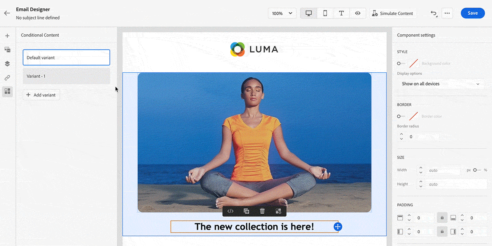

# Versionshinweise {#release-notes}

Auf dieser Seite werden alle neuen Funktionen und Verbesserungen für [!DNL Journey Optimizer] aufgelistet. Auf der Seite [Letzte Dokumentations-Updates](documentation-updates.md) finden Sie weitere Änderungsmöglichkeiten.

[!DNL Adobe Journey Optimizer] setzt nativ auf [!DNL Adobe Experience Platform] auf und profitiert von den neuesten Innovationen und Verbesserungen von Platform. Weitere Informationen zu diesen Änderungen finden Sie unter [Versionshinweise zu Adobe Experience Platform](https://experienceleague.adobe.com/docs/experience-platform/release-notes/latest.html?lang=de){target=&quot;_blank&quot;}.

 Registrieren Sie sich noch heute für den [vierteljährlichen Adobe Journey Optimizer-Newsletter](https://www.adobe.com/subscription/Adobe_Journey_Optimizer_NL.html){target=&quot;_blank&quot;}, um jedes Quartal die neuesten Produktaktualisierungen, spannende Geschichten, Anwendungsbeispiele, Tipps und vieles mehr direkt in Ihrem Posteingang zu erhalten.

## Version September 2022{#sept-2022-release}

### Neue Funktionen{#sept-2022-features}

<!--
<table>
<thead>
<tr>
<th><strong>Dynamic content & new conditional rule builder</strong> </th>
</tr>
</thead>
<tbody>
<tr>
<td>

You can now create dynamic content to adapt the content of your messages based on conditional rules.
 

Conditional rules are created using a visual rule builder within the Expression Editor, where you can store them for further reuse across your journeys and campaigns.

For more information, refer to the <a href="../personalization/get-started-dynamic-content.md">detailed documentation</a>.
</td>
</tr>
</tbody>
</table>
-->

<table>
<thead>
<tr>
<th><strong>API-gesteuerte Kampagnen</strong> </th>
</tr>
</thead>
<tbody>
<tr>
<td>

Zusätzlich zu bereits geplanten Kampagnen können Sie jetzt API-gesteuerte Kampagnen in Journey Optimizer erstellen und sie über APIs von einem externen System aus aufrufen.

Auf diese Weise können Sie Nutzungsszenarien mit verschiedenen operativen und Transaktionsnachrichten abdecken, wie z. B. das Zurücksetzen von Kennwörtern, OTP-Token usw.

Weitere Informationen zu Datensätzen finden Sie in der <a href="../campaigns/api-triggered-campaigns.md">detaillierten Dokumentation</a>.
</td>
</tr>
</tbody>
</table>

<table>
<thead>
<tr>
<th><strong>Data Access Control</strong> </th>
</tr>
</thead>
<tbody>
<tr>
<td>

Mithilfe der attributbasierten Zugriffskontrolle können Administratoren den Zugriff auf bestimmte Objekte anhand bestimmter Attribute steuern. Bei diesen Attributen kann es sich um Metadaten handeln, die einem Objekt hinzugefügt werden, wie z. B. Beschriftungen. Ab dieser Version können Administratoren auch Benutzerrollen definieren, die nur Zugriff auf bestimmte Felder und/oder Objekte haben, sowie Daten, die diesen Feldern und/oder Objekten entsprechen.

 Die Verwendung der attributbasierten Zugriffskontrolle ist derzeit auf ausgewählte Kunden beschränkt und wird in einer zukünftigen Version für alle Umgebungen bereitgestellt.

Weitere Informationen zu Datensätzen finden Sie in der <a href="../administration/object-based-access.md">detaillierten Dokumentation</a>.
</td>
</tr>
</tbody>
</table>

<table>
<thead>
<tr>
<th><strong>Data Governance und Datenschutz – </strong> </th>
</tr>
</thead>
<tbody>
<tr>
<td>

Mit dem Data Usage Labeling and Enforcement (DULE)-Governance-Framework kann Journey Optimizer jetzt Adobe Experience Platform-Governance-Richtlinien nutzen, um zu verhindern, dass sensible Felder durch benutzerdefinierte Aktionen in Drittanbietersysteme exportiert werden. Wenn das System in den benutzerdefinierten Aktionsparametern ein eingeschränktes Feld identifiziert, wird ein Fehler angezeigt, der die Veröffentlichung der Journey verhindert.

Die Verwendung von DULE (Data Usage Labeling and Enforcement) ist derzeit auf ausgewählte Kunden beschränkt und wird in einer zukünftigen Version in allen Umgebungen bereitgestellt.

Weitere Informationen zu Datensätzen finden Sie in der <a href="../action/action-privacy.md">detaillierten Dokumentation</a>.
</td>
</tr>
</tbody>
</table>

<table>
<thead>
<tr>
<th><strong>Automatisierte Durchsetzung von Einverständniserklärungen (Einverständnisrichtlinien)</strong> </th>
</tr>
</thead>
<tbody>
<tr>
<td>

Mit Adobe Experience Platform können Sie einfach Marketing-Richtlinien übernehmen und durchsetzen, um die Einverständnispräferenzen Ihrer Kunden zu respektieren. Einverständniserklärungen werden in Adobe Experience Platform definiert. In Journey Optimizer können Sie diese Einverständniserklärungen auf Ihre benutzerdefinierten Aktionen anwenden. Beispielsweise können Sie Einwilligungsrichtlinien definieren, um Kunden auszuschließen, die dem Empfang von E-Mail-, Push- oder SMS-Nachrichten nicht zugestimmt haben.

Die automatisierte Einverständnisvollstreckung ist derzeit nur für Organisationen verfügbar, die das Zusatzangebot zum Gesundheitsschild erworben haben.

Weitere Informationen zu Datensätzen finden Sie in der <a href="../action/consent.md">detaillierten Dokumentation</a>.
</td>
</tr>
</tbody>
</table>

<table>
<thead>
<tr>
<th><strong>Berechtigungsverwaltung</strong> </th>
</tr>
</thead>
<tbody>
<tr>
<td>

Journey Optimizer unterstützt das Definieren von Benutzerrollen und Zugriffsrichtlinien zum Verwalten von Berechtigungen für Funktionen und Objekte. bis <strong>Adobe Experience Cloud-Berechtigungen</strong>können Sie Rollen erstellen und verwalten sowie die gewünschten Ressourcenberechtigungen für diese Rollen zuweisen. Mit Berechtigungen können Sie auch die Bezeichnungen, Sandboxes und Benutzer*innen verwalten, die einer bestimmten Rolle zugeordnet sind.

 Die Verwendung von Berechtigungen ist derzeit auf ausgewählte Kunden beschränkt und wird in einer zukünftigen Version in allen Umgebungen bereitgestellt.

Weitere Informationen zu Datensätzen finden Sie in der <a href="../administration/attribute-based-access.md">detaillierten Dokumentation</a>.
</td>
</tr>
</tbody>
</table>

<table>
<thead>
<tr>
<th><strong>Benachrichtigung und Überwachung</strong> </th>
</tr>
</thead>
<tbody>
<tr>
<td>

Als Journey Optimizer-Benutzer können Sie jetzt über die Benutzeroberfläche auf Systemwarnungen zugreifen, um Benachrichtigungen zu erhalten, wenn Journey nicht wie erwartet funktionieren. Sie können die verfügbaren Warnungen anzeigen und abonnieren. Der erste Warnhinweis, der mit dieser Version verfügbar ist, warnt Sie, wenn eine Aktivität vom Typ Segment lesen im festgelegten Zeitraum kein Profil verarbeitet hat. Nach dem Entsperren dieses Workflows werden weitere Änderungen folgen.

Weitere Informationen zu Datensätzen finden Sie in der <a href="../reports/alerts.md">entsprechenden Dokumentation</a>.
</td>
</tr>
</tbody>
</table>

<!--table>
<thead>
<tr>
<th><strong>Data Hygiene</strong> </th>
</tr>
</thead>
<tbody>
<tr>
<td>

Adobe Experience Platform provides a suite of data hygiene capabilities that allow you manage your stored data through programmatic deletions of consumer records and datasets. This capability is now available for Adobe Journey Optimizer. 

You can manage your data stores to ensure that information is used as expected, is updated when incorrect data needs fixing, and is deleted when organizational policies deem it necessary.

<strong>Caution</strong> - Data Hygiene capabilities are currently only available for organizations that have purchased the Healthcare Shield add-on offering.

For more information, refer to the <a href="../building-journeys/read-segment.md#configuring-segment-trigger-activity">detailed documentation</a>.
</td>
</tr>
</tbody>
</table-->

### Verbesserungen{#sept-2022-improvements}

**Journeys**

* Die **Entitätsdatensatz** ist jetzt als vordefinierter Datensatz in Adobe Journey Optimizer verfügbar. Dieser Lookup-Datensatz enthält Metadaten zur Anreicherung der Tracking- und Feedback-Datensatzinformationen. Auf diese Weise können Sie Ihre Berichte und Abfragen mit leichter verständlichen Daten verbessern. [Weitere Informationen](../start/datasets-query-examples.md#entity-dataset)
* Eine neue Limits wurde zu einheitlichen Journey hinzugefügt (beginnend mit einem Ereignis oder einer Segmentqualifikation), um zu verhindern, dass Journey fälschlicherweise mehrmals für dasselbe Ereignis ausgelöst werden. Der erneute Eintritt von Profilen wird jetzt standardmäßig fünf Minuten lang vorübergehend blockiert. [Weitere Informationen](../start/guardrails.md#events-g)

**Administration**

* Beim Aktivieren oder Deaktivieren der Zulassungsliste wird nun eine neue Warnung mit Details zu den Auswirkungen jeder Aktion angezeigt. [Weitere Informationen](../configuration/allow-list.md#enable-allow-list)
* Die Benutzeroberfläche zum Erstellen von Kanaloberflächen, zum Erstellen von IP-Pools, zum Verwalten der Unterdrückungsliste und der Zulassungsliste sowie zum Konfigurieren des SMS-Kanals wurde aktualisiert.
<!--* Now when creating the first channel surface for a given subdomain, the processing time will take 10 minutes to 10 days, and only up to 3 hours for subsequent surfaces using that subdomain. Learn more
* Now when downloading the suppression list as a CSV file, you can choose the file that was previously generated, or generate a new file.
* The user interface for creating landing page presets and landing page subdomains has been improved. Learn more -->

**Auditkontrollen**

* Mit Journey Optimizer können Sie Aktionen identifizieren, die von Benutzern im System auf verschiedenen Diensten und Funktionen wie Kampagnen, Journey, Nachrichten, Landingpages usw. ausgeführt werden. Auditprotokollressourcen enthalten jetzt Änderungen an verschiedenen anderen Aktionen und werden automatisch aufgezeichnet, wenn die Aktivität stattfindet. Weiterführende Informationen finden Sie auf [dieser Seite](../privacy/audit-logs.md).

**Archivierungsunterstützung**

* Die neue **Entitätsdatensatz** enthält ein Feld Vorlage , mit dem Sie das Format und die Struktur der gesendeten Nachrichten zu Archivierungszwecken in alle Kanäle exportieren können. [Weitere Informationen](../configuration/archiving-support.md)

**Landingpages**

* Sie können jetzt Kontextdaten verwenden, die von einer anderen Seite innerhalb derselben Landingpage stammen. Wenn Sie beispielsweise ein Kontrollkästchen mit einer Abonnementliste auf der primären Landingpage verknüpfen, können Sie diese Abonnementliste auf der Unterseite &quot;Vielen Dank!&quot;verwenden. [Weitere Informationen](../landing-pages/lp-content.md#use-primary-page-context)

* Beim Konfigurieren der primären Seite können Sie jetzt zusätzliche Daten erstellen, um die Speicherung von Informationen beim Senden der Landingpage zu ermöglichen. [Weitere Informationen](../landing-pages/lp-content.md#use-additional-data)

<!--* You can now use information that was submitted on a landing page to send communications to your customers. For example, if a user subscribes to a given subscription list, you can leverage that information to send an email recommending other subscription lists to that user.-->

### Weitere Änderungen{#sept-2022-other}

* Der Journey-Burst-Modus wurde durch den Campaign-Modus Schneller Versand ersetzt. [Weitere Informationen](../campaigns/create-campaign.md#rapid-delivery})
* Um die Leistung zu verbessern, können Feldergruppen für Erlebnisereignisse nicht mehr in Journey verwendet werden, beginnend mit einem Segment lesen, einer Segmentqualifikation oder einer Business-Event-Aktivität. Diese Änderung gilt nur für neue Journey. Vorhandene Verhaltensweisen behalten das aktuelle Verhalten bei. [Weitere Informationen](../start/guardrails.md#expression-editor)
* Die 1-Stunden-Beschränkung für Journey für geplante Lesesegmente wurde entfernt. Diese Journey können jetzt ohne Verzögerung ausgeführt werden.

