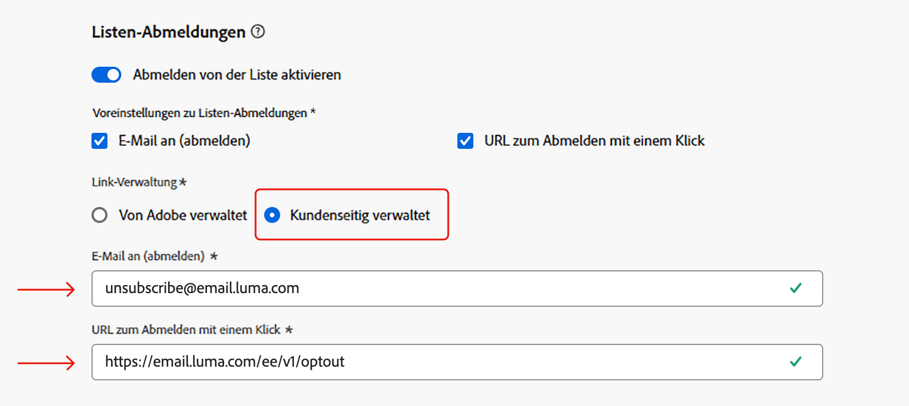

# Versionshinweise {#release-notes}

>[!CONTEXTUALHELP]
>id="ajo_homepage_card1"
>title="Neue Funktionen"
>abstract="**Adobe Journey Optimizer** bietet kontinuierlich neue Funktionen, Verbesserungen vorhandener Funktionen und Fehlerbehebungen. Alle Änderungen werden in der letzten Woche jedes Monats in diesen Versionshinweisen konsolidiert."

[!DNL Adobe Journey Optimizer] bietet kontinuierlich neue Funktionen, Verbesserungen vorhandener Funktionen und Fehlerbehebungen. Alle Änderungen werden in der letzten Woche jedes Monats in diesen Versionshinweisen konsolidiert. [!DNL Adobe Journey Optimizer] setzt nativ auf [!DNL Adobe Experience Platform] auf und profitiert von den neuesten Innovationen und Verbesserungen von Platform. Weitere Informationen zu diesen Änderungen finden Sie unter [Versionshinweise zu Adobe Experience Platform](https://experienceleague.adobe.com/docs/experience-platform/release-notes/latest.html?lang=de){target="_blank"}.

## Updates vom 25. März {#25-03-rn}

**Verbesserungen am Personalization-Editor**

Der Journey Optimizer-Personalisierungseditor wurde um neue Funktionen erweitert:
* **Aktualisiertes Design für den Code-Editor** - Eine sauberere, moderne Benutzeroberfläche für verbesserte Benutzerfreundlichkeit und Fokus.
* **Suchen und Ersetzen** - Es wurde eine Funktion hinzugefügt, mit der Inhalte im Editor schnell gesucht und ersetzt werden können.
* **Unterstützung zum Rückgängigmachen und Wiederholen** - Ermöglicht das einfache Zurücksetzen oder erneute Anwenden von Änderungen.
* **Anpassbare Schriftgröße** - Ermöglicht die Anpassung der Schriftgröße des Editors, um die Lesbarkeit zu verbessern.
* **Inline-JSON** Validierung - Client-seitige Validierung von JSON-Inhalten in Echtzeit, um die Fehlererkennung zu beschleunigen.
* **Automatische Vervollständigung für Profil- und**) - Bietet intelligente Vorschläge zur Optimierung der Inhaltserstellung.
* **Verbesserte Syntaxhervorhebung** - Verbessert die Lesbarkeit, indem die Code-Struktur visuell besser unterschieden wird.

Weitere Informationen finden Sie in der [ausführlichen Dokumentation](../personalization/personalization-build-expressions.md).

## Versionshinweise Februar 2025 {#25-02-rn}

<!--
**Early release notes below are subject to change without prior notice until the release availability date**. Links, screens and updated documentation are published at the release date.-->

**Veröffentlichungsdatum**: 18.-19. Februar 2025

### Neue Funktionen {#25-02-features}

Im Folgenden werden die neuen Funktionen dieser Version beschrieben.

<table>
<thead>
<tr>
<th><strong>Erstellen und Verwalten von Geschäftsregeln</strong> </th>
</tr>
</thead>
<tbody>
<tr>
<td>

Sie können jetzt Geschäftsregeln mithilfe von Regelsätzen erstellen. Regelsätze sind Gruppen von Regeln, mit denen gesendete Nachrichten innerhalb von Kampagnen und Journey-Aktionen kanalübergreifend eingeschränkt und Profileinträge in Journey gesteuert werden können.

<ul><li>Erstellen Sie Kanalregelsätze, um die Anzahl der Nachrichten zu beschränken, die über einen oder mehrere Kanäle gesendet werden. Wenden Sie sie auf Kampagnen oder Journey-Aktionen an, um die im Regelsatz definierten Regeln durchzusetzen. Mit dem Kanalregelsatz können Sie Begrenzungsregeln basierend auf Kommunikationstypen anwenden. Legen Sie beispielsweise einen Regelsatz fest, um „Werbenachrichten“ zu begrenzen, und einen weiteren für „Newsletter“. Wenden Sie den entsprechenden Regelsatz in Ihrer Kampagnen- oder Journey-Aktion an, je nach dem Typ der Kommunikation, die Sie senden.</li>
<li> Erstellen Sie Journey-Regelsätze, um Profileinträge in Journey zu steuern. Begrenzen Sie, wie oft ein Profil innerhalb eines bestimmten Zeitraums auf eine Journey zugreifen kann oder wie viele Journey ein Profil gleichzeitig registrieren kann. Wenden Sie diese auf der Journey-Ebene an, um eine ordnungsgemäße Zugangsverwaltung sicherzustellen.</li>

Bislang für eine Reihe von Organisationen (LA) verfügbar, stehen Geschäftsregeln jetzt für alle Benutzer (GA) zur Verfügung.

Weitere Informationen finden Sie in der <a href="../configuration/rule-sets.md">ausführlichen Dokumentation</a>.

</td>
</tr>
</tbody>
</table>

<table>
<thead>
<tr>
<th><strong>Generieren von Landingpages mit dem KI-Assistenten</strong> </th>
</tr>
</thead>
<tbody>
<tr>
<td>

Mithilfe des KI-Assistenten können Sie jetzt überzeugende Inhalte für Ihre Landingpages erstellen, einschließlich ganzseitiger Designs, personalisiertem Text und personalisierter Visualisierungen.

Weitere Informationen finden Sie in der <a href="../content-management/generative-lp.md">ausführlichen Dokumentation</a>.

</td>
</tr>
</tbody>
</table>

<table>
<thead>
<tr>
<th><strong>Marken mit dem KI-Assistenten (Beta)</strong> </th>
</tr>
</thead>
<tbody>
<tr>
<td>

Sie können jetzt Ihre eigenen Marken festlegen, um die visuelle und verbale Identität Ihrer Marke zu definieren. 

Diese Funktion wird als private Beta-Version für eine begrenzte Anzahl von Kunden veröffentlicht. Es wird in zukünftigen Versionen schrittweise für alle Kunden verfügbar sein.

Weitere Informationen finden Sie in der <a href="../content-management/brands.md">ausführlichen Dokumentation</a>.

</td>
</tr>
</tbody>
</table>

<table>
<thead>
<tr>
<th><strong>Fehlerbehebung bei benutzerdefinierten Aktionen</strong> </th>
</tr>
</thead>
<tbody>
<tr>
<td>

Sie können jetzt eine benutzerdefinierte Aktionskonfiguration überprüfen, indem Sie echte API-Aufrufe direkt aus Adobe Journey Optimizer durchführen. 

Weitere Informationen finden Sie in der <a href="../action/troubleshoot-custom-action.md">ausführlichen Dokumentation</a>.

<!--p> This capability is only available for a set of organizations (Limited Availability). To gain access, contact your Adobe representative.</p-->
</td>
</tr>
</tbody>
</table>

<table>
<thead>
<tr>
<th><strong>Flexible Zielgruppenbewertung (eingeschränkte Verfügbarkeit)</strong> </th>
</tr>
</thead>
<tbody>
<tr>
<td>

Mit der flexiblen Zielgruppenauswertung können Sie nach Bedarf einen Segmentierungsauftrag für ausgewählte Zielgruppen ausführen, um sicherzustellen, dass Sie immer über die neuesten Zielgruppendaten verfügen, bevor Sie sie in Journey Optimizer-Journeys und -Kampagnen aufnehmen.

Weitere Informationen finden Sie in der <a href="../audience/creating-a-segment-definition.md#flexible">ausführlichen Dokumentation</a>.

Diese Funktion ist nur für ausgewählte Organisationen verfügbar (eingeschränkte Verfügbarkeit). Um Zugang zu erhalten, wenden Sie sich an den Adobe-Support.

Verfügbarkeitsdatum: 28. Januar 2025

</tr>
</tbody>
</table>
</table>

### Verbesserungen {#25-02-improvements}

Die folgenden Verbesserungen werden mit dem Update vom Februar vorgenommen.

* **Journey** - Sie können jetzt Ihre benutzerdefinierten Aktionen testen, indem Sie API-Aufrufe aus dem Abschnitt Administration senden. Diese neue Funktion hilft Ihnen bei der Fehlerbehebung bei benutzerdefinierten Aktionen, bevor oder nachdem diese auf einer Journey verwendet werden. [Weitere Informationen](../action/troubleshoot-custom-action.md)

* **Datensatz-TTL (Time-to-Live)** - Ab diesem Monat wird eine TTL (Time-to-Live)-Leitplanke wie folgt für Journey Optimizer-systemgenerierte Datensätze in neuen Sandboxes und neuen Organisationen eingeführt:

   * 90 Tage für Daten im Profilspeicher
   * 13 Monate für Daten im Data Lake

  Diese Änderung wird in einer nachfolgenden Phase in bestehenden Kunden-Sandboxes bereitgestellt.

  Weitere Informationen zu diesem Update finden Sie in [den entsprechenden FAQ](../data/datasets-ttl.md#frequently-asked-questions).

<!--* **Playbooks** - You can now create and publish your own Use Case Playbooks in Journey Optimizer.-->

* **Briefpost** - Ein neuer Servertyp, Data Landing Zone, wird jetzt für das Datei-Routing in der Konfiguration des Briefpostkanals unterstützt. [Weitere Informationen](../direct-mail/direct-mail-configuration.md#file-routing-configuration)

* **SMS** - Sie können jetzt den SMS-Nachrichtenversand über multiregionale Endpunkte verwalten, indem Sie Versand-, Feedback-, eingehende und Callback-URLs überschreiben. Um dies zu unterstützen, wurde der API-Anmeldedaten-Konfiguration ein neues Feld URL-Überschreibung hinzugefügt. Diese Änderung ist nur beim Sinch-Anbieter verfügbar. [Weitere Informationen](../sms/sms-configuration-sinch.md)

* **Personalization** (Verfügbarkeitsdatum: 29. Januar 2025) - Neue Hilfsfunktionen für Datum/Uhrzeit sind zur Verwendung im Personalisierungseditor verfügbar. [Weitere Informationen](../personalization/functions/dates.md)

<!--
* The personalization editor has been enhanced with new capabilities such as Auto-complete, Search, and filtering options. You can also show or hide deprecated attributes.-->

* **E-Mail-**: Wenn Sie das Einverständnis außerhalb von Adobe verwalten, können Sie jetzt als Teil Ihrer E-Mail-Kanal-Konfigurationseinstellungen eine benutzerdefinierte Abmelde-E-Mail-Adresse und eine benutzerdefinierte URL zum Abmelden mit einem Klick festlegen.[Weitere Informationen](../email/list-unsubscribe.md#custom-managed)

  {width="80%"}

* **Decisioning** (Verfügbarkeitsdatum: 28. Januar 2025) - Decisioning unterstützt jetzt Objektdatentypen beim Bearbeiten des Schemas des Elementkatalogs. [Weitere Informationen](../experience-decisioning/catalogs.md)

