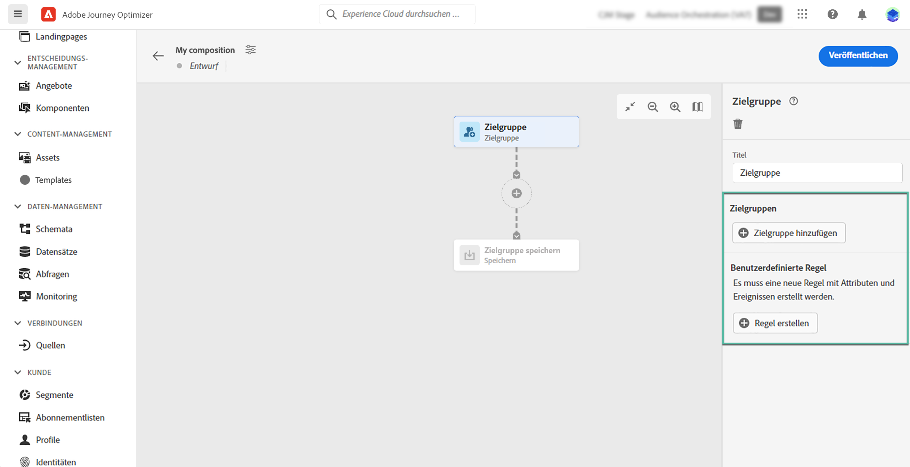
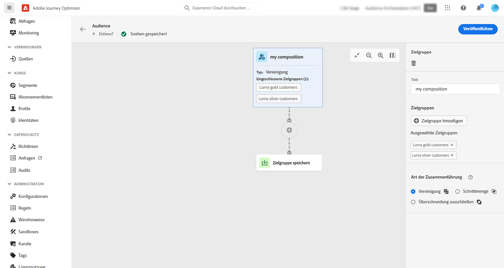
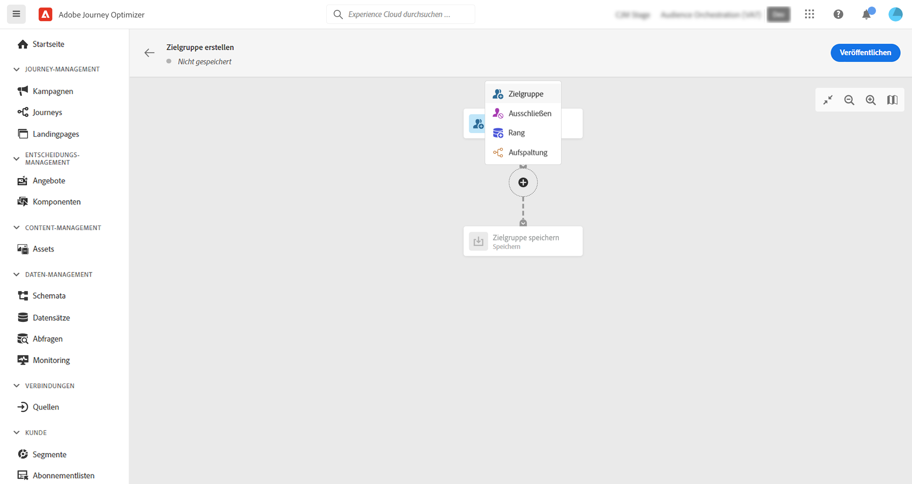
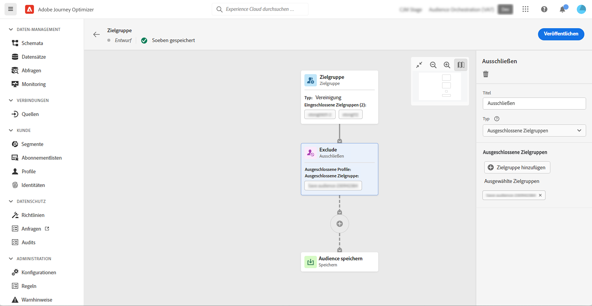
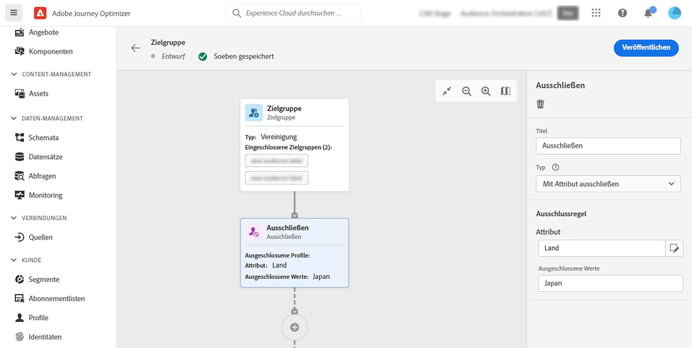
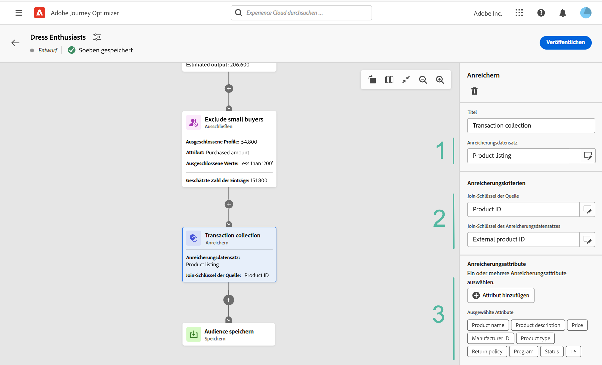
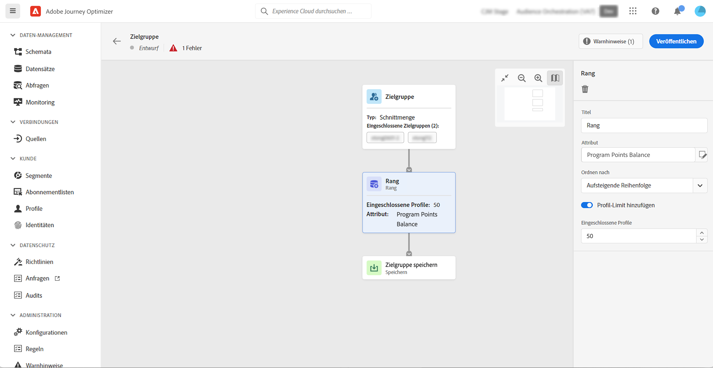
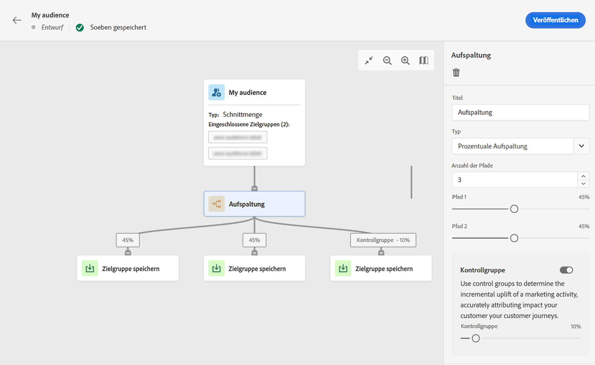
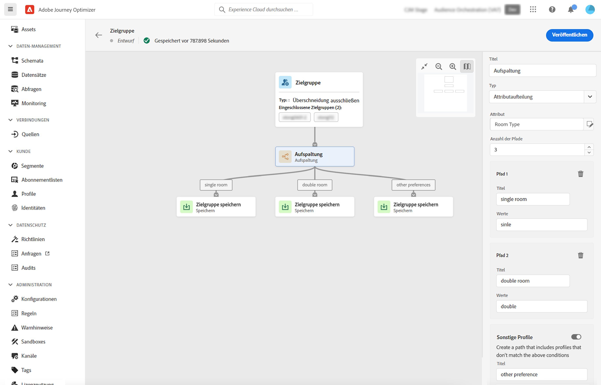
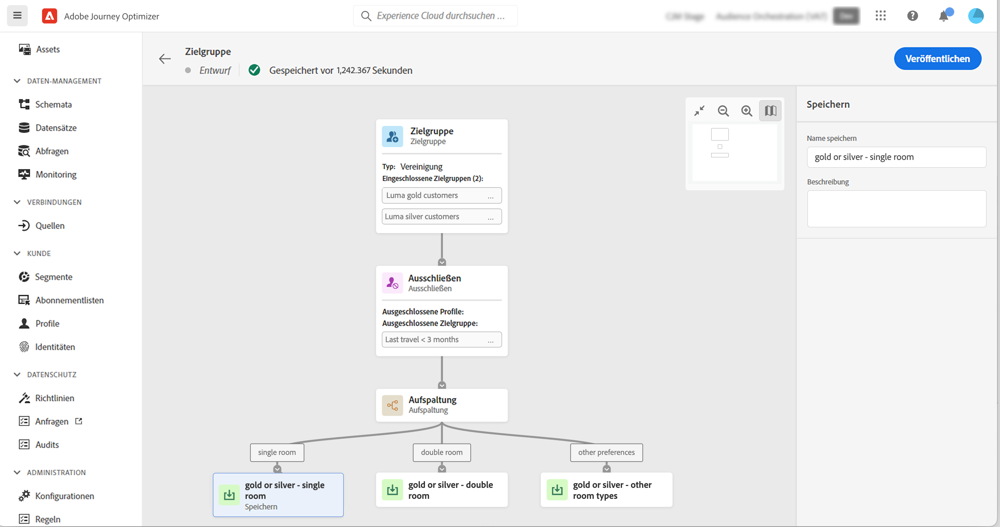

# Arbeiten mit der Arbeitsfläche für Kompositionen {#composition-canvas}

<table style="table-layout:fixed"><tr style="border: 0;"><tr><td>Was Sie in dieser Dokumentation finden werden: <ul>
<li><a href="get-started-audience-orchestration.md">Erste Schritte mit der Audience-Komposition</a></li>
<li><a href="create-compositions.md">Erstellen des Workflows für die erste Komposition</a></li>
<li><b><a href="composition-canvas.md">Arbeiten mit der Arbeitsfläche für Kompositionen</a></b></li>
<li><a href="access-audiences.md">Zugreifen auf und Verwalten von Audiences</a></li></ul></td></tr></table>

Die Zielgruppenzusammensetzung bietet eine visuelle Arbeitsfläche, mit der Sie Zielgruppen erstellen und verschiedene Aktivitäten (Aufspaltung, Anreicherung usw.) verwenden können.

Gehen Sie wie folgt vor, um eine Audience auf der Arbeitsfläche zu erstellen:

1. [Definieren Sie Ihre Start-Audience(s)](#starting-audience)
1. [Fügen Sie eine oder mehrere Aktivitäten hinzu](#action-activities)
1. [Speichern Sie die Ergebnisse in einer neuen Audience](#save)

## Wählen Sie die Start-Audience aus {#starting-audience}

Der erste Schritt bei der Erstellung einer Komposition besteht darin, eine oder mehrere vorhandene Audiences als Grundlage für Ihre Komposition auszuwählen.

1. Wählen Sie die Aktivität **[!UICONTROL Audience]** und geben Sie einen Titel für die Aktivität an.

1. Wählen Sie die anzusprechende Zielgruppe:

   * Klicken Sie auf die Schaltfläche **[!UICONTROL Audience hinzufügen]**, um eine oder mehrere bestehende Audiences auszuwählen,
   * Klicken Sie auf die Schaltfläche **[!UICONTROL Regel erstellen]**, um mithilfe des [Segmentierungs-Service](https://experienceleague.adobe.com/docs/experience-platform/segmentation/ui/overview.html?lang=de) eine neue Segmentdefinition zu erstellen.

   

1. Wenn mehrere Audiences ausgewählt sind, legen Sie fest, wie die Profile dieser Audiences zusammengeführt werden sollen:

* **[!UICONTROL Vereinigung]**: Schließt alle Profile der ausgewählten Audiences ein,
* **[!UICONTROL Schnittmenge]**: Schließt Profile ein, die allen ausgewählten Audiences gemeinsam sind,
* **[!UICONTROL Überschneidung ausschließen]**: Schließt Profile ein, die nur zu einer der Audiences gehören. Profile, die zu mehr als einer Audience gehören, werden nicht einbezogen.

In diesem Beispiel möchten wir alle Profile ansprechen, die zu den Zielgruppen Gold und Silber gehören.

Nach Auswahl der Audiences wird die geschätzte Anzahl der Profile am unteren Ende der Aktivität angezeigt.

## Hinzufügen von Aktivitäten {#action-activities}

Fügen Sie Aktivitäten hinzu, nachdem Sie Ihre Start-Audience ausgewählt haben, um Ihre Auswahl zu verfeinern.

Klicken Sie dazu auf die Schaltfläche „+“ im Kompositionspfad und wählen Sie dann die gewünschte Aktivität aus. Der rechte Bereich wird geöffnet, in dem Sie die neu hinzugefügte Aktivität konfigurieren können.

Verfügbare Aktivitäten sind:

* [Audience](#audience): Schließt zusätzliche Profile ein, die zu einer oder mehreren bestehenden Audiences gehören,
* [Ausschließen](#exclude): Schließt Profile aus, die zu einer bestehenden Audience gehören, oder schließt Profile auf der Grundlage bestimmter Attribute aus,
* [Anreichern]{#enrich}: Anreicherung Ihrer Zielgruppe mit zusätzlichen Attributen aus Adobe Experience Platform-Datensätzen,
* [Rang](#rank): Sortiert Profile nach einem bestimmten Attribut, gibt die Anzahl der Profile an, die beibehalten werden sollen, und fügt sie in Ihre Komposition ein,
* [Aufspaltung](#split): Teilt Ihre Komposition in mehrere Pfade, die auf zufälligen Prozentsätzen oder auf Attributen basieren.

Sie können so viele **[!UICONTROL Audience]** und **[!UICONTROL Ausschließen]**-Aktivitäten hinzufügen, wie Sie in Ihrer Komposition benötigen. Nach den Aktivitäten **[!UICONTROL Rang]** und **[!UICONTROL Aufspaltung]** kann jedoch keine weitere Aktivität hinzugefügt werden.

Sie können eine Aktivität jederzeit aus der Arbeitsfläche entfernen, indem Sie im rechten Bereich auf die Schaltfläche „Löschen“ klicken.  Wenn die Aktivität, die Sie löschen möchten, über andere Aktivitäten in der Komposition verfügt, wird eine Meldung angezeigt, mit der Sie angeben können, ob Sie nur die ausgewählte Aktivität oder alle untergeordneten Aktivitäten löschen möchten.

### Audience-Aktivität {#audience}

>[!CONTEXTUALHELP]
>id="ajo_ao_audience"
>title="Audience-Aktivität"
>abstract="Mit der Audience-Aktivität können Sie zusätzliche Profile, die zu einer bestehenden Audience gehören, in Ihre Komposition einbeziehen."

>[!CONTEXTUALHELP]
>id="ajo_ao_merge_types"
>title="Fusionieren von Typen"
>abstract="Geben Sie an, wie die Profile der ausgewählten Audiences zusammengeführt werden sollen."

Mit der **[!UICONTROL Audience]**-Aktivität können Sie zusätzliche Profile, die zu einer bestehenden Audience gehören, in Ihre Komposition aufnehmen.

Die Konfiguration dieser Aktivität ist identisch mit der anfänglichen [Audience-Aktivität](#starting-audience).

### Aktivität „Ausschließen“ {#exclude}

>[!CONTEXTUALHELP]
>id="ajo_ao_exclude_type"
>title="Typ des Ausschließens"
>abstract="Verwenden Sie den Typ „Audience ausschließen“, um Profile auszuschließen, die zu einer bestehenden Audience gehören. Mit dem Typ „Mit Attribut ausschließen“ können Sie Profile auf der Grundlage eines bestimmten Attributs ausschließen."

>[!CONTEXTUALHELP]
>id="ajo_ao_exclude"
>title="Aktivität „Ausschließen“"
>abstract="Mit der Aktivität „Ausschließen“ können Sie Profile aus Ihrer Komposition ausschließen, indem Sie eine vorhandene Audience auswählen oder eine Regel verwenden."

Mit der Aktivität **[!UICONTROL Ausschließen]** können Sie Profile aus Ihrer Komposition ausschließen. Es stehen zwei Arten von Ausschlüssen zur Verfügung:

* **[!UICONTROL Audience ausschließen]**: Schließt Profile aus, die zu einer bestehenden Audience gehören.

   Klicken Sie auf die Schaltfläche **[!UICONTROL Audience hinzufügen]** und wählen Sie die auszuschließende Audience aus.

   

* **[!UICONTROL Mit Attribut ausschließen]**: Schließt Profile auf der Grundlage eines bestimmten Attributs aus.

   Wählen Sie das zu suchende Attribut aus und geben Sie dann den auszuschließenden Wert an. In diesem Beispiel schließen wir Profile mit einer Wohnadresse in Japan von der Komposition aus.

   

### Anreichern {#enrich}

>[!CONTEXTUALHELP]
>id="ajo_ao_enrich"
>title="Aktivität anreichern"
>abstract="Verwenden Sie die Aktivität Anreicherung , um Profile auszuschließen, die zu einer vorhandenen Zielgruppe gehören. Mit dem Typ „Mit Attribut ausschließen“ können Sie Profile auf der Grundlage eines bestimmten Attributs ausschließen."

>[!CONTEXTUALHELP]
>id="ajo_ao_enrich_dataset"
>title="Anreicherungsdatensatz"
>abstract="Wählen Sie den Anreicherungsdatensatz mit den Daten aus, die Sie mit der Zielgruppe verknüpfen möchten."

>[!CONTEXTUALHELP]
>id="ajo_ao_enrich_criteria"
>title="Anreicherungskriterien"
>abstract="Wählen Sie die Felder aus, die als Abstimmschlüssel zwischen dem Quelldatensatz, d. h. der Audience, und dem Anreicherungsdatensatz verwendet werden sollen."

>[!CONTEXTUALHELP]
>id="ajo_ao_enrich_attributes"
>title="Anreicherungsattribute"
>abstract="Wählen Sie ein oder mehrere Attribute aus dem Anreicherungsdatensatz aus, die mit der Zielgruppe verknüpft werden sollen. Nach der Veröffentlichung der Komposition werden diese Attribute mit der Zielgruppe verknüpft und können in Kampagnen zur Personalisierung von Sendungen genutzt werden."

Die **[!UICONTROL Anreichern]** -Aktivität können Sie Ihre Zielgruppe mit zusätzlichen Attributen aus Adobe Experience Platform-Datensätzen anreichern. Sie können beispielsweise Informationen zum gekauften Produkt wie Namen, Preis oder Hersteller-ID hinzufügen und diese Informationen nutzen, um die an die Audience gesendeten Sendungen zu personalisieren.

>[!IMPORTANT]
>
>Derzeit werden Bezeichnungen im Datensatz entweder auf Datensatzebene oder auf Feldebene nicht an die neu erstellte Zielgruppe weitergeleitet. Dies kann sich auf die Zugriffskontrolle und/oder die Data Governance für die resultierende Zielgruppe auswirken. Verwenden Sie daher beim Erstellen von Zielgruppen nur Testdaten.

Gehen Sie wie folgt vor, um die Aktivität zu konfigurieren:

1. Wählen Sie die **[!UICONTROL Anreicherungsdatensatz]** enthält die Daten, die Sie mit der Zielgruppe verknüpfen möchten.

1. Im **[!UICONTROL Anreicherungskriterien]** die Felder auswählen, die als Abstimmschlüssel zwischen dem Quelldatensatz, d. h. der Audience, und dem Anreicherungsdatensatz verwendet werden sollen. In diesem Beispiel verwenden wir die Kennung des gekauften Produkts als Abstimmschlüssel.

1. Klicken Sie auf **[!UICONTROL Attribute hinzufügen]** und wählen Sie dann ein oder mehrere Attribute aus dem Anreicherungsdatensatz aus, die mit der Zielgruppe verknüpft werden sollen.

   

Nach der Veröffentlichung der Komposition werden die ausgewählten Attribute mit der Zielgruppe verknüpft und können in Kampagnen zur Personalisierung von Sendungen genutzt werden.

### Rang-Aktivität {#rank}

>[!CONTEXTUALHELP]
>id="ajo_ao_ranking"
>title="Rangfolge-Aktivität"
>abstract="Mithilfe der Rang-Aktivität können Sie Profile nach einem bestimmten Attribut ordnen und in Ihre Komposition einfügen. Schließen Sie beispielsweise die 50 Profile mit der größten Anzahl an Treuepunkten ein."

>[!CONTEXTUALHELP]
>id="ajo_ao_rank_profilelimit_text"
>title="Profil-Limit hinzufügen"
>abstract="Schalten Sie diese Option ein, um eine maximale Anzahl von Profilen anzugeben, die in die Komposition aufgenommen werden sollen."

Die **[!UICONTROL Rank]**-Aktivität ermöglicht es Ihnen, Profile nach einem bestimmten Attribut zu ordnen und in Ihre Komposition einzuschließen. Sie können beispielsweise die 50 Profile mit der größten Anzahl an Treuepunkten einbeziehen.

1. Wählen Sie das Attribut aus, das Sie nachschlagen möchten, und geben Sie eine Rangfolge an (auf- oder absteigend).

   >[!NOTE]
   >
   >Sie können Attribute mit den folgenden Datentypen auswählen: Ganzzahl, Zahlen, kurze Ganzzahl <!--(other?)-->

1. Schalten Sie die Option **[!UICONTROL Profil-Limit hinzufügen]** ein und geben Sie eine maximale Anzahl von Profilen an, die in die Komposition aufgenommen werden sollen.

   

### Split-Aktivität {#split}

<!-- [!CONTEXTUALHELP]
>id="ajo_ao_control_group_text"
>title="Control Group"
>abstract="Use control groups to isolate a portion of the profiles. This allows you to measure the impact of a marketing activity and make a comparison with the behavior of the rest of the population."-->

>[!CONTEXTUALHELP]
>id="ajo_ao_split"
>title="Split-Aktivität"
>abstract="Die Split-Aktivität ermöglicht es Ihnen, Ihre Komposition in mehrere Pfade zu unterteilen. Beim Veröffentlichen der Komposition wird für jeden Pfad eine Audience in Adobe Experience Platform gespeichert."

>[!CONTEXTUALHELP]
>id="ajo_ao_split_type"
>title="Split-Typ"
>abstract="Verwenden Sie den Split-Typ „Prozent“, um Profile nach dem Zufallsprinzip in mehrere Pfade aufzuteilen. Mit dem Split-Typ „Attribut“ können Sie Profile anhand eines bestimmten Attributs aufteilen."

>[!CONTEXTUALHELP]
>id="ajo_ao_split_otherprofiles_text"
>title="Andere Profile"
>abstract="Schalten Sie diese Option ein, um einen zusätzlichen Pfad mit den verbleibenden Profilen zu erstellen, die keiner der in den anderen Pfaden angegebenen Bedingungen entsprechen."

Die **[!UICONTROL Split]**-Aktivität ermöglicht es Ihnen, Ihre Komposition in mehrere Pfade zu unterteilen.

Durch diese Operation wird automatisch eine **[!UICONTROL Speichern]**-Aktivität am Ende jedes Pfades hinzugefügt. Beim Veröffentlichen der Komposition wird für jeden Pfad eine Audience in Adobe Experience Platform gespeichert.

Es stehen zwei Arten von Split-Operationen zur Verfügung:

* **[!UICONTROL Prozent-Split]**: Profile nach dem Zufallsprinzip in zwei oder mehr Pfade aufteilen. Sie können die Profile beispielsweise in 2 verschiedene Pfade von jeweils 50 % aufteilen. <!--and add an additional path for control group.-->

   

* **[!UICONTROL Attribut-Split]**: Profile anhand eines bestimmten Attributs aufteilen. In diesem Beispiel teilen wir Profile anhand ihrer bevorzugten Zimmertypen auf.

   

   >[!NOTE]
   >
   >Die Option **[!UICONTROL Andere Profile]** ermöglicht Ihnen, einen zusätzlichen Pfad mit den verbleibenden Profilen zu erstellen, die keiner der in den anderen Pfaden angegebenen Bedingungen entsprechen.

## Speichern Ihrer Audiences {#save}

Konfigurieren Sie die resultierenden Audiences, die in Adobe Experience Platform gespeichert werden.

Wählen Sie dazu die Aktivität **[!UICONTROL Audiences speichern]** am Ende jedes Pfads und geben Sie dann den Namen der neuen Audience an, die erstellt werden soll.

Sobald Ihre Komposition fertig ist, können Sie diese veröffentlichen. [Informationen zur Erstellung von Kompositionen](create-compositions.md)
