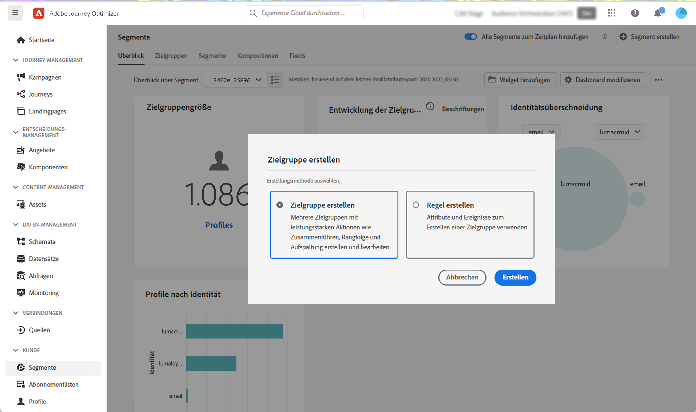
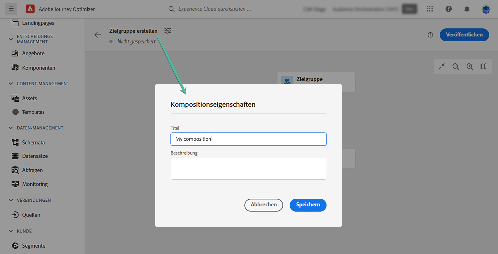
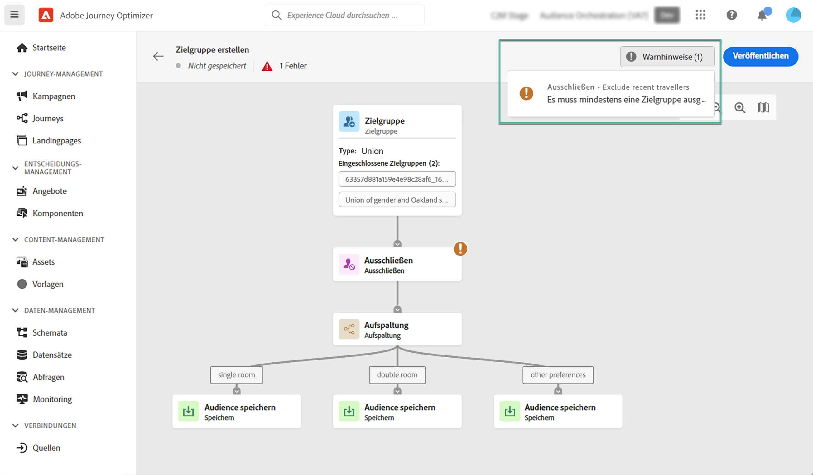
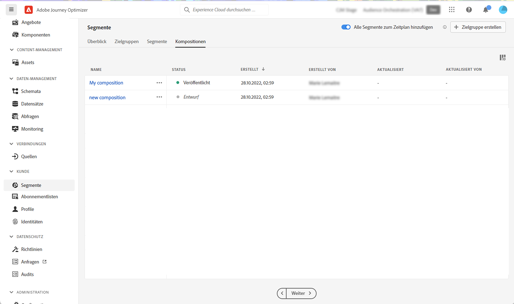

# Erstellen von Komposition-Workflows {#create-compositions}

Mit Komposition-Workflows können Sie bestehende Audiences kombinieren und anordnen, um neue Zielgruppen zu erstellen.

## Erstellen eines Kompositionsarbeitsablaufs {#create}

1. Zugriff auf **[!UICONTROL Segments]** Menü und wählen Sie **[!UICONTROL Create Audience]**.

1. Auswählen **[!UICONTROL Compose Audience]**.

   >[!NOTE]
   >
   >Die **[!UICONTROL Build rule]** Mit der Erstellungsmethode können Sie eine neue Segmentdefinition erstellen, indem Sie die [Segmentierungsdienst](https://experienceleague.adobe.com/docs/experience-platform/segmentation/ui/overview.html).

   

1. Die Arbeitsfläche der Komposition wird mit zwei Standardaktivitäten angezeigt:

   * **[!UICONTROL Audience]**: der Ausgangspunkt Ihrer Komposition. Mithilfe dieser Aktivität können Sie eine oder mehrere Zielgruppen als Grundlage für Ihren Workflow auswählen.

   * **[!UICONTROL Save]**: der letzte Schritt Ihrer Komposition. Mit dieser Aktivität können Sie das Ergebnis Ihres Workflows in einer neuen Audience speichern.
   Weiterführende Informationen zum Konfigurieren von Aktivitäten auf der Arbeitsfläche des Kompositionsarbeitsablaufs finden Sie im Abschnitt [Arbeiten mit der Arbeitsfläche für Kompositionen](composition-canvas.md).

1. Öffnen Sie die Eigenschaften der Komposition, um einen Titel und eine Beschreibung anzugeben.

   Wenn in den Eigenschaften kein Titel definiert ist, wird die Kompositionsbezeichnung der Anfang sein. **[!UICONTROL Audience]** Aktivität.

   

1. Konfigurieren Sie Ihre Komposition, indem Sie zwischen den **[!UICONTROL Audience]** und **[!UICONTROL Save]** Aktivitäten. [Erfahren Sie, wie Sie mit der Arbeitsfläche für Kompositionen arbeiten.](composition-canvas.md)

   

1. Sobald Ihre Komposition fertig ist, klicken Sie auf die **[!UICONTROL Publish]** Schaltfläche zum Veröffentlichen der Komposition und Speichern der resultierenden Zielgruppen in Adobe Experience Platform.

   Tritt während der Veröffentlichung ein Fehler auf, werden Warnhinweise mit Informationen zur Behebung des Problems angezeigt.

   

1. Die Komposition ist veröffentlicht. Die resultierenden Zielgruppen werden in Adobe Experience Platform gespeichert und können für Journey Optimizer-Kampagnen verwendet werden. [Erfahren Sie, wie Sie mit Kampagnen arbeiten.](../campaigns/get-started-with-campaigns.md)

## Auf Kompositionen zugreifen {#access}

>[!CONTEXTUALHELP]
>id="ajo_ao_publish"
>title="Veröffentlichen der Audience"
>abstract="Veröffentlichen Sie Ihre Komposition, um die resultierenden Zielgruppen in Adobe Experience Platform zu speichern."

Alle erstellten Kompositionen können über die **[!UICONTROL Compositions]** Registerkarte. Sie können mehrere Status haben:

* **[!UICONTROL Draft]**: die Komposition läuft und noch nicht veröffentlicht wurde.
* **[!UICONTROL Published]**: die Komposition veröffentlicht wurde, die resultierenden Zielgruppen gespeichert wurden und zur Verwendung verfügbar sind.
* **[!UICONTROL Archived]**: die Komposition archiviert wurde.

>[!NOTE]
>
>Sie können eine vorhandene Komposition jederzeit mit der Schaltfläche mit den Auslassungspunkten in der Liste duplizieren oder löschen.

Weitere Informationen:

* [Erste Schritte mit der Komposition von Zielgruppen](get-started-audience-orchestration.md)
* [Arbeiten mit der Arbeitsfläche für Kompositionen](composition-canvas.md)
* [Zielgruppen aufrufen und verwalten](access-audiences.md)
