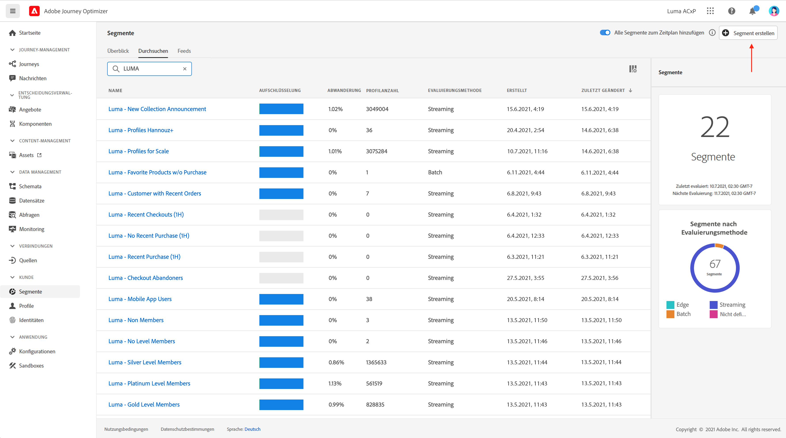
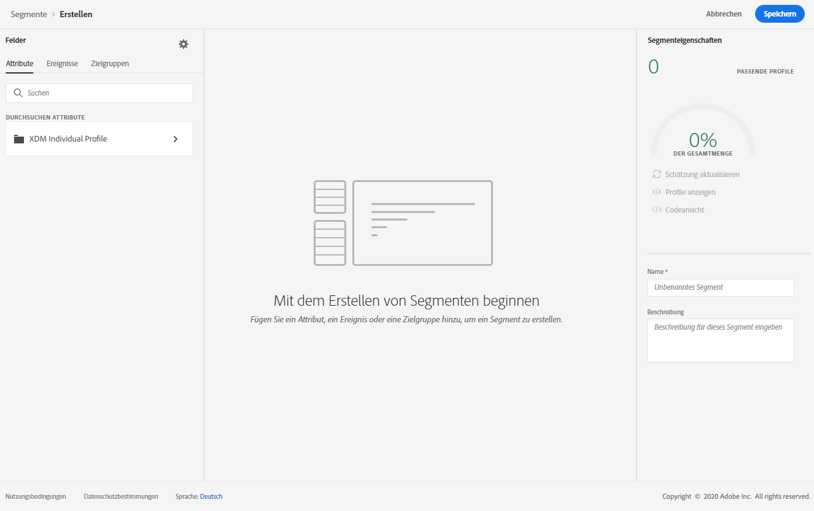
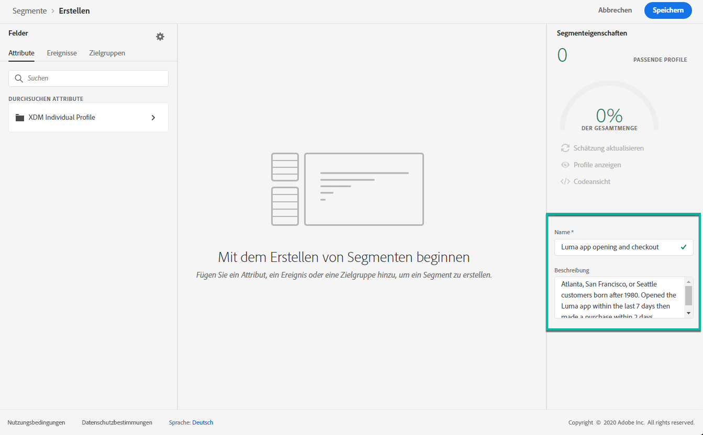
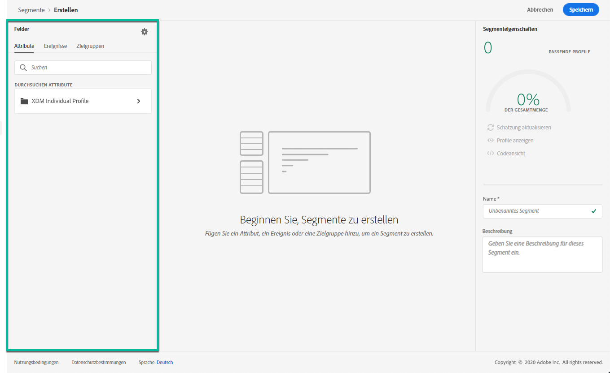
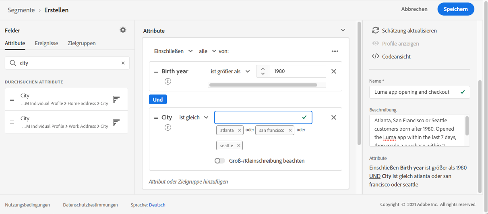
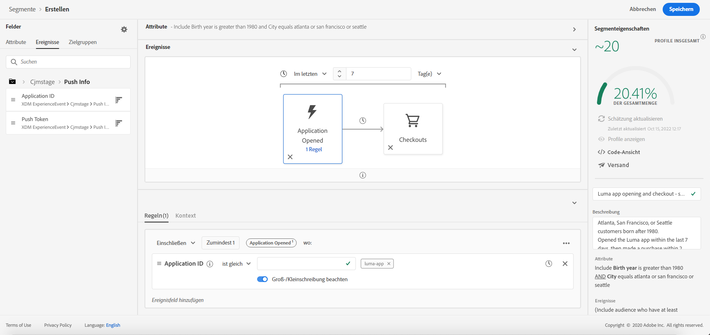
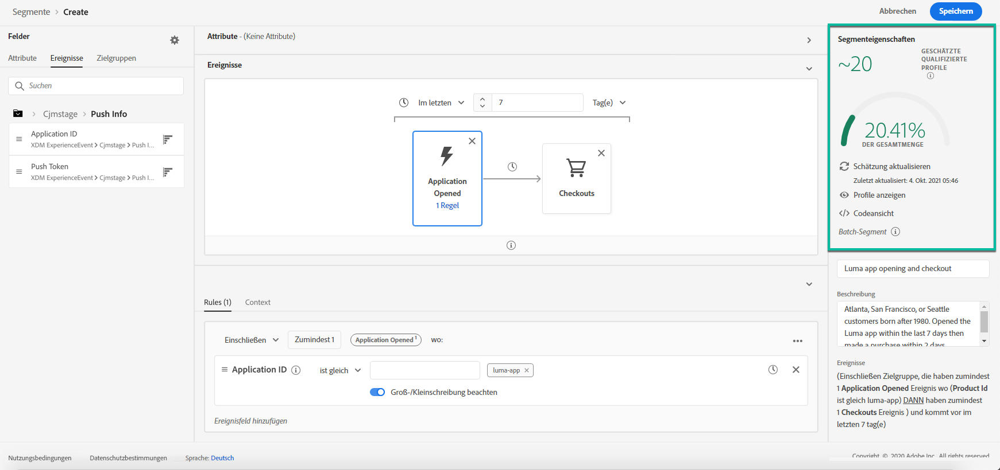

# Erstellen von Segmenten {#build-segments}

>[!CONTEXTUALHELP]
>id="ajo_ao_create_rule"
>title="Erstellen einer Regel"
>abstract="Die Methode zum Erstellen von Regeln ermöglicht Ihnen, mithilfe des Segmentierungs-Services von Adobe Experience Platform eine neue Segmentdefinition zu erstellen."

In diesem Beispiel erstellen wir ein Segment für alle in Atlanta, San Francisco oder Seattle wohnenden und nach 1980 geborenen Kunden. Alle diese Kunden sollten das Programm Luma innerhalb der letzten 7 Tage geöffnet und dann innerhalb von 2 Stunden nach dem Öffnen eine Bestellung abgeschlossen haben.

➡️ [In diesem Video erfahren Sie, wie Sie Segmente erstellen](#video-segment)

1. Rufen Sie das Menü **[!UICONTROL Segmente]** auf und klicken Sie dann auf die Schaltfläche **[!UICONTROL Segment erstellen]**.

   

   Im Bildschirm für die Segmentdefinition können Sie alle erforderlichen Felder konfigurieren, um Ihr Segment einzurichten. Erfahren Sie, wie Sie Segmente im [Dokumentation zum Segmentierungsdienst](https://experienceleague.adobe.com/docs/experience-platform/segmentation/ui/overview.html?lang=de){target="_blank"}.

   

1. Geben Sie im Bereich **[!UICONTROL Segmenteigenschaften]** einen Namen und eine Beschreibung (optional) für das Segment ein.

   

1. Ziehen Sie per Drag-and-Drop die gewünschten Felder aus dem linken Bereich in den mittleren Arbeitsbereich und konfigurieren Sie die Felder dann entsprechend Ihren Anforderungen.

   >[!NOTE]
   >
   >Beachten Sie, dass die Felder im linken Bereich je nach Konfiguration der Schemas **XDM Individual Profile** und **XDM ExperienceEvent** für Ihr Unternehmen abweichen.  Weitere Informationen finden Sie unter [Dokumentation zum Experience-Datenmodell (XDM)](https://experienceleague.adobe.com/docs/experience-platform/xdm/home.html?lang=de){target="_blank"}.

   

   In diesem Beispiel müssen für die Segmenterstellung die Felder **Attribute** und **Ereignisse** verwendet werden:

   * **Attribute**: Profile mit Wohnsitz in Atlanta, San Francisco oder Seattle und mit Geburtsjahr nach 1980

     

   * **Ereignisse**: Profile, die das Luma-Programm innerhalb der letzten 7 Tage geöffnet und innerhalb von 2 Stunden nach dem Öffnen eine Bestellung abgeschlossen haben.

     

1. Wenn Sie dem Arbeitsbereich neue Felder hinzufügen und diese konfigurieren, wird der Bereich **[!UICONTROL Segmenteigenschaften]** automatisch mit Informationen zum geschätzten Bestand an Profilen dieses Segments aktualisiert.

   

1. Wenn das Segment fertig ist, klicken Sie auf **[!UICONTROL Speichern]**. Es wird nun in der Liste von Adobe Experience Platform-Segmenten angezeigt. Mithilfe der Suchleiste können Sie ein bestimmtes Segment in der Liste suchen.

Das Segment kann jetzt in Ihren Journeys verwendet werden. Weiterführende Informationen hierzu finden Sie in [diesem Abschnitt](../segment/about-segments.md).

## Anleitungsvideo{#video-segment}

Erfahren Sie, wie Sie Segmente erstellen.

>[!VIDEO](https://video.tv.adobe.com/v/334281?quality=12)
