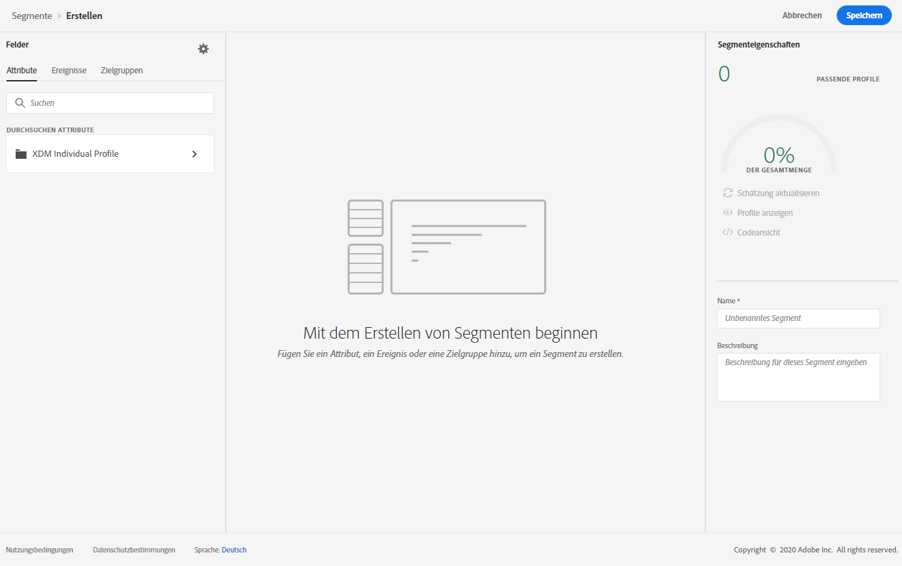
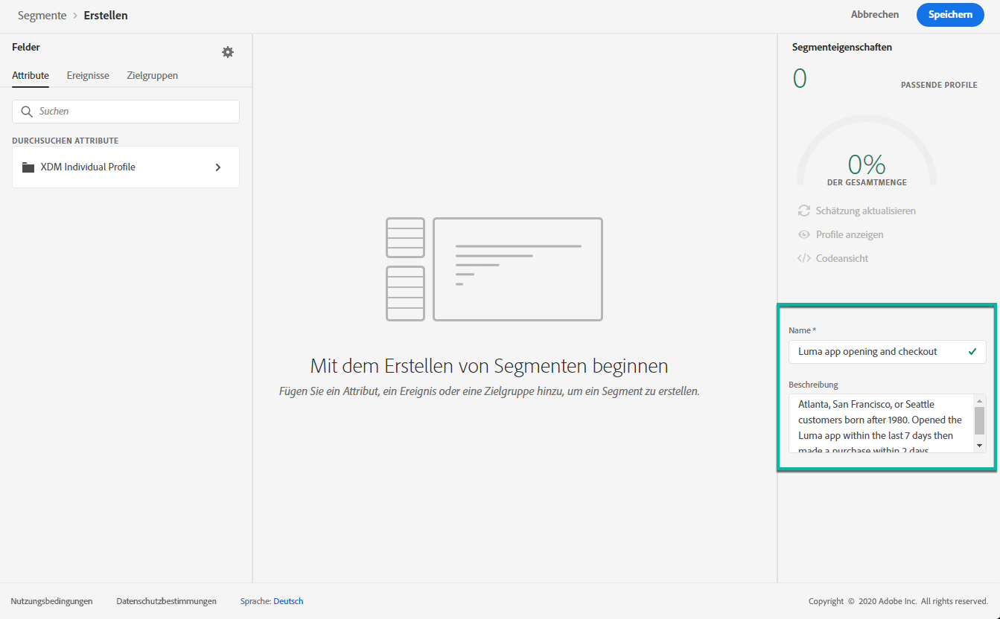
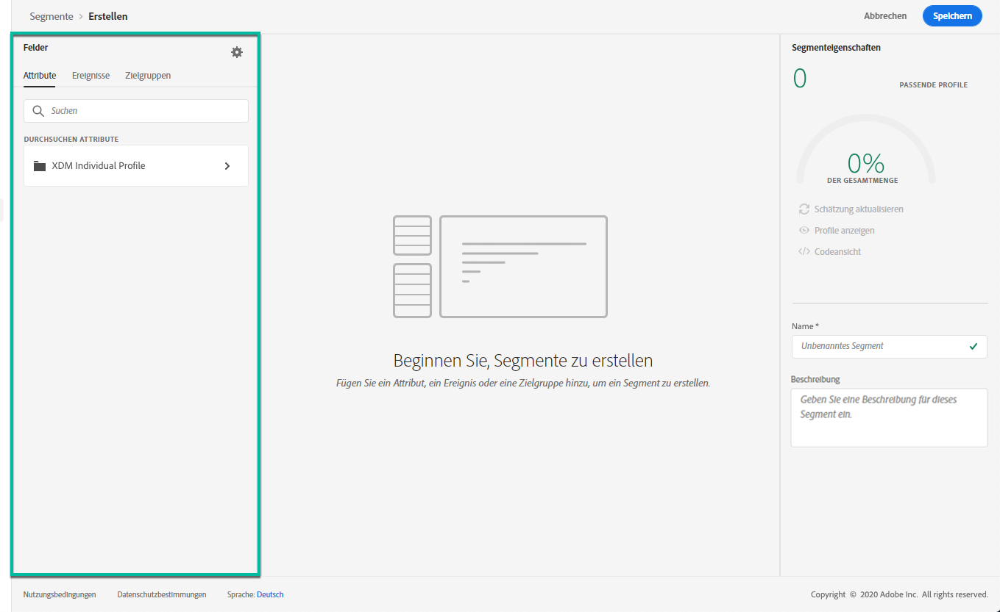
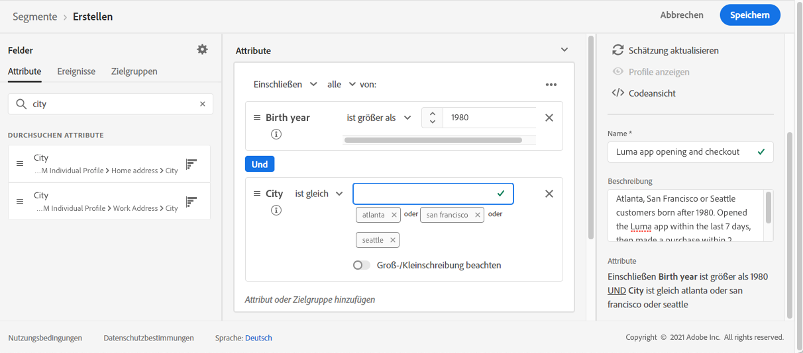
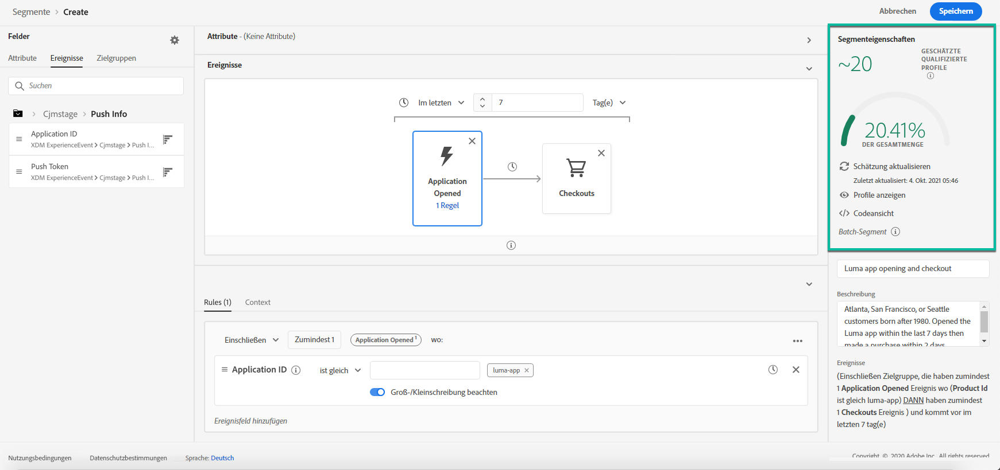

# Segmente {#build-segments} erstellen

In diesem Beispiel werden wir ein Segment zur Zielgruppe aller in Atlanta, San Francisco oder Seattle lebenden und nach 1980 geborenen Kunden erstellen. Alle diese Kunden hätten die Luma Anwendung innerhalb der letzten 7 Tage öffnen und dann innerhalb von 2 Stunden nach dem Öffnen des Antrags einen Kauf tätigen sollen.

1. Rufen Sie das Menü **[!UICONTROL Segmente]** auf und klicken Sie dann auf die Schaltfläche **[!UICONTROL Segment erstellen]**.

   

   Im Bildschirm für die Segmentdefinition können Sie alle erforderlichen Felder konfigurieren, um Ihr Segment einzurichten. Erfahren Sie, wie Sie Segmente in der Dokumentation zum [Segmentierungsdienst](https://experienceleague.adobe.com/docs/experience-platform/segmentation/ui/overview.html) konfigurieren.

   

1. Geben Sie im Bereich **[!UICONTROL Segmenteigenschaften]** einen Namen und eine Beschreibung (optional) für das Segment ein.

   

1. Ziehen Sie die gewünschten Felder aus dem linken Bereich in den mittleren Arbeitsbereich und konfigurieren Sie sie dann entsprechend Ihren Anforderungen.

   >[!NOTE]
   >
   >Beachten Sie, dass die im linken Bereich verfügbaren Felder je nach Konfiguration der Schema **XDM Individuelles Profil** und **XDM ExperienceEvent** für Ihr Unternehmen variieren.  Weitere Informationen finden Sie in der Dokumentation [Erlebnisdatenmodell (XDM)](https://experienceleague.adobe.com/docs/experience-platform/xdm/home.html).

   

   In diesem Beispiel müssen zum Erstellen des Segments die Felder **Attribute** und **Ereignis** verwendet werden:

   * **Attribute**: Profile, die in Atlanta, San Francisco oder Seattle leben und nach 1980 geboren wurden,
   * **Ereignisse**: Profil, die die Luma-Anwendung innerhalb der letzten 7 Tage geöffnet haben, haben innerhalb von 2 Stunden nach dem Öffnen des Antrags einen Kauf getätigt.

      

      

1. Wenn Sie neue Felder im Arbeitsbereich hinzufügen und konfigurieren, wird der Bereich **[!UICONTROL Segmenteigenschaften]** automatisch mit Informationen zu den geschätzten Profilen des Segments aktualisiert.

   

1. Sobald das Segment fertig ist, klicken Sie auf **[!UICONTROL Speichern]**. Es wird in der Liste von Adobe Experience Platform-Segmenten angezeigt. Beachten Sie, dass eine Suchleiste verfügbar ist, mit der Sie ein bestimmtes Segment in der Liste suchen können.

Das Segment kann jetzt in Ihren Journey verwendet werden. Weiterführende Informationen hierzu finden Sie in [diesem Abschnitt](../segment/about-segments.md).
