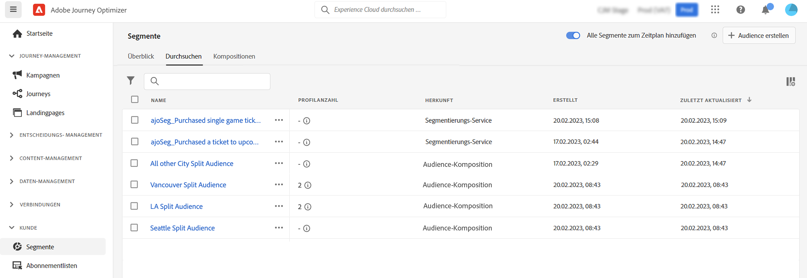

# Erste Schritte mit der Audience-Komposition {#get-start-audience-composition}

>[!CONTEXTUALHELP]
>id="ajo_ao_create_composition"
>title="Erstellen einer Komposition"
>abstract="Erstellen Sie einen Workflow für die Komposition, um bestehende Adobe Experience Platform-Audiences in einer visuellen Arbeitsfläche zu kombinieren, und nutzen Sie verschiedene Aktivitäten (Aufspaltung, Ausschluss ...), um neue Audiences zu erstellen."

>[!BEGINSHADEBOX]

Inhalt dieser Dokumentation:

* **[Erste Schritte mit der Audience-Komposition](get-started-audience-orchestration.md)**
* [Erstellen des ersten Kompositions-Workflows](create-compositions.md)
* [Arbeiten mit der Arbeitsfläche für Kompositionen](composition-canvas.md)
* [Zugreifen auf und Verwalten von Audiences](access-audiences.md)

>[!ENDSHADEBOX]

>[!AVAILABILITY]
>
>Die Zielgruppenzusammensetzung ist derzeit nur für eine begrenzte Gruppe von Kunden verfügbar. Wenden Sie sich bei Fragen an Ihren Ansprechpartner bei der Adobe.

Mit der Komposition von Audiences können Sie **Kompositions-Workflows** erstellen, in denen Sie vorhandene Adobe Experience Platform-Audiences in einer visuellen Arbeitsfläche kombinieren und verschiedene Aktivitäten (Aufspaltung, Ausschluss ...) nutzen können, um neue Audiences zu erstellen.

Nach Abschluss des Vorgangs werden die **resultierenden Zielgruppen** zusammen mit vorhandenen Zielgruppen in Adobe Experience Platform gespeichert und können **in Kampagnen genutzt werden**, um Kunden anzusprechen. [Mit Kampagnen arbeiten](../campaigns/get-started-with-campaigns.md)

>[!IMPORTANT]
>
>Zielgruppen, die aus Kompositions-Workflows resultieren, können nur in Journey Optimizer-Kampagnen verwendet werden. Sie sind nicht zur Verwendung in Journeys verfügbar.
>
>Kampagnen in Adobe Journey Optimizer sind noch nicht in den Richtliniendurchsetzungsdienst integriert. Daher werden Datennutzungsbezeichnungen, die Sie auf Ihre Zielgruppenattribute anwenden, in Journey Optimizer-Kampagnen nicht erzwungen.

Auf die Audience-Komposition kann über das Menü **[!UICONTROL Segmente]** von Adobe Journey Optimizer zugegriffen werden:

* Die Registerkarte **[!UICONTROL Übersicht]** bietet ein dediziertes Dashboard mit Schlüsselmetriken, die sich auf die Segmentdaten Ihres Unternehmens beziehen. Weitere Informationen finden Sie im [Handbuch zu Adobe Experience Platform Dashboards](https://experienceleague.adobe.com/docs/experience-platform/dashboards/guides/segments.html?lang=de).

* Auf der Registerkarte **[!UICONTROL Durchsuchen]** werden alle in Adobe Experience Platform gespeicherten Audiences aufgelistet.

* Auf der Registerkarte **[!UICONTROL Kompositionen]** können Sie Kompositions-Workflows erstellen, in denen Sie Audiences kombinieren und anordnen können, um neue Audiences zu erstellen.

Klicken Sie auf jede Karte, um zu erfahren, wie Sie mit der Audience-Komposition arbeiten können:

<table style="table-layout:fixed"><tr style="border: 0;">
<td>

<a href="create-compositions.md"><strong>Erstellen Ihres ersten Kompositions-Workflows</strong></a>
</td>
<td>

<a href="composition-canvas.md"><strong>Arbeiten mit der Arbeitsfläche für Kompositionen</strong></a>
</td>
<td>

<a href="access-audiences.md"><strong>Zugreifen auf und Verwalten von Audiences</strong></a>
</td>
</tr></table>
