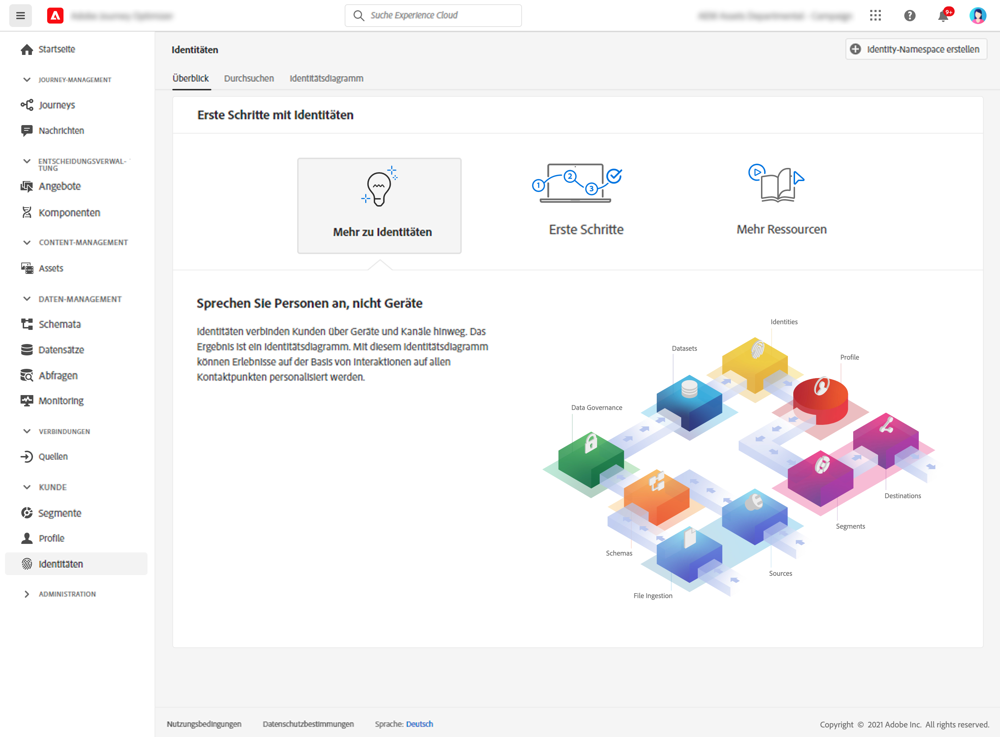

# Erste Schritte mit Identitäten {#identities-gs}

Eine Identität besteht aus Daten, die für eine Entität (normalerweise eine Person) eindeutig sind. Eine Identität wie z. B. eine Anmeldekennung, eine ECID oder eine Treueprogramm-ID wird als bekannte Identität bezeichnet.

Personenbezogene Daten (PII) wie E-Mail-Adresse und Telefonnummer dienen zur direkten Identifizierung eines Kunden. Infolgedessen werden personenbezogene Daten dazu verwendet, um verschiedene Identitäten eines Kunden systemübergreifend abzugleichen.

In [!DNL Adobe Journey Optimizer] verknüpfen **Identitäten** Verbraucher geräteübergreifend und kanalübergreifend. Das Ergebnis ist ein [Identitätsdiagramm](#id-graph). Das verknüpfte Identitätsdiagramm wird verwendet, um auf Erlebnissen basierende Interaktionen an allen Ihren Touchpoints zu personalisieren.

Weitere Informationen zu **Identity Service** finden Sie in [dieser Dokumentation](https://experienceleague.adobe.com/docs/experience-platform/identity/home.html?lang=de){target="_blank"}.

## Identity-Namespaces {#identity-namespaces}

**** Identity-Namespaces sind Komponenten des Identity Service, die als Indikatoren für den Kontext dienen, auf den sich eine Identität bezieht. Sie identifizieren beispielsweise den Wert `name@email.com` als E-Mail-Adresse oder `443522` als numerische CRM-ID. Das Verwenden von Identitäts-Namespaces setzt ein Verständnis der verschiedenen beteiligten Adobe Experience Platform-Dienste voraus. Bevor Sie Namespaces nutzen, lesen Sie bitte die Dokumentation für folgende Dienste:

Weitere Informationen zu **Identity-Namespaces** finden Sie in [dieser Dokumentation](https://experienceleague.adobe.com/docs/experience-platform/identity/namespaces.html?lang=de){target="_blank"}.

## Identitätsdiagramm{#id-graph}

Im **Identitätsdiagramm** werden die Beziehungen zwischen den verschiedenen Identitäten eines Kunden zusammengefasst. Dort wird visuell veranschaulicht, wie der Kunde auf unterschiedlichen Kanälen mit Ihrer Marke interagiert. Alle Identitätsdiagramme werden von Adobe Experience Platform Identity Service bei Kundenaktivität nahezu in Echtzeit verwaltet und aktualisiert.

Mit dem Identitätsdiagramm-Viewer in der [!DNL Adobe Journey Optimizer]-Benutzeroberfläche können Sie visualisieren und besser verstehen, welche Kundenidentitäten auf welche Weise miteinander verknüpft sind. Mit dem Viewer können Sie verschiedene Teile des Diagramms per Drag-and-drop verschieben und mit ihnen interagieren, sodass Sie komplexe Identitätsbeziehungen untersuchen, Fehler effizient beheben und von einer erhöhten Transparenz bei der Verwendung von Informationen profitieren können. 

Weitere Informationen zum **Identitätsdiagramm** finden Sie in [dieser Dokumentation](https://experienceleague.adobe.com/docs/experience-platform/identity/ui/identity-graph-viewer.html?lang=de){target="_blank"}.
