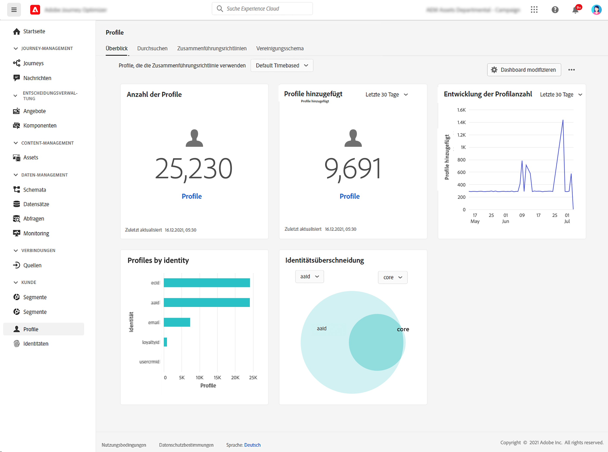

# Erste Schritte mit Profilen {#profiles-gs}

Echtzeit-Kundenprofil in [!DNL Adobe Journey Optimizer] um eine ganzheitliche Sicht auf jeden einzelnen Kunden zu erhalten, indem Daten aus verschiedenen Kanälen kombiniert werden, einschließlich Online, Offline, CRM und Drittanbieter. **Profile** ermöglicht es Ihnen, Ihre Kundendaten in einer einheitlichen Ansicht zusammenzufassen, die eine umsetzbare, mit Zeitstempel versehene Übersicht über jede Kundeninteraktion bietet.

>[!NOTE]
>
>Wenn Ihr Unternehmen neu bei [!DNL Adobe Journey Optimizer] und noch keine aktiven Profil-Datensätze oder Zusammenführungsrichtlinien erstellt haben, wird die **Profile** Das Dashboard ist nicht sichtbar. Stattdessen wird die **Übersicht** enthält Links zur Adobe Experience Platform-Dokumentation, die Ihnen bei den ersten Schritten mit dem Echtzeit-Kundenprofil helfen.

Erfahren Sie, wie Sie auf das **Profil-Dashboard** Detaillierte Informationen zu den im Dashboard angezeigten Metriken finden Sie unter [diesem Abschnitt](https://experienceleague.adobe.com/docs/experience-platform/profile/ui/user-guide.html){target=&quot;_blank&quot;}.

Sie können Datenfragmente aus mehreren Quellen zusammenführen und kombinieren, um eine vollständige Ansicht Ihrer einzelnen Kunden zu erhalten. Beim Zusammenführen dieser Daten dienen Zusammenführungsrichtlinien als Regeln, mit denen bestimmt wird, wie Daten priorisiert werden und welche Daten kombiniert werden, um eine einheitliche Ansicht zu schaffen.

Weitere Informationen **Zusammenführungsrichtlinien** in [Dokumentation](https://experienceleague.adobe.com/docs/experience-platform/profile/merge-policies/ui-guide.html){target=&quot;_blank&quot;}.

**Siehe auch**

* [Dokumentation zum Echtzeit-Kundenprofil](https://experienceleague.adobe.com/docs/experience-platform/query/home.html){target=&quot;_blank&quot;}
* [Video Übersicht über das Echtzeit-Kundenprofil](https://experienceleague.adobe.com/docs/experience-platform/profile/home.html){target=&quot;_blank&quot;}
