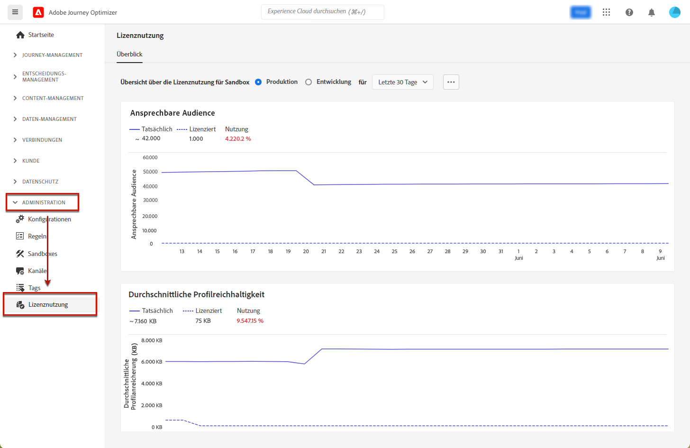

# Lizenznutzungs-Dashboard {#license-usage}

Die [!DNL Adobe Journey Optimizer] [Benutzeroberfläche](../start/user-interface.md) bietet ein Dashboard, das wichtige Informationen zur Lizenznutzung Ihres Unternehmens anzeigt, wie sie bei der täglichen Momentaufnahme erfasst werden.

Um auf das Dashboard zuzugreifen, gehen Sie zu **[!UICONTROL Administration]** > **[!UICONTROL Lizenznutzung]**. Dadurch wird die Registerkarte **[!UICONTROL Überblick]** mit dem Dashboard angezeigt.

>[!NOTE]
>
>Um das Dashboard anzeigen zu können, muss Ihnen die [Anzeigen des Dashboards zur Lizenznutzung](https://experienceleague.adobe.com/docs/experience-platform/dashboards/permissions.html?lang=de#available-permissions){target="_blank"} Berechtigung.

Weitere Informationen finden Sie in der Dokumentation zu Adobe Experience Platform:

* [Übersicht über das Lizenzverwendungs-Dashboard](https://experienceleague.adobe.com/docs/experience-platform/dashboards/guides/license-usage.html?lang=de){target="_blank"}
* [Dashboard zur Lizenznutzung](https://experienceleague.adobe.com/docs/experience-platform/dashboards/guides/license-usage.html?lang=de#exploring-the-license-usage-dashboard){target="_blank"}
* [Verfügbare Metriken](https://experienceleague.adobe.com/docs/experience-platform/dashboards/guides/license-usage.html?lang=de#available-metrics){target="_blank"}
