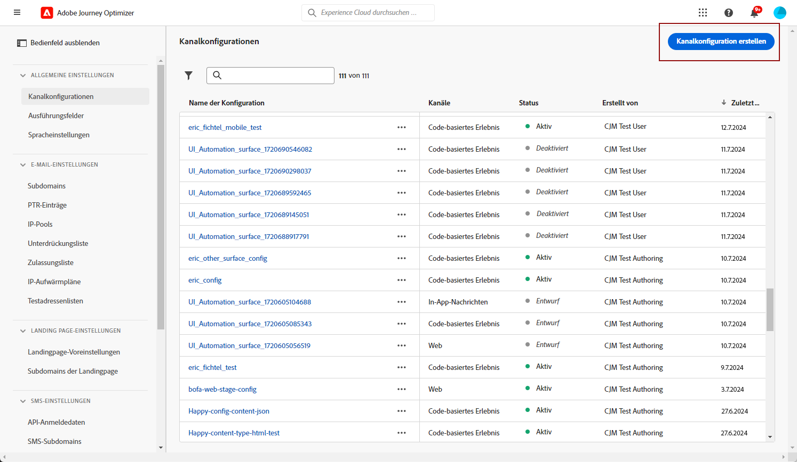
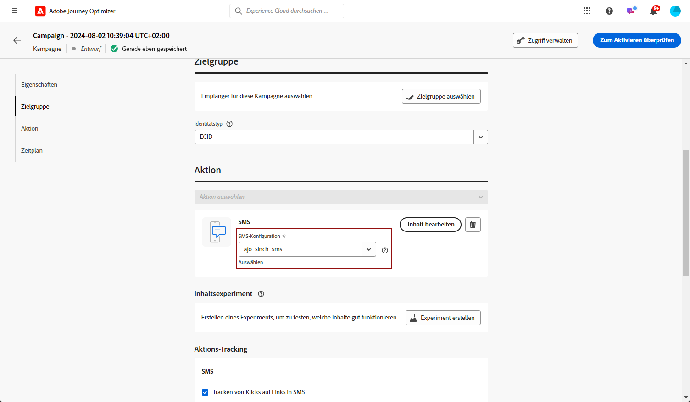
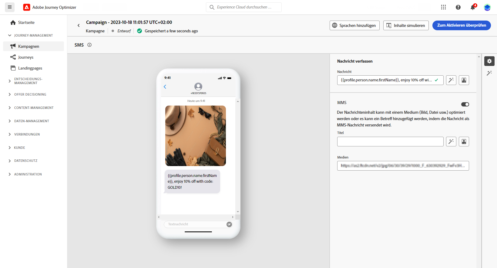

# MMS-Nachricht erstellen {#create-mms}

## Voraussetzungen{#sms-prerequisites}

Bevor Sie Ihre SMS-Nachricht erstellen, müssen Sie zunächst Ihren SMS-Anbieter mit Journey Optimizer konfigurieren. Gehen Sie dazu folgendermaßen vor:

* Vor dem SMS-Versand müssen Sie die Provider-Einstellungen in Journey Optimizer integrieren.

+++ Erfahren Sie, wie Sie eine neue Single-MMS-API-Berechtigung erstellen.

   1. Navigieren Sie in der linken Leiste zu **[!UICONTROL Administration]** > **[!UICONTROL Kanal]** und wählen Sie das Menü **[!UICONTROL API-Anmeldedaten]**. Klicken Sie auf die Schaltfläche **[!UICONTROL Neue API-Anmeldedaten erstellen]**.

      

   1. Konfigurieren Sie Ihre SMS-API-Anmeldedaten:

   * Für **[!DNL Sinch MMS]**:

      * **[!UICONTROL Name]**: Wählen Sie einen Namen für Ihre API-Anmeldedaten.

      * **[!UICONTROL Projekt-ID]**, **[!UICONTROL App-ID]** und **[!UICONTROL API-Token]**: Im Menü Conversation API können Sie Ihre Anmeldedaten im Menü App finden.  [Weitere Informationen](https://docs.cc.sinch.com/cloud/service-configuration/en/oxy_ex-1/common/wln1620131604643.html)

     

   1. Wenn Sie die Konfiguration Ihrer API-Anmeldedaten abgeschlossen haben, klicken Sie auf **[!UICONTROL Senden]**.

  Nachdem Sie Ihre API-Anmeldedaten erstellt und konfiguriert haben, müssen Sie jetzt eine Kanaloberfläche (d. h. Nachrichtenvoreinstellung) für SMS-Nachrichten einrichten.

+++

* Danach müssen Sie eine SMS-Oberfläche erstellen. Diese Schritte müssen von einem Adobe Journey Optimizer-Systemadministrator durchgeführt werden.

+++ Erfahren Sie, wie Sie Ihre Kanaloberfläche erstellen.

   1. Navigieren Sie in der linken Leiste zu **[!UICONTROL Administration]** > **[!UICONTROL Kanäle]** und wählen Sie **[!UICONTROL Branding]** > **[!UICONTROL Kanaloberflächen]**. Klicken Sie auf die Schaltfläche **[!UICONTROL Kanaloberfläche erstellen]**.

      

   1. Geben Sie einen Namen und eine Beschreibung (optional) für die Oberfläche ein und wählen Sie dann den SMS-Kanal aus.

      

      >[!NOTE]
      >
      > Namen müssen mit einem Buchstaben (A–Z) beginnen. Ein Name darf nur alphanumerische Zeichen enthalten. Sie können auch die Zeichen Unterstrich `_`, Punkt `.` und Bindestrich `-` verwenden.

   1. Definieren Sie die **SMS-Einstellungen**.

      

      Wählen Sie zunächst den **[!UICONTROL SMS-Typ]** aus, der mit der Oberfläche gesendet werden soll: **[!UICONTROL Transaktion]** oder **[!UICONTROL Marketing]**.

      * Wählen Sie **Marketing** für Werbe-SMS: Diese Nachrichten erfordern die Zustimmung der Benutzenden.
      * Wählen Sie **Transaktion** für nicht-kommerzielle Nachrichten, wie z. B. Bestellbestätigungen, Benachrichtigungen beim Zurücksetzen des Kennworts oder Versandinformationen.

      Wenn Sie eine SMS-Nachricht erstellen, müssen Sie eine gültige Kanaloberfläche wählen, die der Kategorie entspricht, die Sie für Ihre Nachricht ausgewählt haben.

      >[!CAUTION]
      >
      >**Transaktions-SMS-Nachrichten** können an Profile gesendet werden, die sich von Marketing-Nachrichten abgemeldet haben. Diese Nachrichten können nur in bestimmten Kontexten gesendet werden.

   1. Wählen Sie die **[!UICONTROL SMS-Konfiguration]** aus, um sie mit der Oberfläche zu verknüpfen.

      Weiterführende Informationen zur Konfiguration Ihrer Umgebung für den Versand von SMS-Nachrichten finden Sie in [diesem Abschnitt](#create-api).

   1. Geben Sie die **[!UICONTROL Absendernummer]** ein, die Sie für Ihre Sendungen verwenden möchten.

   1. Wählen Sie Ihr **[!UICONTROL SMS-Ausführungsfeld]**, um das mit den Telefonnummern der Profile verbundene **[!UICONTROL Profilattribut]** auszuwählen.

   1. Wenn Sie die URL-Verkürzungsfunktion in Ihren SMS-Nachrichten verwenden möchten, wählen Sie ein Element aus der **[!UICONTROL Subdomain]**-Liste aus.

      >[!NOTE]
      >
      >Um eine Subdomain auswählen zu können, müssen Sie zuvor mindestens eine Landingpage-Subdomain konfiguriert haben. [Weitere Informationen](sms-subdomains.md)

   1. Geben Sie die **[!UICONTROL Opt-out-Nummer]** ein, die Sie für diese Oberfläche verwenden möchten. Wenn sich Profile von dieser Telefonnummer abmelden, können Sie ihnen immer noch Nachrichten von anderen Nummern senden, die Sie für den Versand von SMS-Nachrichten mit [!DNL Journey Optimizer] verwenden.

      >[!NOTE]
      >
      >In [!DNL Journey Optimizer] wird die Abmeldung von SMS nicht mehr auf Kanalebene verwaltet. Dies ist jetzt für eine Nummer spezifisch.

   1. Nachdem alle Parameter konfiguriert wurden, klicken Sie zur Bestätigung auf **[!UICONTROL Senden]**. Sie können die Kanaloberfläche auch als Entwurf speichern und ihre Konfiguration später fortsetzen.

      

   1. Nachdem die Kanaloberfläche erstellt wurde, wird sie in der Liste mit dem Status **[!UICONTROL Verarbeitung läuft]** angezeigt.

      >[!NOTE]
      >
      >In [diesem Abschnitt](#monitor-channel-surfaces) erfahren Sie mehr über die möglichen Fehlerursachen, wenn die Prüfungen nicht erfolgreich sind.

   1. Sobald die Prüfungen erfolgreich abgeschlossen sind, erhält die Kanaloberfläche den Status **[!UICONTROL Aktiv]**. Sie kann nun zum Versand von Nachrichten verwendet werden.

      

## Erstellen einer SMS-Nachricht {#create-sms-journey-campaign}

Auf den folgenden Registerkarten finden Sie weitere Informationen dazu, wie Sie eine SMS-Nachricht in einer Kampagne oder Journey hinzufügen können.

>[!BEGINTABS]

>[!TAB Hinzufügen einer SMS-Nachricht zu einer Journey]

1. Öffnen Sie Ihre Journey und ziehen Sie eine SMS-Aktivität aus dem Abschnitt **Aktionen** der Palette.

   

1. Geben Sie allgemeine Informationen (Titel, Beschreibung, Kategorie) zu Ihrer Nachricht ein und wählen Sie dann die zu verwendende Nachrichtenoberfläche aus.

   

   Weitere Informationen zur Konfiguration der Journey finden Sie auf [dieser Seite](../building-journeys/journey-gs.md).

   Das Feld **[!UICONTROL Oberfläche]** ist standardmäßig mit der letzten Oberfläche für den Kanal vorausgefüllt, den die Benutzerin oder der Benutzer verwendet hat.

Sie können jetzt mit der Erstellung des Inhalts Ihrer SMS-Nachricht beginnen, indem Sie die Schaltfläche **[!UICONTROL Inhalt bearbeiten]** anklicken. [Definieren Ihres SMS-Inhalts](#sms-content)

>[!TAB Hinzufügen einer SMS-Nachricht zu einer Kampagne]

1. Erstellen Sie eine neue geplante oder durch eine API ausgelöste Kampagne. Wählen Sie **[!UICONTROL SMS]** als Aktion und anschließend die **[!UICONTROL Anwendungsoberfläche]**, die verwendet werden soll. [Weitere Informationen zur SMS-Konfiguration](sms-configuration.md).

   

1. Klicken Sie auf **[!UICONTROL Erstellen]**.

1. Bearbeiten Sie im Bereich **[!UICONTROL Eigenschaften]** den **[!UICONTROL Titel]** und die **[!UICONTROL Beschreibung]** Ihrer Kampagne.

   

1. Klicken Sie auf die Schaltfläche **[!UICONTROL Zielgruppe auswählen]**, um die Zielgruppe aus der Liste der verfügbaren Adobe Experience Platform-Zielgruppen zu definieren. [Weitere Informationen](../audience/about-audiences.md).

1. Wählen Sie im Feld **[!UICONTROL Identity-Namespace]** den Namespace aus, der zur Identifizierung der Personen in der ausgewählten Zielgruppe verwendet werden soll. [Weitere Informationen](../event/about-creating.md#select-the-namespace).

   

1. Klicken Sie auf **[!UICONTROL Experiment erstellen]**, um mit der Konfiguration Ihres Inhaltsexperiments zu beginnen und Abwandlungen zu erstellen, deren Leistung zu messen und die beste Option für Ihre Zielgruppe zu ermitteln. [Weitere Informationen](../campaigns/content-experiment.md)

1. Im Bereich **[!UICONTROL Tracking von Aktionen]** können Sie angeben, ob Sie Klicks auf Links in Ihrer SMS-Nachricht verfolgen möchten.

1. Kampagnen sind so konzipiert, dass sie an einem bestimmten Datum oder in regelmäßigen Abständen ausgeführt werden. Erfahren Sie in [diesem Abschnitt](../campaigns/create-campaign.md#schedule), wie Sie den **[!UICONTROL Zeitplan]** der Kampagne konfigurieren können.

1. Wählen Sie aus dem Menü **[!UICONTROL Aktions-Trigger]** die **[!UICONTROL Häufigkeit]** Ihrer SMS-Nachricht:

   * Einmal
   * Täglich
   * Wöchentlich
   * Monat

Sie können jetzt mit der Erstellung des Inhalts Ihrer SMS-Nachricht beginnen, indem Sie die Schaltfläche **[!UICONTROL Inhalt bearbeiten]** anklicken. [Gestalten von SMS-Inhalten](#sms-content)

>[!ENDTABS]

## MMS-Inhalt definieren{#mms-content}

1. Klicken Sie auf dem Bildschirm der Journey- oder Kampagnenkonfiguration auf die Schaltfläche **[!UICONTROL Inhalt bearbeiten]**, um den SMS-Inhalt zu konfigurieren.

1. Klicken Sie auf das Feld **[!UICONTROL Nachricht]**, um den Ausdruckseditor zu öffnen.

   

1. Verwenden Sie den Ausdruckseditor, um Inhalte zu definieren und dynamische Inhalte hinzuzufügen. Sie können jedes Attribut verwenden, sowie z. B. Profilnamen oder Stadt. Weitere Informationen zu [Personalisierung](../personalization/personalize.md) und [dynamischen Inhalten](../personalization/get-started-dynamic-content.md) finden Sie im Ausdruckseditor.

1. Aktivieren Sie die MMS-Option, um Ihrem SMS-Inhalt Medien hinzuzufügen.

   >[!NOTE]
   >
   > Die MMS-Option ist nur mit Sinch verfügbar. Sie müssen eine bestimmte API-Berechtigung erstellen, um MMS zu erstellen. [Weitere Informationen](sms-configuration.md#create-new-api)

   

1. Hinzufügen einer **[!UICONTROL Titel]** auf Ihre Medien.

1. Geben Sie die URL Ihres Mediums im **[!UICONTROL Medien]** -Feld.

   

1. Klicken Sie auf **[!UICONTROL Speichern]** und überprüfen Sie Ihre Nachricht in der Vorschau. Sie können **[!UICONTROL Inhalt simulieren]** verwenden, um Ihre gekürzten URLs oder personalisierten Inhalte in der Vorschau anzuzeigen.

Sie können jetzt Ihre SMS-Nachricht testen und an Ihre Audience senden. [Weitere Informationen](send-sms.md)
Nach dem Versand können Sie die Wirkung Ihrer SMS in den Kampagnen- oder Journey-Berichten messen. Weiterführende Informationen zum Reporting finden Sie in [diesem Abschnitt](../reports/campaign-global-report.md#sms-tab).

>[!NOTE]
>
>In Übereinstimmung mit den Branchenstandards und -vorschriften müssen alle SMS-Marketing-Nachrichten eine Möglichkeit für die Empfänger enthalten, ihr Abo einfach zu kündigen. Zu diesem Zweck können SMS-Empfänger mit Keywords zum Opt-in oder Opt-out antworten. [Informationen über die Verwaltung des Opt-outs](../privacy/opt-out.md#sms-opt-out-management-sms-opt-out-management)

**Verwandte Themen**

* [Vorschau, Test und Versand Ihrer SMS-Nachricht](send-sms.md)
* [Konfigurieren des SMS-Kanals](sms-configuration.md)
* [SMS-Bericht](../reports/journey-global-report.md#sms-global)