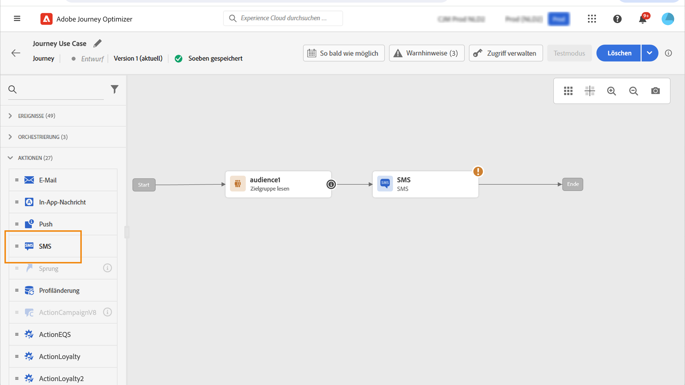
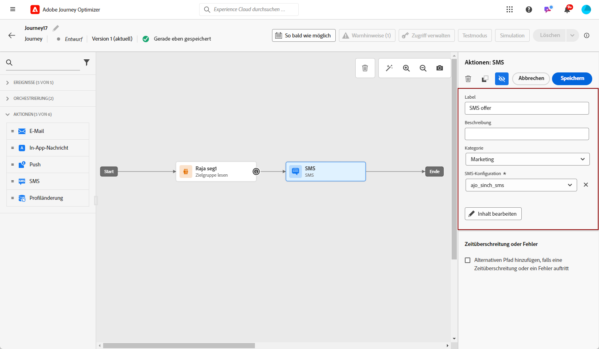
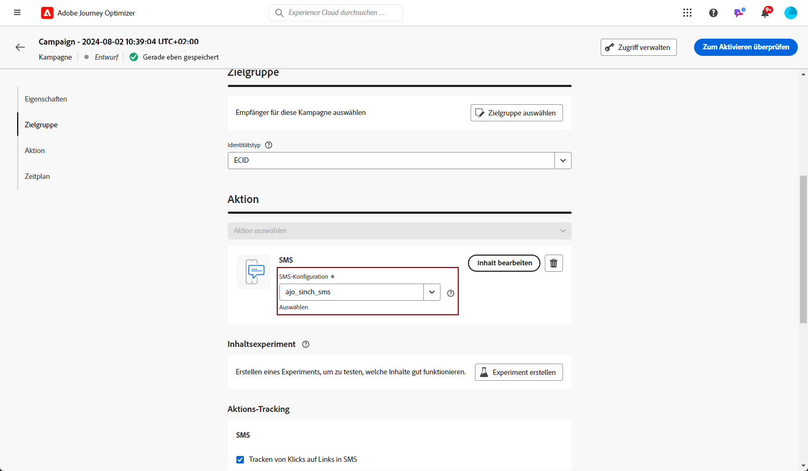
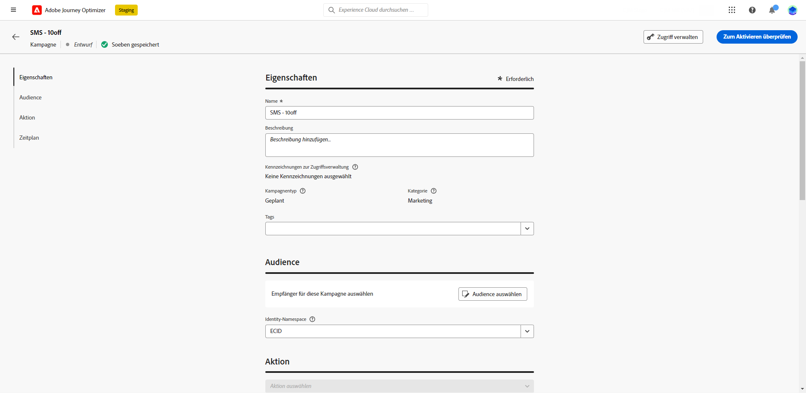
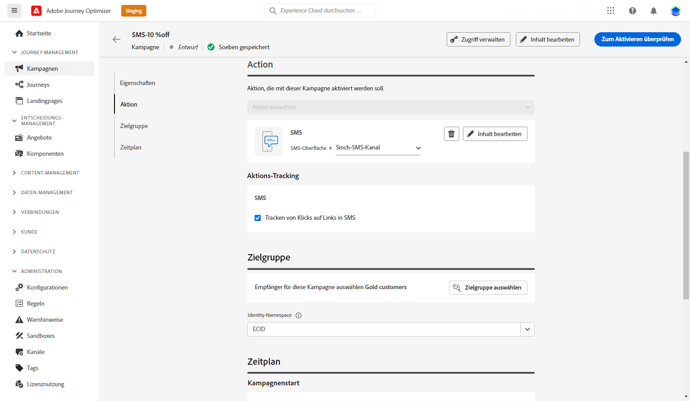
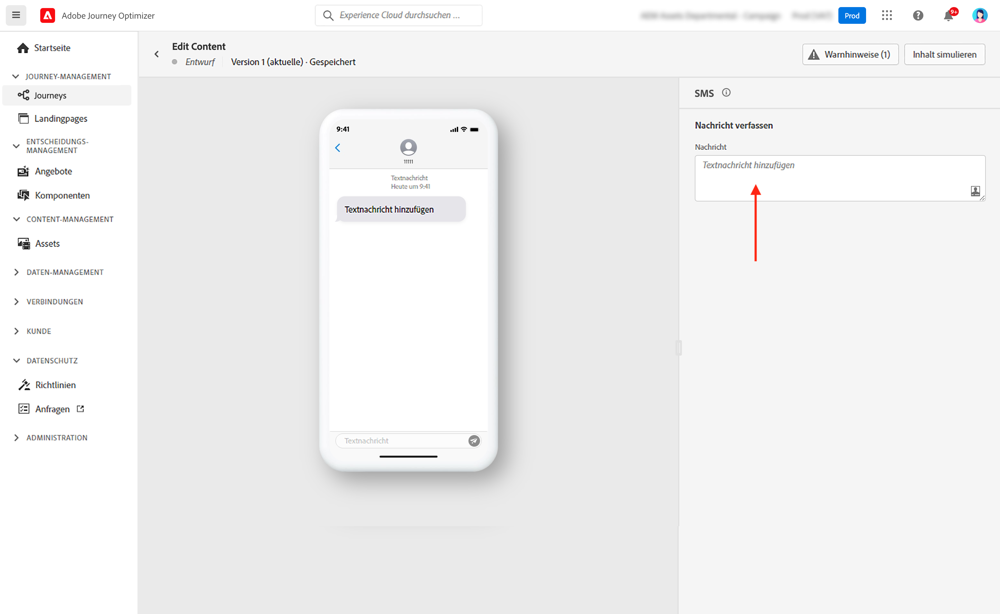
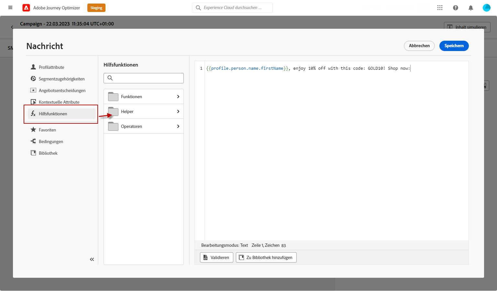
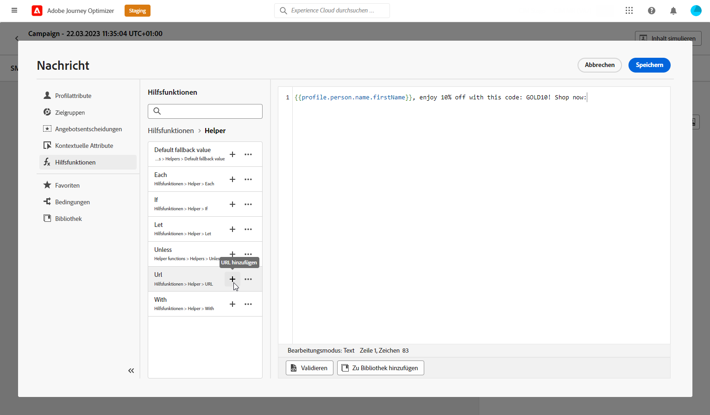

# Erstellen einer SMS-Nachricht {#create-sms}

>[!CONTEXTUALHELP]
>id="ajo_message_sms"
>title="Erstellen einer SMS-Nachricht"
>abstract="Fügen Sie Ihre SMS-Nachricht hinzu und beginnen Sie, sie mit dem Ausdruckseditor zu personalisieren."

## Hinzufügen einer SMS-Nachricht {#create-sms-journey-campaign}

Auf den folgenden Registerkarten finden Sie weitere Informationen dazu, wie Sie eine SMS-Nachricht in einer Kampagne oder Journey hinzufügen können.

>[!BEGINTABS]

>[!TAB Hinzufügen einer SMS-Nachricht zu einer Journey]

1. Öffnen Sie Ihre Journey und ziehen Sie eine SMS-Aktivität aus dem Abschnitt **Aktionen** der Palette.

   

1. Geben Sie allgemeine Informationen (Titel, Beschreibung, Kategorie) zu Ihrer Nachricht ein und wählen Sie dann die zu verwendende Nachrichtenoberfläche aus.

   

   Weitere Informationen zur Konfiguration der Journey finden Sie auf [dieser Seite](../building-journeys/journey-gs.md).

   Das Feld **[!UICONTROL Oberfläche]** ist standardmäßig mit der letzten Oberfläche für den Kanal vorausgefüllt, den die Benutzerin oder der Benutzer verwendet hat.

Sie können jetzt mit der Erstellung des Inhalts Ihrer SMS-Nachricht beginnen, indem Sie die Schaltfläche **[!UICONTROL Inhalt bearbeiten]** anklicken. [Definieren Ihres SMS-Inhalts](#sms-content)

>[!TAB Hinzufügen einer SMS-Nachricht zu einer Kampagne]

1. Erstellen Sie eine neue geplante oder durch eine API ausgelöste Kampagne. Wählen Sie **[!UICONTROL SMS]** als Aktion und anschließend die **[!UICONTROL Anwendungsoberfläche]**, die verwendet werden soll. [Weitere Informationen zur SMS-Konfiguration](sms-configuration.md).

   

1. Klicken Sie auf **[!UICONTROL Erstellen]**.

1. Bearbeiten Sie im Bereich **[!UICONTROL Eigenschaften]** den **[!UICONTROL Titel]** und die **[!UICONTROL Beschreibung]** Ihrer Kampagne.

   

1. Im Bereich **[!UICONTROL Tracking von Aktionen]** können Sie angeben, ob Sie Klicks auf Links in Ihrer SMS-Nachricht verfolgen möchten.

1. Klicken Sie auf die Schaltfläche **[!UICONTROL Audience auswählen]**, um die Audience aus der Liste der verfügbaren Adobe Experience Platform-Segmente zu definieren. [Weitere Informationen](../segment/about-segments.md).

1. Wählen Sie im Feld **[!UICONTROL Identity-Namespace]** den Namespace aus, der zur Identifizierung der Personen im ausgewählten Segment verwendet werden soll. [Weitere Informationen](../event/about-creating.md#select-the-namespace).

   

1. Kampagnen sind so konzipiert, dass sie an einem bestimmten Datum oder in regelmäßigen Abständen ausgeführt werden. Erfahren Sie in [diesem Abschnitt](../campaigns/create-campaign.md#schedule), wie Sie den **[!UICONTROL Zeitplan]** der Kampagne konfigurieren können.

1. Wählen Sie aus dem Menü **[!UICONTROL Aktions-Trigger]** die **[!UICONTROL Häufigkeit]** Ihrer SMS-Nachricht:

   * Einmal
   * Täglich
   * Wöchentlich
   * Monat

Sie können jetzt mit der Erstellung des Inhalts Ihrer SMS-Nachricht beginnen, indem Sie die Schaltfläche **[!UICONTROL Inhalt bearbeiten]** anklicken. [Gestalten von SMS-Inhalten](#sms-content)

>[!ENDTABS]

## Definieren Ihres SMS-Inhalts{#sms-content}

1. Klicken Sie auf dem Bildschirm der Journey- oder Kampagnenkonfiguration auf die Schaltfläche **[!UICONTROL Inhalt bearbeiten]**, um den SMS-Inhalt zu konfigurieren.

1. Klicken Sie auf das Feld **[!UICONTROL Nachricht]**, um den Ausdruckseditor zu öffnen.

   

1. Verwenden Sie den Ausdruckseditor, um Inhalte zu definieren und dynamische Inhalte hinzuzufügen. Sie können jedes Attribut verwenden, sowie z. B. Profilnamen oder Stadt. Weitere Informationen zu [Personalisierung](../personalization/personalize.md) und [dynamischen Inhalten](../personalization/get-started-dynamic-content.md) finden Sie im Ausdruckseditor.

1. Nach der Definition Ihres Inhalts können Sie das Verfolgen von URLs für Ihre Nachricht aktivieren. Rufen Sie dazu das Menü **[!UICONTROL Hilfsfunktionen]** auf und wählen Sie **[!UICONTROL Helfer]** aus.

   Beachten Sie, dass Sie zur Verwendung der URL-Kürzungsfunktion zunächst eine Subdomain konfigurieren müssen, die dann mit Ihrer Oberfläche verknüpft wird. [Weitere Informationen](sms-subdomains.md)

   

1. Klicken Sie innerhalb des Menüs **[!UICONTROL Hilfsfunktionen]** auf **[!UICONTROL URL-Funktion]** und wählen Sie dann **[!UICONTROL URL hinzufügen]** aus.

   

1. Fügen Sie in das Feld `originalUrl` die URL ein, die Sie kürzen möchten.

1. Klicken Sie auf **[!UICONTROL Speichern]** und überprüfen Sie Ihre Nachricht in der Vorschau. Sie können **[!UICONTROL Inhalt simulieren]** verwenden, um Ihre gekürzten URLs oder personalisierten Inhalte in der Vorschau anzuzeigen.

   

Sie können jetzt Ihre SMS-Nachricht testen und an Ihre Audience senden. [Weitere Informationen](send-sms.md)
Nach dem Versand können Sie die Wirkung Ihrer SMS in den Kampagnen- oder Journey-Berichten messen. Weiterführende Informationen zum Reporting finden Sie in [diesem Abschnitt](../reports/campaign-global-report.md#sms-tab).

>[!NOTE]
>
>In Übereinstimmung mit den Branchenstandards und -vorschriften müssen alle SMS-Marketing-Nachrichten eine Möglichkeit für die Empfänger enthalten, ihr Abo einfach zu kündigen. Zu diesem Zweck können SMS-Empfänger mit Keywords zum Opt-in oder Opt-out antworten. [Informationen über die Verwaltung des Opt-outs](../privacy/opt-out.md#sms-opt-out-management-sms-opt-out-management)

**Verwandte Themen**

* [Vorschau, Test und Versand Ihrer SMS-Nachricht](send-sms.md)
* [Konfigurieren des SMS-Kanals](sms-configuration.md)
* [SMS-Bericht](../reports/journey-global-report.md#sms-global)
* [Hinzufügen einer Nachricht zu einer Journey](../building-journeys/journeys-message.md)
* [Hinzufügen einer Nachricht in einer Kampagne](../campaigns/create-campaign.md)
