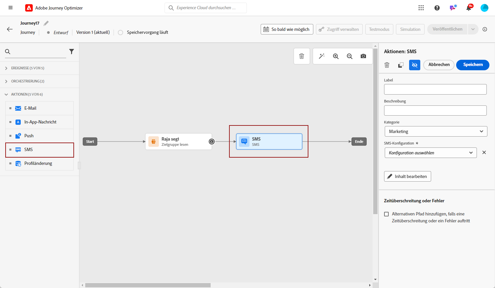

# Erstellen einer SMS-/MMS-/RCS-Nachricht {#create-sms}

>[!CONTEXTUALHELP]
>id="ajo_message_sms"
>title="Erstellen einer Textnachricht"
>abstract="Um eine Textnachricht (SMS/MMS/RCS) zu erstellen, fügen Sie eine SMS-Aktion in eine Journey oder eine Kampagne ein und beginnen Sie, diese mit dem Personalisierungseditor zu personalisieren."

>[!AVAILABILITY]
>
>RCS ist kein HIPAA-fähiger Service und darf nicht zur Erfassung, Speicherung oder Verarbeitung sensibler personenbezogener Daten verwendet werden, einschließlich zulässiger Gesundheitsdaten, z. B. persönlicher Gesundheitsinformationen, die Ihr Unternehmen ansonsten möglicherweise in Journey Optimizer verarbeiten darf.

Mit Adobe Journey Optimizer können Sie Text- (SMS), Rich Communication- (RCS) und Multimedia-Nachrichten (MMS) entwerfen und versenden. Sie müssen zunächst eine SMS-Aktion in eine Journey oder eine Kampagne einfügen und dann den Inhalt der Textnachricht definieren, wie unten beschrieben. Adobe Journey Optimizer bietet auch die Möglichkeit, Ihre Textnachrichten vor dem Versand zu testen, sodass Sie das Rendering, die Personalisierungsattribute und alle anderen Einstellungen überprüfen können.

In Übereinstimmung mit den Branchenstandards und -vorschriften müssen alle SMS/MMS-Marketing-Nachrichten eine Möglichkeit für die Empfängerinnen und Empfänger enthalten, ihr Abo einfach zu kündigen. Zu diesem Zweck können SMS-Empfänger mit Keywords zum Opt-in oder Opt-out antworten. [Informationen über die Verwaltung des Opt-outs](../privacy/opt-out.md#opt-out-decision-management)

## Hinzufügen einer Textnachricht {#create-sms-journey-campaign}

Auf den folgenden Registerkarten erfahren Sie, wie Sie einer Kampagne oder Journey eine Textnachricht (SMS/MMS/RCS) hinzufügen können.

>[!BEGINTABS]

>[!TAB Hinzufügen einer Textnachricht zu einer Journey]

1. Öffnen Sie Ihre Journey und ziehen Sie eine SMS-Aktivität aus dem Abschnitt **Aktionen** der Palette.

   

1. Geben Sie allgemeine Informationen (Label, Beschreibung, Kategorie) zu Ihrer Nachricht ein und wählen Sie dann die zu verwendende Konfiguration aus.

   

   Weitere Informationen zur Konfiguration der Journey finden Sie auf [dieser Seite](../building-journeys/journey-gs.md).

   Das Feld **[!UICONTROL Konfiguration]** ist standardmäßig mit der letzten Konfiguration für den Kanal vorausgefüllt, den die Benutzerin oder der Benutzer verwendet hat.

Sie können jetzt mit der Erstellung des Inhalts Ihrer SMS-Nachricht beginnen, indem Sie die Schaltfläche **[!UICONTROL Inhalt bearbeiten]** anklicken, wie unten beschrieben.

>[!TAB Hinzufügen einer Textnachricht zu einer Kampagne]

1. Rufen Sie das Menü **[!UICONTROL Kampagnen]** auf und klicken Sie auf **[!UICONTROL Kampagne erstellen]**.

1. Wählen Sie den Typ der Kampagne aus, die Sie ausführen möchten.

   * **Geplant – Marketing**: die Kampagne wird sofort oder an einem bestimmten Datum ausgeführt. Geplante Kampagnen dienen dem Versand von Marketing-Nachrichten. Sie werden über die Benutzeroberfläche konfiguriert und ausgeführt.

   * **API-ausgelöst – Marketing/Transaktion**: die Kampagne wird mithilfe eines API-Aufrufs ausgeführt.  Durch API ausgelöste Kampagnen zielen auf den Versand von Marketing- oder Transaktionsnachrichten ab, d. h. Nachrichten, die aufgrund einer von einem Kontakt durchgeführten Aktion gesendet werden: Zurücksetzen des Passworts, Warenkorbkauf usw.

1. Bearbeiten Sie im Bereich **[!UICONTROL Eigenschaften]** den **[!UICONTROL Titel]** und die **[!UICONTROL Beschreibung]** Ihrer Kampagne.

1. Klicken Sie auf die Schaltfläche **[!UICONTROL Zielgruppe auswählen]**, um die Zielgruppe aus der Liste der verfügbaren Adobe Experience Platform-Zielgruppen zu definieren. [Weitere Informationen](../audience/about-audiences.md).

1. Wählen Sie im Feld **[!UICONTROL Identity-Namespace]** den Namespace aus, der zur Identifizierung der Personen in der ausgewählten Zielgruppe verwendet werden soll. [Weitere Informationen](../event/about-creating.md#select-the-namespace).

1. Wählen Sie im Abschnitt **[!UICONTROL Aktionen]** die Option **[!UICONTROL In-SMS]** aus und wählen Sie eine Konfiguration aus oder erstellen Sie eine neue Konfiguration.

   Weitere Informationen zur SMS-Konfiguration finden Sie auf [dieser Seite](sms-configuration.md).

   

1. Klicken Sie auf **[!UICONTROL Experiment erstellen]**, um mit der Konfiguration Ihres Inhaltsexperiments zu beginnen und Abwandlungen zu erstellen, deren Performance zu messen und die beste Option für Ihre Zielgruppe zu ermitteln. [Weitere Informationen](../content-management/content-experiment.md)

1. Im Bereich **[!UICONTROL Tracking von Aktionen]** können Sie angeben, ob Sie Klicks auf Links in Ihrer SMS-Nachricht verfolgen möchten.

1. Kampagnen sind so konzipiert, dass sie an einem bestimmten Datum oder in regelmäßigen Abständen ausgeführt werden. Erfahren Sie in [diesem Abschnitt](../campaigns/campaign-schedule.md#action-campaign-schedule), wie Sie den **[!UICONTROL Zeitplan]** der Kampagne konfigurieren können.

1. Wählen Sie aus dem Menü **[!UICONTROL Aktions-Trigger]** die **[!UICONTROL Häufigkeit]** Ihrer SMS-Nachricht:

   * Einmal
   * Täglich
   * Wöchentlich
   * Monat

Sie können jetzt mit der Erstellung des Inhalts Ihrer Textnachricht beginnen, indem Sie die Schaltfläche **[!UICONTROL Inhalt bearbeiten]** anklicken, wie unten beschrieben.

>[!ENDTABS]

## Definieren Ihres SMS-/RCS-Inhalts{#sms-content}

>[!CONTEXTUALHELP]
>id="ajo_message_sms_content"
>title="Definieren Ihres SMS-Inhalts"
>abstract="Passen Sie Ihre Textnachrichten (SMS/MMS/RCS) mithilfe des Personalisierungseditors an und personalisieren Sie sie, indem Sie den Inhalt definieren und dynamische Elemente einfügen."

Gehen Sie wie folgt vor, um Ihren Nachrichteninhalt zu konfigurieren. Die Einstellungen für MMS-Nachrichten sind in [diesem Abschnitt](#mms-content) beschrieben.

1. Klicken Sie auf dem Bildschirm der Journey- oder Kampagnenkonfiguration auf die Schaltfläche **[!UICONTROL Inhalt bearbeiten]**, um den Inhalt der Textnachricht zu konfigurieren.

1. Klicken Sie auf das Feld **[!UICONTROL Nachricht]**, um den Personalisierungseditor zu öffnen.

   Fügen Sie für RCS-Messaging mit Infobip, Twilio oder anderen Drittanbietern die erforderliche JSON-Payload in Ihre [benutzerdefinierte SMS-Konfiguration](sms-configuration-custom.md#api-credential) ein.

   

1. Erzeugen Sie ansprechende Textnachrichten, die auf Ihre Zielgruppe zugeschnitten sind, mithilfe [KI-Assistenten für die Textgenerierung](../content-management/generative-text.md).

1. Verwenden Sie den Personalisierungseditor, um Inhalte zu definieren und Personalisierung sowie dynamischen Inhalt hinzuzufügen. Sie können jedes Attribut verwenden, wie etwa Profilname oder Stadt. Sie können auch bedingte Regeln definieren. Auf den folgenden Seiten erfahren Sie mehr über [Personalisierung](../personalization/personalize.md) und [dynamische Inhalte](../personalization/get-started-dynamic-content.md) im Personalisierungseditor.

1. Nach dem Definieren Ihres Inhalts können Sie das Verfolgen von URLs für Ihre Nachricht aktivieren. Rufen Sie dazu das Menü **[!UICONTROL Hilfsfunktionen]** auf und wählen Sie **[!UICONTROL Helfer]** aus.

   Um die Funktion der URL-Verkürzung zu verwenden, müssen Sie zunächst eine Subdomain konfigurieren, die dann mit Ihrer Konfiguration verknüpft wird. [Weitere Informationen](sms-subdomains.md)

   >[!NOTE]
   >
   > Um auf SMS-Subdomains zuzugreifen und sie zu bearbeiten, benötigen Sie die Berechtigung zum **[!UICONTROL Verwalten von SMS-Subdomains]** für die Produktions-Sandbox. Weitere Informationen zu Berechtigungen finden Sie in [diesem Abschnitt](../administration/high-low-permissions.md).

   

1. Klicken Sie innerhalb des Menüs **[!UICONTROL Hilfsfunktionen]** auf **[!UICONTROL URL-Funktion]** und wählen Sie dann **[!UICONTROL URL hinzufügen]** aus.

   

   <!--The URL shortening function cannot be used within a fragment. TBC-->

1. Fügen Sie in das Feld `originalUrl` die URL ein, die gekürzt werden soll, und klicken Sie auf **[!UICONTROL Speichern]**.

   >[!CAUTION]
   >
   > Die Lebensdauer kurzer URLs ist auf 30 Tage festgelegt. Nach diesem Zeitraum sind diese kurzen URLs nicht mehr zugänglich und zeigen die folgende Meldung an: `404 short-code not found`.

1. Klicken Sie auf **[!UICONTROL Speichern]** und überprüfen Sie Ihre Nachricht in der Vorschau. Sie können nun den Inhalt Ihrer Nachricht testen und überprüfen, wie in [diesem Abschnitt](#sms-mms-test) beschrieben.

## Definieren Ihrer MMS-Inhalte{#mms-content}

Sie können Ihre Kommunikation verbessern, indem Sie MMS-Nachrichten (Multimedia Message Service) versenden, was das Weitergeben von Medien wie Videos, Fotos, Audioclips, GIFs und vielem mehr ermöglicht. Außerdem können Sie mit MMS bis zu 1.600 Zeichen Text in Ihre Nachricht einfügen.

>[!NOTE]
>
> Der MMS-Kanal ist mit einigen Einschränkungen verbunden, die auf [dieser Seite](../start/guardrails.md#sms-guardrails) aufgeführt sind.

Gehen Sie wie folgt vor, um MMS-Inhalte zu erstellen:

1. Erstellen Sie eine SMS wie in [diesem Abschnitt](#create-sms-journey-campaign) beschrieben.

1. Bearbeiten Sie Ihren SMS-Inhalt wie in [diesem Abschnitt](#sms-content) beschrieben.

1. Aktivieren Sie die MMS-Option, um Medien zu Ihrem SMS-Inhalt hinzuzufügen.

   

1. Fügen Sie einen **[!UICONTROL Titel]** zu Ihrem Medium hinzu.

1. Geben Sie die URL des Mediums in das Feld **[!UICONTROL Medien]** ein.

   

1. Klicken Sie auf **[!UICONTROL Speichern]** und überprüfen Sie Ihre Nachricht in der Vorschau. Sie können nun den Inhalt Ihrer Nachricht wie unten beschrieben testen und überprüfen.

## Testen und senden Ihrer Nachrichten {#sms-mms-test}

Verwenden Sie die Schaltfläche **[!UICONTROL Inhalt simulieren]**, um eine Vorschau des Inhalts Ihrer Textnachrichten, der gekürzten URLs und der personalisierten Inhalte anzuzeigen.

Sobald Sie Ihre Tests durchgeführt und den Inhalt validiert haben, können Sie Ihre Textnachricht an Ihre Zielgruppe senden. Diese Schritte werden auf [dieser Seite](send-sms.md) im Detail beschrieben.

Nach dem Versand können Sie die Wirkung Ihrer SMS in den Kampagnen- oder Journey-Berichten messen. Weiterführende Informationen zum Reporting finden Sie in [diesem Abschnitt](../reports/campaign-global-report-cja-sms.md).

**Verwandte Themen**

* [Vorschau, Test und Versand Ihrer Textnachricht](send-sms.md)
* [Konfigurieren des SMS-Kanals](sms-configuration.md)
* [SMS- und MMS-Berichte](../reports/journey-global-report-cja-sms.md)
* [Hinzufügen einer Nachricht zu einer Journey](../building-journeys/journeys-message.md)
* [Hinzufügen einer Nachricht in einer Kampagne](../campaigns/create-campaign.md)
