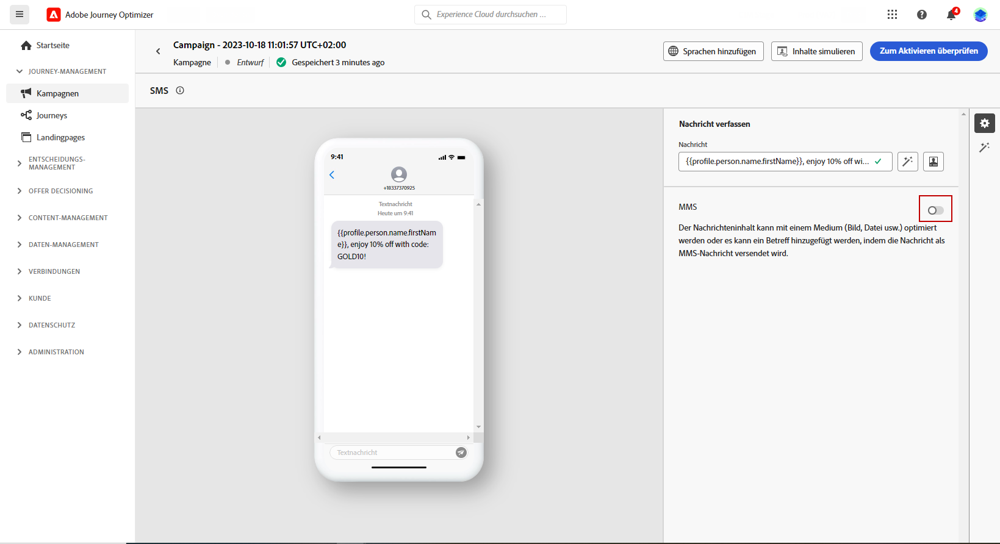
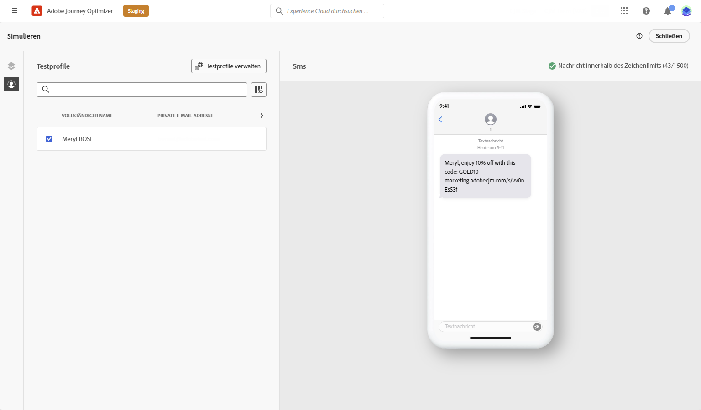

# Textnachrichten erstellen (SMS/MMS){#create-sms}

>[!CONTEXTUALHELP]
>id="ajo_message_sms"
>title="Textnachrichten erstellen"
>abstract="Um eine Textnachricht (SMS/MMS) zu erstellen, fügen Sie eine SMS-Aktion in eine Journey oder Kampagne hinzu und personalisieren Sie sie mit dem Ausdruckseditor."

Mit Adobe Journey Optimizer können Sie Text- (SMS) und Multimedia-Nachrichten (MMS) erstellen und versenden. Zunächst müssen Sie eine SMS-Aktion zu einer Journey oder Kampagne hinzufügen und dann den Inhalt der Textnachricht wie unten beschrieben definieren. Adobe Journey Optimizer bietet außerdem Funktionen zum Testen Ihrer Textnachrichten vor dem Versand, sodass Sie das Rendering, die Personalisierungsattribute und alle anderen Einstellungen überprüfen können.

>[!NOTE]
>
>In Übereinstimmung mit den Branchenstandards und -vorschriften müssen alle SMS/MMS-Marketingnachrichten eine Möglichkeit enthalten, mit der sich die Empfänger einfach abmelden können. Zu diesem Zweck können SMS-Empfänger mit Keywords zum Opt-in oder Opt-out antworten. [Informationen über die Verwaltung des Opt-outs](../privacy/opt-out.md#sms-opt-out-management-sms-opt-out-management)

## Textnachrichten hinzufügen {#create-sms-journey-campaign}

Auf den folgenden Registerkarten erfahren Sie, wie Sie eine Textnachricht (SMS/MMS) zu einer Kampagne oder Journey hinzufügen.

>[!BEGINTABS]

>[!TAB Textnachrichten zu einer Journey hinzufügen]

1. Öffnen Sie Ihre Journey und ziehen Sie eine SMS-Aktivität aus dem Abschnitt **Aktionen** der Palette.

   

1. Geben Sie allgemeine Informationen (Titel, Beschreibung, Kategorie) zu Ihrer Nachricht ein und wählen Sie dann die zu verwendende Nachrichtenoberfläche aus.

   

   Weitere Informationen zur Konfiguration der Journey finden Sie auf [dieser Seite](../building-journeys/journey-gs.md).

   Das Feld **[!UICONTROL Oberfläche]** ist standardmäßig mit der letzten Oberfläche für den Kanal vorausgefüllt, den die Benutzerin oder der Benutzer verwendet hat.

Sie können jetzt mit der Erstellung des Inhalts Ihrer SMS-Nachricht über die **[!UICONTROL Inhalt bearbeiten]** wie unten beschrieben.

>[!TAB Eine Textnachricht zu einer Kampagne hinzufügen]

1. Erstellen Sie eine neue geplante oder durch eine API ausgelöste Kampagne. Wählen Sie **[!UICONTROL SMS]** als Aktion und anschließend die **[!UICONTROL Anwendungsoberfläche]**, die verwendet werden soll. Weitere Informationen zur SMS-Konfiguration in [diese Seite](sms-configuration.md).

   

1. Klicken Sie auf **[!UICONTROL Erstellen]**.

1. Bearbeiten Sie im Bereich **[!UICONTROL Eigenschaften]** den **[!UICONTROL Titel]** und die **[!UICONTROL Beschreibung]** Ihrer Kampagne.

   

1. Klicken Sie auf die Schaltfläche **[!UICONTROL Zielgruppe auswählen]**, um die Zielgruppe aus der Liste der verfügbaren Adobe Experience Platform-Zielgruppen zu definieren. [Weitere Informationen](../audience/about-audiences.md).

1. Wählen Sie im Feld **[!UICONTROL Identity-Namespace]** den Namespace aus, der zur Identifizierung der Personen in der ausgewählten Zielgruppe verwendet werden soll. [Weitere Informationen](../event/about-creating.md#select-the-namespace).

   

1. Klicken Sie auf **[!UICONTROL Experiment erstellen]**, um mit der Konfiguration Ihres Inhaltsexperiments zu beginnen und Abwandlungen zu erstellen, deren Leistung zu messen und die beste Option für Ihre Zielgruppe zu ermitteln. [Weitere Informationen](../campaigns/content-experiment.md)

1. Im Bereich **[!UICONTROL Tracking von Aktionen]** können Sie angeben, ob Sie Klicks auf Links in Ihrer SMS-Nachricht verfolgen möchten.

1. Kampagnen sind so konzipiert, dass sie an einem bestimmten Datum oder in regelmäßigen Abständen ausgeführt werden. Erfahren Sie in [diesem Abschnitt](../campaigns/create-campaign.md#schedule), wie Sie den **[!UICONTROL Zeitplan]** der Kampagne konfigurieren können.

1. Wählen Sie aus dem Menü **[!UICONTROL Aktions-Trigger]** die **[!UICONTROL Häufigkeit]** Ihrer SMS-Nachricht:

   * Einmal
   * Täglich
   * Wöchentlich
   * Monat

Sie können jetzt mit der Erstellung des Inhalts Ihrer Textnachricht über die **[!UICONTROL Inhalt bearbeiten]** wie unten beschrieben.

>[!ENDTABS]

## Definieren Ihres SMS-Inhalts{#sms-content}

>[!CONTEXTUALHELP]
>id="ajo_message_sms_content"
>title="Definieren Ihres SMS-Inhalts"
>abstract="Passen Sie Ihre Textnachrichten (SMS/MMS) mithilfe des Ausdruckseditors an und personalisieren Sie sie, indem Sie den Inhalt definieren und dynamische Elemente einfügen."

Gehen Sie wie folgt vor, um Ihren SMS-Inhalt zu konfigurieren. Die Einstellungen für MMS werden im Abschnitt [diesem Abschnitt](#mms-content).

1. Klicken Sie im Konfigurationsbildschirm von Journey oder Kampagne auf die Schaltfläche **[!UICONTROL Inhalt bearbeiten]** Schaltfläche zum Konfigurieren des Inhalts der Textnachricht.

1. Klicken Sie auf das Feld **[!UICONTROL Nachricht]**, um den Ausdruckseditor zu öffnen.

   

1. Verwenden Sie den Ausdruckseditor, um Inhalte zu definieren, Personalisierungen und dynamische Inhalte hinzuzufügen. Sie können jedes beliebige Attribut verwenden, z. B. den Profilnamen oder die Stadt. Sie können auch bedingte Regeln definieren. Auf den folgenden Seiten erfahren Sie mehr über [Personalisierung](../personalization/personalize.md) und [dynamischer Inhalt](../personalization/get-started-dynamic-content.md) im Ausdruckseditor.

1. Nach der Definition Ihres Inhalts können Sie Ihrer Nachricht getrackte URLs hinzufügen. Rufen Sie dazu das Menü **[!UICONTROL Hilfsfunktionen]** auf und wählen Sie **[!UICONTROL Helfer]** aus.

   Beachten Sie, dass Sie zur Verwendung der URL-Kürzungsfunktion zunächst eine Subdomain konfigurieren müssen, die dann mit Ihrer Oberfläche verknüpft wird. [Weitere Informationen](sms-subdomains.md)

   >[!CAUTION]
   >
   > Zum Zugreifen auf und Bearbeiten von SMS-Subdomains benötigen Sie die **[!UICONTROL Verwalten von SMS-Subdomains]** -Berechtigung für die Produktions-Sandbox. Weiterführende Informationen zu Berechtigungen finden Sie in [diesem Abschnitt](../administration/high-low-permissions.md).

   

1. Klicken Sie innerhalb des Menüs **[!UICONTROL Hilfsfunktionen]** auf **[!UICONTROL URL-Funktion]** und wählen Sie dann **[!UICONTROL URL hinzufügen]** aus.

   

1. Fügen Sie in das Feld `originalUrl` die URL ein, die gekürzt werden soll, und klicken Sie auf **[!UICONTROL Speichern]**.

1. Klicken Sie auf **[!UICONTROL Speichern]** und überprüfen Sie Ihre Nachricht in der Vorschau. Sie können jetzt Ihren Nachrichteninhalt wie in [diesem Abschnitt](#sms-mms-test).

## Definieren Ihrer MMS-Inhalte{#mms-content}

Sie können Ihre Kommunikation verbessern, indem Sie Multimedia Message Service (MMS)-Nachrichten versenden, um die Freigabe von Medien wie Videos, Bildern, Audio-Clips und GIF und mehr zu ermöglichen. Zusätzlich ermöglicht MMS bis zu 1600 Zeichen Text in Ihrer Nachricht.

>[!NOTE]
>
>* Diese Funktion ist derzeit mit **Sinch** nur.
>
>* Der MMS-Kanal weist einige Einschränkungen auf, die unter [diese Seite](../start/guardrails.md#sms-guardrails).
>

Gehen Sie wie folgt vor, um MMS-Inhalte zu erstellen:

1. Erstellen Sie eine SMS wie in [diesem Abschnitt](#create-sms-journey-campaign).

1. Bearbeiten Sie den SMS-Inhalt wie im Abschnitt [diesem Abschnitt](#sms-content).

1. Aktivieren Sie die MMS-Option, um Medien zu Ihrem SMS-Inhalt hinzuzufügen.

   

1. Fügen Sie einen **[!UICONTROL Titel]** zu Ihrem Medium hinzu.

1. Geben Sie die URL des Mediums in das Feld **[!UICONTROL Medien]** ein.

   

1. Klicken Sie auf **[!UICONTROL Speichern]** und überprüfen Sie Ihre Nachricht in der Vorschau. Jetzt können Sie Ihren Nachrichteninhalt wie unten beschrieben testen und überprüfen.

## Nachrichten testen und senden {#sms-mms-test}

Verwenden Sie die **[!UICONTROL Inhalt simulieren]** -Schaltfläche, um eine Vorschau des Textinhalts, gekürzter URLs und personalisierten Inhalts anzuzeigen.

Nachdem Sie Ihre Tests durchgeführt und den Inhalt validiert haben, können Sie Ihre Textnachricht an Ihre Audience senden. Diese Schritte werden im Abschnitt [diese Seite](send-sms.md)

Nach dem Versand können Sie die Wirkung Ihrer SMS in den Kampagnen- oder Journey-Berichten messen. Weiterführende Informationen zum Reporting finden Sie in [diesem Abschnitt](../reports/campaign-global-report.md#sms-tab).

**Verwandte Themen**

* [Vorschau, Test und Versand Ihrer Textnachricht](send-sms.md)
* [Konfigurieren des SMS-Kanals](sms-configuration.md)
* [SMS/MMS-Berichte](../reports/journey-global-report.md#sms-global)
* [Hinzufügen einer Nachricht zu einer Journey](../building-journeys/journeys-message.md)
* [Hinzufügen einer Nachricht in einer Kampagne](../campaigns/create-campaign.md)
