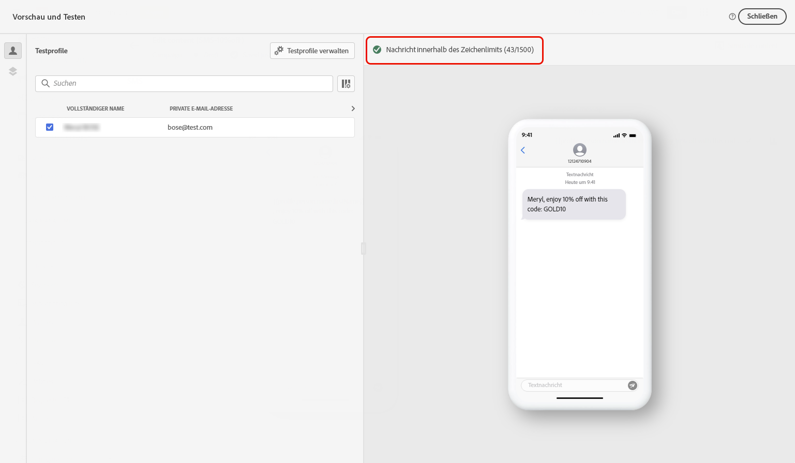
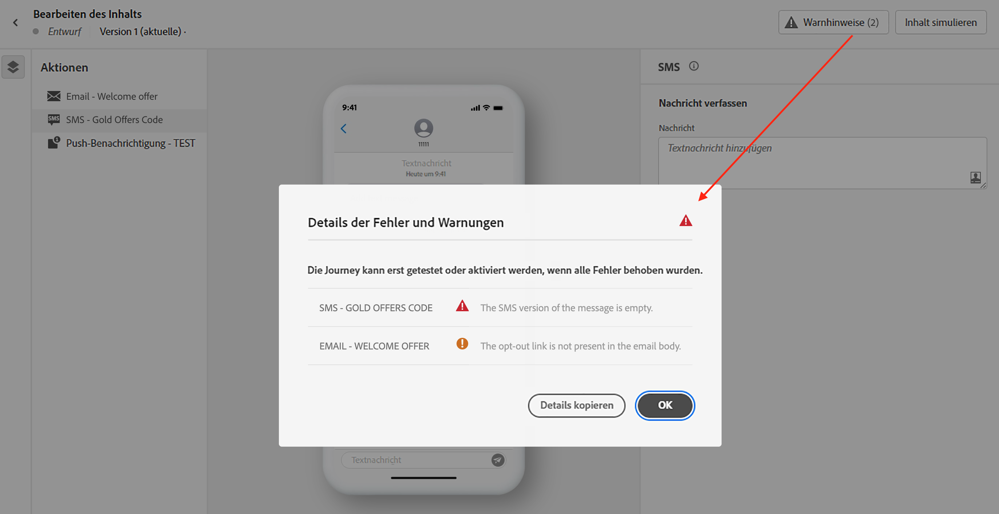

# Vorschau und Test Ihrer SMS-Nachricht {#send-sms}

## Vorschau Ihrer SMS-Nachricht {#preview-sms}

Sobald der Inhalt der Nachricht erstellt wurde, können Sie mithilfe von Testprofilen eine Vorschau erstellen und einen Testversand durchführen. Wenn Sie personalisierten Inhalt eingefügt haben, können Sie mithilfe von Testprofildaten überprüfen, wie dieser Inhalt in der Nachricht angezeigt wird.

1. Klicken Sie auf **[!UICONTROL Inhalt simulieren]**.

1. Klicken Sie auf **[!UICONTROL Testprofile verwalten]**, um ein Testprofil hinzuzufügen.

1. Suchen Sie Ihr Testprofil mit den Feldern **[!UICONTROL Identity-Namespace]** und **[!UICONTROL Identitätswert]**. Klicken Sie anschließend auf **[!UICONTROL Profil hinzufügen]**.

   

1. Nachdem Sie Ihr Testprofil ausgewählt haben, können Sie das Fenster **[!UICONTROL Testprofil hinzufügen]** schließen.

1. Im Fenster **Vorschau und Test** werden die Daten des Testprofils zum Inhalt der Nachricht hinzugefügt.

   

## Validieren Ihrer SMS{#sms-validate}

Sie müssen die Warnmeldungen im oberen Bereich des Editors überprüfen. Einige davon sind einfache Warnungen, aber andere können Sie daran hindern, die Nachricht zu senden. Es gibt zwei Arten von Warnungen: Warnungen und Fehler.

* **Warnhinweise** geben Hinweise auf Empfehlungen und zeigen Best Practices. So wird beispielsweise eine Warnmeldung angezeigt, wenn Ihre SMS-Nachricht leer ist.

* **Fehler** hindern Sie daran, die Journey zu testen oder zu aktivieren oder die Kampagne zu veröffentlichen, bis sie behoben sind. Eine Fehlermeldung warnt Sie zum Beispiel, wenn die Betreffzeile fehlt.

>[!NOTE]
>
> Um die Zustellbarkeit zu verbessern, verwenden Sie die Telefonnummern in den vom Anbieter unterstützten Formaten. Beispielsweise unterstützen Twilio und Sinch nur Telefonnummern im E.164-Format.

## Senden Ihrer SMS-Nachricht{#sms-send}

Wenn Ihre SMS-Nachricht fertig ist, konfigurieren Sie Ihre [Journey](../building-journeys/journey-gs.md) oder [Kampagne](../campaigns/create-campaign.md), um sie zu versenden.

**Verwandte Themen**

* [Konfigurieren des SMS-Kanals](sms-configuration.md)
* [SMS-Bericht](../reports/journey-global-report.md#sms-global)
* [Erstellen einer SMS-Nachricht](create-sms.md)
* [Hinzufügen einer Nachricht zu einer Journey](../building-journeys/journeys-message.md)
