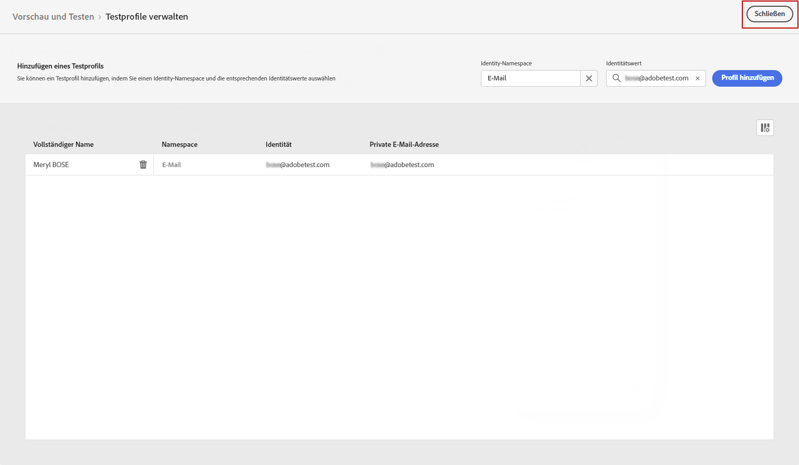

# SMS senden {#send-sms}

## SMS-Vorschau {#preview-sms}

Sobald der Nachrichteninhalt definiert wurde, können Sie mithilfe von Testprofilen die Vorschau anzeigen und testen. Wenn Sie personalisierten Inhalt eingefügt haben, können Sie mithilfe von Testprofildaten prüfen, wie dieser Inhalt in der Nachricht dargestellt wird.

1. Klicken **[!UICONTROL Simulate content]**.

1. Klicken **[!UICONTROL Manage test profiles]** , um ein Testprofil hinzuzufügen.

1. Suchen Sie Ihr Testprofil mit dem **[!UICONTROL Identity namespace]** und **[!UICONTROL Identity value]** -Felder. Klicken Sie anschließend auf **[!UICONTROL Add profile]**.

   

1. Nachdem Sie Ihr Testprofil ausgewählt haben, können Sie die **[!UICONTROL Add test profile]** Fenster.

   

1. Im Fenster Vorschau &amp; Test werden Testprofildaten im Nachrichteninhalt verwendet.

   Beispielsweise sind für diese SMS-Nachricht beide Nachrichteninhalte personalisiert:

   

## SMS validieren{#sms-preview}

>[!NOTE]
>
> Für eine bessere Zustellbarkeit sollten Sie stets die Telefonnummern in den vom Provider unterstützten Formaten verwenden. Beispielsweise unterstützen Twilio und Sinch nur Telefonnummern im E.164-Format.

Sie müssen Warnhinweise auch im oberen Bereich des Editors überprüfen.  Bei einigen handelt es sich um einfache Warnungen, andere können Sie jedoch daran hindern, die Nachricht zu verwenden. Es können zwei Arten von Warnhinweisen auftreten:

* **Warnungen** Siehe Empfehlungen und Best Practices. Beispielsweise wird eine Nachricht angezeigt, wenn Ihre SMS leer ist.

* **Fehler** verhindern, dass Sie die Journey testen oder aktivieren, solange sie nicht aufgelöst wurde. Beispielsweise werden Sie in einer Nachricht darauf hingewiesen, dass die Betreffzeile fehlt.

Wenn Ihre SMS fertig ist, konfigurieren Sie Ihre [Journey](../building-journeys/journey-gs.md) oder [Kampagne](../campaigns/create-campaign.md) , um es zu versenden.

**Verwandte Themen**

* [SMS-Kanal konfigurieren](sms-configuration.md)
* [SMS-Bericht](../reports/journey-global-report.md#sms-global)
* [SMS erstellen](create-sms.md)
* [Hinzufügen einer Nachricht in einer Journey](../building-journeys/journeys-message.md)
