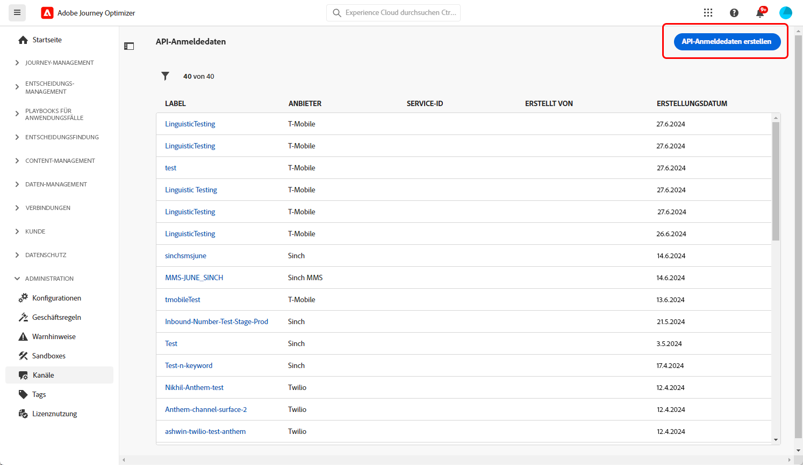
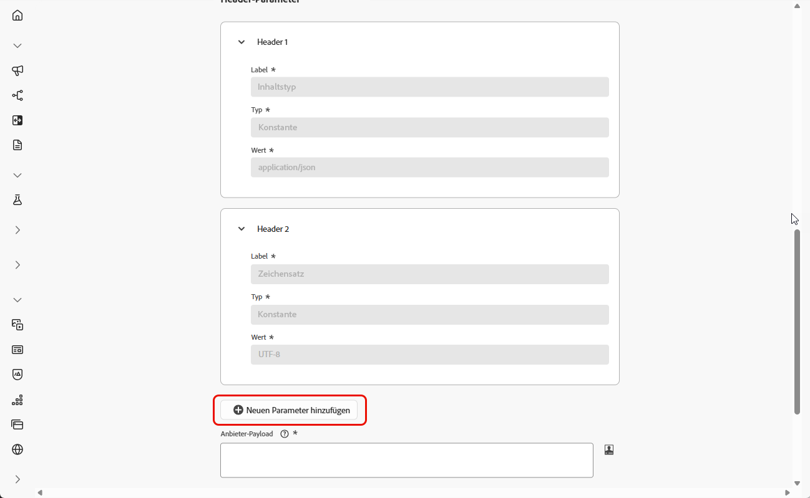
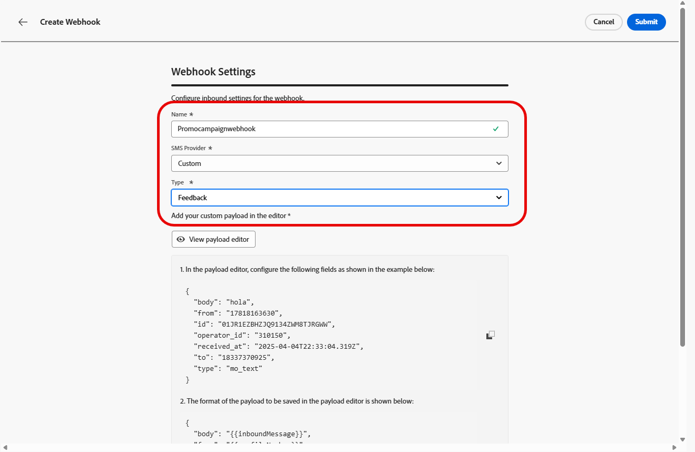
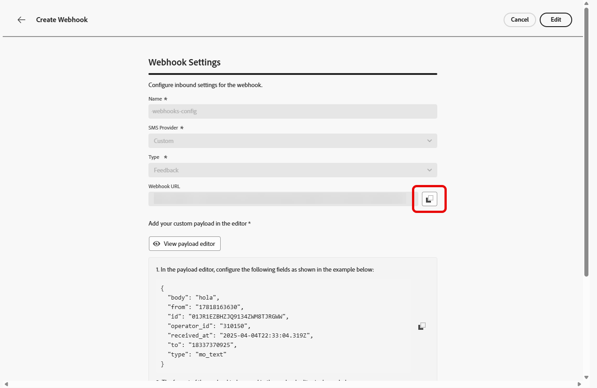

# Konfigurieren eines benutzerdefinierten Anbieters {#sms-configuration-custom}

>[!CONTEXTUALHELP]
>id="ajo_admin_sms_api_byop_provider_url"
>title="Anbieter-URL"
>abstract="Geben Sie die URL des externen APIs an, zu dem eine Verbindung hergestellt werden soll. Diese URL dient als Endpunkt für den Zugriff auf die API-Funktionen."

>[!CONTEXTUALHELP]
>id="ajo_admin_sms_api_byop_header_parameters"
>title="Header-Parameter"
>abstract="Geben Sie Label, Typ und Wert zusätzlicher Header an, um eine ordnungsgemäße Authentifizierung, Inhaltsformatierung und effektive API-Kommunikation zu ermöglichen. "

>[!CONTEXTUALHELP]
>id="ajo_admin_sms_api_byop_provider_payload"
>title="Anbieter-Payload"
>abstract="Stellen Sie die Anfrage-Payload bereit, damit die korrekten Daten zur Verarbeitung und Antworterstellung gesendet werden."

Diese Funktion ermöglicht es Ihnen, Ihre eigenen Messaging-Anbieter zu integrieren und zu konfigurieren, und bietet Flexibilität über die Standardanbieter (Sinch, Twilio und Infobip) hinaus. Dadurch werden Erstellung, Versand, Reporting und Einverständnisverwaltung für SMS- und RCS-Nachrichten nahtlos möglich.

Über die Konfiguration benutzerdefinierter Anbieter können Sie Messaging-Services von Drittanbietern direkt in Journey Optimizer verbinden, Nachrichten-Payloads für dynamische Inhalte anpassen und Opt-in-/Opt-out-Voreinstellungen verwalten, um Compliance über SMS- und RCS-Kanäle hinweg sicherzustellen.

Gehen Sie wie folgt vor, um Ihren benutzerdefinierten Anbieter zu konfigurieren:

1. [Erstellen von API-Anmeldedaten](#api-credential)
1. [Erstellen eines Webhook](#webhook)
1. [Erstellen einer Kanalkonfiguration](sms-configuration-surface.md)
1. [Erstellen einer Journey oder Kampagne mit der SMS-Kanalaktion](create-sms.md)

## Erstellen von API-Anmeldedaten {#api-credential}

Gehen Sie wie folgt vor, um in Journey Optimizer SMS- und RCS-Nachrichten mit einem benutzerdefinierten Anbieter zu versenden, der nicht von Adobe vorkonfiguriert bereitgestellt wird (z. B. Sinch, Infobip, Twilio):

1. Navigieren Sie in der linken Leiste zu **[!UICONTROL Administration]** `>` **[!UICONTROL Kanäle]**, wählen Sie das Menü **[!UICONTROL API-Anmeldedaten]** unter **[!UICONTROL SMS-Einstellungen]** aus und klicken Sie auf die Schaltfläche **[!UICONTROL Neue API-Anmeldedaten erstellen]**.

   

1. Konfigurieren Sie Ihre SMS-API-Anmeldedaten wie unten beschrieben:

   * **[!UICONTROL SMS-Anbieter]**: Benutzerdefiniert.

   * **[!UICONTROL Name]**: Geben Sie einen Namen für Ihre API-Anmeldedaten ein.

   * **[!UICONTROL Anbieter-App-ID]**: Geben Sie die von Ihrem SMS-Anbieter bereitgestellte Anwendungs-ID ein.

   * **[!UICONTROL Anbietername]**: Geben Sie den Namen Ihres SMS-Anbieters ein.

   * **[!UICONTROL Anbieter-URL]**: Geben Sie die URL Ihres SMS-Anbieters ein.

   * **[!UICONTROL Authentifizierungstyp]**: Wählen Sie Ihren Autorisierungstyp aus und [füllen Sie die entsprechenden Felder](#auth-options) je nach der ausgewählten Authentifizierungsmethode aus.

     

1. Aktivieren Sie die Option **[!UICONTROL mTLS-Unterstützung]**, um sicherzustellen, dass sich sowohl der Client als auch der Server gegenseitig authentifizieren, bevor eine sichere Verbindung hergestellt wird.

   Um nur mTLS zu verwenden, wählen Sie die Option **[!UICONTROL Keine Authentifizierung]** aus der Dropdown-Liste **[!UICONTROL Authentifizierungstyp]** aus und aktivieren Sie dann die **[!UICONTROL mTLS-Unterstützung]**.

1. Klicken Sie im Abschnitt **[!UICONTROL Header]** auf **[!UICONTROL Neuen Parameter hinzufügen]**, um die HTTP-Header der Anfragenachricht anzugeben, die an den externen Service gesendet werden soll. 

   Die Header-Felder **Inhaltstyp** und **Charset** werden standardmäßig festgelegt und können nicht gelöscht werden.

   

1. Fügen Sie Ihre **[!UICONTROL Anbieter-Payload]** hinzu, um Ihre Anfrage-Payloads zu validieren und anzupassen.

   Bei RCS-Nachrichten wird diese Payload später beim [Gestalten des Inhalts](create-sms.md#sms-content) verwendet.

   >[!NOTE]
   >
   >Beim Konfigurieren eines benutzerdefinierten SMS-Anbieters mit einfacher oder Bearer-Authentifizierung müssen Sie den `authOption`-Parameter in die JSON-Payload einbeziehen. Außerdem muss die **Anbieter-Payload** auf die Vorlagenvariablen `{{fromNumber}}`, `{{toNumber}}` und `{{message}}` verweisen.

1. Wenn Sie die Konfiguration Ihrer API-Anmeldedaten abgeschlossen haben, klicken Sie auf **[!UICONTROL Senden]**.

1. Klicken Sie im Menü **[!UICONTROL API-Anmeldedaten]** auf den , um Ihre API-Anmeldedaten zu löschen.

   

1. Um vorhandene Anmeldedaten zu ändern, suchen Sie die gewünschten API-Anmeldedaten und klicken Sie auf die Option **[!UICONTROL Bearbeiten]**, um die erforderlichen Änderungen vorzunehmen.

   

1. Klicken Sie anhand Ihrer bestehenden API-Anmeldedaten auf **[!UICONTROL SMS-Verbindung überprüfen]**, um Ihre SMS-API-Anmeldedaten zu testen und zu überprüfen, indem Sie eine Beispielnachricht an ein bestimmtes Gerät senden.

1. Füllen Sie die Felder **Anzahl** und **Nachricht** aus und klicken Sie auf **[!UICONTROL Verbindung überprüfen]**.

   >[!IMPORTANT]
   >
   >Die Nachricht muss so strukturiert sein, dass sie mit dem Payload-Format des Anbieters übereinstimmt.

   

Nachdem Sie Ihre API-Anmeldedaten erstellt und konfiguriert haben, müssen Sie jetzt [die eingehenden Webhook-Einstellungen](#webhook) für SMS-Nachrichten erstellen.

### Authentifizierungsoptionen für benutzerdefinierte SMS-Anbieter {#auth-options}

>[!CONTEXTUALHELP]
>id="ajo_admin_sms_api_byop_auth_type"
>title="Authentifizierungstyp"
>abstract="Geben Sie die Authentifizierungsmethode an, die für den Zugriff auf das API erforderlich ist. Dadurch wird eine sichere und autorisierte Kommunikation mit dem externen Dienst sichergestellt."

>[!BEGINTABS]

>[!TAB API-Schlüssel]

Nachdem Sie Ihre API-Anmeldedaten erstellt haben, füllen Sie die Felder aus, die für die API-Schlüsselauthentifizierung erforderlich sind:

* **[!UICONTROL Name]**: Geben Sie einen Namen für Ihre API-Schlüsselkonfiguration ein.
* **[!UICONTROL API-Token]**: Geben Sie das von Ihrem SMS-Anbieter bereitgestellte API-Token ein.

>[!TAB MAC-Authentifizierung]

Nachdem Sie Ihre API-Anmeldedaten erstellt haben, füllen Sie die Felder aus, die für die MAC-Authentifizierung erforderlich sind:

* **[!UICONTROL Name]**: Geben Sie einen Namen für Ihre MAC-Authentifizierungskonfiguration ein.
* **[!UICONTROL API-Token]**: Geben Sie das von Ihrem SMS-Anbieter bereitgestellte API-Token ein.
* **[!UICONTROL API-Geheimschlüssel]**: Geben Sie den von Ihrem SMS-Anbieter bereitgestellten API-Geheimschlüssel ein. Dieser Schlüssel wird verwendet, um den MAC (Nachrichtenauthentifizierungs-Code) für eine sichere Kommunikation zu generieren.
* **[!UICONTROL Hash-Format für Mac-Autorisierung]**: Wählen Sie das Hash-Format für die MAC-Authentifizierung.

>[!TAB OAuth 2-Authentifizierung]

Nachdem Sie Ihre API-Anmeldedaten erstellt haben, füllen Sie die Felder aus, die für die OAuth-Authentifizierung erforderlich sind:

* **[!UICONTROL Name]**: Geben Sie einen Namen für Ihre OAuth-Authentifizierungskonfiguration ein.

* **[!UICONTROL API-Token]**: Geben Sie das von Ihrem SMS-Anbieter bereitgestellte API-Token ein.

* **[!UICONTROL OAuth-URL]**: Geben Sie die URL zum Abrufen des OAuth-Tokens ein.

* **[!UICONTROL OAuth-Text]**: Stellen Sie den OAuth-Anfragetext im JSON-Format bereit, einschließlich Parametern wie `grant_type`, `client_id` und `client_secret`.

>[!TAB JWT-Authentifizierung]

Nachdem Sie Ihre API-Anmeldedaten erstellt haben, füllen Sie die Felder aus, die für die JWT-Authentifizierung erforderlich sind:

* **[!UICONTROL Name]**: Geben Sie einen Namen für Ihre JWT-Authentifizierungskonfiguration ein.

* **[!UICONTROL API-Token]**: Geben Sie das von Ihrem SMS-Anbieter bereitgestellte API-Token ein.

* **[!UICONTROL JWT-Payload]**: Geben Sie die JSON-Payload ein, die die für das JWT erforderlichen Ansprüche enthält, z. B. Aussteller, Betreff, Zielgruppe und Gültigkeit.

>[!ENDTABS]

## Erstellen eines Webhook {#webhook}

>[!BEGINSHADEBOX]

Wenn keine Opt-in- oder Opt-out-Keywords angegeben werden, werden standardmäßige Einverständnisnachrichten verwendet, um den Datenschutz der Benutzenden zu berücksichtigen. Durch das Hinzufügen benutzerdefinierter Keywords werden die Standardwerte automatisch überschrieben.

**Standard-Keywords:**

* **Opt-in**: SUBSCRIBE, YES, UNSTOP, START, CONTINUE, RESUME, BEGIN
* **Opt-out**: STOP, QUIT, CANCEL, END, UNSUBSCRIBE, NO
* **Hilfe**: HELP.

>[!ENDSHADEBOX]

Nachdem Ihre API-Anmeldedaten erfolgreich erstellt wurden, können Sie jetzt Webhooks konfigurieren, um eingehende Antworten für die Verwaltung des Opt-in- und Opt-out-Einverständnisses zu erfassen und Versandberichte einschließlich Lesebestätigungen (sofern verfügbar) zu erhalten.

Beim Einrichten eines Webhooks können Sie seinen Zweck basierend auf dem Typ der Daten definieren, die Sie erfassen möchten:

* **[!UICONTROL Eingehend]**: Verwenden Sie diese Option, wenn Sie Einverständnisantworten wie Opt-ins oder Opt-outs und Benutzereinstellungen erfassen möchten.

* **[!UICONTROL Feedback]**: Wählen Sie diese Option aus, um Versand- und Interaktionsereignisse einschließlich Lesebestätigungen und Benutzerinteraktionen zu verfolgen, um Reporting und Analysen zu unterstützen.

>[!BEGINTABS]

>[!TAB Eingehend]

1. Navigieren Sie in der linken Leiste zu **[!UICONTROL Administration]** `>` **[!UICONTROL Kanäle]**, wählen Sie das Menü **[!UICONTROL SMS-Webhooks]** unter **[!UICONTROL SMS-Einstellungen]** aus und klicken Sie auf die Schaltfläche **[!UICONTROL Webhook erstellen]**.

   

1. Konfigurieren Sie Ihre Webhook-Einstellungen wie unten beschrieben:

   * **[!UICONTROL Name]**: Geben Sie einen Namen für Ihren Webhook ein.

   * **[!UICONTROL SMS-Anbieter auswählen]**: Benutzerdefiniert.

   * **[!UICONTROL Typ]**: Eingehend.

   * **[!UICONTROL API-Anmeldedaten]**: Wählen Sie aus der Dropdown-Liste die [zuvor konfigurierten API-Anmeldedaten](#api-credential) aus.

   * **[!UICONTROL Absendertelefonnummer]**: Geben Sie die Telefonnummer der Absenderin bzw. des Absenders ein, die Sie für Ihre Nachrichten verwenden möchten.

     

1. Klicken Sie auf , um Ihre Keyword-Kategorien hinzuzufügen, und konfigurieren Sie sie dann wie folgt:

   * **[!UICONTROL Kategorie für eingehende Keywords]**: Wählen Sie für Ihre Keyword-Kategorien entweder **[!UICONTROL Opt-in]**, **[!UICONTROL Opt-out]**, **[!UICONTROL Double-Opt-in]**, **[!UICONTROL Hilfe]** oder **[!UICONTROL Benutzerdefiniert]**.

   * **[!UICONTROL Keyword eingeben]**: Geben Sie die standardmäßigen oder benutzerdefinierten Keywords ein, durch die Ihre Nachricht automatisch ausgelöst wird. Klicken Sie auf , um mehrere Keywords hinzuzufügen.

     Verwenden Sie für **[!UICONTROL Benutzerdefiniertes Keyword]** nicht einverständnisbezogene Keywords für Batch-basierte Aktionen innerhalb einer Journey.

   * **[!UICONTROL Antwortnachricht]**: Wählen Sie aus der Dropdown-Liste die benutzerdefinierte Antwort aus, die automatisch gesendet wird.

   

1. Klicken Sie auf **[!UICONTROL Payload-Editor anzeigen]**, um Ihre Anfrage-Payloads zu validieren und anzupassen.

   Sie können Ihre Payload mithilfe von Profilattributen dynamisch personalisieren und mithilfe integrierter Hilfsfunktionen sicherstellen, dass genaue Daten zur Verarbeitung und Antworterstellung gesendet werden.

1. Wenn Sie die Konfiguration Ihres Webhook abgeschlossen haben, klicken Sie auf **[!UICONTROL Senden]**.

1. Klicken Sie im Menü **[!UICONTROL Webhooks]** auf , um Ihren Webhook zu löschen.

1. Um vorhandene Konfigurationen zu ändern, suchen Sie den gewünschten Webhook und klicken Sie auf die Option **[!UICONTROL Bearbeiten]**, um die erforderlichen Änderungen vorzunehmen.

1. Greifen Sie über Ihren zuvor gesendeten **[!UICONTROL Webhook]** auf Ihre neue **[!UICONTROL Webhook-URL]** zu und kopieren Sie sie.

   

Nachdem Sie die Einstellungen für „eingehend“ für den Webhook erstellt und konfiguriert haben, müssen Sie jetzt eine [Kanalkonfiguration](sms-configuration-surface.md) für SMS-Nachrichten erstellen. 

Nach der Konfiguration können Sie alle betriebsbereiten Kanalfunktionen wie Nachrichtenerstellung, Personalisierung, Linktracking und Reporting nutzen.

>[!TAB Feedback]

1. Navigieren Sie in der linken Leiste zu **[!UICONTROL Administration]** `>` **[!UICONTROL Kanäle]**, wählen Sie das Menü **[!UICONTROL SMS-Webhooks]** unter **[!UICONTROL SMS-Einstellungen]** aus und klicken Sie auf die Schaltfläche **[!UICONTROL Webhook erstellen]**.

   

1. Konfigurieren Sie Ihre Webhook-Einstellungen wie unten beschrieben:

   * **[!UICONTROL Name]**: Geben Sie einen Namen für Ihren Webhook ein.

   * **[!UICONTROL SMS-Anbieter auswählen]**: Benutzerdefiniert.

   * **[!UICONTROL Typ]**: Feedback.

   

1. Klicken Sie auf **[!UICONTROL Payload-Editor anzeigen]**, um Ihre Anfrage-Payloads zu validieren und anzupassen.

   Sie können Ihre Payload mithilfe von Profilattributen dynamisch personalisieren und mithilfe integrierter Hilfsfunktionen sicherstellen, dass genaue Daten zur Verarbeitung und Antworterstellung gesendet werden.

1. Wenn Sie die Konfiguration Ihres Webhook abgeschlossen haben, klicken Sie auf **[!UICONTROL Senden]**.

1. Klicken Sie im Menü **[!UICONTROL Webhooks]** auf , um Ihren Webhook zu löschen.

1. Um vorhandene Konfigurationen zu ändern, suchen Sie den gewünschten Webhook und klicken Sie auf die Option **[!UICONTROL Bearbeiten]**, um die erforderlichen Änderungen vorzunehmen.

1. Greifen Sie über Ihren zuvor gesendeten **[!UICONTROL Webhook]** auf Ihre neue **[!UICONTROL Webhook-URL]** zu und kopieren Sie sie.

   

Nachdem Sie die Einstellungen für „eingehend“ für den Webhook erstellt und konfiguriert haben, müssen Sie jetzt eine [Kanalkonfiguration](sms-configuration-surface.md) für SMS-Nachrichten erstellen. 

Nach der Konfiguration können Sie alle betriebsbereiten Kanalfunktionen wie Nachrichtenerstellung, Personalisierung, Linktracking und Reporting nutzen.

>[!ENDTABS]

## Anleitungsvideo {#video}

>[!VIDEO](https://video.tv.adobe.com/v/3431625)

