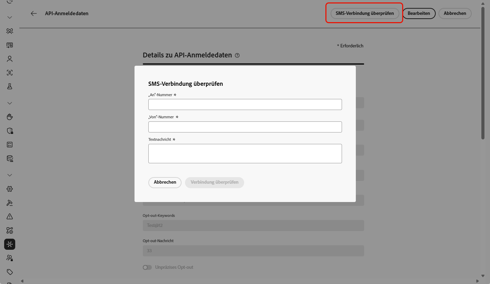

# Konfigurieren eines Sinch-Anbieters {#sms-configuration-sinch}

Wenn Sie den Sinch-Anbieter mit Journey Optimizer verwenden, können Sie zwischen drei verschiedenen Optionen wählen:

* **SMS-Konfiguration**: Richten Sie Ihre Sinch-API-Anmeldedaten ein, um nahtlos SMS-Nachrichten zu versenden.

* **MMS-Konfiguration**: Konfigurieren Sie für Multimedia Messaging (MMS) Ihre Sinch-MMS-API-Anmeldedaten. Beachten Sie, dass das Tracking und Beantworten von eingehenden Nachrichten über die SMS-Konfiguration erfolgt. Die MMS-Einrichtung ist nur für den ausgehenden Versand der MMS-Nachricht vorgesehen.

* **RCS-Konfiguration**: Richten Sie Ihre Sinch-API-Anmeldedaten ein, um nahtlos RCS-Nachrichten zu versenden.

## Konfigurieren von API-Anmeldedaten für SMS{#create-api}

>[!BEGINSHADEBOX]

Wenn keine Opt-in- oder Opt-out-Keywords angegeben werden, werden standardmäßige Einverständnisnachrichten verwendet, um den Datenschutz der Benutzenden zu berücksichtigen. Durch das Hinzufügen benutzerdefinierter Keywords werden die Standardwerte automatisch überschrieben.

**Standard-Keywords:**

* **Opt-in**: SUBSCRIBE, YES, UNSTOP, START, CONTINUE, RESUME, BEGIN
* **Opt-out**: STOP, QUIT, CANCEL, END, UNSUBSCRIBE, NO
* **Hilfe**: HELP.

>[!ENDSHADEBOX]

Gehen Sie wie folgt vor, um Ihren Sinch-Anbieter zum Senden von SMS-Nachrichten und MMS in Journey Optimizer zu konfigurieren:

1. Navigieren Sie in der linken Leiste zu **[!UICONTROL Administration]** > **[!UICONTROL Kanäle]** `>` **[!UICONTROL SMS-Einstellungen]** und wählen Sie das Menü **[!UICONTROL API-Anmeldedaten]**. Klicken Sie auf die Schaltfläche **[!UICONTROL Neue API-Anmeldedaten erstellen]**.

1. Konfigurieren Sie Ihre SMS-API-Anmeldedaten wie unten beschrieben:

   +++ Liste der SMS-Anmeldedaten für die Konfiguration

   | Konfigurationsfelder | Beschreibung |
   |---|---|    
   | SMS-Anbieter | Sinch |
   | Name | Wählen Sie einen Namen für Ihre API-Anmeldedaten. |
   | Service-ID und API-Token | Rufen Sie die API-Seite auf. Sie finden Ihre Anmeldedaten auf der Registerkarte „SMS“. Weitere Informationen finden Sie in der [Sinch-Dokumentation](https://developers.sinch.com/docs/sms/getting-started/){target="_blank"}. |
   | Opt-in-Keywords | Geben Sie die standardmäßigen oder benutzerdefinierten Keywords ein, durch die Ihre Opt-in-Nachricht automatisch ausgelöst wird. Verwenden Sie für mehrere Keywords kommagetrennte Werte. |
   | Opt-in-Nachricht | Geben Sie die benutzerdefinierte Antwort ein, die automatisch als Opt-in-Nachricht gesendet wird. |
   | Opt-out-Keywords | Geben Sie die standardmäßigen oder benutzerdefinierten Keywords ein, durch die Ihre Opt-out-Nachricht automatisch ausgelöst wird. Verwenden Sie für mehrere Keywords kommagetrennte Werte. |
   | Opt-out-Nachricht | Geben Sie die benutzerdefinierte Antwort ein, die automatisch als Opt-out-Nachricht gesendet wird. |
   | Hilfe-Keywords | Geben Sie die standardmäßigen oder benutzerdefinierten Keywords ein, durch die Ihre **Hilfenachricht** automatisch ausgelöst wird. Verwenden Sie für mehrere Keywords kommagetrennte Werte. |
   | Hilfenachricht | Geben Sie die benutzerdefinierte Antwort ein, die automatisch als **Hilfenachricht** gesendet wird. |
   | Double-Opt-in-Keywords | Geben Sie die Keywords ein, die den Double-Opt-in-Prozess auslösen. Wenn kein Benutzerprofil vorhanden ist, wird es nach erfolgreicher Bestätigung erstellt. Verwenden Sie für mehrere Keywords kommagetrennte Werte. [Erfahren Sie mehr über das SMS-Double-Opt-in](https://video.tv.adobe.com/v/3427129/?learn=on). |
   | Double-Opt-in-Nachricht | Geben Sie die benutzerdefinierte Antwort ein, die automatisch nach der Double-Opt-in-Bestätigung gesendet wird. |
   | Eingehende Nummer | Fügen Sie Ihre eindeutige eingehende Nummer oder Ihren eindeutigen Kurz-Code hinzu. Auf diese Weise können Sie dieselben API-Anmeldedaten für verschiedene Sandboxes verwenden, von denen jede über eine eigene eingehende Zahl oder einen eigenen Kurz-Code verfügt. |
   | Benutzerdefinierte eingehende Keywords | Definieren Sie eindeutige, nicht auf Einverständnis bezogene Keywords für Batch-basierte Aktionen, z. B. RABATT, ANGEBOTE, REGISTRIEREN. Diese Keywords werden als Attribute im Profil erfasst und gespeichert, sodass Sie eine Batch-Segmentqualifikation innerhalb der Journey auslösen und eine benutzerdefinierte Antwort oder Aktion bereitstellen können. |
   | Eingehende Standard-Antwortnachricht | Geben Sie die Standardantwort ein, die gesendet wird, wenn Endbenutzende eine eingehende SMS senden, die keinem der definierten Keywords entspricht. |
   | Überschreibungs-URL | Geben Sie Ihre benutzerdefinierte URL ein, um die Standard-Endpunkte für SMS-Versandberichte, Feedback-Daten, eingehende Nachrichten oder Ereignisbenachrichtigungen zu ersetzen. Sinch sendet alle relevanten Aktualisierungen an diese URL anstelle der vordefinierten. |

   +++

1. Aktivieren Sie die Option **[!UICONTROL Unpräzises Opt-out]**, um Nachrichten zu erkennen, die Opt-out-Schlüsselwörtern ähneln (z. B. „ABNELDEN“), und passen Sie die Bestätigungsantwort im Feld **[!UICONTROL Unpräzise automatische Antwort]** an.

   **[!UICONTROL Unpräzises Opt-out]** kennzeichnet SMS-Nachrichten, die darauf hinweisen, dass jemand das Abonnement kündigen möchte, auch wenn die Nachricht nicht genau mit einem definierten Keyword zum Abmelden übereinstimmt. Es kann häufig verwendete Opt-out-Phrasen und bestimmte anstößige Begriffe erkennen und sicherstellen, dass Ihre Kampagnen die Benutzerpräferenzen respektieren und die Regeln einhalten.

1. Wenn Sie die Konfiguration Ihrer API-Anmeldedaten abgeschlossen haben, klicken Sie auf **[!UICONTROL Senden]**.

1. Klicken Sie im Menü **[!UICONTROL API-Anmeldedaten]** auf das Papierkorbsymbol, um Ihre API-Anmeldedaten zu löschen.

1. Um vorhandene Anmeldedaten zu ändern, suchen Sie die gewünschten API-Anmeldedaten und klicken Sie auf die Option **[!UICONTROL Bearbeiten]**, um die erforderlichen Änderungen vorzunehmen.

1. Klicken Sie anhand Ihrer bestehenden API-Anmeldedaten auf **[!UICONTROL SMS-Verbindung überprüfen]**, um Ihre SMS-API-Anmeldedaten zu testen und zu überprüfen, indem Sie eine Beispielnachricht an ein bestimmtes Gerät senden.

1. Füllen Sie die Felder **Anzahl** und **Nachricht** aus und klicken Sie auf **[!UICONTROL Verbindung überprüfen]**.

   >[!IMPORTANT]
   >
   >Die Nachricht muss so strukturiert sein, dass sie mit dem Payload-Format des Anbieters übereinstimmt.

   

Nachdem Sie Ihre API-Anmeldedaten erstellt und konfiguriert haben, müssen Sie jetzt eine Kanalkonfiguration für SMS-Nachrichten erstellen.  [Weitere Informationen](sms-configuration-surface.md)

## Konfigurieren von API-Anmeldedaten für MMS{#sinch-mms}

>[!IMPORTANT]
>
> Neben der MMS-Einrichtung müssen Sie auch Sinch-API-Anmeldedaten speziell für das Tracking eingehender Nachrichten und die Verwaltung von Zustimmungsanfragen erstellen.

Gehen Sie wie folgt vor, um Sinch MMS mit Journey Optimizer für das Senden von MMS zu konfigurieren:

1. Navigieren Sie in der linken Leiste zu **[!UICONTROL Administration]** > **[!UICONTROL Kanäle]** `>` **[!UICONTROL SMS-Einstellungen]** und wählen Sie das Menü **[!UICONTROL API-Anmeldedaten]**. Klicken Sie auf die Schaltfläche **[!UICONTROL Neue API-Anmeldedaten erstellen]**.

1. Konfigurieren Sie Ihre MMS-API-Anmeldedaten, wie unten beschrieben.

   * **[!UICONTROL SMS-Anbieter]**: Sinch MMS.

   * **[!UICONTROL Name]**: Wählen Sie einen Namen für Ihre API-Anmeldedaten.

   * **[!UICONTROL Projekt-ID]**, **[!UICONTROL App-ID]** und **[!UICONTROL API-Token]**: Führen Sie die folgenden Schritte aus, um Ihre MMS-API-Anmeldeinformationen zu erfassen.

      * Für **[!UICONTROL Projekt-ID]** und **[!UICONTROL App-ID]**: Greifen Sie auf die Seite [Überblick über die Konversations-API](https://dashboard.sinch.com/convapi/overview) Ihres Sinch-Projekts in Ihrem Sinch-Dashboard zu.
      * Für **[!UICONTROL API-Token]**: Rufen Sie die [Zugriffsschlüssel](https://community.sinch.com/t5/Customer-Dashboard/Sinch-Access-Keys/ta-p/12638) für Ihr Sinch-Pojekt auf und generieren Sie einen **Base64-API-Token** aus den **Zugriffsschlüsseln** Ihres Sinch-Projekts.

1. Wenn Sie die Konfiguration Ihrer API-Anmeldedaten abgeschlossen haben, klicken Sie auf **[!UICONTROL Senden]**.

1. Klicken Sie im Menü **[!UICONTROL API-Anmeldedaten]** auf das Papierkorbsymbol, um Ihre API-Anmeldedaten zu löschen.

1. Um vorhandene Anmeldedaten zu ändern, suchen Sie die gewünschten API-Anmeldedaten und klicken Sie auf die Option **[!UICONTROL Bearbeiten]**, um die erforderlichen Änderungen vorzunehmen.

Nachdem Sie Ihre API-Anmeldedaten erstellt und konfiguriert haben, müssen Sie jetzt eine Kanalkonfiguration für MMS-Nachrichten erstellen.  [Weitere Informationen](sms-configuration-surface.md)

## Konfigurieren der API-Anmeldedaten für RCS

<!---->

RCS-Messaging (Rich Communication Services) wird in Journey Optimizer über Sinch unterstützt und ermöglicht den Versand von einfachen Nachrichten unter Verwendung verifizierter Geschäftsprofile mit Branding-Elementen wie Logos und Absendenamen.

Beachten Sie, dass Nachrichten automatisch über SMS gesendet werden, wenn das Gerät des Profils RCS nicht unterstützt oder über RCS vorübergehend unerreichbar ist.

<!--
### Basic RCS Messages

>[!AVAILABILITY]
>
> Basic RCS messages is only available upon Adobe RCS add-on offering.

1. **Set up your branded RCS agent**

    Create a branded RCS agent in the Sinch Dashboard. [Learn more on branded RCS agent](https://community.sinch.com/t5/RCS/Getting-Started-with-RCS-using-Conversation-API/ta-p/17844)

1. **Set up your [Custom API credentials](sms-configuration-custom.md)**
    
    Once your RCS agent is approved, you need to set up your Sinch API credentials, which include your access key, secret, and service plan ID. These credentials will be used by Journey Optimizer to authenticate and send messages through Sinch's platform.

1. **Create a [channel configuration](sms-configuration-surface.md) for your RCS messages**

    Configure a channel surface in Journey Optimizer by linking your Sinch credentials and defining the messaging parameters. This setup enables you to compose and send RCS messages from Journey Optimizer.

1. **Create and personalize your [SMS message](../sms/create-sms.md)**

    Your messages automatically falls back to SMS when the profile's device does not support RCS or is temporarily unreachable via RCS.
-->

### RCS-Multimedia-Nachrichten

>[!AVAILABILITY]
>
> Erweiterte RCS-Nachrichten sind nur mit einem von Sinch verwalteten Direktkonto verfügbar.

1. **Einrichten eines an Ihre Marke angepassten RCS-Agenten**

   Erstellen Sie im Sinch-Dashboard einen RCS-Agenten mit Branding. [Weitere Informationen zu an Marken angepassten RCS-Agenten](https://community.sinch.com/t5/RCS/Getting-Started-with-RCS-using-Conversation-API/ta-p/17844)

1. **Einrichten Ihrer [benutzerdefinierten API-Anmeldedaten](sms-configuration-custom.md)**

   Nachdem der RCS-Agent genehmigt wurde, müssen Sie Ihre benutzerdefinierten API-Anmeldedaten einrichten, die Ihre AppId, Name, URL und Authentifizierungstyp enthalten. 

1. **Konfigurieren Sie RCS mit der Anbieter-Payload.**

   Fügen Sie in Ihren [benutzerdefinierten API-Anmeldedaten](sms-configuration-custom.md) die Anbieter-Payload hinzu, um Ihre RCS-Nachrichten zu validieren und anzupassen.

1. **Erstellen einer [Kanalkonfiguration](sms-configuration-surface.md) für Ihre RCS-Nachrichten**

   Konfigurieren Sie eine Kanaloberfläche in Journey Optimizer, indem Sie Ihre Sinch-Anmeldedaten verknüpfen und die Messaging-Parameter definieren. Mit diesem Setup können Sie RCS-Nachrichten in Journey Optimizer erstellen und von dort aus senden.

1. **Erstellen und Personalisieren Ihrer [SMS-Nachricht](../sms/create-sms.md)**

   Fügen Sie Ihre Payload direkt in den SMS-Inhalt ein, um Ihre Rich Communication Services (RCS)-Nachrichten einzubetten und zu versenden.

   ➡️ [Erfahren Sie in der Sinch-Dokumentation, wie RCS von Sinch unterstützt wird](https://sinch.com/blog/rcs-api-guide/)

