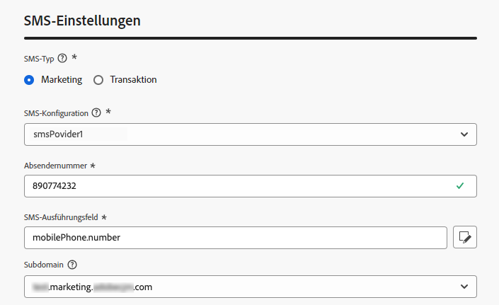

# Erstellen einer SMS/MMS/RCS-Konfiguration {#message-preset-sms}

>[!CONTEXTUALHELP]
>id="ajo_admin_surface_sms_type"
>title="Bestimmen der Nachrichtenkategorie"
>abstract="Wählen Sie über diese Konfiguration die Art der Textnachrichten aus: Marketing für Werbenachrichten, die die Zustimmung der Benutzenden erfordern, oder Transaktionsnachrichten für nicht-kommerzielle Nachrichten, wie z. B. das Zurücksetzen eines Passworts."
>additional-url="https://experienceleague.adobe.com/docs/journey-optimizer/using/privacy/consent/opt-out.html?lang=de#sms-opt-out-management" text="Abmeldung von Marketing-Textnachrichten"

Sobald Ihr SMS-/MMS-/RCS-Kanal konfiguriert wurde, müssen Sie eine Kanalkonfiguration erstellen, um SMS-, RCS- und MMS-Nachrichten von **[!DNL Journey Optimizer]** aus versenden zu können.

Gehen Sie wie folgt vor, um eine Kanalkonfiguration zu erstellen:

1. Navigieren Sie in der linken Leiste zu **[!UICONTROL Administration]** > **[!UICONTROL Kanäle]** und wählen Sie **[!UICONTROL Allgemeine Einstellungen]** > **[!UICONTROL Kanalkonfigurationen]**. Klicken Sie auf die Schaltfläche **[!UICONTROL Kanalkonfiguration erstellen]**.

   

1. Geben Sie einen Namen und eine Beschreibung (optional) für die Konfiguration ein und wählen Sie dann den SMS-Kanal aus.

   

   >[!NOTE]
   >
   > Namen müssen mit einem Buchstaben (A–Z) beginnen. Ein Name darf nur alphanumerische Zeichen enthalten. Sie können auch die Zeichen Unterstrich `_`, Punkt `.` und Bindestrich `-` verwenden.

1. Definieren Sie die **SMS-Einstellungen**.

   {width=80%}

   Wählen Sie zunächst den **[!UICONTROL SMS-Typ]** aus, der mit der Konfiguration gesendet werden soll: **[!UICONTROL Transaktion]** oder **[!UICONTROL Marketing]**.

   * Wählen Sie **Marketing** für Werbetextnachrichten aus. Diese Nachrichten erfordern das Einverständnis der Benutzerin bzw. des Benutzers.
   * Wählen Sie **Transaktion** für nicht-kommerzielle Nachrichten, wie z. B. Bestellbestätigungen, Benachrichtigungen beim Zurücksetzen des Kennworts oder Versandinformationen.

   Wenn Sie eine SMS-/MMS-Nachricht erstellen, müssen Sie eine gültige Kanalkonfiguration wählen, die der Kategorie entspricht, die Sie für Ihre Nachricht ausgewählt haben.

   >[!CAUTION]
   >
   >**Transaktions**-Nachrichten können auch an Profile gesendet werden, die sich von Marketing-Nachrichten abgemeldet haben. Diese Nachrichten können nur in bestimmten Kontexten gesendet werden.

1. Wählen Sie die **[!UICONTROL SMS-Konfiguration]** aus, um sie mit der Konfiguration zu verknüpfen.

   Weiterführende Informationen zur Konfiguration Ihrer Umgebung für den Versand von SMS-Nachrichten finden Sie in [diesem Abschnitt](#create-api).

1. Geben Sie die **[!UICONTROL Absendernummer]** ein, die Sie für Ihre Sendungen verwenden möchten.

1. Wenn Sie die URL-Verkürzungsfunktion in Ihren SMS-Nachrichten verwenden möchten, wählen Sie ein Element aus der Liste **[!UICONTROL Subdomain]** aus.

   >[!NOTE]
   >
   >Um eine Subdomain auswählen zu können, müssen Sie zuvor mindestens eine SMS/MMS-Subdomain konfiguriert haben. [Weitere Informationen](sms-subdomains.md)

1. Verwenden Sie im Abschnitt **[!UICONTROL Ausführungsdimension]** das Feld **[!UICONTROL SMS-Ausführung]**, um unter den Profilattributen die Telefonnummer auszuwählen, die Sie vorrangig verwenden möchten, wenn mehrere Zahlen in der Datenbank verfügbar sind. [Weitere Informationen](../configuration/primary-email-addresses.md#override-execution-address-channel-config)

   >[!NOTE]
   >
   >Standardmäßig verwendet [!DNL Journey Optimizer] die in den [allgemeinen Einstellungen](../configuration/primary-email-addresses.md) der Sandbox-Ebene angegebene Telefonnummer. Durch die Aktualisierung dieses Felds wird der Standardwert für die Journeys und Kampagnen überschrieben, die diese Konfiguration verwenden.

1. Nachdem alle Parameter konfiguriert wurden, klicken Sie zur Bestätigung auf **[!UICONTROL Senden]**. Sie können die Kanalkonfiguration auch als Entwurf speichern und ihre Konfiguration später fortsetzen.

   

1. Nachdem die Kanalkonfiguration erstellt wurde, wird sie in der Liste mit dem Status **[!UICONTROL Verarbeitung läuft]** angezeigt.

   >[!NOTE]
   >
   >In [diesem Abschnitt](../configuration/channel-surfaces.md) erfahren Sie mehr über die möglichen Fehlerursachen, wenn die Prüfungen nicht erfolgreich sind.

1. Sobald die Prüfungen erfolgreich abgeschlossen sind, erhält die Kanalkonfiguration den Status **[!UICONTROL Aktiv]**. Sie kann nun zum Versand von Nachrichten verwendet werden.

   

Sie können jetzt mit Journey Optimizer Textnachrichten senden.
