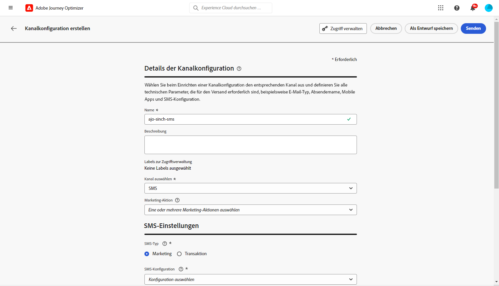
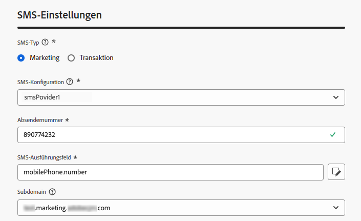
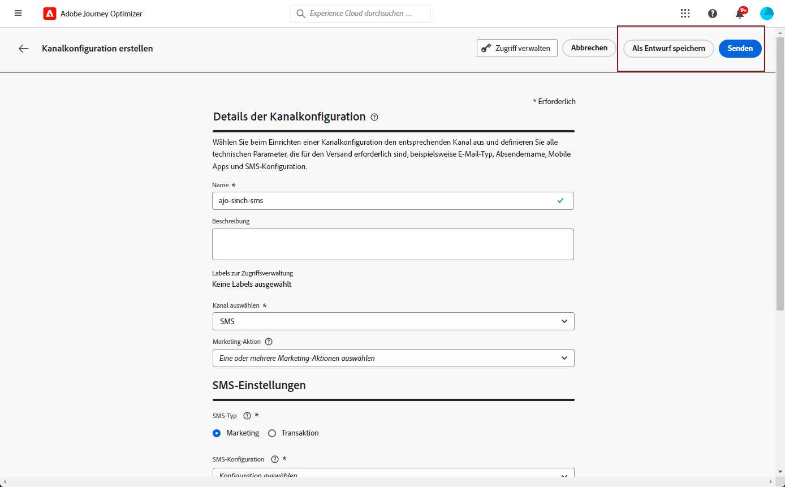

# Konfigurieren des SMS-Kanals {#sms-configuration}

Bevor Sie Ihre SMS oder MMS versenden, müssen Sie Ihre Adobe Journey Optimizer-Umgebung konfigurieren. Gehen Sie hierfür wie folgt vor:

* [Integrieren der Anbietereinstellungen](#create-api) mit Journey Optimizer
* [Erstellen einer SMS-Oberfläche](#message-preset-sms) (d. h. SMS-Voreinstellung), die auch für MMS verwendet wird

Diese Schritte müssen von Adobe Journey Optimizer-[Systemadmins](../start/path/administrator.md) durchgeführt werden.

## Voraussetzungen{#sms-prerequisites}

Adobe Journey Optimizer lässt sich derzeit mit Drittanbietern integrieren, die unabhängig von Adobe Journey Optimizer Textnachrichtendienste anbieten. Unterstützte Anbieter für Textnachrichten sind: **Sinch**, **Twilio** und **Infobip**. MMS wird nur mit **Sinch** unterstützt.

Vor der Konfiguration des SMS-Kanals müssen Sie bei einem dieser Anbieter ein Konto erstellen, um das **API-Token** und die **Service-ID** zu erhalten, über die Sie die Verbindung zwischen Adobe Journey Optimizer und dem entsprechenden Anbieter herstellen können.

Ihre Nutzung von Textnachrichten-Services unterliegt zusätzlichen Bedingungen des jeweiligen Anbieters. Als Lösungen von Drittanbietern stehen den Benutzerinnen und Benutzern von Adobe Journey Optimizer Sinch, Twilio und Infobip über eine Integration zur Verfügung. Adobe kontrolliert keine Produkte von Drittanbietern und ist nicht für diese verantwortlich. Wenden Sie sich bei Problemen oder Hilfeanfragen im Zusammenhang mit den Textnachrichtendiensten (SMS/MMS) an Ihren Anbieter.

>[!CAUTION]
>
>Um auf SMS-Subdomains zuzugreifen und sie zu bearbeiten, benötigen Sie die Berechtigung zum **[!UICONTROL Verwalten von SMS-Subdomains]** für die Produktions-Sandbox. Weitere Informationen zu technischen Workflows finden Sie auf [dieser Seite](../administration/high-low-permissions.md#administration-permissions).
>

## Erstellen neuer API-Anmeldeinformationen {#create-api}

>[!CONTEXTUALHELP]
>id="ajo_admin_sms_api_header"
>title="Konfigurieren eines SMS-Anbieters mit Journey Optimizer"
>abstract="Adobe Journey Optimizer versendet Textnachrichten über SMS-Dienstanbieter. Wählen Sie Ihren Anbieter aus und geben Sie Ihre API-Anmeldeinformationen ein."

>[!CONTEXTUALHELP]
>id="ajo_admin_mms_api_header"
>title="Konfigurieren Ihres MMS-Anbieters mit Journey Optimizer"
>abstract="Adobe Journey Optimizer versendet Medieninhalte über MMS-Dienstanbieter. Wählen Sie Ihren Anbieter aus und geben Sie Ihre API-Anmeldeinformationen ein."

>[!CONTEXTUALHELP]
>id="ajo_admin_sms_api"
>title="Konfigurieren eines SMS/MMS-Anbieters mit Journey Optimizer"
>abstract="Vor dem Versand von Textnachrichten (SMS/MMS) müssen Sie die Anbietereinstellungen in Journey Optimizer integrieren. Danach müssen Sie eine SMS/MMS-Oberfläche erstellen. Diese Schritte müssen von Adobe Journey Optimizer-Systemadmins durchgeführt werden."
>additional-url="https://experienceleague.adobe.com/docs/journey-optimizer/using/sms/sms-configuration.html?lang=de#message-preset-sms" text="Erstellen einer SMS-Kanaloberfläche"

>[!CONTEXTUALHELP]
>id="ajo_admin_sms_configuration"
>title="Wählen Sie die Konfiguration des SMS-Anbieters aus."
>abstract="Wählen Sie die für Ihren SMS-Anbieter konfigurierten API-Anmeldeinformationen aus."

Gehen Sie wie folgt vor, um Ihren SMS/MMS-Anbieter in Journey Optimizer zu konfigurieren:

1. Navigieren Sie in der linken Leiste zu **[!UICONTROL Administration]** > **[!UICONTROL Kanal]** und wählen Sie das Menü **[!UICONTROL API-Anmeldedaten]**. Klicken Sie auf die Schaltfläche **[!UICONTROL Neue API-Anmeldedaten erstellen]**.

   

1. Konfigurieren Sie Ihre SMS-API-Anmeldeinformationen, wie unten beschrieben.

   

   * +++ Für **[!DNL Sinch]**

      * **[!UICONTROL Name]**: Wählen Sie einen Namen für Ihre API-Anmeldedaten.

      * **[!UICONTROL Service-ID]** und **[!UICONTROL API-Token]**: Rufen Sie die API-Seite auf. Ihre Anmeldedaten finden Sie auf der Registerkarte „SMS“. Weitere Informationen finden Sie in der [Sinch-Dokumentation](https://developers.sinch.com/docs/sms/getting-started/){target="_blank"}.

      * **[!UICONTROL Opt-in-Nachricht]**: Geben Sie die benutzerdefinierte Antwort ein, die automatisch als **[!UICONTROL Opt-in-Nachricht]** gesendet wird.

      * **[!UICONTROL Opt-out-Nachricht]**: Geben Sie die benutzerdefinierte Antwort ein, die automatisch als Ihre **[!UICONTROL Opt-out-Nachricht]**.

      * **[!UICONTROL Hilfenachricht]**: Geben Sie die benutzerdefinierte Antwort ein, die automatisch als **Hilfenachricht** gesendet wird.

      * **[!UICONTROL Doppelte Opt-in-Suchbegriffe]**: Geben Sie die Suchbegriffe ein, die den doppelten Anmeldeprozess Trigger haben. Wenn kein Benutzerprofil vorhanden ist, wird es nach erfolgreicher Bestätigung erstellt. Verwenden Sie für mehrere Schlüsselwörter durch Kommas getrennte Werte.

      * **[!UICONTROL Anmeldung mit zweifacher Bestätigung]**: Geben Sie die benutzerdefinierte Antwort ein, die automatisch nach der Anmeldung mit zweifacher Bestätigung gesendet wird.
+++

   * +++ Für **[!DNL Sinch MMS]**

      * **[!UICONTROL Name]**: Wählen Sie einen Namen für Ihre API-Anmeldedaten.

      * **[!UICONTROL Projekt-ID]**, **[!UICONTROL App-ID]** und **[!UICONTROL API-Token]**: Im Menü „Konversations-API“ können Sie Ihre Anmeldedaten im App-Menü finden.  Weitere Informationen finden Sie in der [Sinch-Dokumentation](https://docs.cc.sinch.com/cloud/service-configuration/en/oxy_ex-1/common/wln1620131604643.html){target="_blank"}.

+++

   * +++ Für **[!DNL Twilio]**

      * **[!UICONTROL Name]**: Wählen Sie einen Namen für Ihre API-Anmeldedaten.

      * **[!UICONTROL Konto-SID]** und **[!UICONTROL Authentifizierungs-Token]**: Rufen Sie den Bereich mit den Kontoinformationen Ihrer Twilio Console-Dashboard-Seite auf. Dort finden Sie Ihre Anmeldedaten.

      * **[!UICONTROL Nachrichten-SID]**: Geben Sie die eindeutige Kennung ein, die jeder von der Twilio-API erstellten Nachricht zugewiesen ist. Weitere Informationen finden Sie in der [Twilio-Dokumentation](https://support.twilio.com/hc/en-us/articles/223134387-What-is-a-Message-SID-){target="_blank"}.

+++

   * +++ Für **[!DNL Infobip]**

      * **[!UICONTROL Name]**: Wählen Sie einen Namen für Ihre API-Anmeldedaten.

      * **[!UICONTROL API-Basis-URL]** und **[!UICONTROL API-Token]**: Rufen Sie die Startseite Ihrer Web-Oberfläche oder die Seite zur Verwaltung von API-Schlüsseln auf. Dort finden Sie Ihre Anmeldedaten. Weitere Informationen finden Sie in der [Infobip-Dokumentation](https://www.infobip.com/docs/api){target="_blank"}.

      * **[!UICONTROL Doppelte Opt-in-Suchbegriffe]**: Geben Sie die Suchbegriffe ein, die den doppelten Anmeldeprozess Trigger haben. Wenn kein Benutzerprofil vorhanden ist, wird es nach erfolgreicher Bestätigung erstellt. Verwenden Sie für mehrere Schlüsselwörter durch Kommas getrennte Werte.

      * **[!UICONTROL Anmeldung mit zweifacher Bestätigung]**: Geben Sie die benutzerdefinierte Antwort ein, die automatisch als Antwort auf die Double Opt-in-Bestätigung gesendet wird.

      * **[!UICONTROL Prinzipalentitäts-ID]**: Geben Sie Ihre zugewiesene DLT-Prinzipal-Entitäts-ID ein.

      * **[!UICONTROL Inhaltsvorlagen-ID]**: Geben Sie Ihre registrierte DLT-Inhaltsvorlagen-ID ein.

      * **[!UICONTROL Gültigkeitszeitraum]**: Geben Sie den Gültigkeitszeitraum der Nachricht in Stunden an. Falls Nachrichten nicht innerhalb dieses Zeitrahmens zugestellt werden können, unternimmt das System zusätzliche Versuche, sie erneut zu senden. Der standardmäßige Gültigkeitszeitraum beträgt 48 Stunden.

      * **[!UICONTROL Callback-Daten]**: Geben Sie die zusätzlichen Client-Daten ein, die an die Benachrichtigungs-URL gesendet werden.
+++

1. Wenn Sie die Konfiguration Ihrer API-Anmeldedaten abgeschlossen haben, klicken Sie auf **[!UICONTROL Senden]**.

Nachdem Sie Ihre API-Anmeldedaten erstellt und konfiguriert haben, müssen Sie jetzt eine Kanaloberfläche (d. h. Nachrichtenvoreinstellung) für SMS-Nachrichten einrichten.

## Erstellen einer SMS-Oberfläche {#message-preset-sms}

>[!CONTEXTUALHELP]
>id="ajo_admin_surface_sms_type"
>title="Bestimmen der Nachrichtenkategorie"
>abstract="Wählen Sie über diese Oberfläche die Art der Textnachrichten aus: Marketing für Werbenachrichten, die die Zustimmung der Benutzenden erfordern, oder Transaktionsnachrichten für nicht-kommerzielle Nachrichten, wie z. B. das Zurücksetzen eines Passworts."
>additional-url="https://experienceleague.adobe.com/docs/journey-optimizer/using/privacy/consent/opt-out.html?lang=de#sms-opt-out-management" text="Abmeldung von Marketing-Textnachrichten"

Sobald Ihr SMS/MMS-Kanal konfiguriert ist, müssen Sie eine Kanaloberfläche erstellen, um SMS-Nachrichten von **[!DNL Journey Optimizer]** aus versenden zu können.

Gehen Sie wie folgt vor, um eine Kanaloberfläche zu erstellen:

1. Navigieren Sie in der linken Leiste zu **[!UICONTROL Administration]** > **[!UICONTROL Kanäle]** und wählen Sie **[!UICONTROL Branding]** > **[!UICONTROL Kanaloberflächen]**. Klicken Sie auf die Schaltfläche **[!UICONTROL Kanaloberfläche erstellen]**.

   

1. Geben Sie einen Namen und eine Beschreibung (optional) für die Oberfläche ein und wählen Sie dann den SMS-Kanal aus.

   

   >[!NOTE]
   >
   > Namen müssen mit einem Buchstaben (A–Z) beginnen. Ein Name darf nur alphanumerische Zeichen enthalten. Sie können auch die Zeichen Unterstrich `_`, Punkt `.` und Bindestrich `-` verwenden.

1. Definieren Sie die **SMS-Einstellungen**.

   

   Wählen Sie zunächst den **[!UICONTROL SMS-Typ]** aus, der mit der Oberfläche gesendet werden soll: **[!UICONTROL Transaktion]** oder **[!UICONTROL Marketing]**.

   * Wählen Sie **Marketing** für Werbetextnachrichten aus. Diese Nachrichten erfordern das Einverständnis der Benutzerin bzw. des Benutzers.
   * Wählen Sie **Transaktion** für nicht-kommerzielle Nachrichten, wie z. B. Bestellbestätigungen, Benachrichtigungen beim Zurücksetzen des Kennworts oder Versandinformationen.

   Wenn Sie eine SMS/MMS-Nachricht erstellen, müssen Sie eine gültige Kanaloberfläche wählen, die der Kategorie entspricht, die Sie für Ihre Nachricht ausgewählt haben.

   >[!CAUTION]
   >
   >**Transaktions**-Nachrichten können auch an Profile gesendet werden, die sich von Marketing-Nachrichten abgemeldet haben. Diese Nachrichten können nur in bestimmten Kontexten gesendet werden.

1. Wählen Sie die **[!UICONTROL SMS-Konfiguration]** aus, um sie mit der Oberfläche zu verknüpfen.

   Weiterführende Informationen zur Konfiguration Ihrer Umgebung für den Versand von SMS-Nachrichten finden Sie in [diesem Abschnitt](#create-api).

1. Geben Sie die **[!UICONTROL Absendernummer]** ein, die Sie für Ihre Sendungen verwenden möchten.

1. Wählen Sie Ihr **[!UICONTROL SMS-Ausführungsfeld]**, um das mit den Telefonnummern der Profile verbundene **[!UICONTROL Profilattribut]** auszuwählen.

1. Wenn Sie die URL-Verkürzungsfunktion in Ihren SMS-Nachrichten verwenden möchten, wählen Sie ein Element aus der **[!UICONTROL Subdomain]**-Liste aus.

   >[!NOTE]
   >
   >Um eine Subdomain auswählen zu können, müssen Sie zuvor mindestens eine SMS/MMS-Subdomain konfiguriert haben. [Weitere Informationen](sms-subdomains.md)

1. Geben Sie die **[!UICONTROL Opt-out-Nummer]** ein, die Sie für diese Oberfläche verwenden möchten. Wenn sich Profile von dieser Telefonnummer abmelden, können Sie ihnen immer noch Nachrichten von anderen Nummern senden, die Sie für den Versand von SMS-Nachrichten mit [!DNL Journey Optimizer] verwenden.

   >[!NOTE]
   >
   >In [!DNL Journey Optimizer] wird die Abmeldung von Textnachrichten nicht mehr auf Kanalebene verwaltet. Dies ist jetzt für eine Nummer spezifisch.

1. Nachdem alle Parameter konfiguriert wurden, klicken Sie zur Bestätigung auf **[!UICONTROL Senden]**. Sie können die Kanaloberfläche auch als Entwurf speichern und ihre Konfiguration später fortsetzen.

   

1. Nachdem die Kanaloberfläche erstellt wurde, wird sie in der Liste mit dem Status **[!UICONTROL Verarbeitung läuft]** angezeigt.

   >[!NOTE]
   >
   >In [diesem Abschnitt](#monitor-channel-surfaces) erfahren Sie mehr über die möglichen Fehlerursachen, wenn die Prüfungen nicht erfolgreich sind.

1. Sobald die Prüfungen erfolgreich abgeschlossen sind, erhält die Kanaloberfläche den Status **[!UICONTROL Aktiv]**. Sie kann nun zum Versand von Nachrichten verwendet werden.

   

Sie können jetzt mit Journey Optimizer Textnachrichten senden.

**Verwandte Themen**

* [Erstellen einer Textnachricht (SMS/MMS)](create-sms.md)
* [Hinzufügen einer Nachricht zu einer Journey](../building-journeys/journeys-message.md)
* [Hinzufügen einer Nachricht in einer Kampagne](../campaigns/create-campaign.md)

