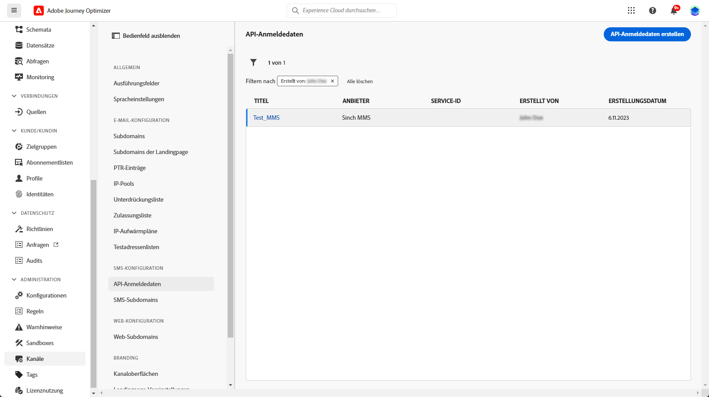
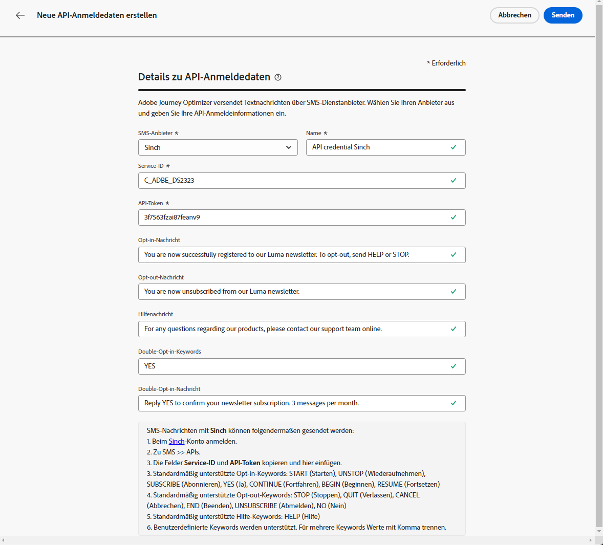
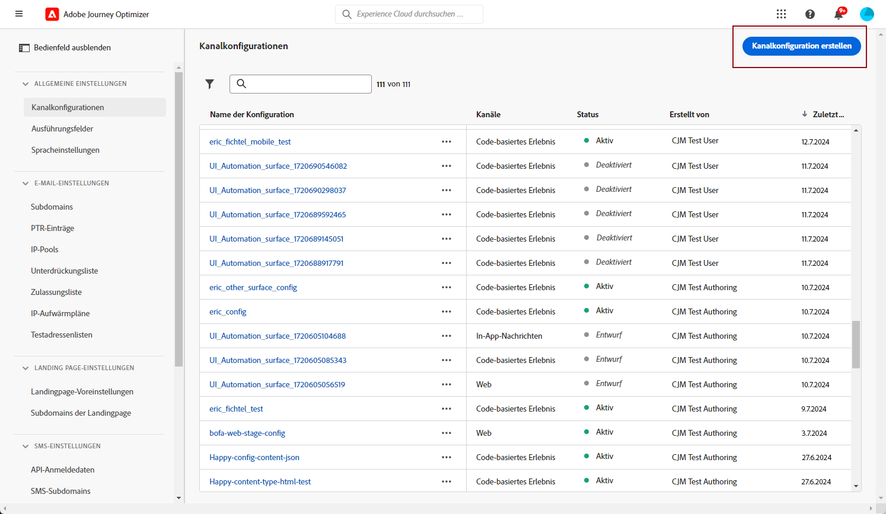
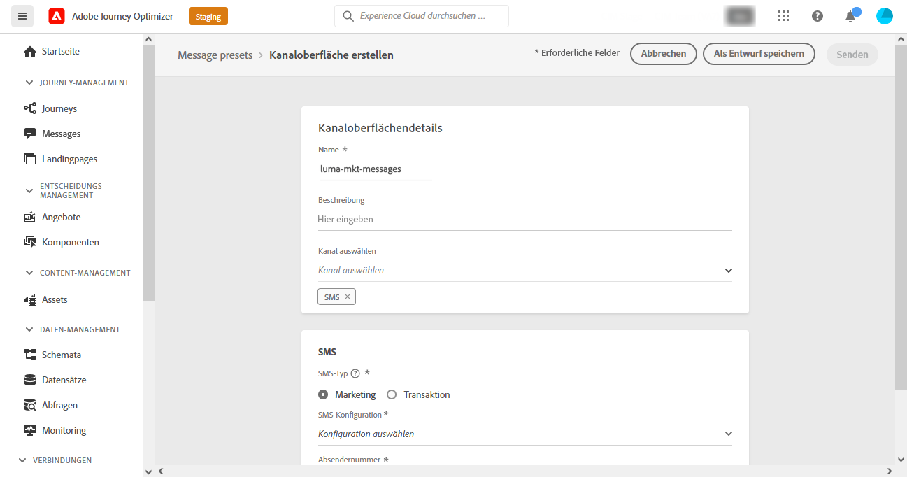
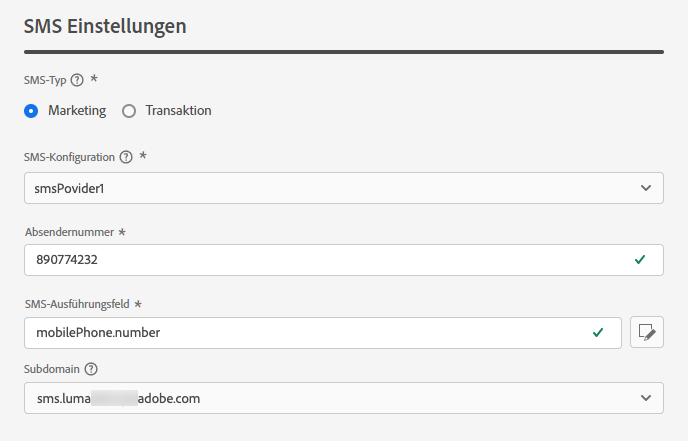
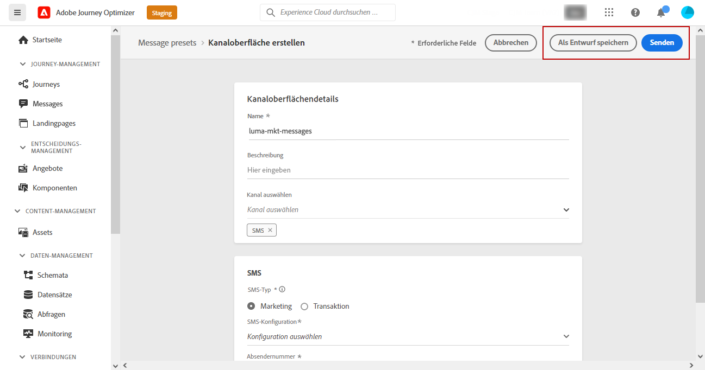

# Konfigurieren des SMS-Kanals {#sms-configuration}

[!DNL Journey Optimizer] ermöglicht es Ihnen, Journeys zu erstellen und Nachrichten an eine ausgewählte Audience zu senden.

Konfigurieren Sie Ihre Instanz, bevor Sie SMS versenden. Sie müssen dazu die [Provider-Einstellungen in Journey Optimizer integrieren](#create-api) und [eine SMS-Oberfläche (d. h. eine SMS-Voreinstellung) einrichten](#message-preset-sms). Diese Schritte müssen von einem [Adobe Journey Optimizer-Systemadministrator](../start/path/administrator.md) durchgeführt werden.

>[!IMPORTANT]
>
>Adobe Journey Optimizer kann derzeit mit Drittanbietern wie Sinch und Twilio integriert werden, die unabhängig von Adobe Journey Optimizer SMS-Services anbieten.  Vor der SMS-Konfiguration müssen Sie bei einem dieser SMS-Provider ein Konto erstellen, um das API-Token und die Service-ID zu erhalten, über die Sie die Verbindung zwischen Adobe Journey Optimizer und dem entsprechenden SMS-Provider herstellen können. Ihre Nutzung von SMS-Services unterliegt zusätzlichen Bedingungen des jeweiligen SMS-Anbieters. Da Sinch und Twilio Drittanbieterprodukte sind, die Adobe Journey Optimizer-Benutzenden über eine Integration zur Verfügung stehen, müssen sich die Benutzenden von Sinch oder Twilio bei allen Fragen und Anfragen im Zusammenhang mit SMS-Services an den jeweiligen SMS-Anbieter wenden, um Unterstützung zu erhalten. Adobe kontrolliert keine Produkte von Drittanbietern und ist nicht für diese verantwortlich.

## Erstellen neuer API-Anmeldeinformationen {#create-api}

>[!CONTEXTUALHELP]
>id="ajo_admin_sms_api_header"
>title="Konfigurieren eines SMS-Anbieters mit Journey Optimizer"
>abstract="Wählen Sie Ihren Anbieter aus und geben Sie Ihre SMS-API-Anmeldeinformationen ein."

>[!CONTEXTUALHELP]
>id="ajo_admin_sms_api"
>title="Konfigurieren eines SMS-Anbieters mit Journey Optimizer"
>abstract="Vor dem SMS-Versand müssen Sie die Provider-Einstellungen in Journey Optimizer integrieren. Danach müssen Sie eine SMS-Oberfläche erstellen. Diese Schritte müssen von einem Adobe Journey Optimizer-Systemadministrator durchgeführt werden."
>additional-url="https://experienceleague.adobe.com/docs/journey-optimizer/using/sms/sms-configuration.html?lang=de#message-preset-sms" text="Erstellen einer SMS-Kanaloberfläche"

>[!CONTEXTUALHELP]
>id="ajo_admin_sms_configuration"
>title="Wählen Sie die Konfiguration des SMS-Anbieters aus."
>abstract="Wählen Sie die für Ihren SMS-Anbieter konfigurierten API-Anmeldeinformationen aus."

Gehen Sie wie folgt vor, um Ihren SMS-Anbieter in Journey Optimizer zu konfigurieren:

1. Gehen Sie in das Menü **[!UICONTROL Administration]** > **[!UICONTROL Kanäle]** > **[!UICONTROL API-Anmeldeinformationen]** und klicken Sie auf **[!UICONTROL API-Anmeldeinformationen erstellen]**.

   

1. Wählen Sie Ihren **[!UICONTROL SMS-Anbieter]**:

   * [!DNL Sinch]. Greifen Sie über Ihren Sinch-Account auf das Menü „SMS“ > „APIs“ zu, um Ihre **[!UICONTROL Service-ID]** und Ihr **[!UICONTROL API-Token]** zu finden.
   * [!DNL Twilio]. Rufen Sie auf der Konsolen-Dashboard-Seite das Kontoinformationsfenster auf, um Ihre **[!UICONTROL Service-ID]** und Ihr **[!UICONTROL API-Token]** zu finden.

1. Geben Sie einen **[!UICONTROL Namen]** für Ihre API-Anmeldeinformationen ein.

1. Geben Sie Ihre **[!UICONTROL Service-ID]** und Ihr **[!UICONTROL API-Token]** ein.

   

1. Wenn Sie die Konfiguration Ihrer API-Anmeldedaten abgeschlossen haben, klicken Sie auf **[!UICONTROL Senden]**.

Nachdem Sie Ihre API-Anmeldedaten erstellt und konfiguriert haben, müssen Sie jetzt eine Kanaloberfläche (d. h. Nachrichtenvoreinstellung) für SMS-Nachrichten einrichten.

## Erstellen einer Kanaloberfläche für SMS-Nachrichten {#message-preset-sms}

>[!CONTEXTUALHELP]
>id="ajo_admin_surface_sms_type"
>title="Bestimmen Sie die SMS-Kategorie"
>abstract="Wählen Sie den SMS-Nachrichtentyp aus, der bei Verwendung dieser Oberfläche gesendet werden soll: „Marketing“ für Werbenachrichten, für die das Einverständnis der Benutzenden erforderlich ist, oder „Transaktion“ für nicht kommerzielle Nachrichten, die in bestimmten Kontexten auch an abgemeldete Profile gesendet werden können."
>additional-url="https://experienceleague.adobe.com/docs/journey-optimizer/using/privacy/consent/opt-out.html?lang=de#sms-opt-out-management" text="Abmeldung von Marketing-SMS-Nachrichten"

Nachdem Ihr SMS-Kanal konfiguriert wurde, müssen Sie eine Kanaloberfläche erstellen, um über **[!DNL Journey Optimizer]** SMS-Nachrichten senden zu können.

Gehen Sie wie folgt vor, um eine Kanaloberfläche zu erstellen:

1. Rufen Sie das Menü **[!UICONTROL Kanäle]** > **[!UICONTROL Branding]** > **[!UICONTROL Kanaloberflächen]** auf, und klicken Sie dann auf **[!UICONTROL Kanaloberfläche erstellen]**.

   

1. Geben Sie einen Namen und eine Beschreibung (optional) für die Oberfläche ein und wählen Sie dann den SMS-Kanal aus.

   

   >[!NOTE]
   >
   > Namen müssen mit einem Buchstaben (A–Z) beginnen. Ein Name darf nur alphanumerische Zeichen enthalten. Sie können auch die Zeichen Unterstrich `_`, Punkt `.` und Bindestrich `-` verwenden.

1. Konfigurieren Sie die **SMS**-Einstellungen.

   

   * Wählen Sie den **[!UICONTROL SMS-Typ]** aus, der mit der Oberfläche gesendet werden soll: **[!UICONTROL Transaktion]** oder **[!UICONTROL Marketing]**.

   * Wählen Sie die **[!UICONTROL SMS-Konfiguration]** aus, um sie mit der Oberfläche zu verknüpfen.

      Weiterführende Informationen zur Konfiguration Ihrer Umgebung für den Versand von SMS-Nachrichten finden Sie in [diesem Abschnitt](#create-api).

   * Geben Sie die **[!UICONTROL Absendernummer]** ein, die Sie für Ihre Sendungen verwenden möchten.

   * Wählen Sie Ihr **[!UICONTROL SMS-Ausführungsfeld]**, um das mit den Telefonnummern der Profile verbundene **[!UICONTROL Profilattribut]** auszuwählen.

1. Nachdem alle Parameter konfiguriert wurden, klicken Sie zur Bestätigung auf **[!UICONTROL Senden]**. Sie können die Kanaloberfläche auch als Entwurf speichern und ihre Konfiguration später fortsetzen.

   

1. Nachdem die Kanaloberfläche erstellt wurde, wird sie in der Liste mit dem Status **[!UICONTROL Verarbeitung läuft]** angezeigt.

   >[!NOTE]
   >
   >In [diesem Abschnitt](#monitor-channel-surfaces) erfahren Sie mehr über die möglichen Fehlerursachen, wenn die Prüfungen nicht erfolgreich sind.

1. Sobald die Prüfungen erfolgreich abgeschlossen sind, erhält die Kanaloberfläche den Status **[!UICONTROL Aktiv]**. Sie kann nun zum Versand von Nachrichten verwendet werden.

   

Sie können jetzt mit Journey Optimizer SMS-Nachrichten senden.

**Verwandte Themen**

* [Erstellen einer SMS-Nachricht](create-sms.md)
* [Hinzufügen einer Nachricht zu einer Journey](../building-journeys/journeys-message.md)
