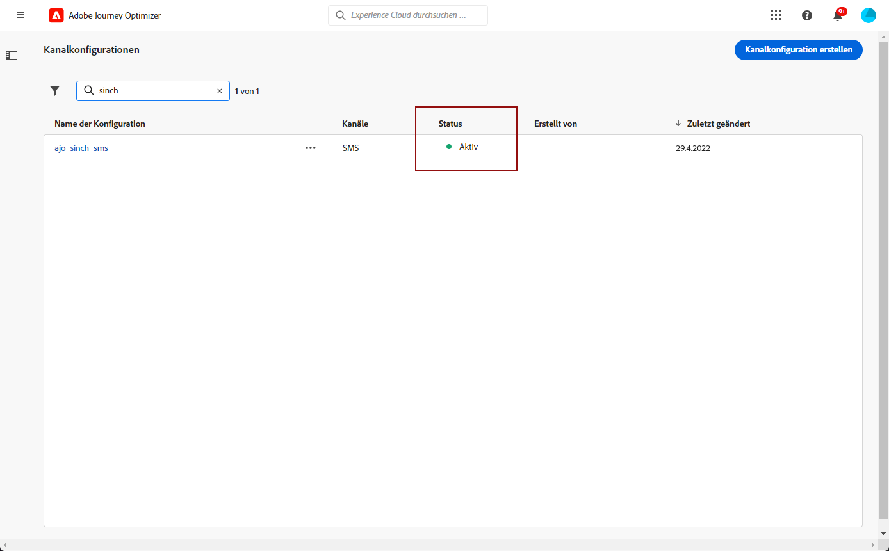

# Konfigurieren des SMS-Kanals {#sms-configuration}

[!DNL Journey Optimizer] ermöglicht es Ihnen, Journeys zu erstellen und Nachrichten an eine ausgewählte Audience zu senden.

Konfigurieren Sie Ihre Instanz, bevor Sie SMS versenden. Sie müssen dazu die [Provider-Einstellungen in Journey Optimizer integrieren](#create-api) und [eine SMS-Oberfläche (d. h. eine SMS-Voreinstellung) einrichten](#message-preset-sms). Diese Schritte müssen von einem [Adobe Journey Optimizer-Systemadministrator](../start/path/administrator.md) durchgeführt werden.

## Voraussetzungen{#sms-prerequisites}

Adobe Journey Optimizer kann derzeit mit Drittanbietern wie Sinch, Twilio und Infobip integriert werden, die von Adobe Journey Optimizer unabhängige SMS-Services anbieten.

Vor der SMS-Konfiguration müssen Sie bei einem dieser SMS-Provider ein Konto erstellen, um das API-Token und die Service-ID zu erhalten, über die Sie die Verbindung zwischen Adobe Journey Optimizer und dem entsprechenden SMS-Provider herstellen können.

Ihre Nutzung von SMS-Services unterliegt zusätzlichen Bedingungen des jeweiligen SMS-Anbieters. Da Sinch und Twilio Drittanbieterprodukte sind, die Adobe Journey Optimizer-Benutzenden über eine Integration zur Verfügung stehen, müssen sich die Benutzenden von Sinch oder Twilio bei allen Fragen und Anfragen im Zusammenhang mit SMS-Services an den jeweiligen SMS-Anbieter wenden, um Unterstützung zu erhalten. Adobe kontrolliert keine Produkte von Drittanbietern und ist nicht für diese verantwortlich.

>[!CAUTION]
>
>Um auf SMS-Subdomains zuzugreifen und sie zu bearbeiten, benötigen Sie die Berechtigung zum **[!UICONTROL Verwalten von SMS-Subdomains]** für die Produktions-Sandbox.

## Erstellen neuer API-Anmeldeinformationen {#create-api}

>[!CONTEXTUALHELP]
>id="ajo_admin_sms_api_header"
>title="Konfigurieren eines SMS-Anbieters mit Journey Optimizer"
>abstract="Anbieter auswählen und SMS-API-Anmeldeinformationen eingeben."

>[!CONTEXTUALHELP]
>id="ajo_admin_sms_api"
>title="Konfigurieren eines SMS-Anbieters mit Journey Optimizer"
>abstract="Vor dem SMS-Versand müssen Sie die Provider-Einstellungen in Journey Optimizer integrieren. Danach müssen Sie eine SMS-Oberfläche erstellen. Diese Schritte müssen von einem Adobe Journey Optimizer-Systemadministrator durchgeführt werden."
>additional-url="https://experienceleague.adobe.com/docs/journey-optimizer/using/sms/sms-configuration.html?lang=de#message-preset-sms" text="Erstellen einer SMS-Kanaloberfläche"

>[!CONTEXTUALHELP]
>id="ajo_admin_sms_configuration"
>title="Wählen Sie die Konfiguration des SMS-Anbieters aus."
>abstract="Wählen Sie die für Ihren SMS-Anbieter konfigurierten API-Anmeldeinformationen aus."

Gehen Sie wie folgt vor, um Ihren SMS-Anbieter in Journey Optimizer zu konfigurieren:

1. Navigieren Sie in der linken Leiste zu **[!UICONTROL Administration]** > **[!UICONTROL Kanal]** und wählen Sie das Menü **[!UICONTROL API-Anmeldedaten]**. Klicken Sie auf die Schaltfläche **[!UICONTROL Neue API-Anmeldedaten erstellen]**.

   

1. Konfigurieren Sie Ihre SMS-API-Anmeldedaten:

   * Für **[!DNL Sinch]**:

      * **[!UICONTROL Name]**: Wählen Sie einen Namen für Ihre API-Anmeldedaten.

      * **[!UICONTROL Service-ID]** und **[!UICONTROL API-Token]**: Rufen Sie die API-Seite auf. Ihre Anmeldedaten finden Sie auf der Registerkarte „SMS“. [Weitere Informationen](https://developers.sinch.com/docs/sms/getting-started/){target="_blank"}.

      * **[!UICONTROL Opt-in-Nachricht]**: Geben Sie die benutzerdefinierte Antwort ein, die automatisch als Ihre **[!UICONTROL Opt-in-Nachricht]**.

      * **[!UICONTROL Hilfemeldung]**: Geben Sie die benutzerdefinierte Antwort ein, die automatisch als Ihre **Hilfemeldung**.

   * Für **[!DNL Twilio]**:

      * **[!UICONTROL Name]**: Wählen Sie einen Namen für Ihre API-Anmeldedaten.

      * **[!UICONTROL Konto-SID]** und **[!UICONTROL Authentifizierungs-Token]**: Rufen Sie den Bereich mit den Kontoinformationen Ihrer Twilio Console-Dashboard-Seite auf. Dort finden Sie Ihre Anmeldedaten.

      * **[!UICONTROL Nachrichten-SID]**: Geben Sie die eindeutige Kennung ein, die jeder von der Twilio-API erstellten Nachricht zugewiesen ist. [Weitere Informationen](https://support.twilio.com/hc/en-us/articles/223134387-What-is-a-Message-SID-){target="_blank"}.

   * Für **[!DNL Infobip]**:

      * **[!UICONTROL Name]**: Wählen Sie einen Namen für Ihre API-Anmeldedaten.

      * **[!UICONTROL API-Basis-URL]** und **[!UICONTROL API-Token]**: Rufen Sie die Startseite Ihrer Web-Oberfläche oder die Seite zur Verwaltung von API-Schlüsseln auf. Dort finden Sie Ihre Anmeldedaten. [Weitere Informationen](https://www.infobip.com/docs/api){target="_blank"}.

   

1. Wenn Sie die Konfiguration Ihrer API-Anmeldedaten abgeschlossen haben, klicken Sie auf **[!UICONTROL Senden]**.

Nachdem Sie Ihre API-Anmeldedaten erstellt und konfiguriert haben, müssen Sie jetzt eine Kanaloberfläche (d. h. Nachrichtenvoreinstellung) für SMS-Nachrichten einrichten.

## Erstellen einer SMS-Oberfläche {#message-preset-sms}

>[!CONTEXTUALHELP]
>id="ajo_admin_surface_sms_type"
>title="Bestimmen der SMS-Kategorie"
>abstract="Wählen Sie über diese Oberfläche die Art der SMS-Nachrichten aus: Marketing für Werbe-SMS, die die Zustimmung der Benutzenden erfordern, oder Transaktions-SMS für nicht-kommerzielle SMS-Nachrichten, wie z. B. das Zurücksetzen eines Kennworts."
>additional-url="https://experienceleague.adobe.com/docs/journey-optimizer/using/privacy/consent/opt-out.html?lang=de#sms-opt-out-management" text="Abmeldung von Marketing-SMS-Nachrichten"

Sobald Ihr SMS-Kanal konfiguriert ist, müssen Sie eine Kanaloberfläche erstellen, um SMS-Nachrichten von **[!DNL Journey Optimizer]** aus versenden zu können.

Gehen Sie wie folgt vor, um eine Kanaloberfläche zu erstellen:

1. Navigieren Sie in der linken Leiste zu **[!UICONTROL Administration]** > **[!UICONTROL Kanäle]** und wählen Sie **[!UICONTROL Branding]** > **[!UICONTROL Kanaloberflächen]**. Klicken Sie auf die Schaltfläche **[!UICONTROL Kanaloberfläche erstellen]**.

   

1. Geben Sie einen Namen und eine Beschreibung (optional) für die Oberfläche ein und wählen Sie dann den SMS-Kanal aus.

   

   >[!NOTE]
   >
   > Namen müssen mit einem Buchstaben (A–Z) beginnen. Ein Name darf nur alphanumerische Zeichen enthalten. Sie können auch die Zeichen Unterstrich `_`, Punkt `.` und Bindestrich `-` verwenden.

1. Definieren Sie die **SMS-Einstellungen**.

   

   Wählen Sie zunächst den **[!UICONTROL SMS-Typ]** aus, der mit der Oberfläche gesendet werden soll: **[!UICONTROL Transaktion]** oder **[!UICONTROL Marketing]**.

   * Wählen Sie **Marketing** für Werbe-SMS: Diese Nachrichten erfordern die Zustimmung der Benutzenden.
   * Wählen Sie **Transaktion** für nicht-kommerzielle Nachrichten, wie z. B. Bestellbestätigungen, Benachrichtigungen beim Zurücksetzen des Kennworts oder Versandinformationen.

   Wenn Sie eine SMS-Nachricht erstellen, müssen Sie eine gültige Kanaloberfläche wählen, die der Kategorie entspricht, die Sie für Ihre Nachricht ausgewählt haben.

   >[!CAUTION]
   >
   >**Transaktions-SMS-Nachrichten** können an Profile gesendet werden, die sich von Marketing-Nachrichten abgemeldet haben. Diese Nachrichten können nur in bestimmten Kontexten gesendet werden.

1. Wählen Sie die **[!UICONTROL SMS-Konfiguration]** aus, um sie mit der Oberfläche zu verknüpfen.

   Weiterführende Informationen zur Konfiguration Ihrer Umgebung für den Versand von SMS-Nachrichten finden Sie in [diesem Abschnitt](#create-api).

1. Geben Sie die **[!UICONTROL Absendernummer]** ein, die Sie für Ihre Sendungen verwenden möchten.

1. Wählen Sie Ihr **[!UICONTROL SMS-Ausführungsfeld]**, um das mit den Telefonnummern der Profile verbundene **[!UICONTROL Profilattribut]** auszuwählen.

1. Wenn Sie die URL-Verkürzungsfunktion in Ihren SMS-Nachrichten verwenden möchten, wählen Sie ein Element aus der **[!UICONTROL Subdomain]**-Liste aus.

   >[!NOTE]
   >
   >Um eine Subdomain auswählen zu können, müssen Sie zuvor mindestens eine Landingpage-Subdomain konfiguriert haben. [Weitere Informationen](sms-subdomains.md)

1. Geben Sie die **[!UICONTROL Opt-out-Nummer]** ein, die Sie für diese Oberfläche verwenden möchten. Wenn sich Profile von dieser Telefonnummer abmelden, können Sie ihnen immer noch Nachrichten von anderen Nummern senden, die Sie für den Versand von SMS-Nachrichten mit [!DNL Journey Optimizer] verwenden.

   >[!NOTE]
   >
   >In [!DNL Journey Optimizer] wird die Abmeldung von SMS nicht mehr auf Kanalebene verwaltet. Dies ist jetzt für eine Nummer spezifisch.

1. Nachdem alle Parameter konfiguriert wurden, klicken Sie zur Bestätigung auf **[!UICONTROL Senden]**. Sie können die Kanaloberfläche auch als Entwurf speichern und ihre Konfiguration später fortsetzen.

   

1. Nachdem die Kanaloberfläche erstellt wurde, wird sie in der Liste mit dem Status **[!UICONTROL Verarbeitung läuft]** angezeigt.

   >[!NOTE]
   >
   >In [diesem Abschnitt](#monitor-channel-surfaces) erfahren Sie mehr über die möglichen Fehlerursachen, wenn die Prüfungen nicht erfolgreich sind.

1. Sobald die Prüfungen erfolgreich abgeschlossen sind, erhält die Kanaloberfläche den Status **[!UICONTROL Aktiv]**. Sie kann nun zum Versand von Nachrichten verwendet werden.

   

Sie können jetzt mit Journey Optimizer SMS-Nachrichten senden.

**Verwandte Themen**

* [Erstellen einer SMS-Nachricht](create-sms.md)
* [Hinzufügen einer Nachricht zu einer Journey](../building-journeys/journeys-message.md)
* [Hinzufügen einer Nachricht in einer Kampagne](../campaigns/create-campaign.md)

