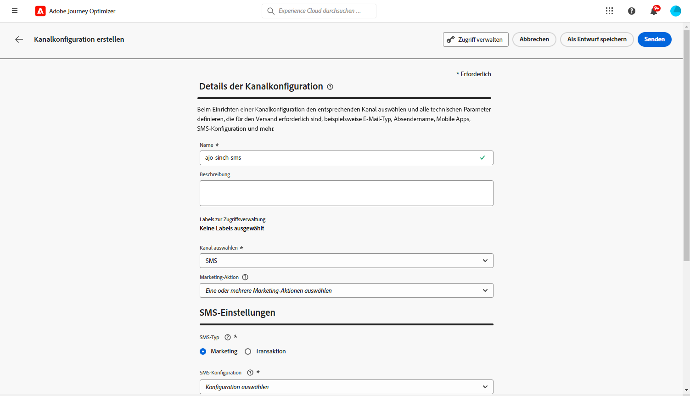
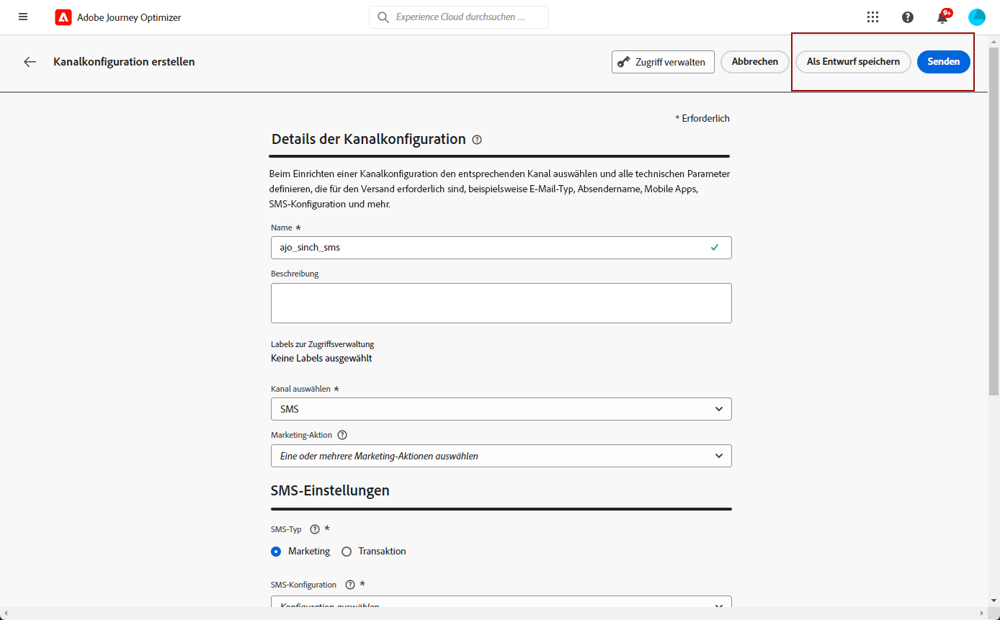

# Konfigurieren des SMS-Kanals {#sms-configuration}

Bevor Sie SMS oder MMS senden, müssen Sie Ihre Adobe Journey Optimizer-Umgebung konfigurieren. Gehen Sie wie folgt vor:

* [Provider-Einstellungen integrieren](#create-api) mit Journey Optimizer
* [SMS-Oberfläche erstellen](#message-preset-sms) (d. h. SMS-Vorgabe), auch für MMS verwendet

Diese Schritte müssen von einem Adobe Journey Optimizer ausgeführt werden [Systemadministrator](../start/path/administrator.md).

## Voraussetzungen{#sms-prerequisites}

Adobe Journey Optimizer ist derzeit mit Drittanbietern integriert, die unabhängig von Adobe Journey Optimizer Textnachrichten anbieten. Folgende Anbieter werden für Textnachrichten unterstützt: **Sinch**, **Twilio** und **Infobip**. MMS wird nur mit **Sinch**.

Vor der SMS-Kanalkonfiguration müssen Sie ein Konto bei einem dieser Anbieter erstellen, um Ihre **API-Token** und **Dienst-ID**, die Sie konfigurieren müssen, um die Verbindung zwischen Adobe Journey Optimizer und dem entsprechenden Provider herzustellen.

Ihre Nutzung von Textnachrichten unterliegt zusätzlichen Bedingungen des jeweiligen Anbieters. Als Drittanbieterlösungen stehen Adobe Journey Optimizer-Benutzern Sinch, Twilio und Infobip über eine Integration zur Verfügung. Adobe kontrolliert keine Produkte von Drittanbietern und ist nicht für diese verantwortlich. Wenden Sie sich bei Problemen oder Hilfeanfragen im Zusammenhang mit Textnachrichten (SMS/MMS) an Ihren Provider.

>[!CAUTION]
>
>Zum Zugreifen auf und Bearbeiten von SMS-Subdomains benötigen Sie die **[!UICONTROL Verwalten von SMS-Subdomains]** -Berechtigung für die Produktions-Sandbox. Weitere Informationen zu Berechtigungen finden Sie unter [diese Seite](../administration/high-low-permissions.md#administration-permissions).
>

## Erstellen neuer API-Anmeldeinformationen {#create-api}

>[!CONTEXTUALHELP]
>id="ajo_admin_sms_api_header"
>title="SMS-/MMS-Provider mit Journey Optimizer konfigurieren"
>abstract="Adobe Journey Optimizer sendet Textnachrichten über SMS/MMS-Dienstleister. Wählen Sie Ihren Provider aus und geben Sie Ihre API-Anmeldeinformationen ein."

>[!CONTEXTUALHELP]
>id="ajo_admin_sms_api"
>title="SMS-/MMS-Provider mit Journey Optimizer konfigurieren"
>abstract="Vor dem Versand von Textnachrichten (SMS/MMS) müssen Sie die Provider-Einstellungen in Journey Optimizer integrieren. Danach müssen Sie eine SMS/MMS-Oberfläche erstellen. Diese Schritte müssen von einem Adobe Journey Optimizer-Systemadministrator durchgeführt werden."
>additional-url="https://experienceleague.adobe.com/docs/journey-optimizer/using/sms/sms-configuration.html?lang=de#message-preset-sms" text="Erstellen einer SMS-Kanaloberfläche"

>[!CONTEXTUALHELP]
>id="ajo_admin_sms_configuration"
>title="Wählen Sie die Konfiguration des SMS-Anbieters aus."
>abstract="Wählen Sie die für Ihren SMS-Anbieter konfigurierten API-Anmeldeinformationen aus."

Gehen Sie wie folgt vor, um Ihren SMS-/MMS-Provider mit Journey Optimizer zu konfigurieren:

1. Navigieren Sie in der linken Leiste zu **[!UICONTROL Administration]** > **[!UICONTROL Kanal]** und wählen Sie das Menü **[!UICONTROL API-Anmeldedaten]**. Klicken Sie auf die Schaltfläche **[!UICONTROL Neue API-Anmeldedaten erstellen]**.

   

1. Konfigurieren Sie Ihre SMS-API-Anmeldeinformationen, wie unten beschrieben.

   

   * Für **[!DNL Sinch]**:

      * **[!UICONTROL Name]**: Wählen Sie einen Namen für Ihre API-Anmeldedaten.

      * **[!UICONTROL Dienst-ID]** und **[!UICONTROL API-Token]**: Rufen Sie die Seite APIs auf. Ihre Anmeldedaten finden Sie auf der Registerkarte SMS . Weitere Informationen finden Sie unter [Einzeldokumentation](https://developers.sinch.com/docs/sms/getting-started/){target="_blank"}.

      * **[!UICONTROL Opt-in-Nachricht]**: Geben Sie die benutzerdefinierte Antwort ein, die automatisch als **[!UICONTROL Opt-in-Nachricht]** gesendet wird.

      * **[!UICONTROL Hilfenachricht]**: Geben Sie die benutzerdefinierte Antwort ein, die automatisch als **Hilfenachricht** gesendet wird.

   * Für **[!DNL Sinch MMS]**:

      * **[!UICONTROL Name]**: Wählen Sie einen Namen für Ihre API-Anmeldedaten.

      * **[!UICONTROL Projekt-ID]**, **[!UICONTROL App-ID]** und **[!UICONTROL API-Token]**: Im Menü Conversation API können Sie Ihre Anmeldedaten im Menü App finden. Weitere Informationen finden Sie unter [Einzeldokumentation](https://docs.cc.sinch.com/cloud/service-configuration/en/oxy_ex-1/common/wln1620131604643.html){target="_blank"}.

   * Für **[!DNL Twilio]**:

      * **[!UICONTROL Name]**: Wählen Sie einen Namen für Ihre API-Anmeldedaten.

      * **[!UICONTROL Konto-SID]** und **[!UICONTROL Authentifizierungs-Token]**: Rufen Sie den Bereich mit den Kontoinformationen Ihrer Twilio Console-Dashboard-Seite auf. Dort finden Sie Ihre Anmeldedaten.

      * **[!UICONTROL Nachrichten-SID]**: Geben Sie die eindeutige Kennung ein, die jeder von der Twilio-API erstellten Nachricht zugewiesen ist. Weitere Informationen finden Sie unter [Twilio-Dokumentation](https://support.twilio.com/hc/en-us/articles/223134387-What-is-a-Message-SID-){target="_blank"}.

   * Für **[!DNL Infobip]**:

      * **[!UICONTROL Name]**: Wählen Sie einen Namen für Ihre API-Anmeldedaten.

      * **[!UICONTROL API-Basis-URL]** und **[!UICONTROL API-Token]**: Rufen Sie die Startseite Ihrer Web-Oberfläche oder die Seite zur Verwaltung von API-Schlüsseln auf. Dort finden Sie Ihre Anmeldedaten. Weitere Informationen finden Sie unter [Informationsdokumentation](https://www.infobip.com/docs/api){target="_blank"}.

1. Wenn Sie die Konfiguration Ihrer API-Anmeldedaten abgeschlossen haben, klicken Sie auf **[!UICONTROL Senden]**.

Nachdem Sie Ihre API-Anmeldedaten erstellt und konfiguriert haben, müssen Sie jetzt eine Kanaloberfläche (d. h. Nachrichtenvoreinstellung) für SMS-Nachrichten einrichten.

## Erstellen einer SMS-Oberfläche {#message-preset-sms}

>[!CONTEXTUALHELP]
>id="ajo_admin_surface_sms_type"
>title="Nachrichtenkategorie definieren"
>abstract="Wählen Sie den Typ der Textnachrichten mit dieser Oberfläche aus: Marketing für Werbenachrichten, für die die Zustimmung des Benutzers erforderlich ist, oder Transaktion für nicht kommerzielle Nachrichten, wie z. B. Kennwortrücksetzung."
>additional-url="https://experienceleague.adobe.com/docs/journey-optimizer/using/privacy/consent/opt-out.html?lang=de#sms-opt-out-management" text="Opt-out in Marketing-Textnachrichten"

Nachdem Ihr SMS-/MMS-Kanal konfiguriert wurde, müssen Sie eine Kanaloberfläche erstellen, von der aus SMS-Nachrichten gesendet werden können **[!DNL Journey Optimizer]**.

Gehen Sie wie folgt vor, um eine Kanaloberfläche zu erstellen:

1. Navigieren Sie in der linken Leiste zu **[!UICONTROL Administration]** > **[!UICONTROL Kanäle]** und wählen Sie **[!UICONTROL Branding]** > **[!UICONTROL Kanaloberflächen]**. Klicken Sie auf die Schaltfläche **[!UICONTROL Kanaloberfläche erstellen]**.

   

1. Geben Sie einen Namen und eine Beschreibung (optional) für die Oberfläche ein und wählen Sie dann den SMS-Kanal aus.

   

   >[!NOTE]
   >
   > Namen müssen mit einem Buchstaben (A–Z) beginnen. Ein Name darf nur alphanumerische Zeichen enthalten. Sie können auch die Zeichen Unterstrich `_`, Punkt `.` und Bindestrich `-` verwenden.

1. Definieren Sie die **SMS-Einstellungen**.

   

   Wählen Sie zunächst den **[!UICONTROL SMS-Typ]** aus, der mit der Oberfläche gesendet werden soll: **[!UICONTROL Transaktion]** oder **[!UICONTROL Marketing]**.

   * Auswählen **Marketing** für Werbetexte: Diese Nachrichten erfordern die Zustimmung des Benutzers.
   * Wählen Sie **Transaktion** für nicht-kommerzielle Nachrichten, wie z. B. Bestellbestätigungen, Benachrichtigungen beim Zurücksetzen des Kennworts oder Versandinformationen.

   Bei der Erstellung einer SMS/MMS-Nachricht müssen Sie eine gültige Kanaloberfläche auswählen, die der für Ihre Nachricht ausgewählten Kategorie entspricht.

   >[!CAUTION]
   >
   >**Transaktions**-Nachrichten können auch an Profile gesendet werden, die sich von Marketing-Nachrichten abgemeldet haben. Diese Nachrichten können nur in bestimmten Kontexten gesendet werden.

1. Wählen Sie die **[!UICONTROL SMS-Konfiguration]** aus, um sie mit der Oberfläche zu verknüpfen.

   Weiterführende Informationen zur Konfiguration Ihrer Umgebung für den Versand von SMS-Nachrichten finden Sie in [diesem Abschnitt](#create-api).

1. Geben Sie die **[!UICONTROL Absendernummer]** ein, die Sie für Ihre Sendungen verwenden möchten.

1. Wählen Sie Ihr **[!UICONTROL SMS-Ausführungsfeld]**, um das mit den Telefonnummern der Profile verbundene **[!UICONTROL Profilattribut]** auszuwählen.

1. Wenn Sie die URL-Verkürzungsfunktion in Ihren SMS-Nachrichten verwenden möchten, wählen Sie ein Element aus der **[!UICONTROL Subdomain]**-Liste aus.

   >[!NOTE]
   >
   >Um eine Subdomain auswählen zu können, stellen Sie sicher, dass Sie zuvor mindestens eine SMS/MMS-Subdomain konfiguriert haben. [Weitere Informationen](sms-subdomains.md)

1. Geben Sie die **[!UICONTROL Opt-out-Nummer]** ein, die Sie für diese Oberfläche verwenden möchten. Wenn sich Profile von dieser Nummer abmelden, können Sie ihnen weiterhin Nachrichten von anderen Nummern senden, die Sie verwenden können, um Textnachrichten mit [!DNL Journey Optimizer].

   >[!NOTE]
   >
   >In [!DNL Journey Optimizer], wird das Opt-out für Textnachrichten nicht mehr auf Kanalebene verwaltet. Dies ist jetzt für eine Nummer spezifisch.

1. Nachdem alle Parameter konfiguriert wurden, klicken Sie zur Bestätigung auf **[!UICONTROL Senden]**. Sie können die Kanaloberfläche auch als Entwurf speichern und ihre Konfiguration später fortsetzen.

   

1. Nachdem die Kanaloberfläche erstellt wurde, wird sie in der Liste mit dem Status **[!UICONTROL Verarbeitung läuft]** angezeigt.

   >[!NOTE]
   >
   >In [diesem Abschnitt](#monitor-channel-surfaces) erfahren Sie mehr über die möglichen Fehlerursachen, wenn die Prüfungen nicht erfolgreich sind.

1. Sobald die Prüfungen erfolgreich abgeschlossen sind, erhält die Kanaloberfläche den Status **[!UICONTROL Aktiv]**. Sie kann nun zum Versand von Nachrichten verwendet werden.

   

Sie können jetzt mit Journey Optimizer Textnachrichten versenden.

**Verwandte Themen**

* [SMS/MMS erstellen](create-sms.md)
* [Hinzufügen einer Nachricht zu einer Journey](../building-journeys/journeys-message.md)
* [Hinzufügen einer Nachricht in einer Kampagne](../campaigns/create-campaign.md)

