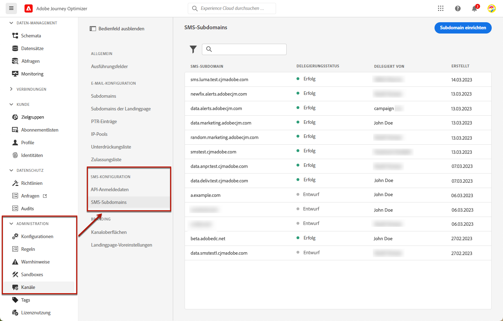
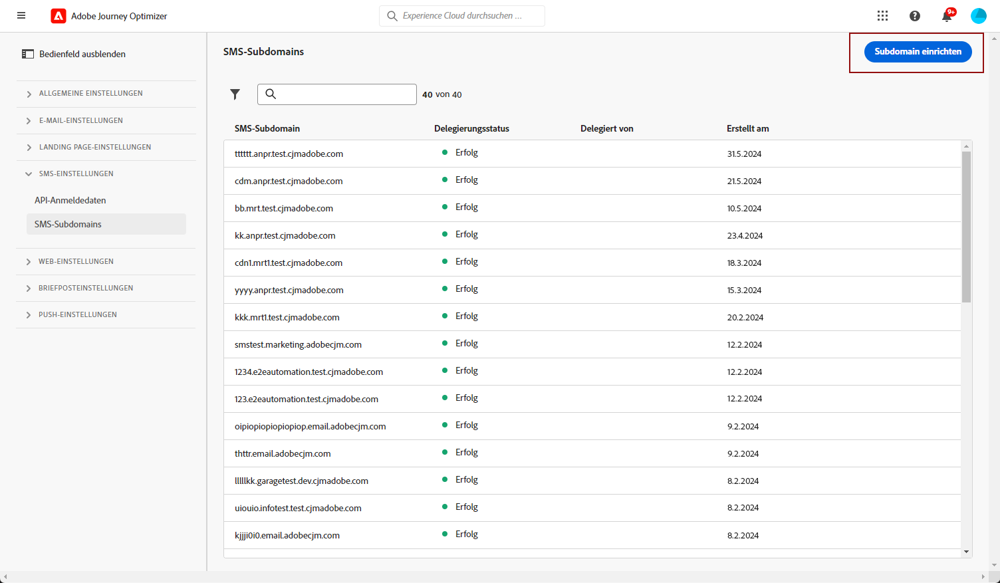
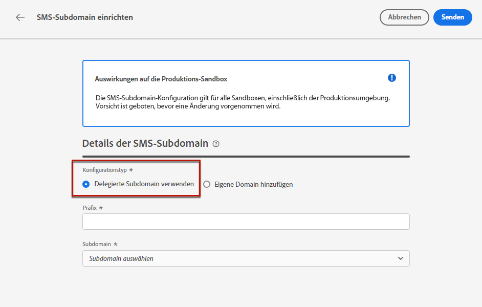
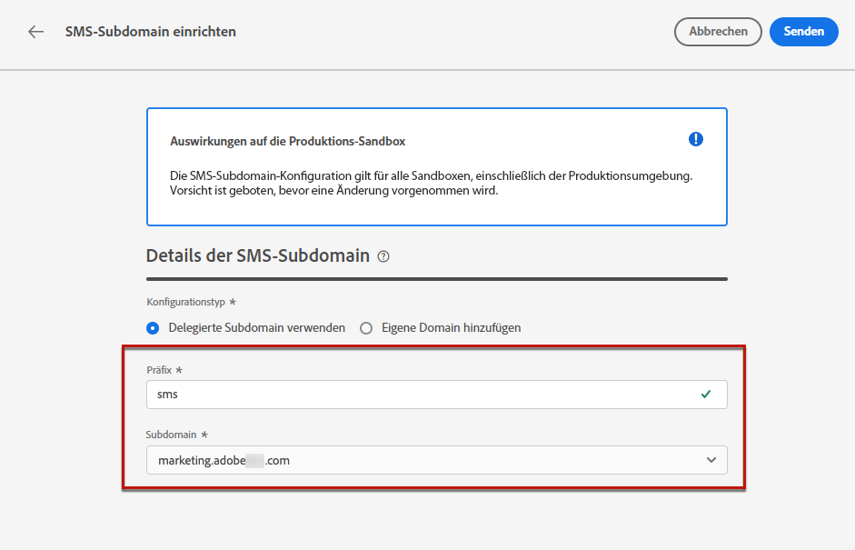
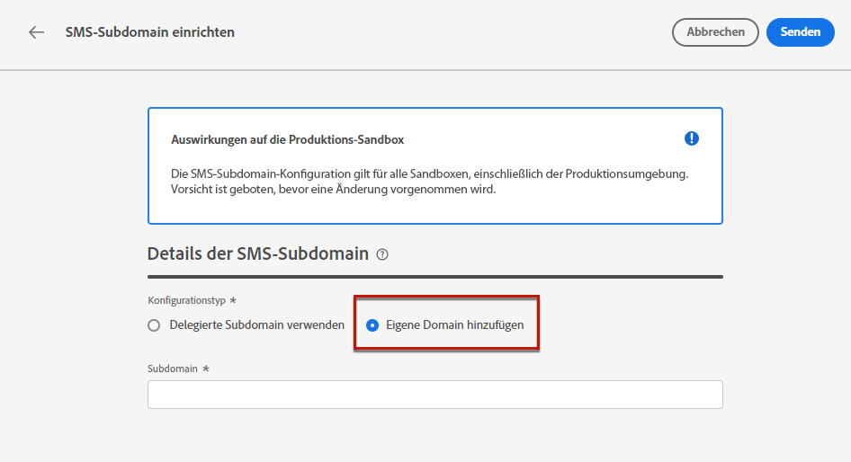
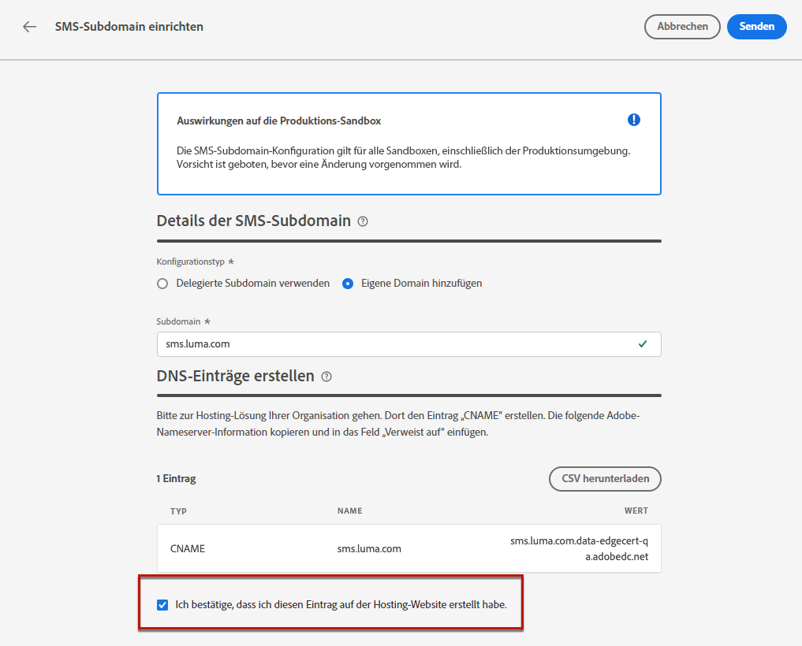

# SMS-Subdomains konfigurieren {#lp-subdomains}

>[!CONTEXTUALHELP]
>id="ajo_admin_subdomain_sms_header"
>title="SMS-Subdomain zuweisen"
>abstract="Sie richten Ihre Subdomain für die Verwendung von SMS ein. Sie können eine Subdomain verwenden, die bereits an Adobe delegiert ist, oder eine andere Subdomain konfigurieren."

>[!CONTEXTUALHELP]
>id="ajo_admin_subdomain_sms"
>title="SMS-Subdomain zuweisen"
>abstract="Sie müssen eine Subdomain für Ihre SMS-Nachrichten konfigurieren, da diese Subdomain zum Erstellen einer SMS-Oberfläche erforderlich ist. Es kann eine Subdomain verwendet werden, die bereits an Adobe delegiert ist, oder eine andere Subdomain konfiguriert werden."
>additional-url="https://experienceleague.adobe.com/docs/journey-optimizer/using/sms/sms-configuration.html#message-preset-sms" text="SMS-Oberflächen erstellen"

>[!CONTEXTUALHELP]
>id="ajo_admin_config_sms_subdomain"
>title="SMS-Subdomain auswählen"
>abstract="Um eine SMS-Oberfläche erstellen zu können, stellen Sie sicher, dass Sie zuvor mindestens eine SMS-Subdomain konfiguriert haben, die aus der Liste Subdomain-Name ausgewählt werden soll."
>additional-url="https://experienceleague.adobe.com/docs/journey-optimizer/using/sms/sms-configuration.html#message-preset-sms" text="SMS-Oberflächen erstellen"

Um die URLs zu Ihren SMS-Nachrichten verkürzen zu können, müssen Sie die Subdomain einrichten, die Sie zum Zeitpunkt der [SMS-Oberfläche erstellen](sms-configuration.md#message-preset-sms).

Sie können eine Subdomain verwenden, die bereits an Adobe delegiert wurde, oder eine andere Subdomain konfigurieren. Weitere Informationen zum Delegieren von Subdomains an Adobe finden Sie in [diesem Abschnitt](../configuration/delegate-subdomain.md).

>[!CAUTION]
>
>Die Konfiguration von SMS-Subdomains ist in allen Umgebungen üblich. Daher gilt:
>
>* Zum Zugreifen auf und Bearbeiten von SMS-Subdomains benötigen Sie die **[!UICONTROL Verwalten von SMS-Subdomains]** -Berechtigung für die Produktions-Sandbox.
>
> * Änderungen an einer SMS-Subdomain wirken sich auch auf die Produktions-Sandboxes aus.

## Verwenden einer vorhandenen Subdomain {#sms-use-existing-subdomain}

Gehen Sie wie folgt vor, um eine Subdomain zu verwenden, die bereits an Adobe delegiert wurde.

1. Zugriff auf **[!UICONTROL Administration]** > **[!UICONTROL Kanäle]** Menü und wählen Sie **[!UICONTROL SMS-Konfiguration]** > **[!UICONTROL SMS-Subdomains]**.

   

1. Klicken Sie auf **[!UICONTROL Subdomain einrichten]**.

   

1. Auswählen **[!UICONTROL Delegierte Subdomain verwenden]** von **[!UICONTROL Konfigurationstyp]** Abschnitt.

   

1. Geben Sie das Präfix ein, das in Ihrer SMS-URL angezeigt werden soll.

   >[!NOTE]
   >
   >Nur alphanumerische Zeichen und Bindestriche sind zulässig.

1. Wählen Sie aus der Liste eine delegierte Subdomain aus.

   >[!NOTE]
   >
   >Sie können keine Subdomain auswählen, die bereits als SMS-Subdomain verwendet wurde.

   <!--Capital letters are not allowed in subdomains. TBC by PM-->

   

   <!--Note that you cannot use multiple delegated subdomains of the same parent domain. For example, if 'marketing1.yourcompany.com' is already delegated to Adobe for your SMS messages, you will not be able to use 'marketing2.yourcompany.com'. However, multi-level subdomains being supported for SMS, you may proceed using a subdomain of 'marketing1.yourcompany.com' (such as 'email.marketing1.yourcompany.com'), or a different parent domain.-->

   >[!CAUTION]
   >
   >Wenn Sie eine Domain auswählen, die mit der [CNAME-Methode](../configuration/delegate-subdomain.md#cname-subdomain-delegation) an Adobe delegiert wurde, müssen Sie den DNS-Eintrag auf Ihrer Hosting-Plattform erstellen. Um den DNS-Eintrag zu generieren, läuft der Prozess genauso ab wie bei der Konfiguration einer neuen SMS-Subdomain. Weitere Informationen dazu finden Sie in [diesem Abschnitt](#sms-configure-new-subdomain).

1. Klicken Sie auf **[!UICONTROL Senden]**.

1. Nach der Übermittlung wird die Subdomain in der Liste mit dem Status **[!UICONTROL Wird verarbeitet]** angezeigt. Weiterführende Informationen zum Status von Subdomains finden Sie in [diesem Abschnitt](../configuration/about-subdomain-delegation.md#access-delegated-subdomains).<!--Same statuses?-->

   >[!NOTE]
   >
   >Bevor Sie diese Subdomain zum Senden von Nachrichten verwenden können, müssen Sie warten, bis Adobe die erforderlichen Prüfungen durchgeführt hat, was bis zu 4 Stunden dauern kann.<!--Learn more in [this section](delegate-subdomain.md#subdomain-validation).-->

1. Sobald die Prüfungen erfolgreich abgeschlossen sind, erhält die Subdomain den Status **[!UICONTROL Erfolg]**. Es kann zur Erstellung von Oberflächen für SMS-Kanäle verwendet werden.

## Konfigurieren einer neuen Subdomain {#sms-configure-new-subdomain}

>[!CONTEXTUALHELP]
>id="ajo_admin_sms_subdomain_dns"
>title="Erstellen des passenden DNS-Eintrags"
>abstract="Um eine neue SMS-Subdomain zu konfigurieren, müssen Sie die auf der Benutzeroberfläche von Journey Optimizer angezeigten Informationen zum Adobe-Nameserver kopieren und in Ihre Domain-Hosting-Lösung einfügen, um den entsprechenden DNS-Datensatz zu generieren. Nach erfolgreicher Überprüfung kann die Subdomain zur Erstellung von SMS-Oberflächen verwendet werden."

Gehen Sie wie folgt vor, um eine neue Subdomain zu konfigurieren.

1. Zugriff auf **[!UICONTROL Administration]** > **[!UICONTROL Kanäle]** Menü und wählen Sie **[!UICONTROL SMS-Konfiguration]** > **[!UICONTROL SMS-Subdomains]**.

1. Klicken Sie auf **[!UICONTROL Subdomain einrichten]**.

1. Wählen Sie **[!UICONTROL Eigene Domain hinzufügen]** im Abschnitt **[!UICONTROL Konfigurationstyp]**.

   

1. Geben Sie die zu delegierende Subdomain an.

   >[!CAUTION]
   >
   >Sie können keine bestehende SMS-Subdomain verwenden.
   >
   >Großbuchstaben sind in Subdomains nicht zulässig.

   Es ist nicht zulässig, Adobe eine ungültige Subdomain zuzuweisen. Vergewissern Sie sich, dass Sie eine gültige Subdomain eingeben, die Ihrem Unternehmen gehört, z. B. marketing.ihrunternehmen.com.

   >[!NOTE]
   >
   >Untergeordnete Domänen mit mehreren Ebenen (derselben übergeordneten Domäne) werden unterstützt. Sie können beispielsweise &quot;sms.marketing.yourcompany.com&quot;verwenden.

1. Die Liste der Einträge, die auf Ihren DNS-Servern gespeichert werden sollen, wird angezeigt. Kopieren Sie diesen Datensatz oder laden Sie eine CSV-Datei herunter und navigieren Sie dann zu Ihrer Domain-Hosting-Lösung, um den entsprechenden DNS-Eintrag zu generieren.

1. Stellen Sie sicher, dass in Ihrer Domain-Hosting-Lösung ein DNS-Eintrag generiert wurde. Wenn alles ordnungsgemäß konfiguriert ist, aktivieren Sie die Checkbox „Ich bestätige...“ und klicken Sie dann auf **[!UICONTROL Senden]**.

   

   >[!NOTE]
   >
   >Wenn Sie eine neue SMS-Subdomain konfigurieren, wird sie immer auf einen CNAME-Eintrag verweisen.

1. Nachdem die Subdomain-Zuweisung übermittelt wurde, wird die Subdomain in der Liste mit dem Status **[!UICONTROL In Verarbeitung]** angezeigt. Weiterführende Informationen zum Status von Subdomains finden Sie in [diesem Abschnitt](../configuration/about-subdomain-delegation.md#access-delegated-subdomains).<!--Same statuses?-->

   >[!NOTE]
   >
   >Bevor Sie diese Subdomain zum Versand von SMS-Nachrichten verwenden können, müssen Sie warten, bis Adobe die erforderlichen Prüfungen durchführt, die bis zu 4 Stunden dauern können.<!--Learn more in [this section](#subdomain-validation).-->

1. Sobald die Prüfungen erfolgreich abgeschlossen sind, erhält die Subdomain den Status **[!UICONTROL Erfolg]**. Es kann zur Erstellung von Oberflächen für SMS-Kanäle verwendet werden.

   Beachten Sie, dass die Subdomain als **[!UICONTROL Fehlgeschlagen]** markiert wird, wenn Sie den Validierungseintrag in Ihrer Hosting-Lösung nicht erstellen können.
