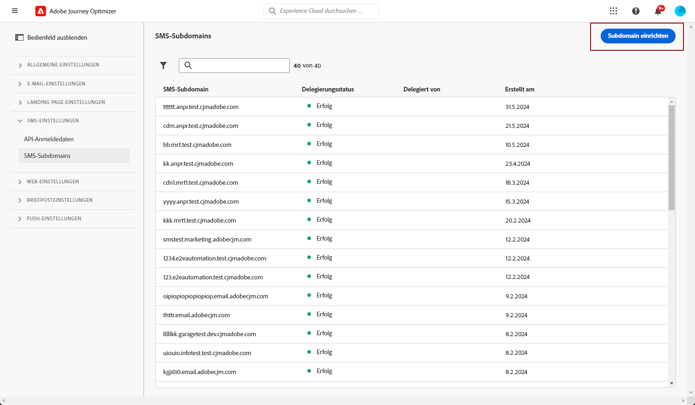
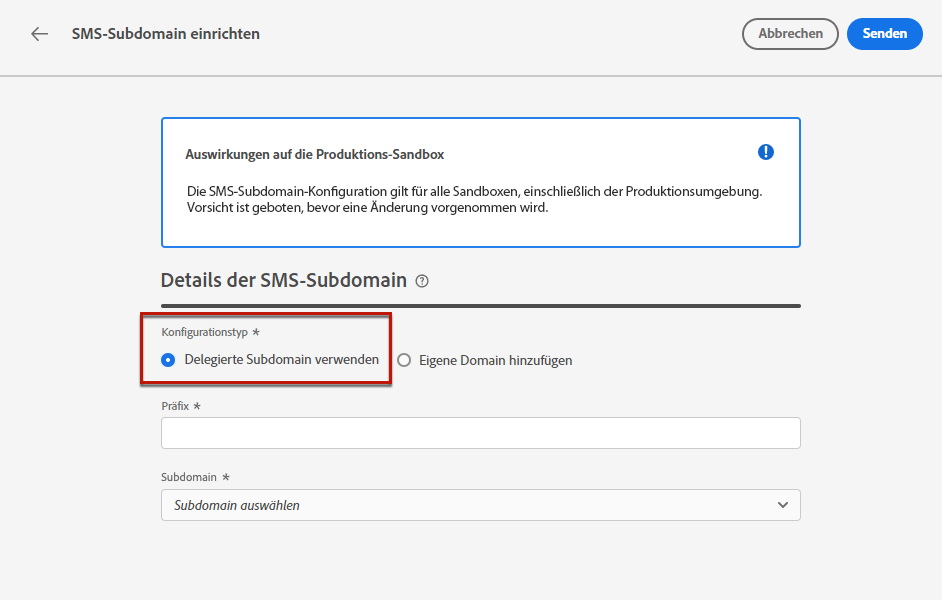
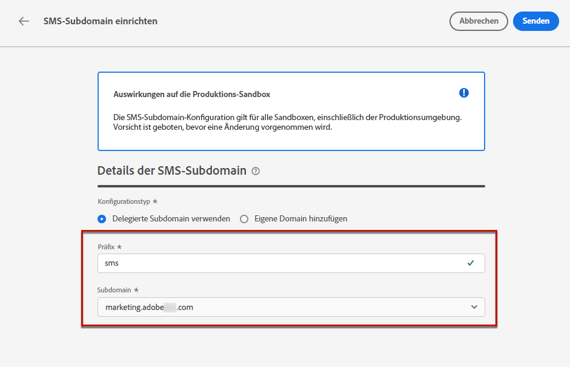
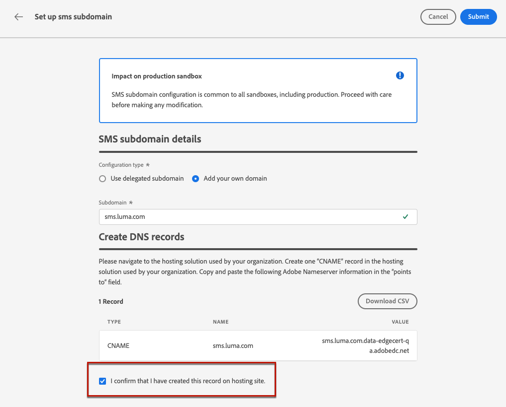

# Konfigurieren von SMS-Subdomains {#sms-mms-subdomains}

>[!CONTEXTUALHELP]
>id="ajo_admin_subdomain_sms_header"
>title="Delegieren einer SMS-/MMS-Subdomain"
>abstract="Subdomain für Textnachrichten (SMS/MMS) einrichten. Sie können eine Subdomain verwenden, die bereits an Adobe delegiert ist, oder eine neue Subdomain konfigurieren."

>[!CONTEXTUALHELP]
>id="ajo_admin_subdomain_sms"
>title="Delegieren einer SMS-/MMS-Subdomain"
>abstract="Sie müssen eine Subdomain konfigurieren, die für Ihre Textnachrichten verwendet werden soll, da diese Subdomain für die Erstellung einer SMS-Konfiguration benötigt wird. Sie können eine bereits an Adobe delegierte Subdomain verwenden oder eine neue Subdomain konfigurieren."
>additional-url="https://experienceleague.adobe.com/en/docs/journey-optimizer/using/channels/sms/configure-sms/sms-configuration-surface" text="Erstellen einer SMS-Konfiguration"

>[!CONTEXTUALHELP]
>id="ajo_admin_config_sms_subdomain"
>title="SMS-/MMS-Subdomain auswählen"
>abstract="Um eine SMS-Konfiguration erstellen zu können, müssen Sie zuvor mindestens eine SMS-Subdomain konfiguriert haben, die aus der Liste der Subdomain-Namen ausgewählt werden kann."
>additional-url="https://experienceleague.adobe.com/en/docs/journey-optimizer/using/channels/sms/configure-sms/sms-configuration-surface" text="Erstellen einer SMS-Konfiguration"

## Erste Schritte mit SMS-Subdomains {#gs-sms-mms-subdomains}

Um die URLs zu Ihren SMS-/MMS-Nachrichten kürzen zu können, müssen Sie die Subdomain einrichten, die Sie auswählen, wenn Sie [eine SMS-Konfiguration erstellen](sms-configuration.md#sms-prerequisites).

Sie können entweder eine Subdomain verwenden, die bereits an Adobe delegiert ist, oder eine andere Subdomain konfigurieren. Weitere Informationen zum Delegieren von Subdomains an Adobe finden [ in diesem Abschnitt](../configuration/delegate-subdomain.md).

Die Konfiguration von SMS-Subdomains wird **von allen Umgebungen gemeinsam genutzt**. Daher wirkt sich jede Änderung an einer SMS-Subdomain auch auf andere Produktions-Sandboxes aus.

>[!NOTE]
>
>Um auf SMS-Subdomains zuzugreifen und sie zu bearbeiten, benötigen Sie die Berechtigung **[!UICONTROL Verwalten von SMS-Subdomains]** für die Produktions-Sandbox. Weitere Informationen zu Berechtigungen finden [ in diesem Abschnitt ](../administration/high-low-permissions.md).

## Vorhandene Subdomain verwenden {#sms-use-existing-subdomain}

Gehen Sie wie folgt vor, um eine Subdomain zu verwenden, die bereits an Adobe delegiert ist.

1. Navigieren Sie zum Menü **[!UICONTROL Administration]** > **[!UICONTROL Kanäle]** und wählen Sie **[!UICONTROL SMS-Einstellungen]** > **[!UICONTROL SMS-Subdomains]**.

1. Klicken Sie **[!UICONTROL Subdomain einrichten]**.

   

1. Wählen **[!UICONTROL Delegierte Subdomain verwenden]** im Abschnitt **[!UICONTROL Konfigurationstyp]** aus.

   

1. Geben Sie das Präfix ein, das in Ihrer SMS-URL angezeigt werden soll.

   Nur alphanumerische Zeichen und Bindestriche sind zulässig.

   >[!CAUTION]
   >
   >Verwenden Sie keine `cdn` oder `data` Präfixe, da diese für die interne Verwendung reserviert sind. Andere eingeschränkte oder reservierte Präfixe wie `dmarc` oder `spf` sollten ebenfalls vermieden werden.

1. Wählen Sie eine delegierte Subdomain aus der Liste aus.

   Es kann keine Subdomain ausgewählt werden, die bereits als SMS-Subdomain verwendet wird.

   <!--Capital letters are not allowed in subdomains. TBC by PM-->

   

   <!--Note that you cannot use multiple delegated subdomains of the same parent domain. For example, if 'marketing1.yourcompany.com' is already delegated to Adobe for your SMS messages, you will not be able to use 'marketing2.yourcompany.com'. However, multi-level subdomains being supported for SMS, you may proceed using a subdomain of 'marketing1.yourcompany.com' (such as 'email.marketing1.yourcompany.com'), or a different parent domain.-->

   >[!CAUTION]
   >
   >Wenn Sie eine Domain auswählen, die mit der [CNAME-Methode](../configuration/delegate-subdomain.md#cname-subdomain-setup) an Adobe delegiert wurde, müssen Sie den DNS-Eintrag auf Ihrer Hosting-Plattform erstellen. Um den DNS-Eintrag zu generieren, gehen Sie genauso vor wie bei der Konfiguration einer neuen SMS-Subdomain. Weitere Informationen hierzu finden [ in diesem Abschnitt](#sms-configure-new-subdomain).

1. Klicken Sie **[!UICONTROL Senden]**.

1. Nach der Übermittlung wird die Subdomain in der Liste mit dem Status **[!UICONTROL Verarbeitung]** angezeigt. Weiterführende Informationen zum Status von Subdomains finden Sie in [diesem Abschnitt](../configuration/delegate-subdomain.md#access-delegated-subdomains).<!--Same statuses?-->

   Bevor Sie diese Subdomain zum Senden von Nachrichten verwenden können, müssen Sie warten, bis Adobe die erforderlichen Prüfungen durchgeführt hat, was **bis zu 4 Stunden**.<!--Learn more in [this section](../configuration/delegate-subdomain.md#subdomain-validation).-->

1. Sobald die Prüfungen erfolgreich abgeschlossen wurden, erhält die Subdomain den Status **[!UICONTROL Erfolg]**. Sie kann jetzt zum Erstellen von SMS-Kanalkonfigurationen verwendet werden.

## Konfigurieren einer neuen Subdomain {#sms-configure-new-subdomain}

>[!CONTEXTUALHELP]
>id="ajo_admin_sms_subdomain_dns"
>title="Erstellen des passenden DNS-Eintrags"
>abstract="Um eine neue SMS-Subdomain zu konfigurieren, müssen Sie die auf der Journey Optimizer-Benutzeroberfläche angezeigten Adobe-Nameserver-Informationen kopieren und in Ihre Domain-Hosting-Lösung einfügen, um den entsprechenden DNS-Eintrag zu generieren. Sobald die Prüfungen erfolgreich abgeschlossen wurden, kann die Subdomain zur Erstellung von SMS-Konfigurationen verwendet werden."

Gehen Sie wie folgt vor, um eine neue Subdomain zu konfigurieren.

1. Navigieren Sie zum Menü **[!UICONTROL Administration]** > **[!UICONTROL Kanäle]** und wählen Sie **[!UICONTROL SMS-Einstellungen]** > **[!UICONTROL SMS-Subdomains]**.

1. Klicken Sie **[!UICONTROL Subdomain einrichten]**.

   

1. Wählen **[!UICONTROL Eigene Domain hinzufügen]** im Abschnitt **[!UICONTROL Konfigurationstyp]** aus.

   

1. Geben Sie die zu delegierende Subdomain an.

   >[!CAUTION]
   >
   >* Eine vorhandene SMS-Subdomain kann nicht verwendet werden.
   >
   >* Großbuchstaben sind in Subdomains nicht zulässig.

   Die Delegierung einer ungültigen Subdomain an Adobe ist nicht zulässig. Geben Sie eine gültige Subdomain ein, die Ihrem Unternehmen gehört, z. B. marketing.yourcompany.com.

   Es werden Subdomains mit mehreren Ebenen (derselben übergeordneten Domain) unterstützt. Sie können beispielsweise „sms.marketing.meinefirma.com“ verwenden.

1. Der Eintrag, der auf Ihren DNS-Servern platziert werden soll, wird angezeigt. Kopieren Sie diesen Eintrag oder laden Sie eine CSV-Datei herunter und navigieren Sie dann zu Ihrer Domain-Hosting-Lösung, um den entsprechenden DNS-Eintrag zu generieren.

1. Stellen Sie sicher, dass in Ihrer Domain-Hosting-Lösung ein DNS-Eintrag generiert wurde. Wenn alles ordnungsgemäß konfiguriert ist, aktivieren Sie die Checkbox „Ich bestätige…“ und klicken Sie dann auf **[!UICONTROL Senden]**.

   

   Wenn Sie eine neue SMS-Subdomain konfigurieren, verweist sie immer auf einen CNAME-Eintrag.

1. Nachdem die Subdomain-Zuweisung übermittelt wurde, wird die Subdomain in der Liste mit dem Status **[!UICONTROL Verarbeitung]** angezeigt. Weiterführende Informationen zum Status von Subdomains finden Sie in [diesem Abschnitt](../configuration/delegate-subdomain.md#access-delegated-subdomains).<!--Same statuses?-->

Bevor Sie eine Subdomain zum Senden von SMS-Nachrichten verwenden, müssen Sie warten, bis Adobe die erforderlichen Prüfungen durchgeführt hat, was bis zu 4 Stunden dauern kann.<!--Learn more in [this section](#subdomain-validation).--> Sobald die Prüfungen erfolgreich abgeschlossen wurden, erhält die Subdomain den Status **[!UICONTROL Erfolg]**. Sie kann jetzt zum Erstellen von SMS-Kanalkonfigurationen verwendet werden.

Beachten Sie, dass die Subdomain als &quot;**[!UICONTROL &quot; markiert wird]** wenn Sie den Validierungseintrag in Ihrer Hosting-Lösung nicht erstellen können.

## Leitplanken {#guardrails}

Derzeit unterstützt die [!DNL Journey Optimizer]-Benutzeroberfläche nicht das Löschen oder Aufheben der Delegierung von SMS-Subdomains, nachdem sie eingerichtet wurden.

Beim Testen von Funktionen in [!DNL Journey Optimizer] kann es jedoch erforderlich sein, eine SMS-Subdomain zu erstellen. Sobald die Tests abgeschlossen sind, kann dies zu einer Überlastung der Umgebungen mit unnötigen Konfigurationen führen, da die Benutzeroberfläche das Entfernen oder Aufheben der Delegierung von SMS-Subdomains nicht zulässt.

Im Folgenden finden Sie einige empfohlene Schritte und Überlegungen:

<!--As an alternative action, create a new SMS subdomain for future use cases and avoid using the existing one if it is no longer needed.-->

* Es empfiehlt sich, eine aufgeräumte Umgebung nur durch die Erstellung der erforderlichen Komponenten und Konfigurationen aufrechtzuerhalten.
* Wenden Sie sich in Situationen mit Geschäftsauswirkungen an Ihren Adobe-Support-Mitarbeiter, der Ihnen möglicherweise beim Entfernen/Aufheben der Delegierung der SMS-Subdomain helfen kann. [Weitere Informationen](#undelegate-subdomain)
* Wenn Sie weitere Unterstützung benötigen, wenden Sie sich an Adobe, um Anleitungen zur effektiven Verwaltung Ihrer Instanz zu erhalten.

## Delegierung einer Subdomain aufheben {#undelegate-subdomain}

Wenn Sie die Delegierung einer SMS-Subdomain aufheben möchten, wenden Sie sich mit der Subdomain, deren Delegierung Sie aufheben möchten, an den Adobe-Support.

Wenn die SMS-Subdomain auf einen CNAME-Eintrag verweist, können Sie den CNAME-DNS-Eintrag, den Sie für die SMS-Subdomain erstellt haben, aus Ihrer Hosting-Lösung löschen (aber nicht die ursprüngliche E-Mail-Subdomain, falls vorhanden).

>[!NOTE]
>
>Eine SMS-Subdomain kann auf einen CNAME-Eintrag verweisen, da es sich entweder um eine [vorhandene Subdomain](#sms-use-existing-subdomain) handelte, die mithilfe der [CNAME-Methode](../configuration/delegate-subdomain.md#cname-subdomain-setup) an Adobe delegiert wurde, oder um eine [neue SMS-Subdomain](#sms-configure-new-subdomain), die Sie konfiguriert haben.

Nachdem Ihre Anfrage von Adobe verarbeitet wurde, wird die nicht delegierte Domain nicht mehr auf der Subdomain-Inventarseite angezeigt.
