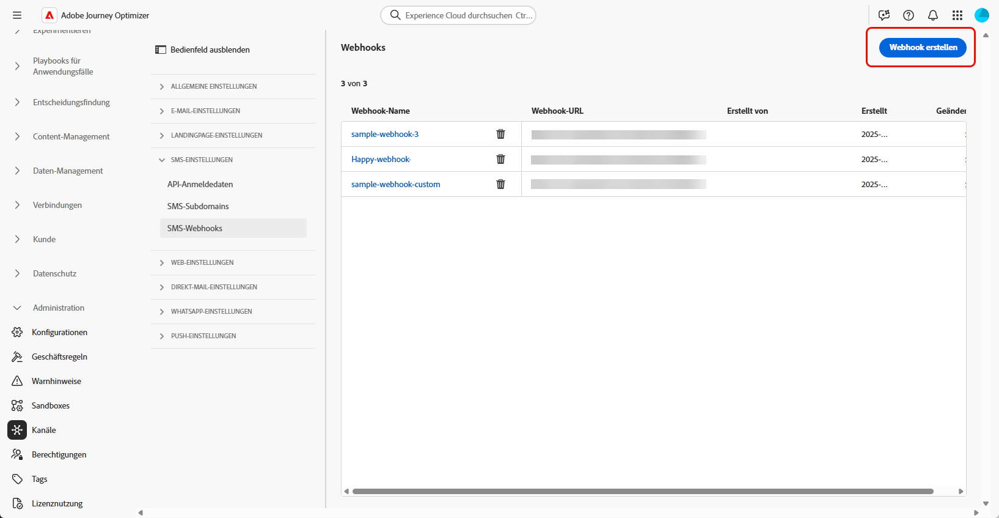
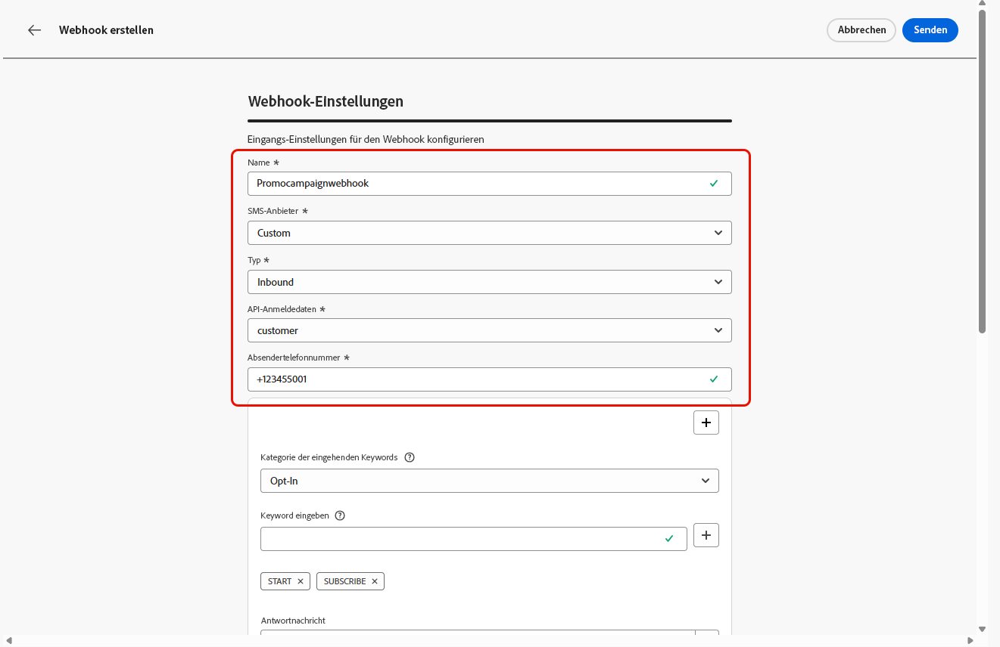
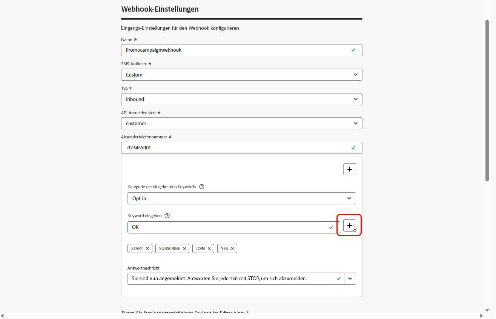
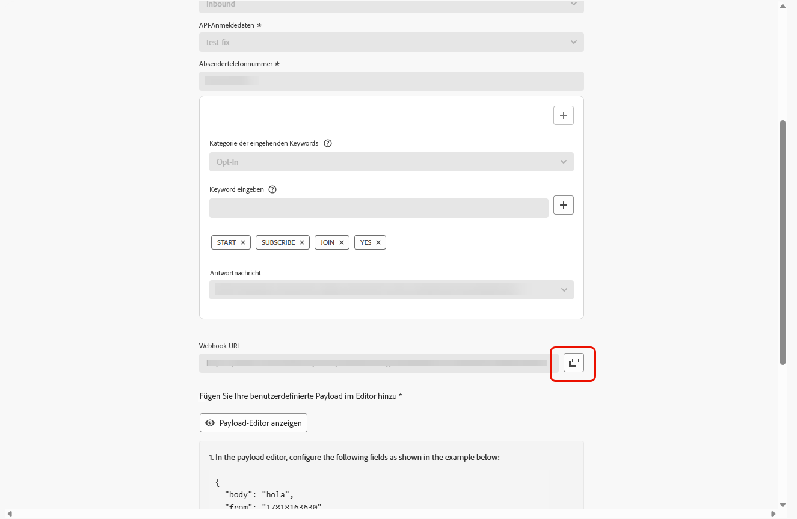

# Erstellen eines Webhook {#webhook}

>[!CONTEXTUALHELP]
>id="ajo_channels_sms_webhook_settings_create"
>title="SMS-Webhook erstellen"
>abstract="Sie können Webhooks konfigurieren, um eingehende Antworten für die Verwaltung des Opt-in- und Opt-out-Einverständnisses zu erfassen und Versandberichte einschließlich Lesebestätigungen zu erhalten, sofern verfügbar."

>[!CONTEXTUALHELP]
>id="ajo_admin_sms_webhook_flow_type"
>title="Webhook-Typ auswählen"
>abstract="Wählen Sie beim Einrichten eines Webhooks &quot;**&quot;,** Einverständnisantworten und Benutzervoreinstellungen zu erfassen, oder &quot;**[!UICONTROL &quot;,]** Versand- und Interaktionsereignisse für Berichte und Analysen zu verfolgen."

>[!BEGINSHADEBOX]

Wenn keine Opt-in- oder Opt-out-Keywords angegeben werden, werden standardmäßige Einverständnisnachrichten verwendet, um den Datenschutz der Benutzenden zu berücksichtigen. Durch das Hinzufügen benutzerdefinierter Keywords werden die Standardwerte automatisch überschrieben.

**Standard-Keywords:**

* **Opt-in**: SUBSCRIBE, YES, UNSTOP, START, CONTINUE, RESUME, BEGIN
* **Opt-out**: STOP, QUIT, CANCEL, END, UNSUBSCRIBE, NO
* **Hilfe**: HELP.

>[!ENDSHADEBOX]

Nachdem Ihre API-Anmeldedaten erfolgreich erstellt wurden, können Sie jetzt Webhooks konfigurieren, um eingehende Antworten für die Verwaltung des Opt-in- und Opt-out-Einverständnisses zu erfassen und Versandberichte einschließlich Lesebestätigungen (sofern verfügbar) zu erhalten.

Beim Einrichten eines Webhooks können Sie seinen Zweck basierend auf dem Typ der Daten definieren, die Sie erfassen möchten:

* **[!UICONTROL Eingehend]**: Verwenden Sie diese Option, wenn Sie Einverständnisantworten wie Opt-ins oder Opt-outs und Benutzereinstellungen erfassen möchten.

* **[!UICONTROL Feedback]**: Wählen Sie diese Option aus, um Versand- und Interaktionsereignisse einschließlich Lesebestätigungen und Benutzerinteraktionen zu verfolgen, um Reporting und Analysen zu unterstützen.

Durchsuchen Sie je nach SMS-Anbieter die folgenden Registerkarten:

>[!BEGINTABS]

>[!TAB Benutzerspezifisch]

1. Navigieren Sie in der linken Leiste zu **[!UICONTROL Administration]** `>` **[!UICONTROL Kanäle]**, wählen Sie das Menü **[!UICONTROL SMS-Webhooks]** unter **[!UICONTROL SMS-Einstellungen]** aus und klicken Sie auf die Schaltfläche **[!UICONTROL Webhook erstellen]**.

   {zoomable="yes"}

1. Konfigurieren Sie Ihre Webhook-Einstellungen wie unten beschrieben:

   * **[!UICONTROL Name]**: Geben Sie einen Namen für Ihren Webhook ein.

   * **[!UICONTROL SMS-Anbieter auswählen]**: Benutzerdefiniert.

   * **[!UICONTROL Typ]**: Eingehend.

   * **[!UICONTROL API-Anmeldedaten]**: Wählen Sie aus der Dropdown-Liste die [zuvor konfigurierten API-Anmeldedaten](sms-configuration-custom.md#api-credential) aus.

   * **[!UICONTROL Absendertelefonnummer]**: Geben Sie die Telefonnummer der Absenderin bzw. des Absenders ein, die Sie für Ihre Nachrichten verwenden möchten.

     {zoomable="yes"}

1. Klicken Sie auf  , um Ihre Keyword-Kategorien hinzuzufügen, und konfigurieren Sie sie dann je nach SMS-Anbieter:

   * **[!UICONTROL Kategorie für eingehende Keywords]**: Wählen Sie für Ihre Keyword-Kategorien entweder **[!UICONTROL Opt-in]**, **[!UICONTROL Opt-out]**, **[!UICONTROL Double-Opt-in]**, **[!UICONTROL Hilfe]** oder **[!UICONTROL Benutzerdefiniert]**.

   * **[!UICONTROL Keyword eingeben]**: Geben Sie die standardmäßigen oder benutzerdefinierten Keywords ein, durch die Ihre Nachricht automatisch ausgelöst wird. Klicken Sie auf , um mehrere Keywords hinzuzufügen.

     Verwenden Sie für **[!UICONTROL Benutzerdefiniertes Keyword]** nicht einverständnisbezogene Keywords für Batch-basierte Aktionen innerhalb einer Journey.

   * **[!UICONTROL Antwortnachricht]**: Wählen Sie aus der Dropdown-Liste die benutzerdefinierte Antwort aus, die automatisch gesendet wird.

   * **[!UICONTROL Unscharfes Opt-out]**: Aktivieren Sie diese Option, um eine automatische Antwort zu senden, wenn ein Keyword erkannt wird, das nahezu einer Übereinstimmung entspricht.

   {zoomable="yes"}

1. Geben Sie eine **[!UICONTROL Standardantwortnachricht]** ein, die automatisch gesendet wird, wenn eine eingehende Nachricht keinem konfigurierten Schlüsselwort oder keiner konfigurierten Kategorie entspricht.

1. Klicken Sie auf **[!UICONTROL Payload-Editor anzeigen]**, um Ihre Anfrage-Payloads zu validieren und anzupassen.

   Sie können Ihre Payload mithilfe von Profilattributen dynamisch personalisieren und mithilfe integrierter Hilfsfunktionen sicherstellen, dass genaue Daten zur Verarbeitung und Antworterstellung gesendet werden.

1. Wenn Sie die Konfiguration Ihres Webhook abgeschlossen haben, klicken Sie auf **[!UICONTROL Senden]**.

1. Um einen **[!UICONTROL Feedback]**-Webhook zu erstellen, gehen Sie wie oben beschrieben vor, indem Sie **[!UICONTROL Feedback]** als Webhook auswählen **[!UICONTROL Typ]**.

1. Über das **[!UICONTROL Webhooks]**-Menü können Sie vorhandene Webhooks bearbeiten oder löschen oder auf die **[!UICONTROL Webhook-URL]** zugreifen und diese kopieren, um sie in Ihren SMS-Anbieter zu integrieren.

   {zoomable="yes"}

Nachdem Sie die Einstellungen für den Webhook erstellt und konfiguriert haben, müssen Sie jetzt eine [Kanalkonfiguration](sms-configuration-surface.md) für SMS-Nachrichten erstellen.

Nach der Konfiguration können Sie alle betriebsbereiten Kanalfunktionen wie Nachrichtenerstellung, Personalisierung, Linktracking und Reporting nutzen.

>[!TAB Infobip]

1. Navigieren Sie in der linken Leiste zu **[!UICONTROL Administration]** `>` **[!UICONTROL Kanäle]**, wählen Sie das Menü **[!UICONTROL SMS-Webhooks]** unter **[!UICONTROL SMS-Einstellungen]** aus und klicken Sie auf die Schaltfläche **[!UICONTROL Webhook erstellen]**.

   {zoomable="yes"}

1. Konfigurieren Sie Ihre Webhook-Einstellungen wie unten beschrieben:

   * **[!UICONTROL Name]**: Geben Sie einen Namen für Ihren Webhook ein.

   * **[!UICONTROL SMS-Anbieter auswählen]**: Infobip.

   * **[!UICONTROL Typ]**: Eingehend.

   * **[!UICONTROL API-Anmeldedaten]**: Wählen Sie aus der Dropdown-Liste die [zuvor konfigurierten API-Anmeldedaten](sms-configuration-infobip.md#api-credential) aus.

   * **[!UICONTROL Absendertelefonnummer]**: Geben Sie die Telefonnummer der Absenderin bzw. des Absenders ein, die Sie für Ihre Nachrichten verwenden möchten.

     {zoomable="yes"}

1. Klicken Sie auf  , um Ihre Keyword-Kategorien hinzuzufügen, und konfigurieren Sie sie dann je nach SMS-Anbieter:

   * **[!UICONTROL Kategorie für eingehende Keywords]**: Wählen Sie für Ihre Keyword-Kategorien entweder **[!UICONTROL Opt-in]**, **[!UICONTROL Opt-out]**, **[!UICONTROL Double-Opt-in]**, **[!UICONTROL Hilfe]** oder **[!UICONTROL Benutzerdefiniert]**.

   * **[!UICONTROL Keyword eingeben]**: Geben Sie die standardmäßigen oder benutzerdefinierten Keywords ein, durch die Ihre Nachricht automatisch ausgelöst wird. Klicken Sie auf , um mehrere Keywords hinzuzufügen.

     Verwenden Sie für **[!UICONTROL Benutzerdefiniertes Keyword]** nicht einverständnisbezogene Keywords für Batch-basierte Aktionen innerhalb einer Journey.

   * **[!UICONTROL Antwortnachricht]**: Wählen Sie aus der Dropdown-Liste die benutzerdefinierte Antwort aus, die automatisch gesendet wird.

   * **[!UICONTROL Unscharfes Opt-out]**: Aktivieren Sie diese Option, um eine automatische Antwort zu senden, wenn ein Keyword erkannt wird, das nahezu einer Übereinstimmung entspricht.

   {zoomable="yes"}

1. Geben Sie eine **[!UICONTROL Standardantwortnachricht]** ein, die automatisch gesendet wird, wenn eine eingehende Nachricht keinem konfigurierten Schlüsselwort oder keiner konfigurierten Kategorie entspricht.

1. Wenn Sie die Konfiguration Ihres Webhook abgeschlossen haben, klicken Sie auf **[!UICONTROL Senden]**.

1. Um einen **[!UICONTROL Feedback]**-Webhook zu erstellen, gehen Sie wie oben beschrieben vor, indem Sie **[!UICONTROL Feedback]** als Webhook auswählen **[!UICONTROL Typ]**.

1. Über das **[!UICONTROL Webhooks]**-Menü können Sie vorhandene Webhooks bearbeiten oder löschen oder auf die **[!UICONTROL Webhook-URL]** zugreifen und diese kopieren, um sie in Ihren SMS-Anbieter zu integrieren.

   {zoomable="yes"}

Nachdem Sie die Einstellungen für „eingehend“ für den Webhook erstellt und konfiguriert haben, müssen Sie jetzt eine [Kanalkonfiguration](sms-configuration-surface.md) für SMS-Nachrichten erstellen. 

Nach der Konfiguration können Sie alle betriebsbereiten Kanalfunktionen wie Nachrichtenerstellung, Personalisierung, Linktracking und Reporting nutzen.

>[!TAB Sinch]

1. Navigieren Sie in der linken Leiste zu **[!UICONTROL Administration]** `>` **[!UICONTROL Kanäle]**, wählen Sie das Menü **[!UICONTROL SMS-Webhooks]** unter **[!UICONTROL SMS-Einstellungen]** aus und klicken Sie auf die Schaltfläche **[!UICONTROL Webhook erstellen]**.

   {zoomable="yes"}

1. Konfigurieren Sie Ihre Webhook-Einstellungen wie unten beschrieben:

   * **[!UICONTROL Name]**: Geben Sie einen Namen für Ihren Webhook ein.

   * **[!UICONTROL SMS-Anbieter auswählen]**: Sinch.

   * **[!UICONTROL Typ]**: Eingehend.

   * **[!UICONTROL API-Anmeldedaten]**: Wählen Sie aus der Dropdown-Liste die [zuvor konfigurierten API-Anmeldedaten](sms-configuration-sinch.md#create-api) aus.

   * **[!UICONTROL Absendertelefonnummer]**: Geben Sie die Telefonnummer der Absenderin bzw. des Absenders ein, die Sie für Ihre Nachrichten verwenden möchten.

     {zoomable="yes"}

1. Klicken Sie auf  , um Ihre Keyword-Kategorien hinzuzufügen, und konfigurieren Sie sie dann je nach SMS-Anbieter:

   * **[!UICONTROL Kategorie für eingehende Keywords]**: Wählen Sie für Ihre Keyword-Kategorien entweder **[!UICONTROL Opt-in]**, **[!UICONTROL Opt-out]**, **[!UICONTROL Double-Opt-in]**, **[!UICONTROL Hilfe]** oder **[!UICONTROL Benutzerdefiniert]**.

   * **[!UICONTROL Keyword eingeben]**: Geben Sie die standardmäßigen oder benutzerdefinierten Keywords ein, durch die Ihre Nachricht automatisch ausgelöst wird. Klicken Sie auf , um mehrere Keywords hinzuzufügen.

     Verwenden Sie für **[!UICONTROL Benutzerdefiniertes Keyword]** nicht einverständnisbezogene Keywords für Batch-basierte Aktionen innerhalb einer Journey.

   * **[!UICONTROL Antwortnachricht]**: Wählen Sie aus der Dropdown-Liste die benutzerdefinierte Antwort aus, die automatisch gesendet wird.

   * **[!UICONTROL Unscharfes Opt-out]**: Aktivieren Sie diese Option, um eine automatische Antwort zu senden, wenn ein Keyword erkannt wird, das nahezu einer Übereinstimmung entspricht.

   {zoomable="yes"}

1. Geben Sie eine **[!UICONTROL Standardantwortnachricht]** ein, die automatisch gesendet wird, wenn eine eingehende Nachricht keinem konfigurierten Schlüsselwort oder keiner konfigurierten Kategorie entspricht.

1. Wenn Sie die Konfiguration Ihres Webhook abgeschlossen haben, klicken Sie auf **[!UICONTROL Senden]**.

1. Klicken Sie im Menü **[!UICONTROL Webhooks]** auf , um Ihren Webhook zu löschen.

1. Um vorhandene Konfigurationen zu ändern, suchen Sie den gewünschten Webhook und klicken Sie auf die Option **[!UICONTROL Bearbeiten]**, um die erforderlichen Änderungen vorzunehmen.

1. Greifen Sie über Ihren zuvor gesendeten **[!UICONTROL Webhook]** auf Ihre neue **[!UICONTROL Webhook-URL]** zu und kopieren Sie sie.

   {zoomable="yes"}

Nachdem Sie die Einstellungen für „eingehend“ für den Webhook erstellt und konfiguriert haben, müssen Sie jetzt eine [Kanalkonfiguration](sms-configuration-surface.md) für SMS-Nachrichten erstellen. 

Nach der Konfiguration können Sie alle betriebsbereiten Kanalfunktionen wie Nachrichtenerstellung, Personalisierung, Linktracking und Reporting nutzen.

<!--
>[!TAB Twilio]

1. In the left rail, navigate to **[!UICONTROL Administration]** `>` **[!UICONTROL Channels]**, select the **[!UICONTROL SMS Webhooks]** menu under **[!UICONTROL SMS settings]**, and click the **[!UICONTROL Create Webhook]** button.

    {zoomable="yes"}

1. Configure your Webhook Settings, as detailed below:

    * **[!UICONTROL Name]**: Enter a name for your Webhook.

    * **[!UICONTROL Select SMS vendor]**: Twilio.

    * **[!UICONTROL Type]**: Inbound.

    * **[!UICONTROL API credentials]**: Choose from the drop-down you [previously configured API credentials](sms-configuration-twilio.md#create-api).

    * **[!UICONTROL Sender Phone Number ​]**: Enter the Sender phone number ​you want to use for your communications.
        
1. Click  to add your keywords categories, then, configure them depending on your SMS provider:

    * **[!UICONTROL Inbound Keyword Category]**: Choose your keyword categories either **[!UICONTROL Opt-In]**, **[!UICONTROL Opt-Out]**, **[!UICONTROL Double Opt-In]**, **[!UICONTROL Help]** or **[!UICONTROL Custom]**. 

    * **[!UICONTROL Enter a keyword]**: Enter the default or custom keywords that will automatically trigger your message. Click  to add multiple keywords.

        For **[!UICONTROL Custom keyword]**, use non-consent–related keywords for batch-based actions within a journey.

    * **[!UICONTROL Reply Message]**: Select from the drop-down the custom response that is automatically sent.

    * **[!UICONTROL Fuzzy Opt-out]**: Enable this option to send an automatic reply when a near-match opt-out keyword is detected.

1. Enter a **[!UICONTROL Default Reply Message]** automatically sent when an inbound message does not match any configured keyword or category.

1. Click **[!UICONTROL Submit]** when you finished the configuration of your Webhook.

1. In the **[!UICONTROL Webhooks]** menu, click the  to delete your Webhook.

1. To modify existing configuration, locate the desired Webhook and click the **[!UICONTROL Edit]** option to make the necessary changes.

1. Access and copy your new **[!UICONTROL Webhook URL]** from your previously submitted **[!UICONTROL Webhook]**.

After creating and configuring the inbound settings for the Webhook, you now need to create a [channel configuration](sms-configuration-surface.md) for SMS messages. 

Once configured, you can leverage all out-of-the-box channel capabilities such as message authoring, personalization, link tracking, and reporting.
-->

>[!ENDTABS]

## Anleitungsvideo {#video}

>[!VIDEO](https://video.tv.adobe.com/v/3431625)
