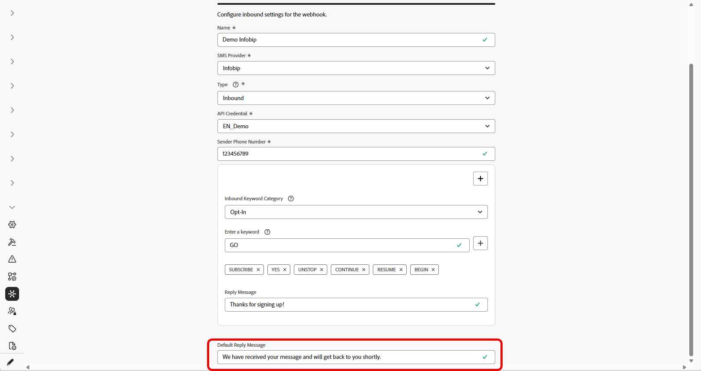
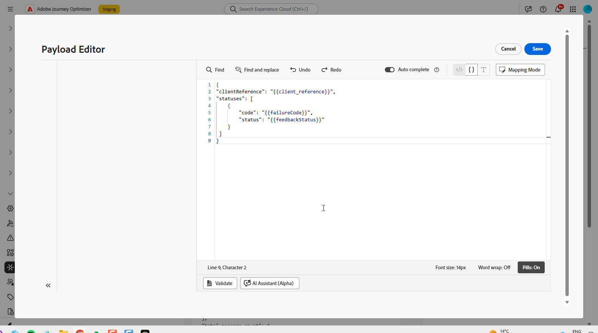

# Erstellen eines Webhook {#webhook}

>[!CONTEXTUALHELP]
>id="ajo_channels_sms_webhook_settings_create"
>title="SMS-Webhook erstellen"
>abstract="Sie können Webhooks konfigurieren, um eingehende Antworten für die Verwaltung des Opt-in- und Opt-out-Einverständnisses zu erfassen und Versandberichte einschließlich Lesebestätigungen zu erhalten, sofern verfügbar."

>[!CONTEXTUALHELP]
>id="ajo_admin_sms_webhook_flow_type"
>title="Webhook-Typ auswählen"
>abstract="Wählen Sie beim Einrichten eines Webhooks &quot;**&quot;,** Einverständnisantworten und Benutzervoreinstellungen zu erfassen, oder &quot;**[!UICONTROL &quot;,]** Versand- und Interaktionsereignisse für Berichte und Analysen zu verfolgen."

>[!BEGINSHADEBOX]

Wenn in Journey Optimizer neue API-Anmeldeinformationen erstellt werden, können jetzt mit SMS-Webhooks sowohl eingehende Keywords als auch Feedback-Ereignisse wie Sendungen und Fehler erfasst werden. Da jeder Anbieter unterschiedliche Funktionen hat, gibt es separate Anweisungen zum Aktivieren von Webhooks.
Da Webhooks jetzt benutzerdefinierte Anbieter unterstützen, ist es jetzt möglich, Feedback und eingehende Keyword-Erfassung von jedem Anbieter zu erfassen, der in Journey Optimizer gemeldet und behandelt werden soll.

* **Neukunden:** Anweisungen hier können befolgt werden, um SMS-Webhooks korrekt zu konfigurieren.

* **Bestehende Kunden:** Sie können von in API-Anmeldeinformationen gespeicherten Informationen zu Webhooks migrieren, und es gibt keinen Zeitplan für die Migration durch Kunden. Bestehende Kunden, die nicht zu SMS-Webhooks migrieren möchten, müssen die Migrationsschritte ausführen, wie im Migrationshandbuch dokumentiert.

>[!ENDSHADEBOX]

## Überblick {#overview}

Nachdem Ihre API-Anmeldeinformationen erfolgreich erstellt wurden, können Sie jetzt Webhooks konfigurieren, um eingehende Antworten für die Verwaltung des Opt-in- und Opt-out-Einverständnisses zu erfassen und Versandberichte einschließlich Lesebestätigungen zu erhalten, sofern verfügbar.

Beim Einrichten eines Webhooks können Sie seinen Zweck basierend auf dem Typ der Daten definieren, die Sie erfassen möchten:

* **Eingehend**: Verwenden Sie diese Option, wenn Sie Einverständnisantworten wie Opt-ins oder Opt-outs und Benutzereinstellungen erfassen möchten.

* **Feedback**: Wählen Sie diese Option, um Versand- und Interaktionsereignisse zu verfolgen, einschließlich Sendungen, ausgehende Fehler, Lesebestätigungen (falls zutreffend), um Berichte und Analysen zu unterstützen.

Je nach Anbieter werden unterschiedliche Erwartungen an die Komponenten gestellt, die für eine erfolgreiche SMS-Implementierung eingerichtet werden müssen:

* **Sinch und Sinch Conversational**: Erstellen Sie einen Webhook, der sowohl eingehende als auch Feedback-Ereignisse verarbeitet. Es ist keine Payload-Konfiguration erforderlich.

* **Infobip**: Erstellen Sie zwei separate Webhooks, einen für eingehende Ereignisse und einen für Feedback-Ereignisse. Für keinen der Webhooks ist eine Payload-Konfiguration erforderlich.

* **Twilio**: Webhooks sind nicht verfügbar. Eingehende und Feedback-Datenerfassung wird nicht unterstützt.

* **Benutzerdefinierter Anbieter**: Erstellen Sie zwei separate Webhooks, einen für eingehende Ereignisse und einen für Feedback-Ereignisse. Die Payload-Konfiguration ist erforderlich, damit beide Webhooks ordnungsgemäß funktionieren.

### Provider-Support {#provider-support}

>[!NOTE]
>
>Das einzige unterstützte Webhook-Format ist JSON. Formulardaten für Webhooks werden nicht unterstützt.

Die folgende Tabelle zeigt, welche Anbieter eingehende und Feedback-Webhooks unterstützen und ob eine Payload-Erstellung erforderlich ist:

| Anbieter | Webhook für eingehende Nachrichten | Feedback Webhook | Suchbegriffe | Payload-Erstellung erforderlich | Webhook erforderlich | Payload-Erstellung |
| --- | --- | --- | --- | --- | --- | --- |
| Infobip | Konfigurierbar | Konfigurierbar | Konfigurierbar | Nicht erforderlich | Erforderlich | Nicht erforderlich |
| Sinch | Konfigurierbar | Konfigurierbar | Konfigurierbar | Nicht erforderlich | Nein. Integriert | K. A. |
| Sinch Conversational | Konfigurierbar | Konfigurierbar | Konfigurierbar | Nicht erforderlich | Nein. Integriert | K. A. |
| Twilio | Nicht verfügbar | Nicht verfügbar | Nicht verfügbar | Nicht verfügbar | Nicht verfügbar | K. A. |
| Benutzerspezifisch | Konfigurierbar | Konfigurierbar | Konfigurierbar | Erforderlich | Erforderlich | Erforderlich |

Für Kunden, die von API-Anmeldeinformationen zu SMS-Webhooks wechseln, finden Sie Informationen zum Migrationspfad im Migrationshandbuch.

## Webhook erstellen

### Für Sinch und Sinch Conversational {#create-webhook-sinch}

Erstellen Sie für Sinch und Sinch Conversational einen einzigen Webhook, der sowohl eingehende als auch Feedback-Ereignisse verarbeitet. Es ist keine benutzerdefinierte Payload-Konfiguration erforderlich.

1. Navigieren Sie in der linken Leiste zu **[!UICONTROL Administration]** `>` **[!UICONTROL Kanäle]**, wählen Sie das Menü **[!UICONTROL SMS-Webhooks]** unter **[!UICONTROL SMS-Einstellungen]** aus und klicken Sie auf die Schaltfläche **[!UICONTROL Webhook erstellen]**.

   

1. Konfigurieren Sie Ihre Webhook-Einstellungen, wie unten beschrieben:

   * **[!UICONTROL Name]**: Geben Sie einen Namen für Ihren Webhook ein.

   * **[!UICONTROL SMS-Anbieter auswählen]**: Sinch oder Sinch Conversational.

   * **[!UICONTROL API-Anmeldedaten]**: Wählen Sie aus der Dropdown-Liste die [zuvor konfigurierten API-Anmeldedaten](sms-configuration-sinch.md) aus.

   * **[!UICONTROL Absender-Telefonnummer]**: Geben Sie die Absender-Telefonnummer ein, die Sie für Ihre Kommunikation verwenden möchten.

   

1. Beginnen Sie mit der Einrichtung der eingehenden Keywords, indem Sie Keywords in das Feld **[!UICONTROL Enter a Keyword]** eingeben. Mehrere Keywords können hinzugefügt und entfernt werden. Beachten Sie, dass bei Schlüsselwörtern nicht zwischen Groß- und Kleinschreibung unterschieden wird.

   

1. Wählen Sie eine Schlüsselwortkategorie aus der Dropdown **[!UICONTROL Liste „Eingehende]**&quot; aus, um Folgendes zu konfigurieren:

   * &#x200B;
     +++ Opt-in

      * Aktivieren von Keywords, die Benutzer mit deren Zustimmung anmelden. Wenn die Nachricht eines Benutzers mit einem konfigurierten Schlüsselwort übereinstimmt, wird seine Telefonnummer für den Empfang von SMS-Nachrichten angemeldet.

      * Standardmäßig sind die folgenden Schlüsselwörter aktiviert: Abonnieren, Ja, Stoppen, Fortsetzen, Fortsetzen und Starten. Entfernen Sie alle Standardschlüsselwörter, indem Sie auf  klicken.

      * Verwenden Sie das Feld **[!UICONTROL Antwortnachricht]**, um eine Nachricht zu erstellen, die automatisch gesendet wird, wenn die eingehende Nachricht eines Benutzers mit einem Opt-in-Schlüsselwort übereinstimmt.

   +++

   * &#x200B;
     +++ Opt-out

      * Aktivieren Sie Schlüsselwörter, die Benutzer abmelden und die Zustimmung zum Senden von Textnachrichten entfernen. Wenn die Nachricht eines Benutzers mit einem konfigurierten Schlüsselwort übereinstimmt, wird seine Telefonnummer vom Erhalt von SMS-Nachrichten abgemeldet.

      * Standardmäßig sind die folgenden Keywords aktiviert: STOP, QUIT, CANCEL, END, UNSUBSCRIBE, NO. Entfernen Sie alle Standardschlüsselwörter, indem Sie auf  klicken.

      * Verwenden Sie das Feld **[!UICONTROL Antwortnachricht]**, um eine Nachricht zu erstellen, die automatisch gesendet wird, wenn die eingehende Nachricht eines Benutzers mit einem Opt-out-Schlüsselwort übereinstimmt.

      * Aktivieren Sie **[!UICONTROL Fuzzy Logic]**, um ähnliche Keywords wie konfigurierte Opt-out-Keywords zu erkennen. Wenn die Antwort eines Benutzers nahe, aber nicht genau ist, wird die im Feld **[!UICONTROL Ungenaue automatische Antwort]** eingegebene Nachricht gesendet. In der Regel zeigt diese Meldung an, dass die Abmeldung nicht stattgefunden hat, und gibt das genaue Keyword an, das zum Abmelden erforderlich ist.

   +++

   * &#x200B;
     +++ Double-Opt-in

      * Aktivieren Sie Schlüsselwörter für die Anmeldeanforderung mit zweifacher Bestätigung. Wenn die Nachricht eines/r Benutzenden mit einem konfigurierten Keyword übereinstimmt, werden sie zu diesem Zeitpunkt nicht vollständig angemeldet. Dieser zweistufige Einverständnis-Workflow erfordert, dass Benutzer ihr Opt-in mit einem zweiten Schlüsselwort bestätigen.

      * Verwenden Sie das Feld **[!UICONTROL Antwortnachricht]**, um eine Nachricht zu erstellen, die automatisch gesendet wird, wenn ein doppeltes Opt-in-Schlüsselwort zugeordnet wird. Diese Meldung weist den Benutzer an, ein Opt-in-Schlüsselwort einzugeben, um den Opt-in-Prozess abzuschließen.

   +++

   * &#x200B;
     +++ Hilfe

      * Aktivieren von Schlüsselwörtern, die eine Standardantwort liefern, wenn Hilfe angefordert wird. Wenn die Nachricht eines Benutzers mit einem konfigurierten Schlüsselwort übereinstimmt, erhält er die Hilfe-Antwortnachricht.

      * Standardmäßig sind die folgenden Schlüsselwörter aktiviert: Hilfe, Info, Informationen. Entfernen Sie alle Standardschlüsselwörter, indem Sie auf  klicken.

      * Verwenden Sie das Feld **[!UICONTROL Antwortnachricht]**, um eine Nachricht zu erstellen, die automatisch gesendet wird, wenn die eingehende Nachricht eines Benutzers mit einem „Hilfe“-Schlüsselwort übereinstimmt.

   +++

   * &#x200B;
     +++ Benutzerspezifisch

      * Konfigurieren Sie ein einzelnes benutzerdefiniertes Keyword. Wenn die Nachricht eines Benutzers mit diesem Keyword übereinstimmt, wird das Keyword in den Datensatz **[!UICONTROL Nachrichten-Feedback-Tracking]** zum Erstellen von Berichten und Zielgruppen geschrieben.

      * Erstellen Sie eine Zielgruppe (Streaming oder Batch), die auf dieses Keyword zur Verwendung in Ihren Journey und Kampagnen verweist.

   +++

1. Geben Sie eine **[!UICONTROL Standardantwortnachricht]** ein. Diese Nachricht wird automatisch gesendet, wenn die Antwort eines Benutzers mit keinem konfigurierten Schlüsselwort übereinstimmt.

   

1. Klicken Sie **[!UICONTROL Senden]**, um Ihre Webhook-Konfiguration zu speichern.

1. Über das **[!UICONTROL Webhooks]**-Menü können Sie vorhandene Webhooks bearbeiten oder löschen.

1. Greifen Sie auf Ihren neu erstellten Webhook zu und kopieren Sie die **[!UICONTROL Webhook-URL]**.

   

1. Verwenden Sie Ihre **[!UICONTROL Webhook]** URL), um zu ermöglichen **dass** Feedback- und **Inbound**-Ereignisse in Journey Optimizer eingehen.

   * Für den SMS-Kanal [weitere Informationen finden Sie in der Sinch-Dokumentation](https://community.sinch.com/t5/SMS/How-do-I-assign-a-callback-URL-to-an-SMS-service/ta-p/8414)

   * Für den MMS-Kanal [weitere Informationen finden Sie in der Sinch-Dokumentation](https://developers.sinch.com/docs/conversation/getting-started#5-handle-incoming-messages)

   * Kunden, die SMS direkt über Journey Optimizer erworben haben, reichen ein Support-Ticket beim Adobe-Support ein. Das Adobe-Konto-Team konfiguriert die Webhook-URL für Sie.
     

Wenn Ihr Webhook API-Anmeldeinformationen verwendet, die an eine vorhandene Kanalkonfiguration angehängt sind, wird der Webhook sofort wirksam. Erstellen Sie andernfalls eine neue Kanalkonfiguration.

➡️[Weitere Informationen zur Kanalkonfiguration](sms-configuration-surface.md)

### Für Infobip {#create-webhook-infobip}

Erstellen Sie für Infobip zwei separate Webhooks, einen für Feedback-Ereignisse und einen für eingehende Ereignisse.

1. Navigieren Sie in der linken Leiste zu **[!UICONTROL Administration]** `>` **[!UICONTROL Kanäle]**, wählen Sie das Menü **[!UICONTROL SMS-Webhooks]** unter **[!UICONTROL SMS-Einstellungen]** aus und klicken Sie auf die Schaltfläche **[!UICONTROL Webhook erstellen]**.

   

1. Konfigurieren Sie Ihre Webhook-Einstellungen, wie unten beschrieben:

   * **[!UICONTROL Name]**: Geben Sie einen Namen für Ihren Webhook ein.

   * **[!UICONTROL SMS-Anbieter auswählen]**: Infobip.

   * **[!UICONTROL Typ]**: Wählen Sie entweder „Feedback“ oder „Eingehend“. Sie müssen beide separat erstellen. Hier beginnen wir mit Inbound.

   * **[!UICONTROL API-Anmeldedaten]**: Wählen Sie aus der Dropdown-Liste die [zuvor konfigurierten API-Anmeldedaten](sms-configuration-infobip.md#api-credential) aus.

   * **[!UICONTROL Absender-Telefonnummer]**: Geben Sie die Absender-Telefonnummer ein, die Sie für Ihre Kommunikation verwenden möchten.

   

1. Beginnen Sie mit der Einrichtung der eingehenden Keywords, indem Sie Keywords in das Feld **[!UICONTROL Enter a Keyword]** eingeben. Mehrere Keywords können hinzugefügt und entfernt werden. Beachten Sie, dass bei Schlüsselwörtern nicht zwischen Groß- und Kleinschreibung unterschieden wird.

   

1. Wählen Sie eine Schlüsselwortkategorie aus der Dropdown **[!UICONTROL Liste „Eingehende]**&quot; aus, um Folgendes zu konfigurieren:

   * &#x200B;
     +++ Opt-in

      * Aktivieren von Keywords, die Benutzer mit deren Zustimmung anmelden. Wenn die Nachricht eines Benutzers mit einem konfigurierten Schlüsselwort übereinstimmt, wird seine Telefonnummer für den Empfang von SMS-Nachrichten angemeldet.

      * Standardmäßig sind die folgenden Schlüsselwörter aktiviert: Abonnieren, Ja, Stoppen, Fortsetzen, Fortsetzen und Starten. Entfernen Sie alle Standardschlüsselwörter, indem Sie auf  klicken.

      * Verwenden Sie das Feld **[!UICONTROL Antwortnachricht]**, um eine Nachricht zu erstellen, die automatisch gesendet wird, wenn die eingehende Nachricht eines Benutzers mit einem Opt-in-Schlüsselwort übereinstimmt.

   +++

   * &#x200B;
     +++ Opt-out

      * Aktivieren Sie Schlüsselwörter, die Benutzer abmelden und die Zustimmung zum Senden von Textnachrichten entfernen. Wenn die Nachricht eines Benutzers mit einem konfigurierten Schlüsselwort übereinstimmt, wird seine Telefonnummer vom Erhalt von SMS-Nachrichten abgemeldet.

      * Standardmäßig sind die folgenden Keywords aktiviert: STOP, QUIT, CANCEL, END, UNSUBSCRIBE, NO. Entfernen Sie alle Standardschlüsselwörter, indem Sie auf  klicken.

      * Verwenden Sie das Feld **[!UICONTROL Antwortnachricht]**, um eine Nachricht zu erstellen, die automatisch gesendet wird, wenn die eingehende Nachricht eines Benutzers mit einem Opt-out-Schlüsselwort übereinstimmt.

      * Aktivieren Sie **[!UICONTROL Fuzzy Logic]**, um ähnliche Keywords wie konfigurierte Opt-out-Keywords zu erkennen. Wenn die Antwort eines Benutzers nahe, aber nicht genau ist, wird die im Feld **[!UICONTROL Ungenaue automatische Antwort]** eingegebene Nachricht gesendet. In der Regel zeigt diese Meldung an, dass die Abmeldung nicht stattgefunden hat, und gibt das genaue Keyword an, das zum Abmelden erforderlich ist.

   +++

   * &#x200B;
     +++ Double-Opt-in

      * Aktivieren Sie Schlüsselwörter für die Anmeldeanforderung mit zweifacher Bestätigung. Wenn die Nachricht eines/r Benutzenden mit einem konfigurierten Keyword übereinstimmt, werden sie zu diesem Zeitpunkt nicht vollständig angemeldet. Dieser zweistufige Einverständnis-Workflow erfordert, dass Benutzer ihr Opt-in mit einem zweiten Schlüsselwort bestätigen.

      * Verwenden Sie das Feld **[!UICONTROL Antwortnachricht]**, um eine Nachricht zu erstellen, die automatisch gesendet wird, wenn ein doppeltes Opt-in-Schlüsselwort zugeordnet wird. Diese Meldung weist den Benutzer an, ein Opt-in-Schlüsselwort einzugeben, um den Opt-in-Prozess abzuschließen.

   +++

   * &#x200B;
     +++ Hilfe

      * Aktivieren von Schlüsselwörtern, die eine Standardantwort liefern, wenn Hilfe angefordert wird. Wenn die Nachricht eines Benutzers mit einem konfigurierten Schlüsselwort übereinstimmt, erhält er die Hilfe-Antwortnachricht.

      * Standardmäßig sind die folgenden Schlüsselwörter aktiviert: Hilfe, Info, Informationen. Entfernen Sie alle Standardschlüsselwörter, indem Sie auf  klicken.

      * Verwenden Sie das Feld **[!UICONTROL Antwortnachricht]**, um eine Nachricht zu erstellen, die automatisch gesendet wird, wenn die eingehende Nachricht eines Benutzers mit einem „Hilfe“-Schlüsselwort übereinstimmt.

   +++

   * &#x200B;
     +++ Benutzerspezifisch

      * Konfigurieren Sie ein einzelnes benutzerdefiniertes Keyword. Wenn die Nachricht eines Benutzers mit diesem Keyword übereinstimmt, wird das Keyword in den Datensatz **[!UICONTROL Nachrichten-Feedback-Tracking]** zum Erstellen von Berichten und Zielgruppen geschrieben.

      * Erstellen Sie eine Zielgruppe (Streaming oder Batch), die auf dieses Keyword zur Verwendung in Ihren Journey und Kampagnen verweist.

   +++

1. Geben Sie eine **[!UICONTROL Standardantwortnachricht]** ein. Diese Nachricht wird automatisch gesendet, wenn die Antwort eines Benutzers mit keinem konfigurierten Schlüsselwort übereinstimmt.

   

1. Klicken Sie **[!UICONTROL Senden]**, um Ihre Webhook-Konfiguration zu speichern.

1. Im Menü **[!UICONTROL Webhooks]** müssen Sie jetzt einen **Feedback**-Webhook für Infobip erstellen.

1. Konfigurieren Sie Ihre Webhook-Einstellungen, wie unten beschrieben:

   * **[!UICONTROL Name]**: Geben Sie einen Namen für Ihren Webhook ein.

   * **[!UICONTROL SMS-Anbieter auswählen]**: Infobip.

   * **[!UICONTROL type]**: Wählen Sie Feedback.

   

1. Klicken Sie **[!UICONTROL Senden]**, um Ihre Konfiguration für den Feedback-Webhook zu speichern.

1. Über das **[!UICONTROL Webhooks]**-Menü können Sie vorhandene Webhooks bearbeiten oder löschen.

1. Greifen Sie auf Ihre neu erstellten Webhooks zu und kopieren Sie **[!UICONTROL Webhook-URL]** aus jedem Ihrer Webhooks.

   

1. Sie können diese URLs jetzt verwenden, um beide Callback-URLs zu aktivieren und Feedback- sowie eingehende Ereignisse in Journey Optimizer zu übertragen.

Wenn Ihr Webhook API-Anmeldeinformationen verwendet, die an eine vorhandene Kanalkonfiguration angehängt sind, wird der Webhook sofort wirksam. Erstellen Sie andernfalls eine neue Kanalkonfiguration.

➡️[Weitere Informationen zur Kanalkonfiguration](sms-configuration-surface.md)

### Für benutzerdefinierten Anbieter {#create-webhook-custom}

Erstellen Sie für benutzerdefinierte SMS-Anbieter zwei separate Webhooks, einen für Feedback-Ereignisse und einen für eingehende Ereignisse.

1. Navigieren Sie in der linken Leiste zu **[!UICONTROL Administration]** `>` **[!UICONTROL Kanäle]**, wählen Sie das Menü **[!UICONTROL SMS-Webhooks]** unter **[!UICONTROL SMS-Einstellungen]** aus und klicken Sie auf die Schaltfläche **[!UICONTROL Webhook erstellen]**.

   

1. Konfigurieren Sie Ihre Webhook-Einstellungen, wie unten beschrieben:

   * **[!UICONTROL Name]**: Geben Sie einen Namen für Ihren Webhook ein.

   * **[!UICONTROL SMS-Anbieter auswählen]**: Benutzerdefiniert.

   * **[!UICONTROL Typ]**: Wählen Sie entweder „Feedback“ oder „Eingehend“. Sie müssen beide separat erstellen. Hier beginnen wir mit Inbound.

   * **[!UICONTROL API-Anmeldedaten]**: Wählen Sie aus der Dropdown-Liste die [zuvor konfigurierten API-Anmeldedaten](sms-configuration-custom.md) aus.

   * **[!UICONTROL Absender-Telefonnummer]**: Geben Sie die Absender-Telefonnummer ein, die Sie für Ihre Kommunikation verwenden möchten.

   

1. Beginnen Sie mit der Einrichtung der eingehenden Keywords, indem Sie Keywords in das Feld **[!UICONTROL Enter a Keyword]** eingeben. Mehrere Keywords können hinzugefügt und entfernt werden. Beachten Sie, dass bei Schlüsselwörtern nicht zwischen Groß- und Kleinschreibung unterschieden wird.

   

1. Wählen Sie eine Schlüsselwortkategorie aus der Dropdown **[!UICONTROL Liste „Eingehende]**&quot; aus, um Folgendes zu konfigurieren:

   * &#x200B;
     +++ Opt-in

      * Aktivieren von Keywords, die Benutzer mit deren Zustimmung anmelden. Wenn die Nachricht eines Benutzers mit einem konfigurierten Schlüsselwort übereinstimmt, wird seine Telefonnummer für den Empfang von SMS-Nachrichten angemeldet.

      * Standardmäßig sind die folgenden Schlüsselwörter aktiviert: Abonnieren, Ja, Stoppen, Fortsetzen, Fortsetzen und Starten. Entfernen Sie alle Standardschlüsselwörter, indem Sie auf  klicken.

      * Verwenden Sie das Feld **[!UICONTROL Antwortnachricht]**, um eine Nachricht zu erstellen, die automatisch gesendet wird, wenn die eingehende Nachricht eines Benutzers mit einem Opt-in-Schlüsselwort übereinstimmt.

   +++

   * &#x200B;
     +++ Opt-out

      * Aktivieren Sie Schlüsselwörter, die Benutzer abmelden und die Zustimmung zum Senden von Textnachrichten entfernen. Wenn die Nachricht eines Benutzers mit einem konfigurierten Schlüsselwort übereinstimmt, wird seine Telefonnummer vom Erhalt von SMS-Nachrichten abgemeldet.

      * Standardmäßig sind die folgenden Keywords aktiviert: STOP, QUIT, CANCEL, END, UNSUBSCRIBE, NO. Entfernen Sie alle Standardschlüsselwörter, indem Sie auf  klicken.

      * Verwenden Sie das Feld **[!UICONTROL Antwortnachricht]**, um eine Nachricht zu erstellen, die automatisch gesendet wird, wenn die eingehende Nachricht eines Benutzers mit einem Opt-out-Schlüsselwort übereinstimmt.

      * Aktivieren Sie **[!UICONTROL Fuzzy Logic]**, um ähnliche Keywords wie konfigurierte Opt-out-Keywords zu erkennen. Wenn die Antwort eines Benutzers nahe, aber nicht genau ist, wird die im Feld **[!UICONTROL Ungenaue automatische Antwort]** eingegebene Nachricht gesendet. In der Regel zeigt diese Meldung an, dass die Abmeldung nicht stattgefunden hat, und gibt das genaue Keyword an, das zum Abmelden erforderlich ist.

   +++

   * &#x200B;
     +++ Double-Opt-in

      * Aktivieren Sie Schlüsselwörter für die Anmeldeanforderung mit zweifacher Bestätigung. Wenn die Nachricht eines/r Benutzenden mit einem konfigurierten Keyword übereinstimmt, werden sie zu diesem Zeitpunkt nicht vollständig angemeldet. Dieser zweistufige Einverständnis-Workflow erfordert, dass Benutzer ihr Opt-in mit einem zweiten Schlüsselwort bestätigen.

      * Verwenden Sie das Feld **[!UICONTROL Antwortnachricht]**, um eine Nachricht zu erstellen, die automatisch gesendet wird, wenn ein doppeltes Opt-in-Schlüsselwort zugeordnet wird. Diese Meldung weist den Benutzer an, ein Opt-in-Schlüsselwort einzugeben, um den Opt-in-Prozess abzuschließen.

   +++

   * &#x200B;
     +++ Hilfe

      * Aktivieren von Schlüsselwörtern, die eine Standardantwort liefern, wenn Hilfe angefordert wird. Wenn die Nachricht eines Benutzers mit einem konfigurierten Schlüsselwort übereinstimmt, erhält er die Hilfe-Antwortnachricht.

      * Standardmäßig sind die folgenden Schlüsselwörter aktiviert: Hilfe, Info, Informationen. Entfernen Sie alle Standardschlüsselwörter, indem Sie auf  klicken.

      * Verwenden Sie das Feld **[!UICONTROL Antwortnachricht]**, um eine Nachricht zu erstellen, die automatisch gesendet wird, wenn die eingehende Nachricht eines Benutzers mit einem „Hilfe“-Schlüsselwort übereinstimmt.

   +++

   * &#x200B;
     +++ Benutzerspezifisch

      * Konfigurieren Sie ein einzelnes benutzerdefiniertes Keyword. Wenn die Nachricht eines Benutzers mit diesem Keyword übereinstimmt, wird das Keyword in den Datensatz **[!UICONTROL Nachrichten-Feedback-Tracking]** zum Erstellen von Berichten und Zielgruppen geschrieben.

      * Erstellen Sie eine Zielgruppe (Streaming oder Batch), die auf dieses Keyword zur Verwendung in Ihren Journey und Kampagnen verweist.

   +++

1. Geben Sie eine **[!UICONTROL Standardantwortnachricht]** ein. Diese Nachricht wird automatisch gesendet, wenn die Antwort eines Benutzers mit keinem konfigurierten Schlüsselwort übereinstimmt.

   

1. Erstellen Sie eine benutzerdefinierte Payload, die der JSON des Anbieters entspricht. Beachten Sie, dass nur JSON als Webhook-Format unterstützt wird. Formulardaten für Webhooks werden nicht unterstützt.

   Der eingehende Webhook erfordert die folgenden Felder, um Werte vom Webhook Ihres Anbieters zu erhalten:

   * **InboundMessage**: Die eingehende Nachricht oder das Keyword, die bzw. das vom Benutzer empfangen wurde.
   * **ProfileNumber**: Die Telefonnummer des Benutzers, der die Nachricht gesendet hat.
   * **RequestID**: Eine eindeutige Kennung, die von Ihrem SMS-Anbieter bereitgestellt wird, um eine bestimmte Transaktion zu identifizieren.
   * **OriginTimestamp**: Der Zeitstempel, wann die Nachricht empfangen wurde, im UTC-Format.
   * **InboundNumber**: Die für diese Webhook-Konfiguration verwendete Telefonnummer.

   +++Payload-Beispiel

       „json
       &lbrace;
       „inboundMessage“: &quot;{{inboundMessage}}&quot;,
       „profileNumber“: &quot;{{profileNumber}}&quot;,
       „requestId“: &quot;{{requestId}}&quot;,
       „originTimestamp“: &quot;{{originTimestamp}}&quot;,
       „inboundNumber“: &quot;{{inboundNumber}}&quot;
       &rbrace;
       &quot;
   +++

1. Wenn Sie Ihre JSON-Datei erstellt haben, klicken Sie auf **[!UICONTROL Payload-Editor anzeigen]** kopieren Sie dann Ihre JSON-Payload in den Editor und speichern Sie sie.

   

1. Klicken Sie **[!UICONTROL Senden]**, um Ihre Webhook-Konfiguration zu speichern.

1. Im Menü **[!UICONTROL Webhooks]** müssen Sie jetzt einen **Feedback**-Webhook für den benutzerdefinierten Anbieter erstellen.

1. Konfigurieren Sie Ihre Webhook-Einstellungen, wie unten beschrieben:

   * **[!UICONTROL Name]**: Geben Sie einen Namen für Ihren Webhook ein.

   * **[!UICONTROL SMS-Anbieter auswählen]**: Benutzerdefiniert.

   * **[!UICONTROL type]**: Wählen Sie Feedback.

   

1. Erstellen Sie eine benutzerdefinierte Payload, die dem JSON-Format Ihres Anbieters entspricht. Beachten Sie, dass nur JSON als Webhook-Format unterstützt wird. Formulardaten für Webhooks werden nicht unterstützt.

   Der Feedback-Webhook erfordert die folgenden Felder, um Werte vom Webhook Ihres Anbieters zu erhalten:

   * **Client-Referenz**: Eine eindeutige Kennung, die zu Protokollierungszwecken in der Payload zurückgegeben wird.
   * **Code**: Der von Ihrem SMS-Anbieter bereitgestellte Fehlercode.
   * **Status**: Der von Ihrem SMS-Anbieter bereitgestellte Fehlerstatus.

   +++Payload-Beispiel

       „json
       &lbrace;
       „clientReference“: &quot;{{client_reference}}&quot;,
       „status“: &lbrack;
       &lbrace;
       „code“: &quot;{{failureCode}}&quot;,
       „status“: &quot;{{feedbackStatus}}&quot;
       &rbrace;
       &rbrack;
       &rbrace;
       &quot;
   
   +++

1. Klicken Sie **[!UICONTROL Payload-Editor anzeigen]** kopieren Sie dann Ihre JSON-Payload in den Editor und speichern Sie sie.

   

1. Klicken Sie **[!UICONTROL Senden]**, um Ihre Konfiguration für den Feedback-Webhook zu speichern.

1. Über das **[!UICONTROL Webhooks]**-Menü können Sie vorhandene Webhooks bearbeiten oder löschen.

1. Greifen Sie auf Ihre neu erstellten Webhooks zu und kopieren Sie **[!UICONTROL Webhook-URL]** aus jedem Ihrer Webhooks.

1. Konfigurieren Sie Ihren SMS-Anbieter, um **Feedback** und **Inbound**-Ereignisse an diese Webhook-URLs in Journey Optimizer zu senden.

   Konfigurationsanweisungen variieren je nach SMS-Anbieter. Einzelheiten zum Einrichten von Callback-URLs finden Sie in der Dokumentation Ihres Anbieters.

Wenn Ihr Webhook API-Anmeldeinformationen verwendet, die an eine vorhandene Kanalkonfiguration angehängt sind, wird der Webhook sofort wirksam. Erstellen Sie andernfalls eine neue Kanalkonfiguration.

➡️[Weitere Informationen zur Kanalkonfiguration](sms-configuration-surface.md)
