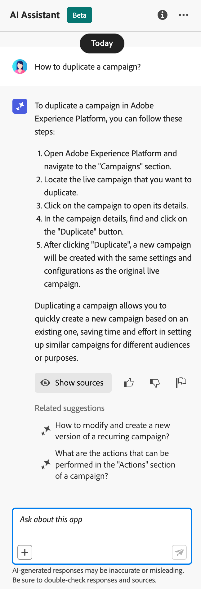

# KI und intelligente Funktionen {#ai-features}

Adobe Journey Optimizer nutzt die Leistungsfähigkeit von künstlicher Intelligenz und maschinellem Lernen, um außergewöhnliche Kundenerlebnisse zu erstellen, zu optimieren und bereitzustellen. Von der Generierung personalisierter Inhalte bis hin zur Vorhersage optimaler Versandzeiten optimieren die KI-Funktionen Ihren Workflow und maximieren die Wirkung. Anwendungsfall-Playbooks bieten vorgefertigte Vorlagen zur schnellen Implementierung gängiger Marketing-Szenarien.

## KI-Assistent {#ai-assistant}

AI Assistant ist Ihr Gesprächsleitfaden für Adobe Journey Optimizer. Damit erhalten Sie sofortige Antworten auf Fragen zu den Produktfunktionen, Einblicke in den Betrieb Ihrer Journey und können die Navigation auf der Plattform erleichtern.

### Zugriff auf den KI-Assistenten

Klicken Sie auf das Symbol KI-Assistent in der oberen Leiste, um das Bedienfeld „Assistent“ auf der rechten Seite des Bildschirms zu öffnen.

>[!IMPORTANT]
>
>Sie müssen den [Benutzerrichtlinien für generative KI von Adobe Experience Cloud zustimmen](https://experienceleague.adobe.com/de/docs/experience-platform/ai-assistant/home){target="_blank"} bevor Sie den KI-Assistenten verwenden.

### Was KI-Assistent tun kann

**Produktwissen** - Stellen Sie Fragen zu den Funktionen und Konzepten von Adobe Journey Optimizer:

* „Wie richte ich eine Kampagne in Adobe Journey Optimizer ein?“
* „Wie erstelle ich eine benutzerdefinierte Aktion zur Verwendung in Journey?“
* „Wie viele Live-Aktivitäten kann ich in einer Sandbox haben?“

**Operational Insights (Beta)** - Erhalten Sie Echtzeitinformationen über Ihre Journey:

* „Wie viele lebende Journey habe ich?“
* „Gib mir eine Liste aller geplanten Journey&quot;
* „Wie viele Journey wurden in den letzten sieben Tagen erstellt?“

>[!NOTE]
>
>Operative Einblicke sind derzeit nur für **Journey** verfügbar und spiegeln Daten aus Ihrer aktuellen Sandbox wider.

### Verwenden des KI-Assistenten

1. Geben Sie Ihre Frage in das Textfeld unten im Bedienfeld ein
2. Drücken Sie die Eingabetaste, um Ihre Abfrage zu senden
3. Überprüfen der KI-generierten Antwort
4. Klicken Sie auf **Quellen anzeigen**, um auf die zugehörige Dokumentation zuzugreifen
5. Daumen hoch/runter verwenden, um die Antwortqualität zu bewerten

{width="40%" align="left"}

[Erfahren Sie mehr über den KI-Assistenten in Experience Platform](https://experienceleague.adobe.com/de/docs/experience-platform/ai-assistant/home){target="_blank"}

## Erweiterte KI-Agenten für die Journey-Optimierung {#ai-agents}

Aufbauend auf den Gesprächsfunktionen des KI-Assistenten bietet Adobe Journey Optimizer spezialisierte KI-Agenten, die tiefgründige Analysen und umsetzbare Empfehlungen für die Journey-Optimierung und das Experimentieren bereitstellen.

### Journey Analyze Agent {#journey-agent}

Der [Journey Analyze Agent](https://experienceleague.adobe.com/de/docs/experience-cloud-ai/experience-cloud-ai/agents/ajo-agent-analyze){target="_blank"} unterstützt Sie bei der Optimierung der Journey-Leistung durch eine Analyse in natürlicher Sprache:

+++**Schlüsselfunktionen**

* **Journey-Fallout-Analyse** - Ermitteln Sie, wo und warum Kundinnen und Kunden während der Journey abbrechen, und erkennen Sie Abkoppelungsmuster
* **Erkennung von Zielgruppenüberschneidungen** - Analysieren Sie Zielgruppenüberschneidungen über mehrere Journey hinweg, um Überermüdung durch Targeting zu verhindern.
* **Konflikterkennung planen** - Identifizieren Sie Zeitkonflikte zwischen terminierten Journey, die dieselbe Zielgruppe ansprechen
* **Operative Einblicke** - Erhalten Sie sofortige Einblicke wie „Alle Live-Journey anzeigen“ oder „Welche Zielgruppen werden in mehr als X Journey verwendet?“

+++

+++**Beispielaufforderungen**

* „Fallout-Analyse für Journey durchführen \[Journey-Name\]&quot;
* „Gibt es Planungskonflikte für Journey \[Journey-Name\]?“
* „Konflikte bei Zielgruppenüberschneidungen für Journey zeigen \[Journey-Name\]&quot;
* „Welche Zielgruppen werden in mehr als fünf Journey verwendet?“

+++

+++**Berechtigungen erforderlich**

* **Journey anzeigen** - Einblicke in Journey direkt im KI-Assistenten anzeigen
* **Journey verwalten** - Erstellen Sie neue Journey direkt im KI-Assistenten
* **Segmente anzeigen** - Einblicke in Zielgruppen anzeigen
* **Segmente verwalten** - Erstellen neuer Zielgruppen direkt im KI-Assistenten

+++

### Experimentiermittel {#experimentation-agent}

Der [Experimentationsagent](https://experienceleague.adobe.com/de/docs/experience-cloud-ai/experience-cloud-ai/agents/agent-experiment){target="_blank"} modernisiert die Ausführung und Verwaltung digitaler Experimente auf Websites, E-Mails, Push-Nachrichten und Anwendungen:

+++**Schlüsselfunktionen**

* **Leistungsanalyse** - Klare Sicht auf die Ereignisse in den Experimenten
* **Insights-Generierung** - Erklärung, warum Ergebnisse aufgetreten sind
* **Opportunities Discovery** - Anleitung für die nächsten Aktionen
* **Inhaltsanalyse** - Untersuchen Sie Messaging-Elemente, um zu verstehen, warum bestimmte Behandlungen andere übertroffen haben
* **Empfehlungsgenerierung** - Vorschläge für neue Behandlungen oder Anpassungen auf der Grundlage von Einblicken

+++

+++**Beispielaufforderungen**

* „Welche Experimente werden für \[Kampagnenname\] ausgeführt?“
* „Welche Behandlung führt für mein \[Experimentname\]?“
* „Was haben wir von \[Experimentname\] gelernt?“
* „Was empfehle ich nach diesem Experiment als Nächstes zu tun?“
* „Welche allgemeinen Muster ergeben sich aus den jüngsten Tests?“

+++

+++**Berechtigungen erforderlich**

* **Experimente anzeigen** - Einblicke in Experimente im KI-Assistenten
* **Verwalten von Experimentmetadaten** - Erstellen neuer Experimente im KI-Assistenten

**Hinweis:** Verfügbar mit Journey Optimizer Experimentation Accelerator-Lizenz.

+++

### Zusätzliche KI-Agenten

**Audience Agent** - Für die konversative Audience-Exploration und -Verwaltung in Adobe Experience Platform, einschließlich Duplikaterkennung und Größenverfolgung. [Erfahren Sie mehr über Audience Agent](https://experienceleague.adobe.com/de/docs/experience-cloud-ai/experience-cloud-ai/agents/audience){target="_blank"}

**Agent Orchestrator** - Koordiniert mehrere spezialisierte Agenten, um komplexe, mehrstufige Marketing-Herausforderungen zu lösen. Der Orchestrator bestimmt automatisch, welche Agenten beteiligt werden sollen, und sequenziert ihre Arbeit effizient. [Erfahren Sie mehr über Agent Orchestrator](https://experienceleague.adobe.com/de/docs/experience-cloud-ai/experience-cloud-ai/agents/agent-orchestrator){target="_blank"}

## KI-gestützte Inhaltserstellung {#content-generation}

Verwenden Sie generative KI, um Inhalte über mehrere Kanäle hinweg zu erstellen und zu personalisieren, und beschleunigen Sie so Ihren Inhaltserstellungsprozess bei gleichzeitiger Wahrung der Markenkonsistenz. Der KI-Assistent für die Inhaltserstellung ist für [E-Mail](../email/get-started-email.md)-, [Push-](../push/get-started-push.md)-, [SMS](../sms/get-started-sms.md)- und [Web](../web/get-started-web.md)-Erlebnisse verfügbar, mit denen Sie Betreffzeilen, Textkörper, Bilder und vollständige Nachrichtenvarianten generieren können.

### Wichtigste Funktionen

* **Textgenerierung** - Erstellen Sie eine überzeugende Kopie basierend auf Ihrer Markensprache und Ihren Zielen. [Text mit KI generieren](../content-management/generative-text.md)
* **Bildgenerierung** - Generieren benutzerdefinierter Bilder mit Adobe Firefly. [Erzeugen von Bildern mit KI](../content-management/generative-image.md)
* **Inhaltsvarianten** - Erstellen Sie mehrere Varianten für A/B-Tests. [Inhaltsexperiment mit KI](../content-management/generative-experimentation.md)
* **Markenausrichtung** Stellen Sie sicher, dass der generierte Inhalt Ihren Markenrichtlinien entspricht. [Bewertung der Markenausrichtung](../content-management/brands-score.md)
* **Vorlagenunterstützung** - Nutzen Sie Ihre vorhandenen E-Mail-Vorlagen. [Arbeiten mit Inhaltsvorlagen](../content-management/content-templates.md)

### Best Practices

* **Spezifisch** - Bereitstellung klarer, detaillierter Eingabeaufforderungen für bessere Ergebnisse
* **Laden Sie Marken-Assets hoch** - Verwenden Sie PDFs, Bilder oder ZIP-Dateien (max. 50 MB), um die Markenkonsistenz zu gewährleisten
* **Benutzerdefinierte Vorlagen verwenden** - Nutzen Sie markenspezifische Vorlagen mit bis zu 8-10 Bildern
* **Feedback geben** - Output bewerten, um die KI-Modelle zu verbessern
* **Alle Inhalte überprüfen** - Überprüfen Sie KI-generierte Inhalte vor der Veröffentlichung immer auf Korrektheit.

[Weitere Informationen zur Inhaltserstellung mit KI](../content-management/gs-generative.md)

## Versandzeitoptimierung {#send-time-optimization}

Verwenden Sie KI, um den optimalen Zeitpunkt für den Versand jeder Nachricht basierend auf individuellen Kundenverhaltensmustern vorherzusagen und so die Interaktion zu maximieren.

### Funktionsweise

Die Sendezeitoptimierung analysiert historische Interaktionsdaten (Öffnungen und Klicks), um vorherzusagen, wann jeder Kunde mit der größten Wahrscheinlichkeit mit Ihren Nachrichten interagieren wird. Das System plant den Versand automatisch innerhalb des festgelegten Zeitfensters.

### Verwendungszeitpunkt

| Geeignet für | Nicht empfohlen für |
|----------|---------------------|
| Marketing-Kampagnen und Newsletter | Zeitkritische Betriebsmeldungen (Bestellbestätigungen, Kennwortzurücksetzung) |
| Werbebotschaften | Dringende Benachrichtigungen (Flugverspätungen, Notfallalarme) |
| Lehrreiche Inhalte | Ereignisbasierte Nachrichten mit spezifischen Timing-Anforderungen |
| Interaktionskampagnen | |

[Informationen zur Versandzeitoptimierung](../building-journeys/send-time-optimization.md)

## KI-Modelle für die Entscheidungsfindung {#ai-decisioning}

Erstellen Sie intelligente Ranking-Modelle, die automatisch optimieren, welche Angebote jedem Kunden angezeigt werden sollen, und maximieren Sie so Ihre Geschäftsziele.

### Modelltypen

**Automatische Optimierung** - Erlernt aus Kundeninteraktionen, um die Angebotsleistung im Laufe der Zeit automatisch zu verbessern

**Personalisierte Optimierung** - Nutzt Kundenprofilattribute und Verhaltensweisen, um für jede Person das beste Angebot vorherzusagen

### Anforderungen

* Mindestens 2 Angebote mit ausreichenden Interaktionsdaten:
   * Über 100 Anzeigeereignisse
   * Mehr als 5 Klickereignisse
   * Innerhalb der letzten 14 Tage
* Maximal 5 KI-Rangfolgemodelle pro Organisation

[Erfahren Sie mehr über KI-Modelle für die Entscheidungsfindung](../experience-decisioning/ranking/ai-models.md) | [Erstellen von KI-Rangfolgemodellen](../experience-decisioning/ranking/create-ai-models.md)

## Inhaltsexperimente mit KI {#experimentation}

**Experiment-Beschleuniger** hilft Ihnen, Experimente mit KI-gesteuerten Einblicken und Empfehlungen schneller durchzuführen und erfolgreichste Inhaltsvarianten schneller zu identifizieren.

Schlüsselfunktionen:

* Automatisches Generieren mehrerer Inhaltsvarianten
* KI-Empfehlungen für das Experimentdesign erhalten
* Frühzeitige Indikatoren für Leistungstrends
* Beschleunigung der Zeit bis zur statistischen Signifikanz

[Weitere Informationen zu Experiment Accelerator](../content-management/experiment-accelerator-gs.md)

## Anwendungsfall-Playbooks {#playbooks}

Anwendungsfall-Playbooks sind vorgefertigte Workflows, mit denen Sie gängige Marketing-Szenarien schnell implementieren können. Jedes Playbook enthält einsatzbereite Journey, Nachrichten, Schemata und Segmente.

### Funktionsweise von Playbooks

1. **Durchsuchen Sie** Playbook-Bibliothek, um Anwendungsfälle zu finden, die Ihren Zielen entsprechen
2. **Aktivieren** ein Playbook, um automatisch alle erforderlichen Ressourcen zu generieren
3. **Passen Sie** generierten Assets an Ihre Marke und Ihre Anforderungen an
4. **Bereitstellen** für die Produktion oder Testen in einer Entwicklungs-Sandbox

### Verfügbare Playbooks

Durchsuchen Sie Journey Optimizer-Playbooks nach gängigen Szenarien wie:

* Wiederherstellung bei Transaktionsabbruch
* Begrüßungsserie für neue Kunden
* Interaktion nach dem Kauf
* Geburtstagsnachrichten
* Rückgewinnungskampagnen

+++**Voraussetzungen**

* Sandbox mit entsprechenden Berechtigungen
* Kanalkonfigurationen für E-Mail, Push und/oder SMS
* Benutzerberechtigungen zum Erstellen von Journey und Nachrichten

+++

[Alle verfügbaren Playbooks anzeigen](https://experienceleague.adobe.com/docs/experience-platform/use-case-playbooks/playbooks/playbooks-list.html?lang=de){target="_blank"} | [Weitere Informationen finden Sie in der Dokumentation zu Experience Platform](https://experienceleague.adobe.com/docs/experience-platform/use-case-playbooks/playbooks/overview.html?lang=de){target="_blank"}

## Zusätzliche KI-Funktionen {#additional-capabilities}

### Bild-zu-HTML-Converter

Wandeln Sie statische Bilddesigns (JPEG, PNG) mithilfe der KI-gestützten Konvertierungstechnologie in bearbeitbare HTML-E-Mail-Vorlagen um.

[Weitere Informationen zu HTML von Bildern](../email/image-to-html.md)

### Bewertung der Markenausrichtung

Bewerten Sie, wie gut Ihre Inhalte mit Ihren Markenrichtlinien übereinstimmen, indem Sie eine KI-gestützte Bewertung verwenden, die die Konsistenz von Ton, Stimme und Botschaften misst.

[Weitere Informationen über die Markenausrichtung](../content-management/brands-score.md)

## Häufig gestellte Fragen {#faq}

+++**Welche Berechtigungen benötige ich für KI-Funktionen?**

* **[KI-Assistent für die Inhaltserstellung](#content-generation)** - Erfordert die Berechtigung „Inhalt generieren“
* **[KI-Assistent](#ai-assistant)** Produktwissen - Erfordert Zustimmung zu den Adobe Generative AI-Benutzerrichtlinien
* **[Journey Analyze Agent](#journey-agent)** - Erfordert die Berechtigungen &quot;Journey anzeigen/verwalten“ und „Segmente anzeigen/verwalten“
* **[Experimentationsagent](#experimentation-agent)**: Erfordert die Berechtigungen „Experimente anzeigen“ und „Experimentmetadaten verwalten“

Alle KI-Agenten benötigen Zugriff auf den KI-Assistenten und stimmen den Adobe Experience Cloud Generative AI-Benutzerrichtlinien zu.

[Informationen zu Berechtigungen](../administration/ootb-permissions.md)

+++

+++**Ist KI-generierter Inhalt immer korrekt?**

Nein. Überprüfen Sie [KI-generierte Inhalte](#content-generation) immer auf Genauigkeit und Markenangemessenheit. Verwenden Sie die Feedback-Tools (Daumen hoch/runter), um die Modelle zu verbessern.

+++

+++**Was sind die wichtigsten Einschränkungen?**

* **[Optimierung des Versandzeitpunkts](#send-time-optimization)** - Nur für E-Mails und Push-Benachrichtigungen in Journey verfügbar; erfordert einen 30-tägigen Schulungszeitraum
* **[KI-Inhaltserstellung](#content-generation)** - Nicht verfügbar für Briefpost, Inhaltskarten, LINE oder WhatsApp
* **[KI-Rangfolgemodelle](#ai-decisioning)** - Maximal 5 Modelle pro Organisation; erfordert minimale Interaktionsdaten

+++

+++**Wie erhalte ich Zugriff auf diese Funktionen?**

Die meisten KI-Funktionen sind in Adobe Journey Optimizer enthalten. Einige Funktionen wie [Sendezeitoptimierung](#send-time-optimization) oder [KI-Agenten](#ai-agents) müssen möglicherweise von Adobe aktiviert werden. Wenden Sie sich an den Adobe-Support, um weitere Informationen zu Ihrer spezifischen Lizenz und den verfügbaren Funktionen zu erhalten.

+++
