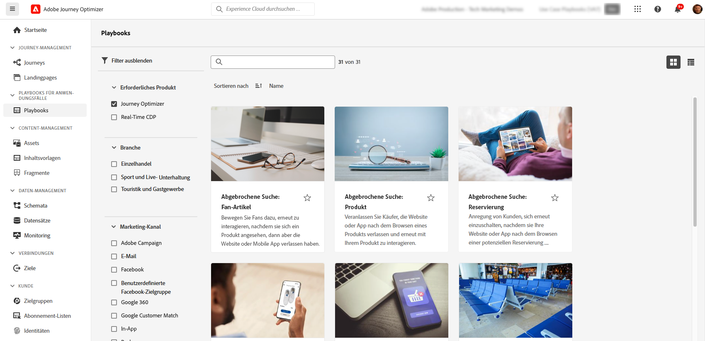

# KI und intelligente Funktionen {#ai-features}

Adobe Journey Optimizer nutzt die Leistungsfähigkeit von künstlicher Intelligenz und maschinellem Lernen, um die Erstellung, Optimierung und Bereitstellung von Kundenerlebnissen zu transformieren. Von der Generierung personalisierter Inhalte bis hin zur Vorhersage der optimalen Versandzeit: KI-Funktionen optimieren Ihren Workflow und maximieren die Wirkung. Anwendungsfall-Playbooks bieten vorkonfigurierte Vorlagen zur schnellen Implementierung gängiger Marketing-Szenarien.

## KI-Assistent {#ai-assistant}

Der KI-Assistent leitet Sie durch Dialoge in Adobe Journey Optimizer. Damit erhalten Sie sofortige Antworten auf Fragen zu den Produktfunktionen sowie betriebliche Erkenntnisse zu Ihren Journeys und können die Navigation auf der Plattform erleichtern.

### Zugriff auf den KI-Assistenten

Klicken Sie in der oberen Leiste auf das Symbol „KI-Assistent“, um das Panel „Assistent“ auf der rechten Seite des Bildschirms zu öffnen.

>[!IMPORTANT]
>
>Bevor Sie den KI-Assistenten verwenden können, müssen Sie den [Benutzerrichtlinien für generative KI in Adobe Experience Cloud](https://experienceleague.adobe.com/de/docs/experience-platform/ai-assistant/home){target="_blank"} zustimmen. 

### Das kann der KI-Assistent für Sie tun

**Produktwissen** – Stellen Sie Fragen zu den Funktionen und Konzepten von Adobe Journey Optimizer:

* „Wie richte ich eine Kampagne in Adobe Journey Optimizer ein?“
* „Wie erstelle ich eine benutzerdefinierte Aktion zur Verwendung in Journeys?“
* „Wie viele Live-Aktivitäten kann ich in einer Sandbox haben?“

**Betriebliche Erkenntnisse (Beta)** – Erhalten Sie Echtzeitinformationen über Ihre Journeys:

* „Wie viele Live-Journeys habe ich?“
* „Erstelle eine Liste aller geplanten Journeys“
* „Wie viele Journeys wurden in den letzten sieben Tagen erstellt?“

>[!NOTE]
>
>Betriebliche Erkenntnisse sind derzeit nur für **Journeys** verfügbar und spiegeln Daten aus Ihrer aktuellen Sandbox wider.

### Verwenden des KI-Assistenten

1. Geben Sie Ihre Frage unten im Panel in das Textfeld ein
2. Drücken Sie die Eingabetaste, um Ihre Frage zu senden
3. Überprüfen Sie die KI-generierte Antwort
4. Klicken Sie auf **Quellen anzeigen**, um auf die zugehörige Dokumentation zuzugreifen
5. Bewerten Sie die Antwortqualität mit einem Daumen nach oben/unten

{width="40%" align="left"}

[Weitere Informationen zum KI-Assistenten in Experience Platform](https://experienceleague.adobe.com/de/docs/experience-platform/ai-assistant/home){target="_blank"}

## Erweiterte AI Agents für die Journey-Optimierung {#ai-agents}

Aufbauend auf den Gesprächsfunktionen des KI-Assistenten bietet Adobe Journey Optimizer spezialisierte AI Agents, die detaillierte Analysen und umsetzbare Empfehlungen für die Journey-Optimierung und für Experimente bereitstellen.

### Journey Agent {#journey-agent}

Journey Agent umfasst zwei Kenntnisse im KI-Assistenten: Analysieren und Erstellen. Verwenden Sie sie, um bestehende Journey zu optimieren oder neue anhand von Eingabeaufforderungen in natürlicher Sprache zu erstellen.

+++**Erforderliche Berechtigungen**

* **Journeys anzeigen** – Zeigen Sie Erkenntnisse zu Journeys direkt im KI-Assistenten an
* **Journeys verwalten** – Erstellen Sie neue Journeys direkt im KI-Assistenten
* **Segmente anzeigen** - Einblicke in Zielgruppen anzeigen und vorhandene Zielgruppen suchen
* **Segmente verwalten** – Erstellen Sie neue Zielgruppen direkt im KI-Assistenten
* **Anzeigen von Journey-Ereignissen, Datenquellen und Aktionen** - Erforderlich für die Fähigkeit zum Erstellen, um Journey-Ereignisse und benutzerdefinierte Aktionen zu suchen

+++

#### Journey Analyze Skill {#journey-analyze-skill}

Der [Journey Analyze Agent](https://experienceleague.adobe.com/de/docs/experience-cloud-ai/experience-cloud-ai/agents/ajo-agent#journey-create-agent-skill-overview-and-user-guide){target="_blank"} unterstützt Sie durch eine Analyse in natürlicher Sprache bei der Optimierung der Journey-Leistung:

+++**Wichtige Funktionen**

* **Journey-Fallout-Analyse** – Ermitteln Sie, wo und warum Kundinnen und Kunden die Journey abbrechen, und erkennen Sie Muster bei abgebrochenen Interaktionen.
* **Erkennung von Zielgruppenüberschneidungen** – Analysieren Sie Zielgruppenüberschneidungen über mehrere Journeys hinweg, um Ermüdung durch übermäßiges Targeting zu verhindern.
* **Erkennung von Zeitplankonflikten** – Erkennen Sie Konflikte in den Zeitplänen von Journeys, die sich an dieselbe Zielgruppe richten.
* **Betriebliche Erkenntnisse** – Erhalten Sie Prompt-basierte Erkenntnisse wie „Zeige alle Live-Journeys an“ oder „Welche Zielgruppen werden in mehr als X Journeys verwendet?“

+++

+++**Beispiel-Prompts**

* „Führe eine Fallout-Analyse für Journey \[Name der Journey\] durch“
* „Gibt es Zeitplankonflikte für die Journey \[Name der Journey\]?“
* „Zeige mir die Konflikte durch Zielgruppenüberschneidungen für Journey \[Name der Journey\] an“
* „Welche Zielgruppen werden in mehr als 5 Journeys verwendet?“

+++

#### Journey Create SKILL {#journey-create-skill}

Mit dem [Journey Create Agent](https://experienceleague.adobe.com/en/docs/experience-cloud-ai/experience-cloud-ai/agents/ajo-agent#journey-analyze-agent-skill-overview-and-user-guide){target="_blank"} können Sie Journey aus Spracheingaben erstellen und Ihre Ziele in strukturierte Journey-Konfigurationen übersetzen:

+++**Wichtige Funktionen**

* **Natural Language Journey Creation** - Beschreiben Sie Ihre gewünschte Journey und lassen Sie sie automatisch erstellen
* **Ereignis- und zielgruppenbasierte Starts** - Erstellen von ereignisausgelösten, zielgruppenbasierten, Geschäftsereignis- oder Zielgruppen-Qualifizierungs-Journey
* **Bedingte Logik** - Aufspaltungspfade basierend auf Kundenattributen oder -verhalten erstellen
* **Multi-Channel-**: Hinzufügen von E-Mail-, Push- und SMS-Aktionen
* **Planung** - Konfigurieren des Startdatums und des Zeitplans zwischen Schritten

+++

+++**Beispiel-Prompts**

* „Erstellen Sie eine Journey, die gestartet wird, wenn ein Kunde einen Kauf online tätigt und eine Dankes-Push-Benachrichtigung sendet.“
* „Erstellen Sie eine Journey mit drei E-Mails über einen Zeitraum von zwei Wochen, beginnend mit 12/20.“
* „Erstellen Sie eine Journey, die gestartet wird, wenn ein Benutzer meinen Speicherort eingibt, und nachverfolgt, je nachdem, ob er über eine gültige E-Mail-Adresse verfügt.“

+++

### Experimentation Agent {#experimentation-agent}

Der [Experimentation Agent](https://experienceleague.adobe.com/de/docs/experience-cloud-ai/experience-cloud-ai/agents/agent-experiment){target="_blank"} modernisiert die Ausführung und Verwaltung digitaler Experimente über Websites, E-Mails, Push-Nachrichten und Anwendungen hinweg:.

+++**Wichtige Funktionen**

* **Leistungsanalyse** – Klare Übersicht der Ereignisse in den Experimenten
* **Erkenntnisgenerierung** – Erklärung, warum Ergebnisse aufgetreten sind
* **Entdeckung von Opportunities** – Leitlinien für die nächsten Aktionen
* **Inhaltsanalyse** – Untersuchen Sie Messaging-Elemente, um zu verstehen, warum bestimmte Abwandlungen eine bessere Leistung gezeigt haben als andere
* **Empfehlungsgenerierung** – Auf Erkenntnissen basierende Vorschläge für neue Abwandlungen oder Anpassungen

+++

+++**Beispiel-Prompts**

* „Welche Experimente werden für \[Name der Kampagne\] ausgeführt?“
* „Welche Abwandlung zeigt für \[Name des Experiments\] die beste Leistung?“
* „Was haben wir aus \[Name des Experiments\] gelernt?“
* „Wie lautet die Empfehlung zur nächsten Aktion nach diesem Experiment?“
* „Welche allgemeinen Muster ergeben sich aus den jüngsten Tests?“

+++

+++**Erforderliche Berechtigungen**

* **Experimente anzeigen** – Zeigen Sie Erkenntnisse aus Experimenten im KI-Assistenten an
* **Experiment-Metadaten verwalten** – Erstellen Sie neue Experimente im KI-Assistenten

**Hinweis:** Verfügbar mit Journey Optimizer Experimentation Accelerator-Lizenz.

+++

### Zusätzliche AI Agents

**Audience Agent** – Für die dialogbasierte Zielgruppenanalyse und -verwaltung in Adobe Experience Platform, einschließlich Duplikaterkennung und Nachverfolgung der Größe. [Weitere Informationen zum Audience Agent](https://experienceleague.adobe.com/de/docs/experience-cloud-ai/experience-cloud-ai/agents/audience){target="_blank"}

**Agent Orchestrator** – Koordiniert mehrere spezialisierte Agents, um komplexe, mehrstufige Marketing-Herausforderungen zu lösen. Der Orchestrator bestimmt automatisch, welche Agents eingebunden werden sollen, und sequenziert ihre Arbeit effizient. [Weitere Informationen zum Agent Orchestrator](https://experienceleague.adobe.com/de/docs/experience-cloud-ai/experience-cloud-ai/agents/agent-orchestrator){target="_blank"}

## KI-gestützte Inhaltserstellung {#content-generation}

Verwenden Sie generative KI, um Inhalte über mehrere Kanäle hinweg zu erstellen und zu personalisieren, und beschleunigen Sie so Ihren Inhaltserstellungsprozess bei gleichzeitiger Wahrung der Markenkonsistenz. Der KI-Assistent für die Inhaltserstellung ist für [E-Mail](../email/get-started-email.md)-, [Push](../push/get-started-push.md)-, [SMS](../sms/get-started-sms.md)- und [Web](../web/get-started-web.md)-Erlebnisse verfügbar, damit Sie Betreffzeilen, Textkörper, Bilder und vollständige Nachrichtenvarianten generieren können.

### Wichtigste Funktionen

* **Vollständige Inhaltserstellung** - Generieren vollständiger Inhaltserlebnisse (Text und Bilder) in einem Durchgang für E-Mail, Web, Landingpages und Push-Benachrichtigungen. [Vollständigen Inhalt mit dem KI-Assistenten generieren](../content-management/generative-full-content.md)
* **Textgenerierung** – Erstellen Sie überzeugende Texte basierend auf Ihrer Markensprache und Ihren Zielen. [Generieren von Text mit KI](../content-management/generative-text.md)
* **Bildgenerierung** – Generieren Sie benutzerdefinierte Bilder mit Adobe Firefly. [Generieren von Bildern mit KI](../content-management/generative-image.md)
* **Inhaltsvarianten** – Erstellen Sie mehrere Varianten für A/B-Tests. [Inhaltsexperimente mit KI](../content-management/generative-experimentation.md)
* **Markenausrichtung** – Stellen Sie sicher, dass der generierte Inhalt Ihren Markenrichtlinien entspricht. [Bewertung der Markenausrichtung](../content-management/brands-score.md)
* **Vorlagenunterstützung** – Nutzen Sie Ihre vorhandenen E-Mail-Vorlagen. [Arbeiten mit Inhaltsvorlagen](../content-management/content-templates.md)

### Best Practices

* **Seien Sie spezifisch** - Geben Sie klare, detaillierte Eingabeaufforderungen für bessere Ergebnisse. [Best Practices für Eingabeaufforderungen kennenlernen](../content-management/ai-assistant-prompting-guide.md)
* **Laden Sie Marken-Assets hoch** – Verwenden Sie PDFs, Bilder oder ZIP-Dateien (max. 50 MB), um die Markenkonsistenz zu gewährleisten
* **Verwenden Sie benutzerdefinierte Vorlagen** – Nutzen Sie markenspezifische E-Mail-Vorlagen mit bis zu 8–10 Bildern
* **Geben Sie Feedback** – Bewerten Sie die Ausgabe, um die KI-Modelle zu verbessern
* **Prüfen Sie alle Inhalte** – Prüfen Sie KI-generierte Inhalte vor der Veröffentlichung immer auf Korrektheit

[Weitere Informationen zur Generierung von KI-Inhalten](../content-management/gs-generative.md)

## Versandzeitoptimierung {#send-time-optimization}

Verwenden Sie KI, um den optimalen Zeitpunkt für den Versand jeder Nachricht basierend auf individuellen Kundenverhaltensmustern vorherzusagen und so die Interaktion zu maximieren.

### Funktionsweise

Die Versandzeitoptimierung analysiert historische Interaktionsdaten (Öffnungen und Klicks), um vorherzusagen, wann jede Kundin bzw. jeder Kunde mit der größten Wahrscheinlichkeit mit Ihren Nachrichten interagieren wird. Das System plant den Versand automatisch innerhalb des festgelegten Zeitfensters.

### Verwendung

| Geeignet für | Nicht empfohlen für |
|----------|---------------------|
| Marketing-Kampagnen und Newsletter | Zeitkritische Betriebsmeldungen (Bestellbestätigungen, Passwortzurücksetzung) |
| Werbebotschaften | Dringende Benachrichtigungen (Flugverspätungen, Notfallalarme) |
| Lehrreiche Inhalte | Ereignisbasierte Nachrichten mit spezifischen Timing-Anforderungen |
| Interaktionskampagnen | |

[Informationen zur Versandzeitoptimierung](../building-journeys/send-time-optimization.md)

## KI-Modelle für die Entscheidungsfindung {#ai-decisioning}

Erstellen Sie intelligente Rangfolgenmodelle, die automatisch optimieren, welche Angebote jeder Kundin bzw. jedem Kunden angezeigt werden sollen, und maximieren Sie so Ihre Geschäftsziele.

### Modelltypen

**Automatische Optimierung** – Lernt aus Kundeninteraktionen, um die Angebotsleistung im Laufe der Zeit automatisch zu verbessern

**Personalisierte Optimierung** – Nutzt Kundenprofilattribute und Verhaltensweisen, um für jede Person das beste Angebot vorherzusagen

### Anforderungen

* Mindestens 2 Angebote mit ausreichenden Interaktionsdaten:
   * Mehr als 100 Anzeigeereignisse
   * Mehr als 5 Klickereignisse
   * Innerhalb der letzten 14 Tage
* Maximal 5 KI-Rangfolgenmodelle pro Organisation

[Weitere Informationen über KI-Modelle für die Entscheidungsfindung](../experience-decisioning/ranking/ai-models.md) | [Erstellen von KI-Rangfolgenmodellen](../experience-decisioning/ranking/create-ai-models.md)

## Inhaltsexperimente mit KI {#experimentation}

**Experiment Accelerator** hilft Ihnen, Experimente mit KI-gesteuerten Erkenntnissen und Empfehlungen schneller durchzuführen und die erfolgreichsten Inhaltsvarianten schneller zu identifizieren.

Wichtigste Funktionen:

* Automatisches Generieren mehrerer Inhaltsvarianten
* Erhalten von KI-Empfehlungen für das Experiment-Design
* Erhalten frühzeitiger Indikatoren für Leistungstrends
* Beschleunigen der Zeit bis zur statistischen Signifikanz

[Weitere Informationen zu Experiment Accelerator](../content-management/experiment-accelerator-gs.md)

## Anwendungsfall-Playbooks {#playbooks}

Anwendungsfall-Playbooks sind vorkonfigurierte Workflows, mit denen Sie gängige Marketing-Szenarien schnell implementieren können. Jedes Playbook enthält einsatzbereite Journeys, Nachrichten, Schemata und Segmente.

### Funktionsweise von Playbooks

1. **Durchsuchen** Sie die Playbook-Bibliothek, um Anwendungsfälle zu finden, die Ihren Zielen entsprechen
2. **Aktivieren** Sie ein Playbook, um automatisch alle erforderlichen Ressourcen zu generieren
3. **Bearbeiten** Sie die generierten Assets entsprechend Ihrer Marke und Anforderungen
4. **Implementieren** Sie sie für die Produktion oder für Tests in einer Entwicklungs-Sandbox

### Verfügbare Playbooks

Durchsuchen Sie Journey Optimizer-Playbooks nach gängigen Szenarien wie den folgenden:

* Wiederherstellen abgebrochener Warenkörbe
* Begrüßungsserie für neue Kundschaft
* Interaktion nach dem Kauf
* Geburtstagsnachrichten
* Rückgewinnungskampagnen

+++**Voraussetzungen**

* Sandbox mit entsprechenden Berechtigungen
* Kanalkonfigurationen für E-Mail, Push und/oder SMS
* Benutzerberechtigungen zum Erstellen von Journeys und Nachrichten

+++

[Alle verfügbaren Playbooks anzeigen](https://experienceleague.adobe.com/docs/experience-platform/use-case-playbooks/playbooks/playbooks-list.html?lang=de){target="_blank"} | [Weitere Informationen finden Sie in der Dokumentation zu Experience Platform](https://experienceleague.adobe.com/docs/experience-platform/use-case-playbooks/playbooks/overview.html?lang=de){target="_blank"}

## Zusätzliche KI-Funktionen {#additional-capabilities}

### Bild-zu-HTML-Converter

Wandeln Sie statische Bildentwürfe (JPEG, PNG) mithilfe der KI-gestützten Konvertierungstechnologie in bearbeitbare HTML-E-Mail-Vorlagen um.

[Weitere Informationen zum Bild-zu-HTML-Converter](../content-management/image-to-html.md)

### GenStudio for Performance Marketing

Integrieren Sie ihn mit Adobe GenStudio for Performance Marketing, um KI-gestützte E-Mail-Inhalte zu erstellen und Vorlagen zur Orchestrierung in Journey Optimizer zu importieren. Exportieren Sie Journey Optimizer-Vorlagen nach GenStudio, generieren Sie Varianten mit KI und stellen Sie sie wieder bereit. (Eingeschränkte Verfügbarkeit, nur E-Mail-Kanal.)

[Weitere Informationen zu GenStudio](../integrations/genstudio.md)

### Bewertung der Markenausrichtung

Bewerten Sie, wie gut Ihre Inhalte mit Ihren Markenrichtlinien übereinstimmen, indem Sie eine KI-gestützte Bewertung verwenden, die die Konsistenz von Ton, Stimme und Botschaften misst.

[Weitere Informationen zur Markenausrichtung](../content-management/brands-score.md)

## Häufig gestellte Fragen {#faq}

+++**Welche Berechtigungen benötige ich für KI-Funktionen?**

* **[KI-Assistent für die Inhaltsgenerierung](#content-generation)** – Erfordert die Berechtigung „Inhalt generieren“
* **[KI-Assistent](#ai-assistant)**-Produktwissen – Erfordert Zustimmung zu den Benutzerrichtlinien der generativen KI von Adobe
* **[Journey Analyze Agent](#journey-agent)** – Erfordert die Berechtigungen „Journeys anzeigen/verwalten“ und „Segmente anzeigen/verwalten“
* **[Journey-Erstellungsagent](#journey-create-agent)** - Erfordert die Berechtigungen Journey verwalten, Journey-Ereignisse/Datenquellen/Aktionen anzeigen, Segmente anzeigen und Segmente verwalten
* **[Experimentation Agent](#experimentation-agent)** – Erfordert die Berechtigungen „Experimente anzeigen“ und „Experimentmetadaten verwalten“

Alle AI Agents erfordern Zugriff auf den KI-Assistenten und Zustimmung zu den Benutzerrichtlinien zu generativer KI in Adobe Experience Cloud.

[Weitere Informationen zu Berechtigungen](../administration/ootb-permissions.md)

+++

+++**Ist KI-generierter Inhalt immer korrekt?**

Nein. Überprüfen Sie [KI-generierte Inhalte](#content-generation) immer auf Korrektheit und Angemessenheit für die Marke. Verwenden Sie die Feedback-Tools (Daumen nach oben/unten), um die Modelle zu verbessern.

+++

+++**Was sind die wichtigsten Einschränkungen?**

* **[Versandzeitoptimierung](#send-time-optimization)** – Nur für E-Mails und Push-Benachrichtigungen in Journeys verfügbar; erfordert einen 30-tägigen Schulungszeitraum
* **[KI-Inhaltserstellung](#content-generation)** – Nicht verfügbar für Direkt-Mail, Inhaltskarten, LINE oder WhatsApp
* **[KI-Rangfolgenmodelle](#ai-decisioning)** – Maximal 5 Modelle pro Organisation; erfordert minimale Interaktionsdaten

+++

+++**Wie erhalte ich Zugriff auf diese Funktionen?**

Die meisten KI-Funktionen sind in Adobe Journey Optimizer enthalten. Einige Funktionen wie [Versandzeitoptimierung](#send-time-optimization) oder [AI Agents](#ai-agents) müssen möglicherweise von Adobe aktiviert werden. Wenden Sie sich an den Adobe-Support, um weitere Informationen zu Ihrer spezifischen Lizenz und den verfügbaren Funktionen zu erhalten.

+++
