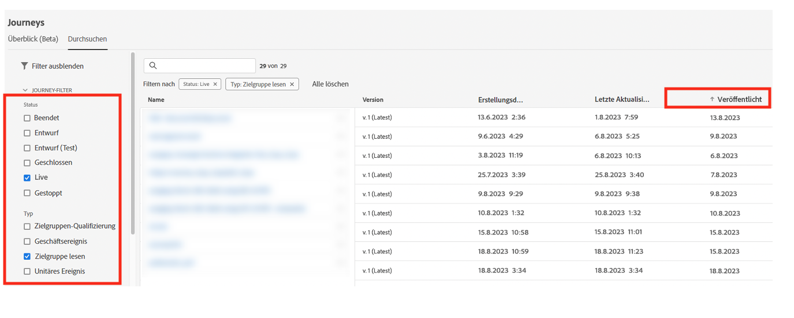

# Best Practices {#best-practices}

## Anleitung zum Echtzeit-Anwendungsfall und zur Omni-Channel-Personalisierung {#real-time-guidance}

Nach der Aktualisierung von Identity Service 2.0 hat die Echtzeit-Identitätszuordnung stattgefunden.

Adobe Journey Optimizer nutzt den Identity Service, um Profile zusammenzuführen und Erlebnisse für den Benutzer zu personalisieren. Daher müssen Sie beim Erstellen Ihrer Anwendungsfälle einige wichtige Aspekte des Dienstes beachten. Als Marke möchten Sie einer Person ein Erlebnis bereitstellen. Anhand des Identitätsdiagramms können Marketing-Fachleute erkennen, mit welchen Geräten eine Person über verschiedene Kanäle hinweg verbunden ist. Das Diagramm kann Identitäten enthalten, die eine Person (CRMID) oder einen Webbrowser (ECID) repräsentieren. Der Identity Service verknüpft diese Informationen miteinander, um eine 360-Grad-Ansicht einer Person oder ein zusammengeführtes Profil zu erstellen. Das bedeutet, wenn jemand Ihre Seite besucht und sich dann anmeldet, können alle vorherigen Daten aus dieser Sitzung mit dem angemeldeten Benutzer verknüpft werden. Dieser Vorgang erfolgt in mehreren Schritten:

1. Erstmalige Zuordnung von Identitäten – Wenn sich eine Person anmeldet, wird die Anmelde-ID (CRMID) mit der Webbrowser-ID (Web- oder Mobile App-Sitzung) verknüpft:

   * Dies kann 30 Minuten bis 4 Stunden dauern.
   * Normalerweise generiert dieses Anmeldeereignis ein Identitätsdiagramm, das die CRMID mit der ECID verknüpft.

1. Nach der ersten Zuordnung werden alle Daten, die mit einer der beiden Identitäten gesendet werden, mit dem zusammengeführten Profil verknüpft und in Journey Optimizer zur Echtzeit-Personalisierung zur Verfügung gestellt. Die Aktualisierung des Profils mit den neuesten Verhaltensdaten kann bis zu 1 Minute dauern. Mehr dazu erfahren Sie auf [dieser Seite](https://experienceleague.adobe.com/docs/experience-platform/ingestion/streaming/overview.html?lang=de).

Beachten Sie beim Erstellen von Anwendungsfällen Folgendes:

1. Die Marke möchte einen Besucher der Seite 30 Minuten nach dem Abbruch (z. B. durch eine E-Mail bei abgebrochenem Warenkorb) erneut gewinnen.

   Verwenden der Identität mit den Daten – ECID. Wenn Sie 100 % der Besucherinnen und Besucher erfassen möchten, die ihre E-Mail-Adresse/App-Installation innerhalb der letzten 30 Minuten angegeben haben, sollten Sie die Cookie-basierte Identität verwenden, um diese Journey (ECID) zu starten. Dabei wird davon ausgegangen, dass Ihre E-Mail-Adresse, Ihr Push-Token oder eine andere Adresse für das Erlebnis mit der ECID verknüpft ist.

1. Omni-Channel-Interaktion über Web, E-Mail, Push usw.:

   * Ihr Profil muss zum Zeitpunkt der Interaktion über die Adresse für die Kommunikation verfügen. Um sicherzustellen, dass dies konsistent und zeitnah geschieht, achten Sie darauf, dass Ihre Daten mit der Identität verknüpft sind, die Sie verwenden möchten.
   * Wenn Sie Informationen aus einer neu installierten App- oder Browser-Sitzung zusammen mit bekannten oder angemeldeten Informationen verwenden müssen, muss diese Nachricht gesendet werden, nachdem diese Identitäten zugeordnet wurden. Dies kann je nach Kundin oder Kunde variieren. Wir empfehlen, mindestens 30 Minuten zu warten, um das höchste Profilvolumen zu erhalten.

## Skalierung mit Journey-Schutzmaßnahmen {#scale}

In diesem Abschnitt erfahren Sie, wie Sie die Skalierung – mit den folgenden beiden Einschränkungen – durchführen:

* Journey Optimizer verfügt über eine Richtlinie von maximal 50 Aktivitäten in einer Journey-Arbeitsfläche. Diese Schutzmechanismen sollen die Lesbarkeit, Qualitätssicherung und Fehlerbehebung unterstützen. Die Anzahl der Aktivitäten in einer Journey wird oben links in der Journey-Arbeitsfläche angezeigt, wenn Sie bis auf 10 Aktivitäten an diesen Grenzwert herankommen.

* Während Sie Journeys veröffentlichen, werden diese von Journey Optimizer automatisch skaliert und angepasst, um maximalen Durchsatz und Stabilität zu gewährleisten. Wenn Sie sich dem Meilenstein von 100 gleichzeitigen Live-Journeys in einer Sandbox nähern, erscheinen eine orangefarbene Überlagerung und ein Warnzeichen auf der Benutzeroberfläche zu dieser Errungenschaft. Wenn Sie diese Benachrichtigung sehen, aber die Notwendigkeit besteht, Ihre Journey über 100 Live-Journeys hinaus zu erweitern, erstellen Sie bitte ein Ticket für die Kundenunterstützung, und wir helfen Ihnen bei der Erreichung Ihrer Ziele.

Es gibt eine Reihe bewährter Methoden, die Sie anwenden können, um innerhalb der Grenzwerte zu bleiben und das System effizient zu nutzen.

* Wenn Sie sich Ihrem Grenzwert für Live-Journeys nähern, sollten Sie als Erstes die Registerkarte **Übersicht** unter **Journey** öffnen, um zu sehen, wie viele Journeys in den letzten 24 Stunden aktiv waren (Journeys mit aktiven Profilen). Dazu können Sie in diesem Abschnitt die Anzahl der Profile überprüfen, die die Journey starten und beenden.

  

* Als Nächstes können Sie im Inventarabschnitt der Journey alle Journeys nach Status = „Live“ und Typ = „Zielgruppe lesen“ filtern. Sortieren Sie dann nach Veröffentlichungsdatum (alt bis neu). Klicken Sie in die Journey und gehen Sie zum Zeitplan. Stoppen Sie alle Live-Journeys mit einem Zeitplan für die Ausführung **Einmal** oder **So bald wie möglich**, die älter als einen Tag sind und nur eine Aktion enthalten.

  

* Wenn Ihre Journey **Zielgruppe lesen** nur eine Aktion und keine Wartezeiten/Entscheidungen oder Sendezeitoptimierungen enthält, können Sie sie auch in Journey Optimizer-Kampagnen verschieben. Kampagnen eignen sich besser für einstufige Interaktionen. Einer der Hauptunterschiede zwischen Campaign und Journeys besteht darin, ob Sie es für wichtig halten, die Benutzerinteraktionen aktiv zu überwachen, um den nächsten Schritt zu bestimmen und weitere Aktionen durchzuführen.
* Um die Anzahl der Aktivitäten innerhalb einer Journey zu verringern, überprüfen Sie die Bedingungsschritte. Es gibt viele Fälle, in denen Sie die Bedingungen in die Segmentdefinition oder die Zielgruppenkomposition verschieben können.
* Wenn dieselben Bedingungen über mehrere Journeys hinweg wiederholt werden (Einverständnisprüfungen, Unterdrückungen), sollten Sie erwägen, sie als Teil der Segmentdefinition zu verschieben. Wenn Sie beispielsweise in mehreren Journeys die Bedingung haben, dass „E-Mail-Adresse ist nicht leer“ überprüft werden soll, sollten Sie diese Bedingung als Teil der Segmentdefinition einbeziehen.
* Wenn Ihre Journey mehrere Bedingungen hat, die die Zielgruppe aufteilen, sollten Sie, um die Zahlen bei jedem Schritt zu sehen, Customer Journey Analytics oder eine andere Reporting-Lösung in Erwägung ziehen, die für die Analyse besser geeignet ist.
* Wenn Sie sich der Höchstgrenze für Knoten auf der Arbeitsfläche nähern, sollten Sie die Konsolidierung von Aktionen mit dynamischen Parametern oder Inhalten erwägen, um den richtigen Inhalt anstelle expliziter Knoten bereitzustellen.
