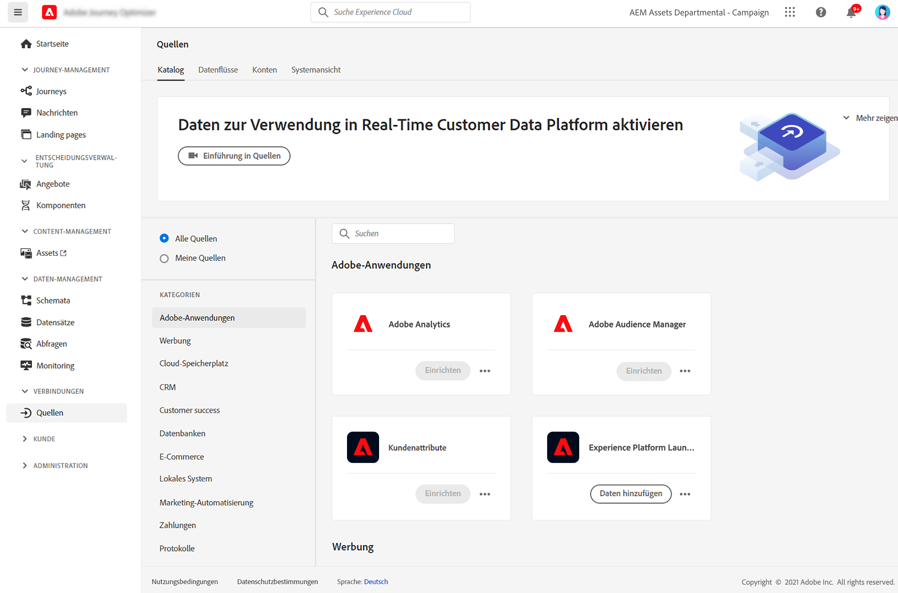

# Erste Schritte mit Quell-Connectoren {#sources-gs}

## Was ist eine Quelle? {#what-is-source}

Eine **Quelle** ist ein Connector, der externe Daten in Adobe Journey Optimizer einbindet. Mit Quellen können Sie Kundeninformationen aus Systemen importieren, die Sie bereits verwenden, z. B. CRM-Plattformen, Cloud-Speicher oder Datenbanken, und diese Daten für die Erstellung personalisierter Customer Journeys verfügbar machen.

Betrachten Sie Quellen als Brücken zwischen Journey Optimizer und Ihren externen Datensystemen. Sie synchronisieren Daten automatisch, sodass Ihnen für Ihre Marketing-Kampagnen stets aktuelle Kundeninformationen zur Verfügung stehen.

## Bedeutung von Quellen  {#why-sources-matter}

Quellen sind für die Erstellung personalisierter, datengestützter Kundenerlebnisse in Journey Optimizer unerlässlich. Hier erfahren Sie, warum:

* **Einheitliche Kundenansicht** – Kombinieren Sie Daten aus mehreren Systemen, um ein vollständiges Bild jeder einzelnen Kundin und jedes einzelnen Kunden zu erhalten
* **Personalisierung in Echtzeit** – Verwenden Sie aktuelle Daten, um zeitnahe und relevante Nachrichten in Ihren Journeys bereitzustellen
* **Automatisierte Datensynchronisierung** – Halten Sie Kundeninformationen ohne manuelle Datenimporte stets auf dem neuesten Stand
* **Effiziente Workflows** – Einmal verbunden, fließen die Daten automatisch in Ihre Journeys ein

Sie können z. B. Quellen verwenden, um den Kaufverlauf aus Ihrer E-Commerce-Plattform zu importieren, und anschließend Journeys erstellen, die personalisierte Produktempfehlungen basierend auf den bisherigen Käufen der Kundinnen und Kunden senden.

## Möglichkeiten mit Quellen {#sources-use-cases}

Häufige Anwendungsfälle für Quellen in Journey Optimizer sind:

* **Kundendaten aus CRM-Systemen importieren** –Synchronisieren Sie Kontaktinformationen, Voreinstellungen und den Interaktionsverlauf aus Plattformen wie Salesforce oder Microsoft Dynamics
* **Kaufdaten verbinden** – Importieren Sie den Auftragsverlauf und die Produktvoreinstellungen aus E-Commerce-Plattformen, um Angebote zu personalisieren
* **Daten aus dem Treueprogramm integrieren** – Greifen Sie auf Punktestände und Treuestufen zu, um Ihre treuesten Kundinnen und Kunden zu belohnen
* **Verhaltensdaten synchronisieren** – Importieren Sie Website-Interaktionen und App-Nutzungsmuster, um relevante Journeys auszulösen
* **Profilattribute aktualisieren** – Halten Sie Kundenprofile mit Daten aus dem Cloud-Speicher oder Datenbanken auf dem neuesten Stand

## Gängige Quelltypen {#source-types}

Journey Optimizer unterstützt verschiedene Quelltypen, um eine Verbindung zu Ihren bestehenden Systemen herzustellen:

**Adobe-Anwendungen:**
* Adobe Analytics
* Adobe Audience Manager
* Adobe Campaign
* Adobe Commerce

**Cloud-Speicherplatz:**
* Amazon S3
* Azur Blob Storage
* Google Cloud Storage
* SFTP

**Datenbanken:**
* Amazon Redshift
* Google BigQuery
* Microsoft SQL Server
* MySQL
* PostgreSQL

**CRM und Marketing-Automatisierung:**
* Microsoft Dynamics
* Salesforce
* Salesforce Marketing Cloud

➡️ Die vollständige Liste finden Sie im [Katalog für Experience Platform-Quellen](https://experienceleague.adobe.com/docs/experience-platform/sources/home.html?lang=de#sources-catalog){target="_blank"}

## Voraussetzungen {#prerequisites}

Bevor Sie Quellen konfigurieren, stellen Sie sicher, dass Sie über Folgendes verfügen:

* **Entsprechende Berechtigungen** – Zugriff zum Verwalten von Quellen in Adobe Experience Platform
* **Anmeldedaten für das Quellsystem** – Authentifizierungsdetails für das externe System, das Sie verbinden möchten
* **Kenntnis Ihrer Daten** – Wissen darüber, welche Datenfelder Sie benötigen und wie diese den Profilen in Journey Optimizer zugeordnet werden

➡️ Informationen zu [Zugriffssteuerung und Berechtigungen](../administration/permissions.md)

## Funktionsweise von Quellen {#how-sources-work}

Adobe Journey Optimizer verwendet das Quellen-Framework von Adobe Experience Platform. Im Folgenden finden Sie den grundlegenden Workflow:

1. **Verbinden** – Richten Sie die Authentifizierung für Ihr externes Datensystem ein
2. **Daten auswählen** – Wählen Sie aus, welche Daten importiert und wie oft sie synchronisiert werden sollen
3. **Felder zuordnen** – Definieren Sie, wie externe Datenfelder den Profilattributen in Journey Optimizer entsprechen
4. **Zeitplan festlegen** – Richten Sie Intervalle für die automatische Datenaktualisierung ein
5. **Überwachen** – Verfolgen Sie den Datenfluss und beheben Sie etwaige Synchronisierungsprobleme

Nach der Konfiguration werden Quellen automatisch im Hintergrund ausgeführt, damit Ihre Kundendaten aktuell bleiben und für die Verwendung in Journeys bereitstehen.

>[!NOTE]
>
>**Datenaufnahme für orchestrierte Kampagnen** - Für dateibasierte Änderungsdatenaufzeichnungsquellen, die mit orchestrierten Kampagnen verwendet werden, ist das Feld &quot;`_change_request_type`&quot; erforderlich. Unterstützte Werte sind `u` (upsert) oder `d` (delete). Diese Werte müssen `u` und `d` in Kleinbuchstaben geschrieben werden, nicht `U` und `D`. [Erfahren Sie mehr über Leitplanken und Einschränkungen für orchestrierte Kampagnen](../orchestrated/guardrails.md)

## Weitere Informationen {#learn-more}

In diesem Video erfahren Sie mehr über Quell-Connectoren und deren Konfiguration in Journey Optimizer:

>[!VIDEO](https://video.tv.adobe.com/v/335919?quality=12)

Detaillierte Informationen zum Konfigurieren und Verwalten von Quellen finden Sie in der [Dokumentation zu Adobe Experience Platform-Quellen](https://experienceleague.adobe.com/docs/experience-platform/sources/home.html?lang=de){target="_blank"}.

## Nächste Schritte {#next-steps}

Nachdem Sie nun wissen, was Quellen sind und warum sie wichtig sind:

* Suchen Sie im [Quellenkatalog](https://experienceleague.adobe.com/docs/experience-platform/sources/home.html?lang=de#sources-catalog){target="_blank"} nach Connectoren für Ihre Systeme
* Erfahren Sie, wie Sie eine [Quellverbindung erstellen](https://experienceleague.adobe.com/docs/experience-platform/sources/ui-tutorials/create/overview.html?lang=de){target="_blank"}
* Verstehen Sie [Datenzuordnung und -umwandlung](https://experienceleague.adobe.com/docs/experience-platform/sources/ui-tutorials/dataflow/overview.html?lang=de){target="_blank"}
* Erfahren Sie, wie Sie [importierte Daten in Journeys verwenden](../building-journeys/journey-gs.md)
* Lesen Sie die Übersicht [Erste Schritte mit dem Daten](../data/gs-data.md), um zu verstehen, wie Quellen in die vollständige Dateneinrichtung für Journey Optimizer passen
