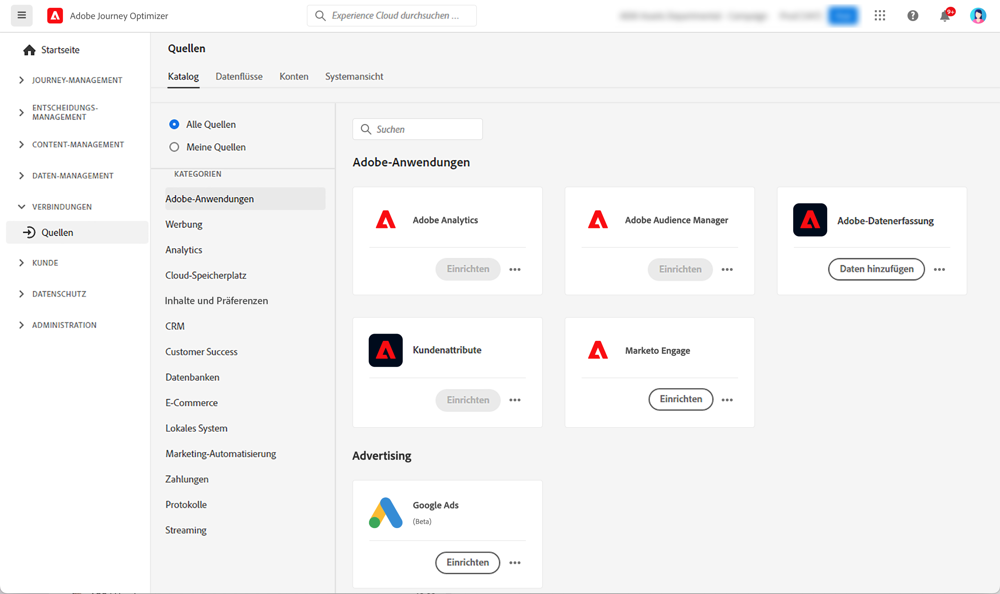

# Erste Schritte mit Quell-Connectoren {#sources-gs}

Adobe Journey Optimizer ermöglicht die Aufnahme von Daten aus externen Quellen und bietet Ihnen die Möglichkeit, die eingehenden Daten mithilfe von Platform-Services zu strukturieren, zu kennzeichnen und zu verbessern. Daten können aus verschiedensten Quellen aufgenommen werden, darunter etwa Adobe-Anwendungen, Cloud-basierte Datenspeicher und Datenbanken.

In diesem Video erfahren Sie mehr über Quell-Connectoren und deren Konfiguration in Journey Optimizer:

>[!VIDEO](https://video.tv.adobe.com/v/335919?quality=12)

Weitere Informationen zum Aufnehmen von Daten aus externen Quellen mit Quell-Connectoren finden Sie in der [Adobe Experience Platform-Dokumentation](https://experienceleague.adobe.com/docs/experience-platform/sources/home.html?lang=de){target="_blank"}.
