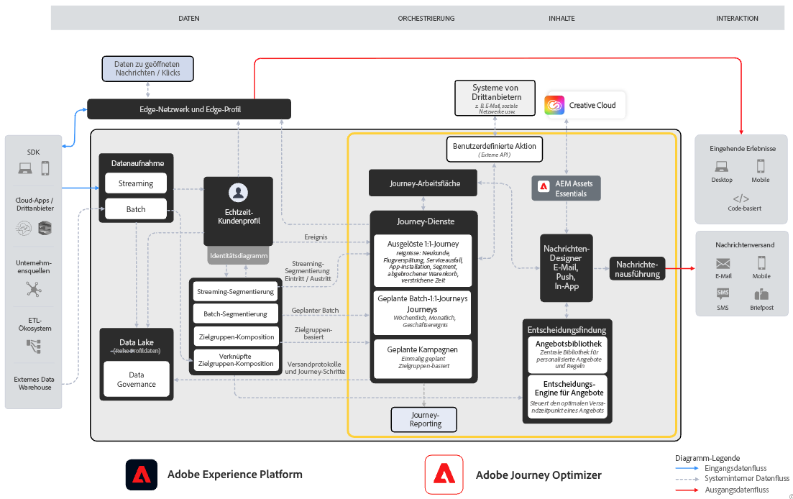

# Erste Schritte mit Journey Optimizer {#cjm-gs}

## Was ist [!DNL Adobe Journey Optimizer]?{#about-cjm}

[!DNL Adobe Journey Optimizer] hilft Unternehmen, ihren Kunden vernetzte, kontextuelle und personalisierte Erlebnisse bereitzustellen. Die Customer Journey umfasst den gesamten Prozess der Kundeninteraktion mit der Marke, von der ersten Kontaktaufnahme bis zum Verlassen. Sie beginnt mit der Wahrnehmungsphase, in der der Kunde die Marke kennenlernt und Interaktionen mit ihr aufnimmt. Der Kunde wird seine Interaktion mit der Marke weiter vertiefen, die Website und physische Filiale besuchen und Einkäufe tätigen, Nachrichten versenden oder Kundenrezensionen posten.

[!DNL Adobe Journey Optimizer] basiert nativ auf [!DNL Adobe Experience Platform] und kombiniert ein einheitliches Echtzeit-Kundenprofil, ein API-First-Open-Framework, zentralisiertes Offer Decisioning und künstliche Intelligenz (KI) sowie maschinelles Lernen (ML) zur Personalisierung und Optimierung. Journey Optimizer ermöglicht es Marken, die nächste beste Interaktion skaliert, schnell und flexibel über die gesamte Journey hinweg intelligent zu bestimmen. Mit [!DNL Adobe Journey Optimizer] können Unternehmen innerhalb derselben Anwendung sowohl geplante Marketing-Kampagnen (z. B. wöchentliche Werbeaktionen für ein Einzelhandelsgeschäft) als auch maßgeschneiderte individuelle Nachrichten erstellen und bereitstellen (z. B. eine Push-Benachrichtigung wegen eines nicht lagernden Artikels, den ein Kunde mit einer Treue-App angesehen hat).

➡️ [Journey Optimizer entdecken](https://experienceleague.adobe.com/docs/journey-optimizer-learn/tutorials/introduction-to-journey-optimizer/introduction.html?lang=de){target="_blank"} (Video)

<!-- Use [!DNL Adobe Journey Optimizer] to build multi-step customer journeys that initiate a sequence of interactions, offers, and messages across channels in real time. This approach ensures customers are engaged at the optimal moments based on their actions and relevant business signals. Learn how to build journeys in [this section](../building-journeys/journey-gs.md).

You can also create audience-based campaigns to send messages.-->

## Anwendungsszenarien {#use-cases}

* Marketing-Experten können [!DNL Adobe Journey Optimizer] verwenden, um sowohl personalisierte Nachrichten als auch zielgruppenbasierte Batch-Nachrichten zu versenden. Beispielsweise kann ein Bekleidungsgeschäft nach dem Kauf Zufriedenheitsumfragen an alle Kunden versenden, die in der letzten Woche Produkte gekauft haben. Aufgrund des schlechten Wetters kam es bei einigen Lieferungen zu Verspätungen. Da das Bekleidungsgeschäft weiß, welche Kundinnen und Kunden ihre Lieferungen nicht erhalten haben, kann es diese vom geplanten Versand der Zufriedenheitsumfrage ausschließen. Stattdessen kann es eine personalisierte E-Mail versenden, in der es sich für die Verzögerung entschuldigt, und einen Rabatt-Code mit Produktempfehlungen einfügen, die auf früheren Käufen der Kundin bzw. des Kunden basieren.

  Marketing-Fachleute können die Anwendung auch verwenden, um verhaltensbasierte Echtzeit-Nachrichten zu senden. Beispielsweise könnte derselbe Einzelhändler eine treue Kundin bzw. einen treuen Kunden in Echtzeit ansprechen, die bzw. der gerade auf den Parkplatz des Geschäfts einbiegt, indem er der Person eine Push-Benachrichtigung über einen Pullover sendet, der wieder in der passenden Größe vorrätig ist.

* Nicht-Marketing-Experten wie Operations- und Support-Teams, die mit der Bereitstellung des Kundenerlebnisses zu tun haben, können [!DNL Adobe Journey Optimizer] verwenden, um eine Vielzahl von Aufgaben zu verwalten, z. B. Benachrichtigungen zu einem Geschäftsablauf oder sogar die Überwachung des Onboarding-Prozesses. Nehmen wir beispielsweise einen Vergnügungspark, in dem Besucher eine Mobile App als Teil ihres Parkerlebnisses herunterladen. Wartungspersonal kann [!DNL Adobe Journey Optimizer] verwenden, um Parkbesucher über Attraktionen zu informieren, die aufgrund von Wartungsarbeiten derzeit geschlossen sind.

## Wichtigste Funktionen {#key-capabilities}

[!DNL Adobe Journey Optimizer] ist eine agile und skalierbare Anwendung zur Erstellung und Bereitstellung personalisierter, vernetzter und zeitnaher Kundenerlebnisse in allen Mobile Apps, Geräten oder Kanälen.

Die wichtigsten Funktionen ermöglichen Folgendes:

* **Echtzeit-Kundeneinblicke und Interaktion**: Ein integriertes Profil verbindet Live-Daten aus allen Quellen auf allen Kunden-Kontaktpunkten, einschließlich Verhaltens-, Transaktions-, Finanz- und Betriebsdaten, um persönliche und kontextuelle Erlebnisse für Kunden zeitnah zu optimieren.

* **Moderne Omni-Channel-Orchestrierung und -Ausführung**: Über eine einzige Arbeitsfläche kann die Customer Journey durch 1:1-Kundeninteraktionen und Marketing-Maßnahmen harmonisiert und optimiert werden. So werden Marken dabei unterstützt, während des gesamten Kundenlebenszyklus einen Mehrwert zu erzielen. In [!DNL Adobe Journey Optimizer] entwickelte Customer Journeys sind dynamisch und ereignisbasiert und ermöglichen es Marken, auf Echtzeitsignale zu reagieren und diese Interaktionen mit geplanten Kampagnen zu verbinden. Dadurch können die richtigen Entscheidungen darüber getroffen werden, welche Nachrichten wann und über welche Kanäle an Kundschaft gesendet werden.

* **Intelligente Entscheidungsfindung und Personalisierung**: Marken können zentralisierte Entscheidungsfindung nutzen und künstliche Intelligenz sowie maschinelles Lernen integrieren. Daraus lassen sich prädiktive Erkenntnisse über das gesamte Kundenerlebnis gewinnen, was die Automatisierung von Entscheidungen und die Optimierung eines Erlebnisses im benötigten Umfang erleichtert. [!DNL Adobe Journey Optimizer] ermöglicht mithilfe der Entscheidungsfindung auf allen Kanälen zentralisierte Angebote im benötigten Umfang.

>[!NOTE]
>
>* Welche Komponenten und Funktionen in Ihrer Umgebung verfügbar sind, hängt von Ihren [Berechtigungen](../administration/permissions.md) und Ihrem [Lizenzierungspaket](https://helpx.adobe.com/de/legal/product-descriptions/adobe-journey-optimizer.html){target="_blank"} ab. Wenden Sie sich bei Fragen an Ihren Adobe Customer Success Manager oder an den Adobe-Support.
>
>* Für [!DNL Journey Optimizer] gelten die allgemeinen Datenschutzrichtlinien und -verfahren von Adobe Experience Cloud. [Weitere Informationen zum Datenschutz](https://www.adobe.com/de/privacy/experience-cloud.html){target="_blank"} in Adobe Experience Cloud.

## Architektur {#architecture}

Verstehen Sie mit der folgenden Abbildung die grundlegende Architektur von [!DNL Adobe Journey Optimizer], die Integrationspunkte und die Beziehung zwischen [!DNL Journey Optimizer] und [!DNL Experience Platform].

Adobe Experience Platform schafft eine leistungsstarke, flexible, offene und zentralisierte Datengrundlage. Daten werden im Zuge dessen erfasst, standardisiert, gesteuert, auf KI-Erkenntnisse angewendet und vereinheitlicht, um durchdachte und relevante digitale Kundenerlebnisse bereitzustellen.

{width="70%" zoomable="yes"}

Vier Anwendungen setzen nativ auf Experience Platform auf: Adobe Real-Time Customer Data Platform, Journey Optimizer, Customer Journey Analytics und Adobe Mix Modeler.

Die Kernfunktionen und Services von Journey Optimizer basieren auf den grundlegenden Komponenten von Adobe Experience Platform, wozu das Echtzeit-Kundenprofil gehört. Journey Optimizer funktioniert nahtlos und ist mit Real-Time CDP und Customer Journey Analytics kompatibel, kann aber auch unabhängig als eigenständige Anwendung eingesetzt werden.

{width="70%" zoomable="yes"}

### Blueprints für Adobe Journey Optimizer

Blueprints für digitale Erlebnisse stellen System- und Datenflussarchitekturdiagramme zur Verfügung, um ein besseres Verständnis der Integration und Implementierung von Adobe Experience Platform und anderen Programmen zu ermöglichen. Die Blueprints bieten eine visuelle Darstellung der Daten- und Inhaltsflüsse zwischen Systemen und Komponenten, der Abfolge von Vorgängen sowie der Abhängigkeiten, um Informationen zum Design von Anwendungsfällen und zur Architektur von Adobe Experience Platform und anderen Programmen zu liefern.

Siehe [Blueprints für Adobe Journey Optimizer](https://experienceleague.adobe.com/de/docs/blueprints-learn/architecture/customer-journeys/journey-optimizer/journey-optimizer-overview){target="_blank"}.

>[!MORELIKETHIS]
>
>* [Wichtige Schritte für den Start](quick-start.md)
>* [Entwerfen von Journeys und Senden von Nachrichten](../building-journeys/journey-gs.md)
>* [Live-Berichte](../reports/live-report.md)
>* [Tutorial: Einführung in Journey Optimizer](https://experienceleague.adobe.com/de/docs/journey-optimizer-learn/tutorials/introduction-to-journey-optimizer/introduction){target="_blank"}
>* [Sicherheitsüberblick für Journey Optimizer](https://www.adobe.com/content/dam/cc/en/security/pdfs/AJO_SecurityOverview.pdf) (PDF)
>* [Produktbeschreibung zu Journey Optimizer](https://helpx.adobe.com/de/legal/product-descriptions/adobe-journey-optimizer.html){target="_blank"}
