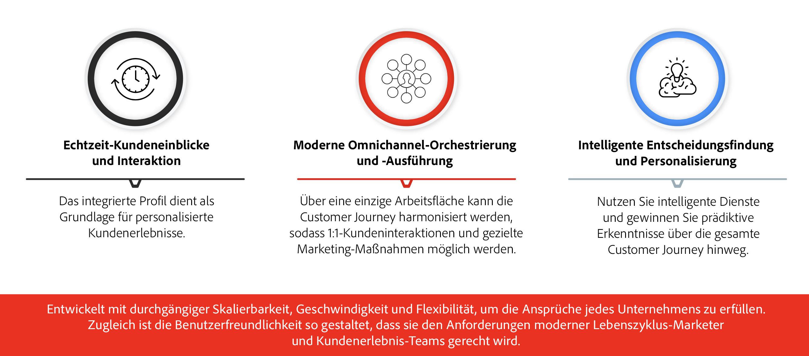
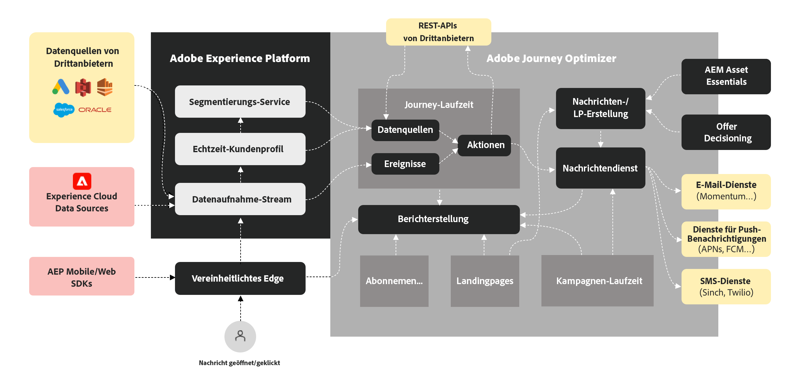

# Erste Schritte mit Journey Optimizer {#cjm-gs}

>[!CONTEXTUALHELP]
>id="test_id"
>title="Testinhalt"
>abstract="Testen Sie den Inhalt für die Integration der kontextbezogenen Hilfe in AJO."

## Was ist [!DNL Adobe Journey Optimizer]?{#about-cjm}

[!DNL Adobe Journey Optimizer] hilft Unternehmen, ihren Kunden vernetzte, kontextbezogene und personalisierte Erlebnisse bereitzustellen. Die Customer Journey umfasst den gesamten Prozess der Kundeninteraktion mit der Marke, von der ersten Kontaktaufnahme bis zum Kaufabschluss. Sie beginnt mit der Wahrnehmungsphase, in der der Kunde die Marke kennenlernt und Interaktionen mit ihr aufnimmt. Der Kunde wird seine Interaktion mit der Marke weiter vertiefen, die Website und physische Filiale besuchen und Einkäufe tätigen, Nachrichten versenden oder Kundenrezensionen posten.

[!DNL Adobe Journey Optimizer] basiert nativ auf [!DNL Adobe Experience Platform] und kombiniert ein einheitliches Echtzeit-Kundenprofil, ein API-First-Open-Framework, zentralisiertes Offer Decisioning und künstliche Intelligenz (KI) sowie maschinelles Lernen (ML) zur Personalisierung und Optimierung. Journey Optimizer ermöglicht es Marken, die nächste beste Interaktion skaliert, schnell und flexibel über die gesamte Journey hinweg intelligent zu bestimmen. Mit [!DNL Adobe Journey Optimizer] können Unternehmen innerhalb derselben Anwendung sowohl geplante Marketing-Kampagnen (z. B. wöchentliche Werbeaktionen für ein Einzelhandelsgeschäft) als auch maßgeschneiderte individuelle Nachrichten erstellen und bereitstellen (z. B. eine Push-Benachrichtigung wegen eines nicht lagernden Artikels, den ein Kunde mit einer Treue-App angesehen hat).

➡️ [Journey Optimizer entdecken](https://experienceleague.adobe.com/docs/journey-optimizer-learn/tutorials/introduction-to-journey-optimizer/introduction.html?lang=de){target=&quot;_blank&quot;} (Video)

## Anwendungsfälle {#use-cases}

* Marketing-Experten können [!DNL Adobe Journey Optimizer] verwenden, um sowohl personalisierte Nachrichten als auch zielgruppenbasierte Batch-Nachrichten zu versenden. Beispielsweise kann ein Bekleidungsgeschäft nach dem Kauf Zufriedenheitsumfragen an alle Kunden versenden, die in der letzten Woche Produkte gekauft haben. Aufgrund des schlechten Wetters kam es bei einigen Lieferungen zu Verspätungen. Da das Bekleidungsgeschäft weiß, welche Kunden ihre Lieferungen nicht erhalten haben, kann es sie vom geplanten Versand der Zufriedenheitsumfrage ausschließen. Stattdessen kann es eine personalisierte E-Mail versenden, in der es sich für die Verzögerung entschuldigt, und einen Rabatt-Code mit Produktempfehlungen einfügen, die auf früheren Käufen des Kunden basieren.

   Marketing-Experten können die Anwendung auch verwenden, um verhaltensbasierte Echtzeit-Nachrichten zu senden. Beispielsweise könnte derselbe Einzelhändler einen treuen Kunden in Echtzeit ansprechen, der gerade auf den Parkplatz des Geschäfts einbiegt, indem er ihm eine Push-Benachrichtigung über einen Pullover sendet, der wieder in der Größe des Kunden vorrätig ist.

* Nicht-Marketing-Experten wie Operations- und Support-Teams, die mit der Bereitstellung des Kundenerlebnisses zu tun haben, können [!DNL Adobe Journey Optimizer] verwenden, um eine Vielzahl von Aufgaben zu verwalten, z. B. Benachrichtigungen zu einem Geschäftsablauf oder sogar die Überwachung des Onboarding-Prozesses. Nehmen wir beispielsweise einen Vergnügungspark, in dem Besucher eine Mobile App als Teil ihres Parkerlebnisses herunterladen. Wartungspersonal kann [!DNL Adobe Journey Optimizer] verwenden, um Parkbesucher über Attraktionen zu informieren, die aufgrund von Wartungsarbeiten derzeit geschlossen sind.

## Wichtigste Funktionen {#key-capabilities}

[!DNL Adobe Journey Optimizer] ist eine agile und skalierbare Anwendung zur Erstellung und Bereitstellung personalisierter, vernetzter und zeitnaher Kundenerlebnisse in allen Mobile Apps, Geräten oder Kanälen.

Die wichtigsten Funktionen ermöglichen Folgendes:

* **Echtzeit-Kundeneinblicke und Interaktion**: Ein integriertes Profil verbindet Live-Daten aus allen Quellen auf allen Kunden-Kontaktpunkten, einschließlich Verhaltens-, Transaktions-, Finanz- und Betriebsdaten, um persönliche und kontextbezogene Erlebnisse für Kunden zeitnah zu optimieren.

* **Moderne Omnichannel-Orchestrierung und -Ausführung**: Über eine einzige Arbeitsfläche kann die Customer Journey durch 1:1-Kundeninteraktionen und Marketing-Maßnahmen harmonisiert und optimiert werden, um Marken dabei zu helfen, im gesamten Kundenlebenszyklus einen Mehrwert zu erzielen. In [!DNL Adobe Journey Optimizer] entwickelte Customer Journeys sind dynamisch und ereignisbasiert und ermöglichen es Marken, auf Echtzeitsignale zu reagieren und diese Interaktionen mit geplanten Kampagnen zu verbinden. Dadurch können die richtigen Entscheidungen darüber getroffen werden, welche Nachrichten wann und über welche Kanäle an einen Kunde gesendet werden.

* **Intelligente Entscheidungsfindung und Personalisierung**: Marken haben die Möglichkeit, zentralisierte Entscheidungsfindung zu nutzen und künstliche Intelligenz und maschinelles Lernen zu integrieren. Daraus lassen sich prädiktive Erkenntnisse über das gesamte Kundenerlebnis gewinnen, was die Automatisierung von Entscheidungen und die Optimierung eines Erlebnisses auch im großen Maßstab erleichtert. [!DNL Adobe Journey Optimizer] ermöglicht mithilfe von Decisioning auf allen Kanälen zentralisierte Angebote im großen Maßstab.

## Architektur {#architecture}

Verstehen Sie mit der folgenden Abbildung die grundlegende Architektur von [!DNL Adobe Journey Optimizer], die Integrationspunkte und die Beziehung zwischen [!DNL Journey Optimizer] und [!DNL Experience Platform].

>[!NOTE]
>
> Für [!DNL Journey Optimizer] gelten die allgemeinen Datenschutzrichtlinien und -verfahren von Adobe Experience Cloud. [Weitere Informationen zum Datenschutz](https://www.adobe.com/de/privacy/experience-cloud.html) in Adobe Experience Cloud.
> Beachten Sie auch die [Limits für Echtzeit-Kundenprofildaten](https://experienceleague.adobe.com/docs/experience-platform/profile/guardrails.html?lang=de).

**Siehe auch**

* [Wichtige Schritte für den Start](quick-start.md)
* [Entwerfen von Journeys und Senden von Nachrichten](../building-journeys/journey-gs.md)
* [Live-Berichte](../reports/live-report.md)
* [Häufig gestellte Fragen zu Journey Optimizer](assets/do-not-localize/AJO-FAQ.pdf) (PDF)
* [Sicherheitsübersicht für Journey Optimizer](https://www.adobe.com/content/dam/cc/en/security/pdfs/AJO_SecurityOverview.pdf) (PDF)
