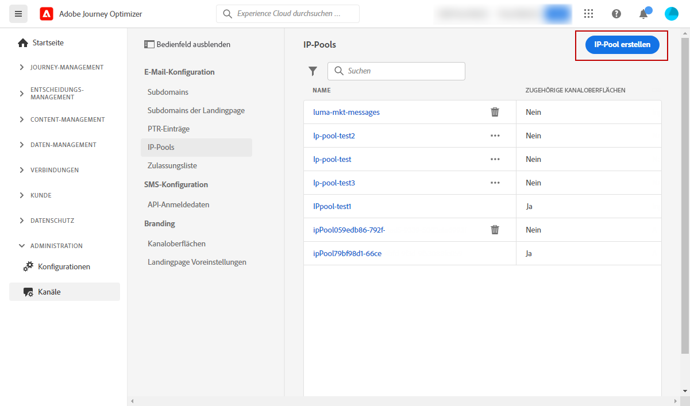

# Erste Schritte für Systemadministratoren {#get-started-sys-admins}

Als **Systemadministrator** richten Sie die Journey Optimizer-Umgebung ein und verwalten den Zugriff, damit Ihre Teams effizient und sicher arbeiten können. Sie führen wichtige Konfigurationsschritte aus, damit [Datentechniker](data-engineer.md), [Entwickler](developer.md) und [Marketer](marketer.md) mit [!DNL Adobe Journey Optimizer] arbeiten können.

Zu Ihren Hauptaufgaben gehören das Einrichten von Benutzergruppen und Berechtigungen, das Erstellen und Verwalten von Sandboxes für die Partitionierung von Daten und Journey für verschiedene Benutzergruppen sowie das Konfigurieren von Versandkanälen und Nachrichtenvoreinstellungen, um ein konsistentes Branding für die verschiedenen über Journey Optimizer bereitgestellten Nachrichten und Assets sicherzustellen. Sie stellen sicher, dass die richtigen Personen Zugriff auf die richtigen Funktionen haben, während gleichzeitig die Sicherheit und die Governance gewahrt bleiben.

Diese Funktionen können von **[!UICONTROL Produktadmins]** verwaltet werden, die Zugriff auf das Produkt „Berechtigungen“ haben. [Weitere Informationen zu Berechtigungen](../../administration/permissions.md){target="_blank"}.

## Einrichten von Zugriff und Berechtigungen

Führen Sie die folgenden Schritte aus, um die Zugriffsverwaltung zu konfigurieren:

1. **Erstellen Sie Sandboxes**, um Ihre Instanzen in separate, isolierte virtuelle Umgebungen zu unterteilen. **Sandboxes** werden in [!DNL Journey Optimizer] erstellt. Weitere Informationen finden Sie im Abschnitt [Sandboxes](../../administration/sandboxes.md).

   >[!NOTE]
   >Wenn Sie als **Systemadmin** das Menü **[!UICONTROL Sandboxes]** in [!DNL Journey Optimizer] nicht sehen können, müssen Sie Ihre Berechtigungen aktualisieren. Informationen zum Aktualisieren Ihrer Rolle finden Sie auf [dieser Seite](../../administration/permissions.md#edit-product-profile).

1. **Verstehen von Rollen**. Rollen sind ein Set vereinheitlichter Rechte, die Benutzenden den Zugriff auf bestimmte Funktionen oder Objekte in der Schnittstelle ermöglichen. Weitere Informationen finden Sie im Abschnitt [Vorkonfigurierte Rollen](../../administration/ootb-product-profiles.md).

1. **Legen Sie Berechtigungen für Rollen fest**, einschließlich **Sandboxes**, und gewähren Sie Ihren Team-Mitgliedern Zugriff, indem Sie sie verschiedenen Rollen zuweisen. Berechtigungen sind Einzelrechte, mit denen Sie die einer **[!UICONTROL Rolle]** zugewiesenen Genehmigungen definieren können. Jede Berechtigung wird unter bestimmten Kategorien erfasst, z. B. Journey oder Angebote, die die verschiedenen Funktionen oder Objekte in [!DNL Journey Optimizer] repräsentieren. Weitere Informationen finden Sie im Abschnitt [Berechtigungsebenen](../../administration/high-low-permissions.md).

1. **Verwenden der Zugriffssteuerung auf Objektebene** (optional). Wenden Sie Zugriffskennzeichnungen auf Objekte wie Journey, Kampagnen und Kanalkonfigurationen an, um zu steuern, welche Benutzenden auf bestimmte Ressourcen zugreifen können. Weitere Informationen zur [Zugriffssteuerung auf Objektebene (OLAC)](../../administration/object-based-access.md).

Darüber hinaus müssen Sie Benutzende, die Zugriff auf Assets Essentials benötigen, den Rollen **Assets Essentials-Endbenutzende** oder/und **Assets Essentials-Benutzende** hinzufügen. [Weitere Informationen finden Sie in der Dokumentation zu Assets Essentials](https://experienceleague.adobe.com/docs/experience-manager-assets-essentials/help/deploy-administer.html?lang=de){target="_blank"}.

Beim erstmaligen Zugriff auf [!DNL Journey Optimizer] wird Ihnen eine Produktions-Sandbox bereitgestellt und je nach Vertrag eine bestimmte Anzahl von IPs zugewiesen.

## Kanäle und Nachrichten konfigurieren

Damit [Marketer](marketer.md) Nachrichten erstellen und senden können, rufen Sie das Menü **ADMINISTRATION** auf. Durchsuchen Sie das Menü **[!UICONTROL Kanäle]**, um die Kanaleinstellungen zu konfigurieren.

>[!NOTE]
>Wenn Sie als **Systemadmin** das Menü **[!UICONTROL Kanäle]** in [!DNL Journey Optimizer] nicht sehen, aktualisieren Sie Ihre Berechtigungen im Produkt [Berechtigungen](../../administration/permissions.md){target="_blank"}.

Führen Sie folgende Schritte aus:

1. **Einrichten von Kanalkonfigurationen**. Definieren Sie alle technischen Parameter, die für E-Mail, SMS, Push-Benachrichtigungen und andere Kanäle erforderlich sind:

   * Definieren Sie **Push-Benachrichtigungseinstellungen** sowohl in [!DNL Adobe Experience Platform] als auch in der Datenerfassung von Adobe Experience Platform. [Weitere Informationen](../../push/push-gs.md)

   * Erstellen Sie **Kanalkonfigurationen** um alle technischen Parameter zu konfigurieren, die für E-Mail-, SMS-, Push-, In-App-, Web- und andere Kanäle erforderlich sind. [Weitere Informationen](../../configuration/channel-surfaces.md)

   * Konfigurieren Sie den **SMS** Kanal, um alle für SMS erforderlichen technischen Parameter einzurichten. [Weitere Informationen](../../sms/sms-configuration.md)

   * Verwalten Sie die Anzahl der Tage, in denen **weitere Zustellversuche** unternommen werden, bevor E-Mail-Adressen an die Unterdrückungsliste gesendet werden. [Weitere Informationen](../../configuration/manage-suppression-list.md)

1. **Subdomains zuweisen**: Für jede neue Subdomain, die in Journey Optimizer verwendet werden soll, besteht der erste Schritt darin, sie zuzuweisen. [Weitere Informationen](../../configuration/about-subdomain-delegation.md)

   

1. **Erstellen von IP-Pools**: Verbessern Sie die Zustellbarkeit Ihrer E-Mails und Ihre Reputation, indem Sie IP-Adressen gruppieren, die mit Ihrer Instanz bereitgestellt wurden. [Weitere Informationen](../../configuration/ip-pools.md)

   

1. **Verwalten der Unterdrückungs- und Zulassungslisten**: Verbessern der Zustellbarkeit durch Unterdrückungs- und Zulassungslisten

   * Eine [Unterdrückungsliste](../../reports/suppression-list.md) besteht aus E-Mail-Adressen, die Sie von Ihren Sendungen ausschließen möchten, da das Senden an diese Kontakte Ihren Ruf als Versender und Ihre Versandraten beeinträchtigen könnte. Sie können alle E-Mail-Adressen überwachen, die bei einer Journey automatisch vom Versand ausgeschlossen werden, wie ungültige Adressen, Adressen, die stets zu Soft-Bounces führen und sich negativ auf Ihre E-Mail-Reputation auswirken könnten, sowie Empfänger, die eine Spam-Beschwerde gegen eine Ihrer E-Mail-Nachrichten eingelegt haben. Erfahren Sie, wie Sie die [Unterdrückungsliste](../../configuration/manage-suppression-list.md) und [weitere Zustellversuche](../../configuration/retries.md) verwalten.

   

   * Mit der [Zulassungsliste](../../configuration/allow-list.md) können Sie einzelne E-Mail-Adressen oder Domains als die einzigen Empfänger oder Domains angeben, die zum Empfang der E-Mails berechtigt sind, die von einer bestimmten Sandbox gesendet werden. Dadurch können Sie verhindern, dass Sie in einer Testumgebung versehentlich E-Mails an echte Kundenadressen senden. Erfahren Sie, wie Sie die [Zulassungsliste aktivieren](../../configuration/allow-list.md).

   Weitere Informationen zur Verwaltung der Zustellbarkeit in [!DNL Adobe Journey Optimizer] finden Sie [auf dieser Seite](../../reports/deliverability.md).

## Zusätzliche Funktionen

Berücksichtigen Sie bei wachsenden Anforderungen Ihres Unternehmens die folgenden erweiterten Funktionen:

* **Einverständnisrichtlinien**: Wenn Ihr Unternehmen Healthcare Shield oder Privacy and Security Shield erworben hat, erstellen Sie Einverständnisrichtlinien, die kanalübergreifend die Kundenvoreinstellungen berücksichtigen. [Weitere Informationen](../../action/consent.md)

* **Data Governance-Richtlinien**: Wenden Sie Datennutzungskennzeichnungen und -richtlinien an, um zu steuern, wie Daten in Marketing-Aktionen verwendet werden. [Weitere Informationen](../../action/action-privacy.md)

* **IP-Aufwärmpläne**: Steigern Sie die Menge der E-Mail-Sendungen schrittweise, um die Reputation der Absender bei E-Mail-Anbietern aufzubauen. [Weitere Informationen](../../configuration/ip-warmup-gs.md)

## Rollenübergreifend zusammenarbeiten

Ihre Verwaltungsarbeit ermöglicht es allen Teams, erfolgreich zu sein:

>[!BEGINTABS]

>[!TAB Support für Dateningenieure]

Zusammenarbeit mit [Dateningenieuren](data-engineer.md) bei der Verwaltung und dem Zugriff auf Daten:

* Berechtigungen für die Datenverwaltung und Schemaerstellung erteilen
* Genehmigen des Sandbox-Zugriffs für Entwicklung und Tests
* Koordinieren von Richtlinien zur Datenaufbewahrung und Governance-Regeln
* Ermöglichen des Zugriffs auf erweiterte Funktionen wie Federated Audience Composition

>[!TAB Entwickler aktivieren]

Zusammenarbeit mit [Entwicklern](developer.md) beim API-Zugriff und bei Tests:

* API-Anmeldeinformationen über Adobe Developer Console bereitstellen
* Einrichten von Sandbox-Umgebungen für Entwicklung und Tests
* Kanalkonfigurationen genehmigen (Push-Zertifikate, SMS-Anbieter)
* Koordination von Testumgebungen und Bereitstellungsstrategie

>[!TAB Marketing-Experten unterstützen]

Zusammenarbeit mit [Marketern](marketer.md) bei Berechtigungen und Kanaleinrichtung:

* Weisen Sie die entsprechenden Berechtigungen zu, um Journey und Kampagnen zu erstellen
* Kanäle konfigurieren, die sie verwenden werden (E-Mail, Push, SMS usw.)
* Unterstützung von Testumgebungen und Genehmigungs-Workflows
* Ermöglichen des Zugriffs auf neue Funktionen

>[!ENDTABS]

## Nächste Schritte

Sobald die Umgebung konfiguriert ist:

1. **Setup überprüfen**: Überprüfen Sie, ob alle Team-Mitglieder auf die erforderlichen Funktionen zugreifen können
2. **Nutzung überwachen**: Verwenden Sie die Verwaltungs-Dashboards, um die Systemnutzung zu verfolgen und Probleme zu identifizieren
3. **Berechtigungen beibehalten**: Berechtigungen werden im Zuge der Weiterentwicklung von Team-Rollen regelmäßig überprüft und aktualisiert
