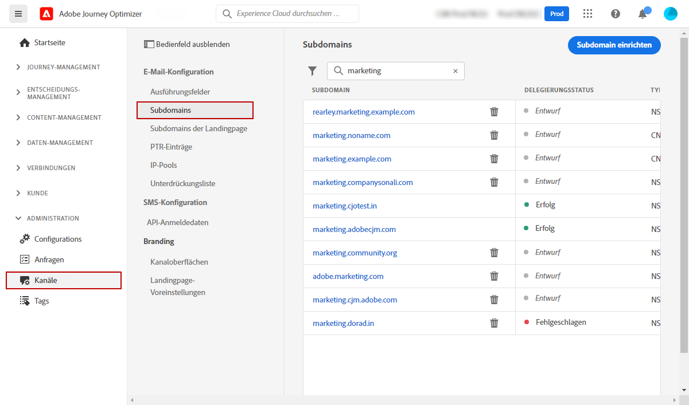

# Erste Schritte für Systemadministratoren {#get-started-sys-admins}

Bevor Sie mit der Verwendung von [!DNL Adobe Journey Optimizer] beginnen, sind mehrere Schritte erforderlich, um Ihre Umgebung vorzubereiten.  Sie müssen diese Schritte ausführen, damit [Datentechniker](data-engineer.md) und [Journey-Anwender](marketer.md) [!DNL Adobe Journey Optimizer] verwenden können.

Als **Systemadministrator** müssen Sie **Produktprofile verstehen und Berechtigungen für die Sandbox-Administration und Kanalkonfiguration zuweisen**. Außerdem müssen Sie Sandboxes einrichten und entsprechend den verfügbaren Produktprofilen verwalten. Anschließend können Sie Produktprofilen Team-Mitglieder zuweisen.

Diese Funktionen können von **[!UICONTROL Produktadministratoren]** verwaltet werden, die Zugriff auf Admin Console haben. [Erfahren Sie mehr über Adobe Admin Console](https://helpx.adobe.com/de/enterprise/admin-guide.html){target=&quot;_blank&quot;}.

Informationen zur Zugriffsverwaltung finden Sie auf den folgenden Seiten:

1. **Erstellen Sie Sandboxes**, um Ihre Instanzen in separate, isolierte virtuelle Umgebungen zu unterteilen. **Sandboxes** werden in [!DNL Journey Optimizer] erstellt. Weitere Informationen finden Sie im Abschnitt [Sandboxes](../../administration/sandboxes.md).

   >[!NOTE]
   >Als **Systemadministrator**, wenn die **[!UICONTROL Sandboxes]** Menü in [!DNL Journey Optimizer], aktualisieren Sie Ihre Berechtigungen in der [Admin Console](https://adminconsole.adobe.com/){target=&quot;_blank&quot;}. Auf [dieser Seite](../../administration/permissions.md#edit-product-profile) erfahren Sie, wie Sie Ihr Produktprofil aktualisieren können.

1. **Verwendung von Produktprofilen**. Produktprofile sind eine Reihe von Einzelberechtigungen, die Benutzern den Zugriff auf bestimmte Funktionen oder Objekte in der Benutzeroberfläche ermöglichen. Weitere Informationen finden Sie im Abschnitt [Vordefinierte Produktprofile](../../administration/ootb-product-profiles.md).

1. **Definieren Sie Berechtigungen für Produktprofile**, einschließlich **Sandboxes**, und geben Sie Ihren Team-Mitgliedern Zugriff, indem Sie sie verschiedenen Produktprofilen zuweisen. Dieser Schritt wird im [Admin Console](https://adminconsole.adobe.com/){target=&quot;_blank&quot;}. Berechtigungen sind Einzelrechte, mit denen Sie die einem **[!UICONTROL Produktprofil]** zugewiesenen Genehmigungen definieren können. Jede Berechtigung wird unter bestimmten Kategorien erfasst, z. B. Journey oder Angebote, die die verschiedenen Funktionen oder Objekte in [!DNL Journey Optimizer] repräsentieren. Weitere Informationen finden Sie im Abschnitt [Berechtigungsebenen](../../administration/high-low-permissions.md).

Darüber hinaus müssen Sie Benutzer, die Zugriff auf Assets Essentials benötigen, zu den Produktprofilen **Assets Essentials Consumer Users** oder/und **Assets Essentials Users** hinzufügen. [Weitere Informationen finden Sie in der Dokumentation zu Assets Essentials](https://experienceleague.adobe.com/docs/experience-manager-assets-essentials/help/deploy-administer.html?lang=de){target=&quot;_blank&quot;}.

>[!NOTE]
>Für Journey Optimizer-Produkte, die vor dem 6. Januar 2022 erworben wurden, müssen Sie [!DNL Adobe Experience Manager Assets Essentials] für Ihre Organisation bereitstellen. Weitere Informationen finden Sie im Abschnitt [Bereitstellen von Assets Essentials](https://experienceleague.adobe.com/docs/experience-manager-assets-essentials/help/deploy-administer.html?lang=de){target=&quot;_blank&quot;}.

Beim erstmaligen Zugriff auf [!DNL Journey Optimizer] wird Ihnen eine Produktions-Sandbox bereitgestellt und je nach Vertrag eine bestimmte Anzahl von IPs zugewiesen.

Um Journeys erstellen und Nachrichten senden zu können, rufen Sie das Menü **ADMINISTRATION** auf. Durchsuchen Sie das Menü **[!UICONTROL Kanäle]**, um Ihre Nachrichten- und Kanaloberflächen (d. h. die Nachrichtenvoreinstellungen) zu konfigurieren.

>[!NOTE]
>Als **Systemadministrator**, wenn die **[!UICONTROL Kanäle]** Menü in [!DNL Journey Optimizer], aktualisieren Sie Ihre Berechtigungen in der [Admin Console](https://adminconsole.adobe.com/){target=&quot;_blank&quot;}. Auf [dieser Seite](../../administration/permissions.md#edit-product-profile) erfahren Sie, wie Sie Ihr Produktprofil aktualisieren können.

Führen Sie dazu folgende Schritte durch:

1. **Konfigurieren von Nachrichten und Kanälen**: Definieren von Oberflächen und Anpassen der Einstellungen für E-Mail-Nachrichten, SMS und Push-Benachrichtigungen

   * Definieren Sie **Push-Benachrichtigungseinstellungen** sowohl in [!DNL Adobe Experience Platform] als auch in [!DNL Adobe Experience Platform Launch]. [Weitere Informationen](../../push/push-gs.md)

   * Erstellen Sie **Kanaloberflächen** (d. h. Nachrichtenvoreinstellungen) zum Konfigurieren aller technischen Parameter, die für E-Mail, SMS und Push-Benachrichtigungen erforderlich sind. [Weitere Informationen](../../configuration/channel-surfaces.md)

   * Konfigurieren Sie den **SMS-Kanal**, um alle für SMS erforderlichen technischen Parameter zu konfigurieren. [Weitere Informationen](../../sms/sms-configuration.md)

   * Verwalten Sie die Anzahl der Tage, in denen **weitere Zustellversuche** unternommen werden, bevor E-Mail-Adressen an die Unterdrückungsliste gesendet werden. [Weitere Informationen](../../configuration/manage-suppression-list.md)

1. **Subdomains zuweisen**: Für jede neue Subdomain, die in Journey Optimizer verwendet werden soll, besteht der erste Schritt darin, sie zuzuweisen. [Weitere Informationen](../../configuration/about-subdomain-delegation.md)

   

1. **Erstellen von IP-Pools**: Verbessern Sie die Zustellbarkeit Ihrer E-Mails und Ihre Reputation, indem Sie IP-Adressen gruppieren, die mit Ihrer Instanz bereitgestellt wurden. [Weitere Informationen](../../configuration/ip-pools.md)

   

1. **Verwalten der Unterdrückungs- und Zulassungslisten**: Verbessern der Zustellbarkeit durch Unterdrückungs- und Zulassungslisten

   * Eine [Unterdrückungsliste](../../reports/suppression-list.md) besteht aus E-Mail-Adressen, die Sie von Ihren Sendungen ausschließen möchten, da das Senden an diese Kontakte Ihren Ruf als Versender und Ihre Versandraten beeinträchtigen könnte. Sie können alle E-Mail-Adressen überwachen, die bei einer Journey automatisch vom Versand ausgeschlossen werden, wie ungültige Adressen, Adressen, die stets zu Soft-Bounces führen und sich negativ auf Ihre E-Mail-Reputation auswirken könnten, sowie Empfänger, die eine Spam-Beschwerde gegen eine Ihrer E-Mail-Nachrichten eingelegt haben. Erfahren Sie, wie Sie die [Unterdrückungsliste](../../configuration/manage-suppression-list.md) und [weitere Zustellversuche](../../configuration/retries.md) verwalten.
   

   * Mit der [Zulassungsliste](../../configuration/allow-list.md) können Sie einzelne E-Mail-Adressen oder Domains als die einzigen Empfänger oder Domains angeben, die zum Empfang der E-Mails berechtigt sind, die von einer bestimmten Sandbox gesendet werden. Dadurch können Sie verhindern, dass Sie in einer Testumgebung versehentlich E-Mails an echte Kundenadressen senden. Erfahren Sie, wie Sie die [Zulassungsliste aktivieren](../../configuration/allow-list.md).
   Sie erfahren mehr über die Zustellbarkeitsverwaltung in [!DNL Adobe Journey Optimizer] [auf dieser Seite](../../reports/deliverability.md).
