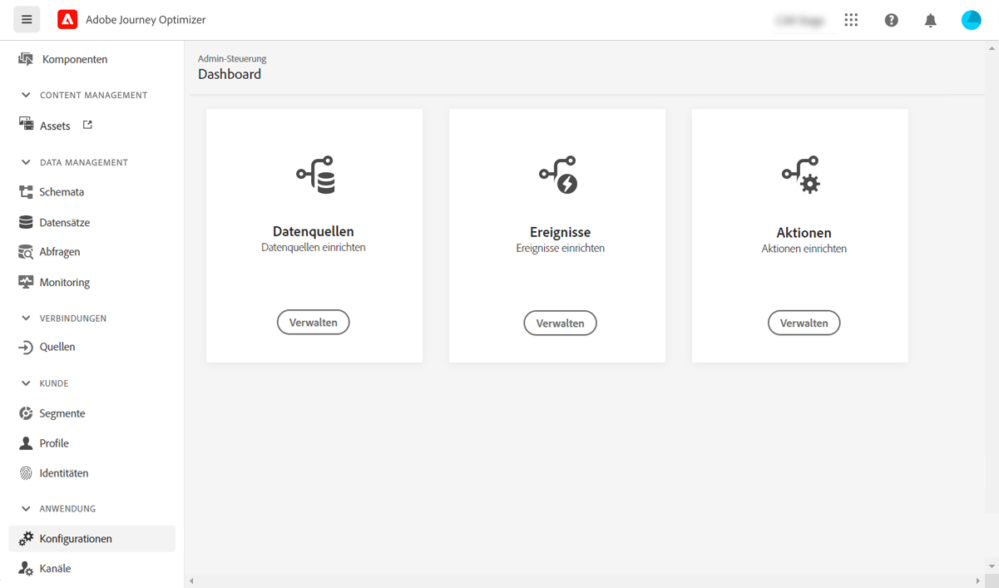

# Erste Schritte für Datentechniker {#data-engineer}

Als **Adobe Journey Optimizer-Dateningenieur** bereiten Sie Kundenprofildaten für die von [!DNL Journey Optimizer] orchestrierten Erlebnisse vor und pflegen diese, modellieren Kunden- und Geschäftsdaten in Schemata und konfigurieren Quell-Connektoren für die Datenaufnahme.
Sobald der [Systemadministrator](administrator.md) Ihnen Zugriff gewährt und die Umgebung vorbereitet hat, können Sie mit der Arbeit mit [!DNL Adobe Journey Optimizer] beginnen.

Auf dieser Seite erfahren Sie, wie Sie **Daten identifizieren und Schemas und Datensätze erstellen**, um Ihre Daten in Adobe Experience Platform verwenden zu können.

>[!NOTE]
>
>Weitere Informationen zur **Datenaufnahme** finden Sie in der [Dokumentation zu Adobe Experience Platform](https://experienceleague.adobe.com/docs/experience-platform/ingestion/home.html?lang=de){target="_blank"}.

Die Schritte zum Erstellen eines Identity-Namespace und eines Datensatzes, der zur Verwendung in Profilen und Testprofilen aktiviert ist, werden in den folgenden Abschnitten beschrieben:

1. **Erstellen eines Identity-Namespace**. In Adobe [!DNL Journey Optimizer] verknüpfen **Identitäten** Verbraucher geräteübergreifend und kanalübergreifend. Das Ergebnis ist ein Identitätsdiagramm. Das verknüpfte Identitätsdiagramm wird verwendet, um Erlebnisse auf der Basis von Interaktionen an allen Ihren Kontaktpunkten zu personalisieren.  Weitere Informationen zu Identitäten und Identity-Namespaces finden Sie [auf dieser Seite](../../audience/get-started-identity.md).

1. **Erstellen Sie ein Schema** und aktivieren Sie es für Profile. Ein Schema ist ein Regelsatz, der die Datenstruktur und das Datenformat repräsentiert und überprüft. Schemata bieten eine übergeordnete abstrakte Definition eines realen Objekts (z. B. einer Person) und bestimmen, welche Daten in jeder Instanz dieses Objekts enthalten sein sollen (z. B. Vorname, Nachname, Geburtsdatum).  Weitere Informationen zu Schemata erhalten Sie [auf dieser Seite](../../data/get-started-schemas.md).

1. **Erstellen Sie Datensätze** und aktivieren Sie sie für Profile. Ein Datensatz ist ein Konstrukt zur Datenspeicherung und -verwaltung, in dem Daten (in der Regel) in einer Tabelle erfasst werden, die ein Schema (Spalten) und Felder (Zeilen) beinhaltet. Datensätze enthalten auch Metadaten, die verschiedene Aspekte der in ihnen gespeicherten Daten beschreiben. Nachdem ein Datensatz erstellt wurde, können Sie ihn einem vorhandenen Schema zuordnen und ihm Daten hinzufügen. Weitere Informationen zu Datensätzen finden Sie [auf dieser Seite](../../data/get-started-datasets.md).

1. **Konfigurieren von Quell-Connectoren**. Adobe Journey Optimizer ermöglicht die Aufnahme von Daten aus externen Quellen und bietet Ihnen die Möglichkeit, mittels Platform-Services eingehende Daten zu strukturieren, zu kennzeichnen und anzureichern. Daten können aus verschiedensten Quellen aufgenommen werden, darunter etwa Adobe-Anwendungen, Cloud-basierte Datenspeicher und Datenbanken. Weitere Informationen zu Quell-Connectoren finden Sie [auf dieser Seite](../get-started-sources.md).

1. **Erstellen von Testprofilen**. Testprofile sind bei Verwendung des [Testmodus](../../building-journeys/testing-the-journey.md) in einer Journey und [für eine Vorschau sowie zum Testen von Nachrichten](../../content-management/preview-test.md) vor dem Versand erforderlich. Die Schritte zum Erstellen von Testprofilen werden [auf dieser Seite](../../audience/creating-test-profiles.md) beschrieben.

Um Nachrichten in Journeys senden zu können, müssen Sie außerdem **[!UICONTROL Datenquellen]**, **[!UICONTROL Ereignisse]** und **[!UICONTROL Aktionen]** konfigurieren. Weiterführende Informationen finden Sie [in diesem Abschnitt](../../configuration/about-data-sources-events-actions.md).

* Mit der Konfiguration von **Datenquellen** können Sie eine Verbindung zu einem System definieren, um zusätzliche Informationen zur Verwendung in Ihren Journeys abzurufen. Weitere Informationen zu Datenquellen finden Sie [in diesem Abschnitt](../../datasource/about-data-sources.md).

* Mithilfe von **Ereignissen** können Sie Ihre Journeys einheitlich auslösen, um Nachrichten in Echtzeit an die Kontakte zu senden, die in die Journey eintreten. In der Konfiguration von Ereignissen konfigurieren Sie die in den Journeys erwarteten Ereignisse. Die eingehenden Ereignisdaten werden mit dem Experience-Datenmodell (XDM) von Adobe normalisiert. Die Ereignisse stammen von Streaming-Aufnahme-APIs für authentifizierte und nicht authentifizierte Ereignisse (z. B. Adobe Mobile SDK-Ereignisse). Weitere Informationen zu Ereignissen finden Sie [in diesem Abschnitt](../../event/about-events.md).

* [!DNL Journey Optimizer] verfügt über integrierte Nachrichtenfunktionen: Sie können Ihre Nachrichten innerhalb einer Journey erstellen und Ihren Inhalt gestalten. Wenn Sie zum Senden Ihrer Nachrichten ein externes System wie beispielsweise Adobe Campaign verwenden, erstellen Sie eine **benutzerdefinierte Aktion**. Weitere Informationen zu Aktionen finden Sie [in diesem Abschnitt](../../action/action.md).
