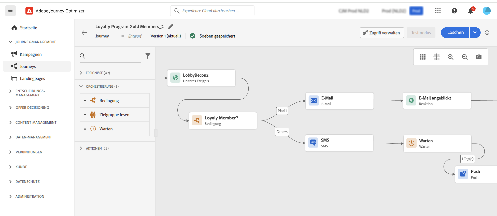

# Erste Schritte für Marketing-Experten {#get-started-marketers}

Als **Marketer** oder **Journey-Anwendender** sind Sie für die Erstellung von Angeboten und Journeys und die Gestaltung von Inhalten verantwortlich. Sie können die Arbeit mit [!DNL Adobe Journey Optimizer] beginnen, sobald Ihnen der [Systemadministrator](administrator.md) und der [Datentechniker](data-engineer.md) Zugriff gewährt und Ihre Umgebung vorbereitet haben.

Anhand der folgenden Abschnitte können Sie Ihre erste Journey einrichten, Angebote und Assets hinzufügen und Nachrichten versenden:

1. **Erstellen von Zielgruppen**. Mit Journey Optimizer können Sie Zielgruppen durch Segmentdefinitionen direkt über das Menü **Zielgruppen** erstellen und in Ihren Journeys nutzen. Weitere Informationen zu Zielgruppen finden Sie [auf dieser Seite](../../audience/about-audiences.md). [In diesem Beispiel](../../audience/creating-a-segment-definition.md) erfahren Sie, wie Sie Segmentdefinitionen erstellen.

1. **Hinzufügen von Personalisierung und dynamischen Inhalten**. Nutzen Sie die Personalisierungsfunktionen von Journey Optimizer, um Ihre Botschaft an Ihre Audience anzupassen. Erhalten Sie weitere Informationen über [Personalisierung](../../personalization/personalize.md) und [dynamische Inhalte](../../personalization/get-started-dynamic-content.md).

   

1. **Erstellen und Verwalten von Assets**. [!DNL Adobe Experience Manager Assets Essentials] bietet ein zentrales Repository mit Assets, die Sie für Ihre Nachrichten verwenden können. Weitere Informationen finden Sie [in diesem Abschnitt](../../email/assets-essentials.md).

1. **Hinzufügen von Angeboten**. Verwenden Sie [!DNL Journey Optimizer], um Ihren Kunden auf allen Kontaktpunkten zur richtigen Zeit das beste Angebot und Erlebnis zu bieten. Nach der Erstellung können Sie personalisierte Angebote an Ihre Audiences senden. Weitere Informationen zum Entscheidungs-Management finden Sie [in diesem Abschnitt](../../offers/get-started/starting-offer-decisioning.md).

   

1. **Testen und Validieren**. Nachdem Ihr Inhalt festgelegt wurde, können Sie mithilfe von Testprofilen eine Vorschau erstellen und einen Testversand durchführen. Bei Verwendung von [personalisierten Inhalten](../../personalization/personalize.md) können Sie prüfen, ob diese Inhalte in der Nachricht korrekt angezeigt werden, und dabei Daten von Testprofilen nutzen. Nutzen Sie außerdem Ihr **Litmus**-Konto in [!DNL Journey Optimizer], um Ihr **E-Mail-Rendering** in gängigen E-Mail-Clients zu überprüfen. Auf diese Weise stellen Sie sicher, dass Ihr E-Mail-Inhalt in jedem Posteingang ansprechend aussieht und korrekt funktioniert. Näheres dazu, wie Sie Ihre Nachrichten testen und validieren, erfahren Sie [in diesem Abschnitt](../../email/preview.md).

1. **Entwerfen Sie Customer Journeys**, um Ihren Kunden personalisierte, kontextuelle Erlebnisse zu bieten. Mit [!DNL Journey Optimizer] können Sie Anwendungsfälle für die Orchestrierung in Echtzeit erstellen und dabei kontextuelle Daten nutzen, die in Ereignissen oder Datenquellen gespeichert sind. Erstellen Sie mehrstufige fortgeschrittene Szenarien mit folgenden Funktionen:

   * Führen Sie einen **unitären Versand** in Echtzeit aus, ausgelöst durch den Empfang eines Ereignisses, oder **als Batch** unter Verwendung von Adobe Experience Platform-Zielgruppen.

   * Nutzen Sie **kontextuelle Daten** aus Ereignissen, Informationen aus Adobe Experience Platform oder Daten aus API-Services von Drittanbietern.

   * Verwenden Sie die **integrierten Kanalaktionen** (E-Mail, SMS, Push-Benachrichtigung) zum Senden von in [!DNL Journey Optimizer] entworfenen Nachrichten oder erstellen Sie **benutzerspezifische Aktionen**, wenn Sie zum Senden Ihrer Nachrichten ein Drittanbietersystem verwenden.

   * Erstellen Sie mit dem **Journey-Designer** mehrstufige Anwendungsfälle: Ziehen Sie einfach per Drag-and-Drop ein Eintrittsereignis oder eine Aktivität vom Typ „Zielgruppe lesen“ in die Benutzeroberfläche, fügen Sie Bedingungen hinzu und senden Sie personalisierte Nachrichten.

   

   Näheres dazu, wie Sie Journeys erstellen und ausführen, finden Sie [in diesem Abschnitt](../../building-journeys/journey-gs.md).

1. **Nachrichten und Journeys überwachen**. Um sicherzustellen, dass Ihre Nachrichten erfolgreich ausgeführt, gesendet und zugestellt werden, bietet [!DNL Journey Optimizer] Funktionen zum Überwachen der aktuell veröffentlichten und ausgelösten Nachrichten. Näheres dazu, wie Sie die Performance überwachen können, erfahren Sie [in diesem Abschnitt](../../reports/global-report.md).
