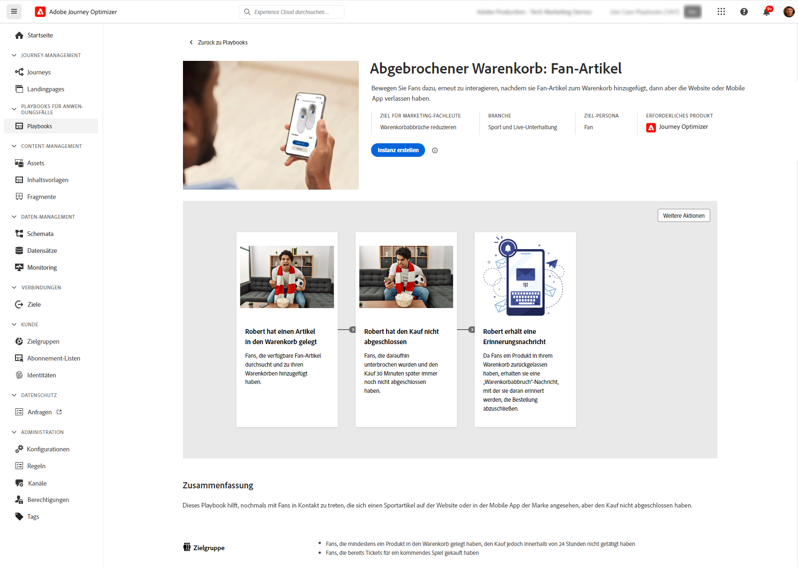

# Anwendungsbeispiele für Playbooks {#playbooks}

>[!PREREQUISITES]
>
>Die folgenden Konfigurationsschritte sind erforderlich, bevor Sie mit &quot;Use Case Playbooks&quot;arbeiten. Detaillierte Informationen zu den einzelnen Schritten finden Sie in der Dokumentation zu den Nutzungsszenarios-Playbooks . [Erste Schritte](https://experienceleague.corp.adobe.com/docs/experience-platform/use-case-playbooks/playbooks/get-started.html){target="_blank"} Seite.
>
>* Sandbox erstellen
>* Benutzerberechtigungen konfigurieren
>* Konfigurieren von Journey Optimizer-Kanaloberflächen für E-Mail-, Push- und SMS-Benachrichtigungen

Anwendungsfall-Playbooks sind vordefinierte Workflows, die häufige Anwendungsfälle behandeln, die Sie mit Adobe Experience Platform und Journey Optimizer ausführen können.

{width="85%"}

Jedes Playbook bietet einen umfassenden Überblick, einschließlich Absicht, Ziele, Zielgruppen und Ressourcen, die für die Implementierung benötigt werden. Darüber hinaus ist in jedem Playbook eine Übersicht verfügbar, um reale Kunden-Touchpoints visuell darzustellen, die mit dem Playbook verknüpft sind.

{width="85%"}

Um auf die Playbooks zuzugreifen, navigieren Sie zum **[!UICONTROL Playbooks]** in der linken Navigationsleiste. Die Bibliothek enthält mehrere Bücher, die mit Adobe Journey Optimizer implementiert wurden. Verwenden Sie die Filter neben der Suchleiste, um auf sie zuzugreifen. Eine umfassende Liste der Journey Optimizer-Playbooks finden Sie im [Anwendungsbeispiel - Playbook-Dokumentation](https://experienceleague.adobe.com/docs/experience-platform/use-case-playbooks/playbooks/playbooks-list.html){target="_blank"}.

{width="85%"}

Nachdem Sie das Playbook ausgewählt haben, das Ihren Bedürfnissen am besten entspricht, können Sie es aktivieren. Dadurch wird eine Instanz des Playbooks erstellt und automatisch die Ressourcen generiert, die zur Unterstützung Ihres spezifischen Anwendungsfalls erforderlich sind. Zu den Ressourcen gehören Journey Optimizer-Assets wie Journey, Nachrichten sowie Adobe Experience Platform-Assets wie Schemata oder Segmente.

>[!NOTE]
>
>Diese Objekte sollen Ihnen dabei helfen, alle Ressourcen zu verstehen, die zur Implementierung Ihres spezifischen Anwendungsfalls erforderlich sind. Sie enthalten keine Daten und werden in Entwicklungs-Sandboxes erstellt.

Um Ihren Anwendungsfall zu implementieren, können Sie zu jedem Objekt navigieren, um es an Ihre Anforderungen anzupassen. Sie können auch die URL der Seite der Playbook-Instanz unter Ihrem Team freigeben, um bei der Implementierung des Anwendungsfalls zusammenzuarbeiten.

Darüber hinaus können Sie die Playbook-Assets in andere Sandboxes importieren. Auf diese Weise können Sie die generierten Assets an Ihren vorhandenen Assets ausrichten und sicherstellen, dass sie mit Ihren Daten kompatibel sind, falls Sie bereits eigene Schemata, Felder und Feldergruppen eingerichtet haben. Diese Schritte werden im Abschnitt [Anwendungsbeispiel - Playbook-Dokumentation](https://experienceleague.adobe.com/docs/experience-platform/use-case-playbooks/playbooks/data-awareness.html){target="_blank"}.
