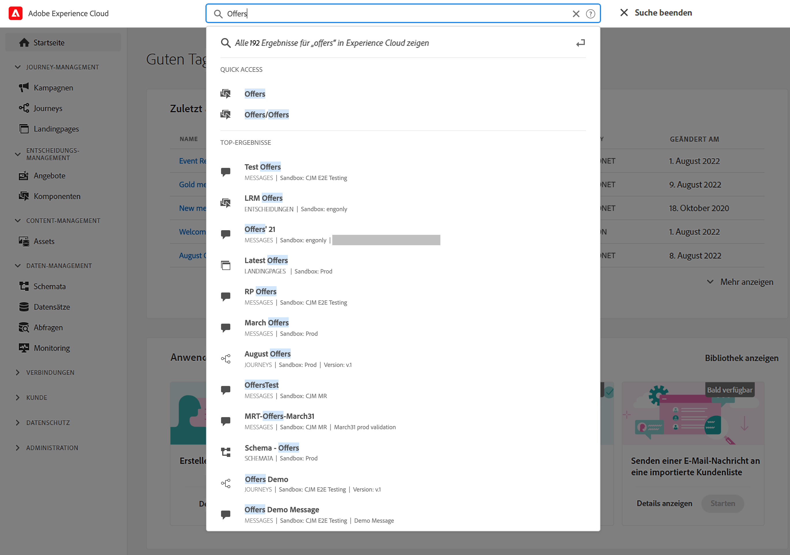
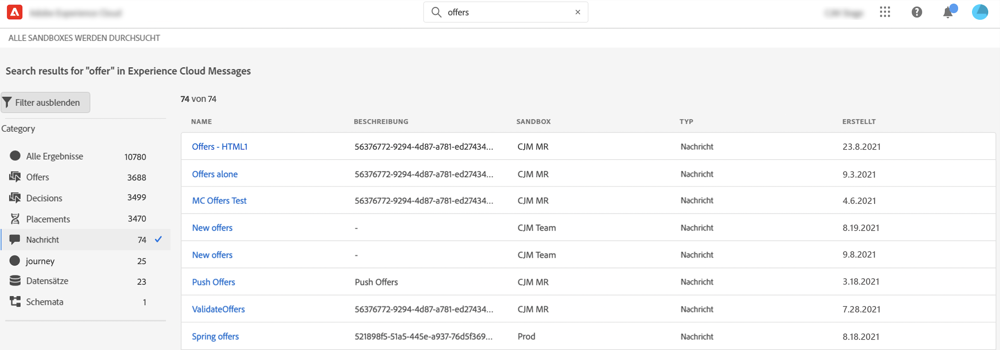
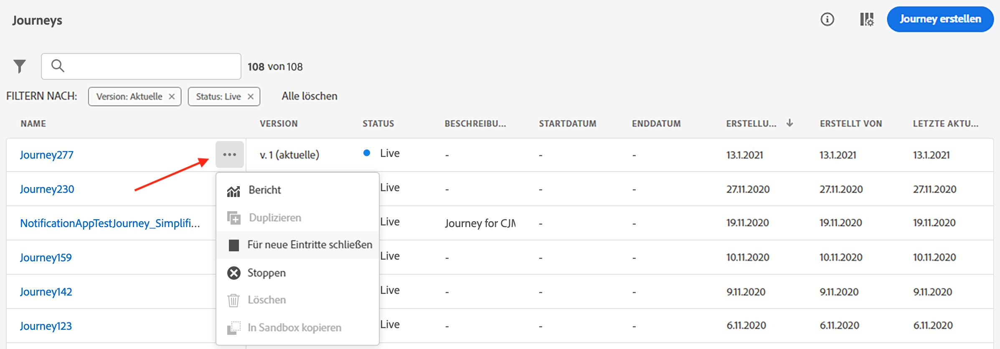
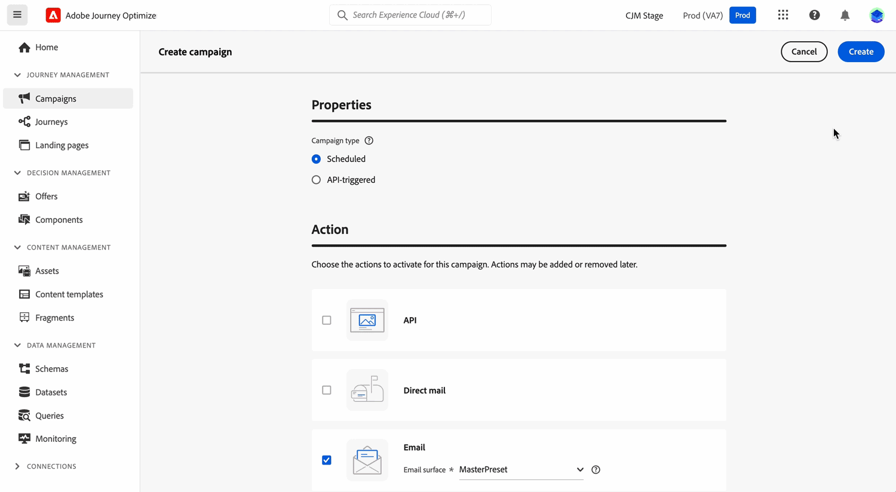
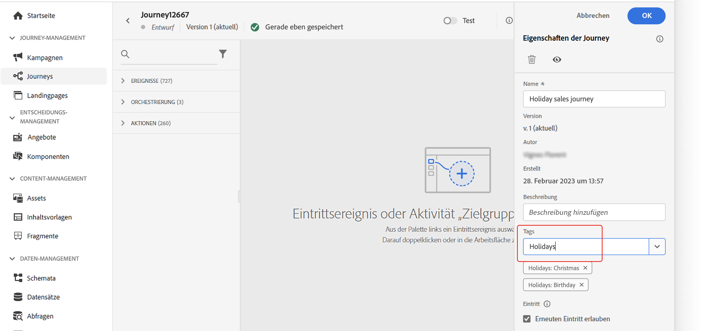
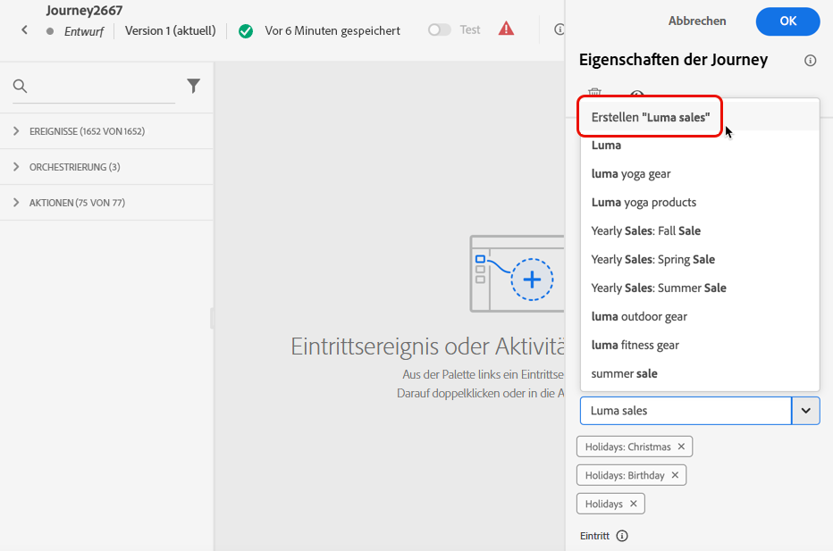
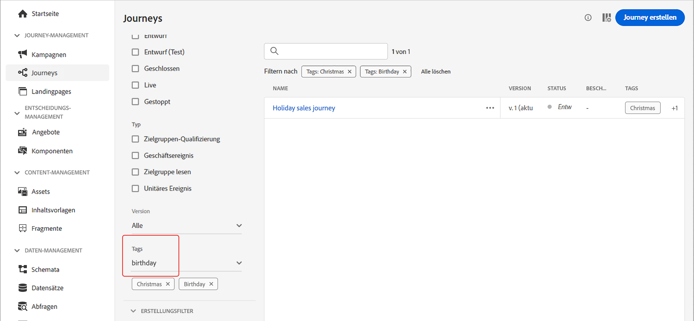
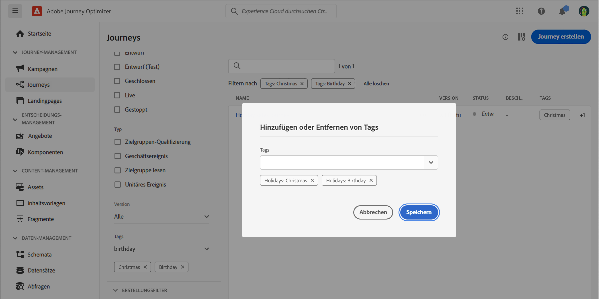

# Suchen, Filtern, Organisieren {#search-filter-organize}

>[!BEGINSHADEBOX]

**Auf dieser Seite:** Suchen und organisieren Sie Journeys, Kampagnen und Assets schnell mit universeller Suche, Listenfiltern und Tags, damit Sie auch bei wachsenden Journey Optimizer-Projekten produktiv bleiben können.

>[!ENDSHADEBOX]

Wenn Ihre Adobe Journey Optimizer-Projekte größer werden, wird das Suchen und Organisieren von Inhalten für effizientes Arbeiten unerlässlich. Auf dieser Seite erfahren Sie, wie Sie Journeys, Kampagnen und Assets mithilfe der universellen Suche schnell finden, Listen filtern, um sich auf bestimmte Elemente zu konzentrieren, und Ihre Arbeit mit Tags und Kategorien organisieren können. Mit diesen Tools können Sie durch große Inhaltsmengen navigieren, die Konsistenz über alle Teams hinweg gewährleisten und Ihre täglichen Workflows optimieren.

## Suche {#unified-search}

Verwenden Sie in der Adobe Journey Optimizer-Benutzeroberfläche die Funktion Einheitliche [!DNL Adobe CX Enterprise] in der Mitte der oberen Leiste, um Assets, Journey, Datensätze und mehr in Ihren Sandboxes zu finden.

Beginnen Sie mit der Eingabe von Inhalten, um die wichtigsten Ergebnisse anzuzeigen. In den Ergebnissen werden auch Hilfeartikel zu den eingegebenen Keywords angezeigt.

Drücken Sie die **Eingabetaste**, um auf alle Ergebnisse zuzugreifen und nach Geschäftsobjekt zu filtern.

## Filterlisten {#filter-lists}

In den meisten Listen können Sie die Suchleiste verwenden, um bestimmte Elemente zu finden und Filterkriterien zu definieren. Sie können jede Liste auch sortieren, indem Sie auf eine beliebige Spaltenüberschrift klicken. In der Ansicht „Kampagnenordner“ wird auch die Sortierung nach **[!UICONTROL Priorität]** und **[!UICONTROL Kanalkonfiguration]** unterstützt.

Sie können auf die Filter zugreifen, indem Sie auf das Filtersymbol links oben in der Liste klicken. Im Filtermenü können Sie die angezeigten Elemente nach unterschiedlichen Kriterien filtern: Sie können etwa festlegen, dass nur Elemente eines bestimmten Typs oder Status, nur von Ihnen erstellte Elemente oder nur die in den letzten 30 Tagen geänderten Elemente angezeigt werden. Die Optionen unterscheiden sich je nach Kontext.

Darüber hinaus können Sie einheitliche Tags verwenden, um eine Liste nach den einem Objekt zugewiesenen Tags zu filtern. Aktuell sind Tags für Journeys und Kampagnen verfügbar. [Erfahren Sie, wie Sie mit Tags arbeiten.](#tags)

>[!NOTE]
>
>Beachten Sie, dass angezeigte Spalten mithilfe der Konfigurationsschaltfläche oben rechts in den Listen personalisiert werden können. Die Personalisierung wird für jeden Benutzer individuell gespeichert.

In den Listen können Sie für jedes Element grundlegende Aktionen durchführen. Sie können ein Element beispielsweise duplizieren oder löschen.

## Massenaktionen {#bulk-actions}

In den Listen **Kampagnen**, **Fragmente** und **Vorlagen** können Sie mithilfe der Kontrollkästchen mehrere Elemente gleichzeitig auswählen und Vorgänge auf alle anwenden. Dazu wird eine Massenaktionsleiste am unteren Bildschirmrand angezeigt.

Folgende Operationen sind verfügbar:

* **[!UICONTROL Zum Paket hinzufügen]** – Exportieren Sie ausgewählte Elemente in eine andere Sandbox. [Weitere Informationen zum Exportieren von Objekten →](../configuration/copy-objects-to-sandbox.md)
* **[!UICONTROL In Ordner verschieben]** – Verschieben Sie ausgewählte Elemente in einen Ordner.
* **[!UICONTROL Tags bearbeiten]** – Bearbeiten Sie die mit den ausgewählten Elementen verknüpften Tags. [Weitere Informationen zum Verwenden von Tags →](#add-tags)
* **[!UICONTROL Zugriff verwalten]** – Wenden Sie Zugriffs-Labels auf ausgewählte Elemente an. [Erfahren Sie mehr über die Zugriffssteuerung auf Objektebene →](../administration/object-based-access.md)
* **[!UICONTROL Archivieren]** – Archivieren Sie ausgewählte Elemente. Verfügbar für Fragmente und Vorlagen.
* **[!UICONTROL Löschen]** – Löschen Sie ausgewählte Elemente dauerhaft. Nur für Kampagnen verfügbar.

## Arbeiten mit einheitlichen Tags {#tags}

>[!CONTEXTUALHELP]
>id="ajo_campaigns_tags"
>title="Tags"
>abstract="Über dieses Feld können Sie Ihrer Kampagne einheitliche Adobe Experience Platform-Tags zuweisen. Dies ermöglicht eine einfache Klassifizierung und verbesserte Suche über die Kampagnenliste."

Mit [einheitlichen Tags](https://experienceleague.adobe.com/docs/experience-platform/administrative-tags/overview.html?lang=de) in Adobe Experience Platform können Sie Ihre Journey Optimizer-Objekte einfach klassifizieren, um die Suche über Listen zu verbessern.

Durch das Hinzufügen aussagekräftiger Tags zu Zielgruppen in Journey Optimizer können Sie Zielgruppen später filtern und suchen, um sie leichter zu finden. Tags können außerdem verwendet werden, um Zielgruppen in relevanten, durchsuchbaren Ordnern zu organisieren, personalisierte Angebote und Erlebnisse zu erstellen und in Erlebnisentscheidungsregeln zu verwenden.

### Hinzufügen von Tags zu einem Objekt {#add-tags}

Mit dem Feld **[!UICONTROL Tags]** können Sie Tags für Ihr Objekt definieren. Tags sind für die folgenden Objekte verfügbar:

* [Kampagnen](../campaigns/create-campaign.md)
* [Entscheidungselemente](../experience-decisioning/items.md)
* [Fragmente](../content-management/fragments.md)
* [Journey-Fragmente](../building-journeys/journey-fragments.md)
* [Journeys](../building-journeys/journey-properties.md)
* [Landingpages](../landing-pages/create-lp.md)
* [Abonnement-Listen](../landing-pages/subscription-list.md)
* [Vorlagen](../content-management/content-templates.md)
* [Kanalkonfigurationen](../configuration/channel-surfaces.md#channel-config-tags)

Sie können entweder ein vorhandenes Tag auswählen oder ein neues erstellen. Gehen Sie dazu wie folgt vor.

1. Geben Sie den Anfang des Namens des gewünschten Tags ein und wählen Sie es aus der Liste aus.

   

   >[!NOTE]
   >
   > Bei Tags wird nicht wischen Groß- und Kleinschreibung unterschieden.

1. Wenn das gesuchte Tag nicht verfügbar ist, klicken Sie auf **[!UICONTROL „“ erstellen]**, um ein neues zu definieren. Es wird automatisch zum aktuellen Objekt hinzugefügt und für alle anderen Objekte verfügbar gemacht.

   

1. Die Liste der ausgewählten oder erstellten Tags wird unter dem Feld **[!UICONTROL Tags]** angezeigt. Sie können beliebig viele Tags definieren.

>[!NOTE]
> 
> Wenn Sie eine neue Version eines Objekts duplizieren oder erstellen, bleiben Tags erhalten.

### Filtern nach Tags {#filter-on-tags}

Jede Objektliste zeigt eine entsprechende Spalte an, sodass Sie Ihre Tags einfach visualisieren können.

Es ist auch ein Filter verfügbar, um nur Objekte mit bestimmten Tags anzuzeigen.

Sie können Tags zu beliebigen Typen von Journeys oder Kampagnen (Live, Entwurf usw.) hinzufügen oder daraus entfernen. Klicken Sie hierzu auf das Symbol **[!UICONTROL Mehr Aktionen]** neben dem Objekt und wählen Sie **[!UICONTROL Tags bearbeiten]** aus.

### Verwalten von Tags {#manage-tags}

Admins können Tags löschen und mithilfe des Menüs **[!UICONTROL Tags]** unter **[!UICONTROL ADMINISTRATION]** nach Kategorien organisieren. Weitere Informationen zum Verwalten von Tags finden Sie in der [Dokumentation zu einheitlichen Tags](https://experienceleague.adobe.com/docs/experience-platform/administrative-tags/ui/managing-tags.html?lang=de).

>[!NOTE]
>
> Direkt über das Feld **[!UICONTROL Tags]** in Journey Optimizer erstellte Tags werden automatisch der integrierten Kategorie „Nicht kategorisiert“ hinzugefügt.
