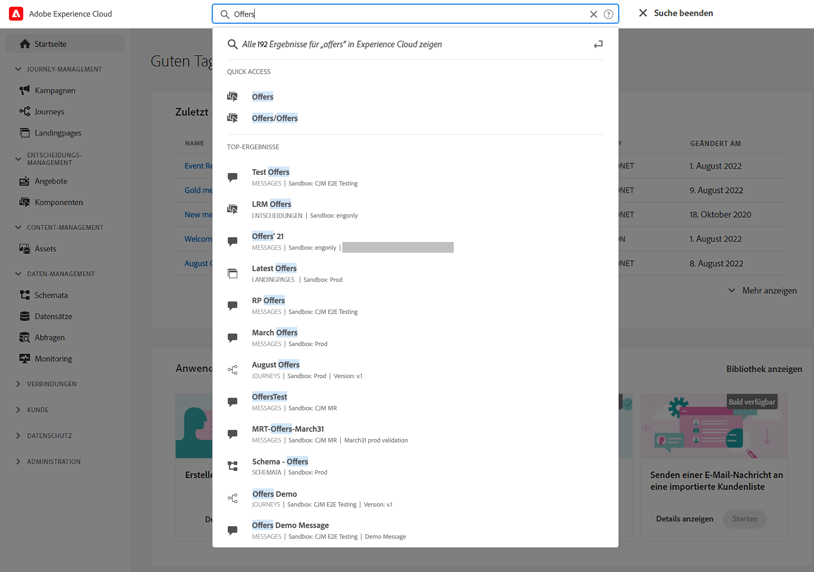
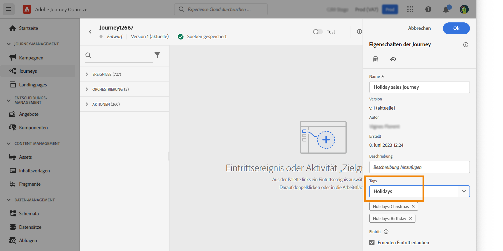

# Suchen, Filtern, Organisieren {#search-filter-organize}

## Suche{#unified-search}

Sie können auf der gesamten Benutzeroberfläche von Adobe Journey Optimizer die Adobe Experience Cloud-Suche in der Mitte der oberen Leiste verwenden, um Assets, Journeys, Datensätze und mehr in Ihren Sandboxes zu finden.

Beginnen Sie mit der Eingabe von Inhalten, um die wichtigsten Ergebnisse anzuzeigen. In den Ergebnissen werden auch Hilfeartikel zu den eingegebenen Keywords angezeigt.

Drücken Sie die **Eingabetaste**, um auf alle Ergebnisse zuzugreifen und nach Geschäftsobjekt zu filtern.

## Filterlisten{#filter-lists}

In den meisten Listen können Sie die Suchleiste verwenden, um bestimmte Elemente zu finden und Filterkriterien zu definieren.

Sie können auf die Filter zugreifen, indem Sie auf das Filtersymbol links oben in der Liste klicken. Im Filtermenü können Sie die angezeigten Elemente nach unterschiedlichen Kriterien filtern: Sie können festlegen, dass nur Elemente eines bestimmten Typs oder Status, der von Ihnen erstellten Elemente oder der in den letzten 30 Tagen geänderten Elemente angezeigt werden. Die Optionen unterscheiden sich je nach Kontext.

Darüber hinaus können Sie Unified-Tags verwenden, um eine Liste nach den einem Objekt zugewiesenen Tags zu filtern. Derzeit sind Tags für Journey und Kampagnen verfügbar. [Erfahren Sie, wie Sie mit Tags arbeiten.](#tags)

>[!NOTE]
>
>Beachten Sie, dass angezeigte Spalten mithilfe der Konfigurationsschaltfläche oben rechts in den Listen personalisiert werden können. Die Personalisierung wird für jeden Benutzer individuell gespeichert.

In den Listen können Sie für jedes Element grundlegende Aktionen durchführen. Sie können Elemente beispielsweise duplizieren oder löschen.

## Arbeiten mit einheitlichen Tags {#tags}

Mit Adobe Experience Platform [Einheitliche Tags](https://experienceleague.adobe.com/docs/experience-platform/administrative-tags/overview.html?lang=de)können Sie Ihre Journey Optimizer-Journey und -Kampagnen einfach klassifizieren, um die Suche über die Listen zu verbessern.

>[!AVAILABILITY]
>
>Einheitliche Tags befinden sich derzeit in der Betaversion. Dokumentation und Funktionalitäten können sich ändern.

### Tags zu einem Objekt hinzufügen

Die **Tags** im Feld [Journey](../building-journeys/journey-gs.md#change-properties) oder [Kampagne](../campaigns/create-campaign.md#create) -Eigenschaften können Sie Tags für Ihr Objekt definieren. Sie können entweder eine vorhandenes Tag auswählen oder ein neues erstellen.

Geben Sie den Anfang des Namens des gewünschten Tags ein und wählen Sie es aus der Liste aus. Wenn sie nicht verfügbar ist, klicken Sie auf **Erstellen** , um ein neues zu erstellen und es hinzuzufügen. Sie können beliebig viele Tags definieren.

Die Liste der definierten Tags wird unter dem Feld **Tags** angezeigt.

>[!NOTE]
>
> Bei Tags wird die Groß-/Kleinschreibung nicht beachtet.
> 
> Wenn Sie eine Journey oder Kampagne duplizieren oder eine neue Version erstellen, bleiben die Tags erhalten.

### Filtern nach Tags

In den Listen Journey und Kampagnen wird eine eigene Spalte angezeigt, sodass Sie Ihre Tags einfach visualisieren können.

Es ist auch ein Filter verfügbar, der nur Journey oder Kampagnen mit bestimmten Tags anzeigt.

Sie können Tags beliebiger Journey- oder Kampagnentypen (Live, Entwurf usw.) hinzufügen oder daraus entfernen. Klicken Sie dazu auf die Schaltfläche **Mehr Aktionen** neben dem Objekt und wählen Sie **Tags bearbeiten**.

### Verwalten von Tags

Admins können Tags löschen und mithilfe des Menüs **Tags** unter **ADMINISTRATION** nach Kategorien organisieren. Erfahren Sie mehr über die Verwaltung von Tags im [Dokumentation zu Unified Tags](https://experienceleague.adobe.com/docs/experience-platform/administrative-tags/ui/managing-tags.html).

>[!NOTE]
>
> Direkt aus dem **[!UICONTROL Tags]** -Feld in Journey Optimizer werden automatisch der integrierten Kategorie &quot;Nicht kategorisiert&quot;hinzugefügt.
