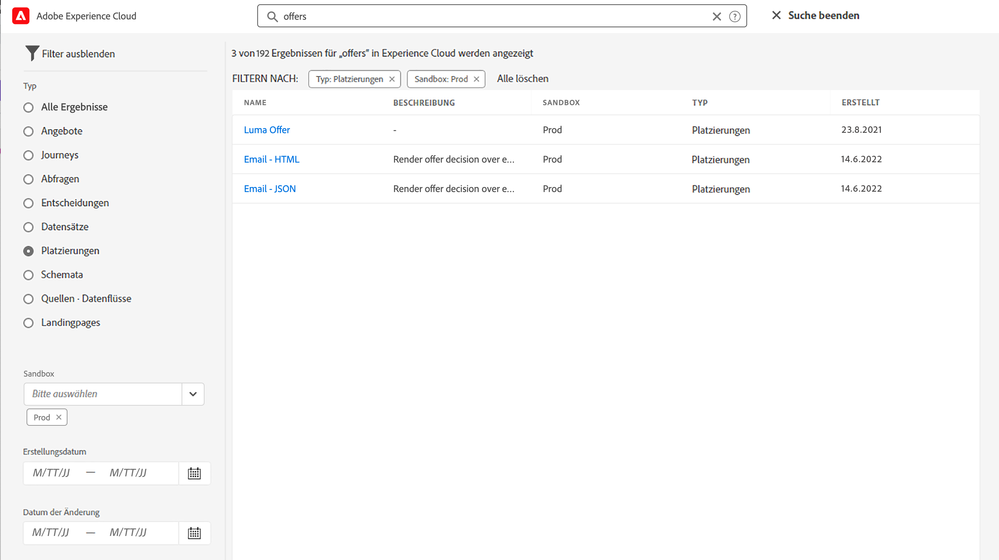
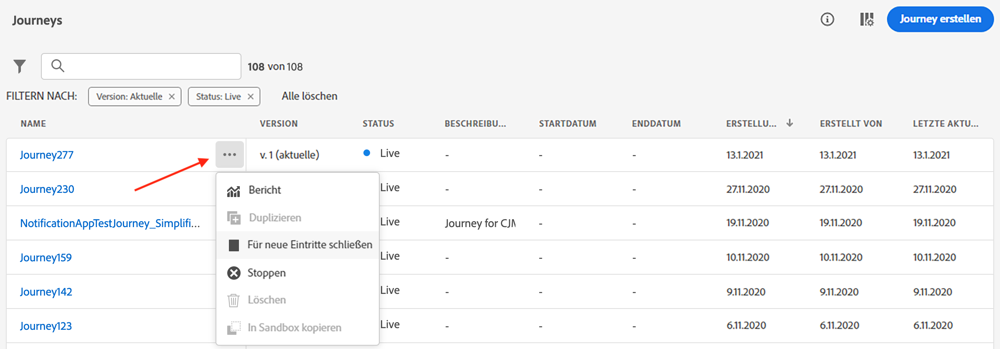
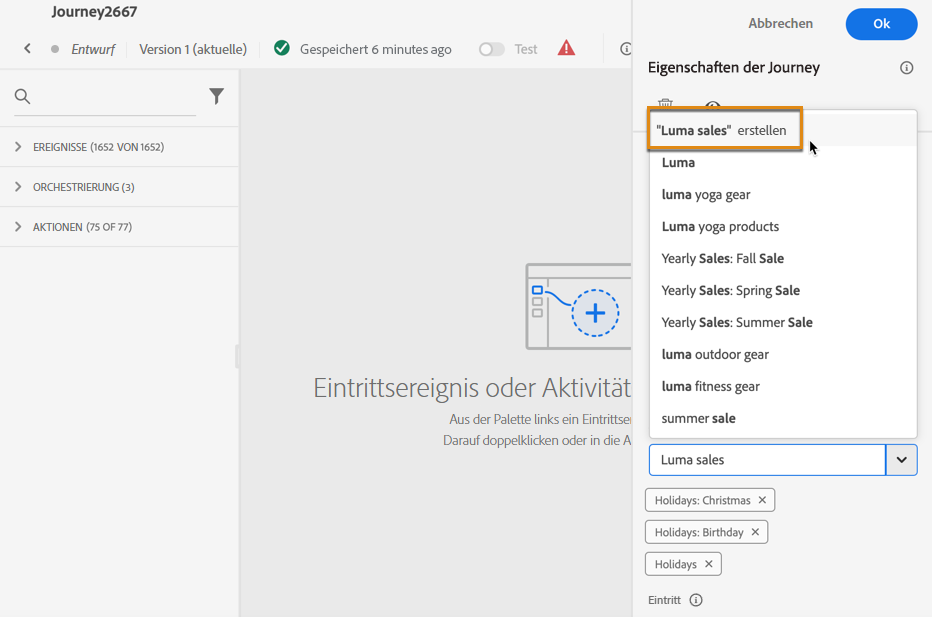

# Suchen, Filtern, Organisieren {#search-filter-organize}

## Suche{#unified-search}

Sie können auf der gesamten Benutzeroberfläche von Adobe Journey Optimizer die Adobe Experience Cloud-Suche in der Mitte der oberen Leiste verwenden, um Assets, Journeys, Datensätze und mehr in Ihren Sandboxes zu finden.

Beginnen Sie mit der Eingabe von Inhalten, um die wichtigsten Ergebnisse anzuzeigen. In den Ergebnissen werden auch Hilfeartikel zu den eingegebenen Keywords angezeigt.

Drücken Sie die **Eingabetaste**, um auf alle Ergebnisse zuzugreifen und nach Geschäftsobjekt zu filtern.

## Filterlisten{#filter-lists}

In den meisten Listen können Sie die Suchleiste verwenden, um bestimmte Elemente zu finden und Filterkriterien zu definieren.

Sie können auf die Filter zugreifen, indem Sie auf das Filtersymbol links oben in der Liste klicken. Im Filtermenü können Sie die angezeigten Elemente nach unterschiedlichen Kriterien filtern: Sie können festlegen, dass nur Elemente eines bestimmten Typs oder Status, nur von Ihnen erstellte Elemente oder nur die in den letzten 30 Tagen geänderten Elemente angezeigt werden. Die Optionen unterscheiden sich je nach Kontext.

Darüber hinaus können Sie einheitliche Tags verwenden, um eine Liste nach den einem Objekt zugewiesenen Tags zu filtern. Aktuell sind Tags für Journeys und Kampagnen verfügbar. [Erfahren Sie, wie Sie mit Tags arbeiten.](#tags)

>[!NOTE]
>
>Beachten Sie, dass angezeigte Spalten mithilfe der Konfigurationsschaltfläche oben rechts in den Listen personalisiert werden können. Die Personalisierung wird für jeden Benutzer individuell gespeichert.

In den Listen können Sie für jedes Element grundlegende Aktionen durchführen. Sie können Elemente beispielsweise duplizieren oder löschen.

## Arbeiten mit einheitlichen Tags {#tags}

>[!CONTEXTUALHELP]
>id="ajo_campaigns_tags"
>title="Tags"
>abstract="In diesem Feld können Sie Ihrer Kampagne Adobe Experience Platform Unified Tags zuweisen. Dies ermöglicht eine einfache Klassifizierung und verbesserte Suche über die Kampagnenliste."

Mit [einheitlichen Adobe Experience Platform-Tags](https://experienceleague.adobe.com/docs/experience-platform/administrative-tags/overview.html?lang=de) können Sie Ihre Journey Optimizer-Journeys und -Kampagnen einfach klassifizieren, um die Suche über Listen zu verbessern.

### Hinzufügen von Tags zu einem Objekt

Mit dem Feld **[!UICONTROL Tags]** können Sie Tags für Ihr Objekt definieren. Tags sind für die folgenden Objekte verfügbar:

* [Journeys](../building-journeys/journey-gs.md#change-properties)
* [Kampagnen](../campaigns/create-campaign.md#create)
* [Vorlagen](../content-management/content-templates.md)
* [Fragmente](../content-management/fragments.md)
* [Abonnement-Listen](../landing-pages/subscription-list.md)
* [Landingpages](../landing-pages/create-lp.md)

Sie können entweder ein vorhandenes Tag auswählen oder ein neues erstellen. Gehen Sie dazu wie folgt vor.

1. Geben Sie den Anfang des Namens des gewünschten Tags ein und wählen Sie es aus der Liste aus.

   

   >[!NOTE]
   >
   > Bei Tags wird nicht zwischen Groß- und Kleinschreibung unterschieden.

1. Wenn das gesuchte Tag nicht verfügbar ist, klicken Sie auf **[!UICONTROL „“ erstellen]**, um ein neues Objekt zu definieren. Es wird automatisch zum aktuellen Objekt hinzugefügt und für alle anderen Objekte verfügbar gemacht.

   

1. Die Liste der ausgewählten oder erstellten Tags wird unter dem Feld **[!UICONTROL Tags]** angezeigt. Sie können beliebig viele Tags definieren.

>[!NOTE]
> 
> Wenn Sie eine neue Version eines Objekts duplizieren oder erstellen, bleiben Tags erhalten.

### Filtern nach Tags

Jede Objektliste zeigt eine entsprechende Spalte an, sodass Sie Ihre Tags einfach visualisieren können.

Es ist auch ein Filter verfügbar, um nur Objekte mit bestimmten Tags anzuzeigen.

Sie können Tags zu beliebigen Typen von Journeys oder Kampagnen (Live, Entwurf usw.) hinzufügen oder daraus entfernen. Klicken Sie hierzu auf das Symbol **[!UICONTROL Mehr Aktionen]** neben dem Objekt und wählen Sie **[!UICONTROL Tags bearbeiten]** aus.

### Verwalten von Tags

Admins können Tags löschen und mithilfe des Menüs **[!UICONTROL Tags]** unter **[!UICONTROL ADMINISTRATION]** nach Kategorien organisieren. Weitere Informationen über die Verwaltung von Tags finden Sie in der [Dokumentation zu einheitlichen Tags](https://experienceleague.adobe.com/docs/experience-platform/administrative-tags/ui/managing-tags.html?lang=de).

>[!NOTE]
>
> Direkt über das Feld **[!UICONTROL Tags]** in Journey Optimizer erstellte Tags werden automatisch der integrierten Kategorie „Nicht kategorisiert“ hinzugefügt.
