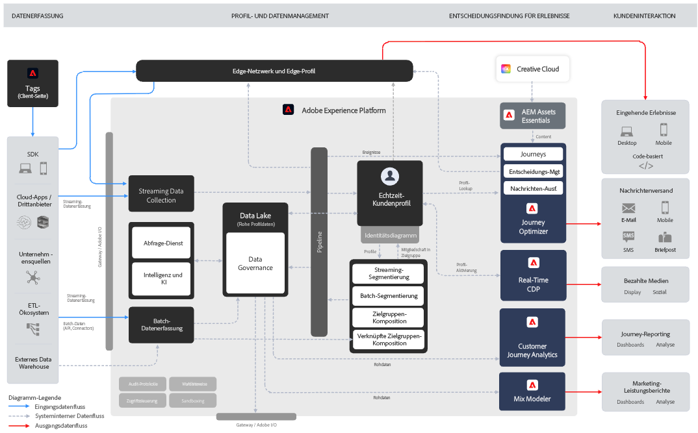

# Grundlegendes zu Journey Optimizer {#understanding-ajo}

Adobe Journey Optimizer und Adobe Experience Platform arbeiten zusammen, um eine skalierte, datengestützte Personalisierung im benötigten Umfang zu ermöglichen. Auf dieser Seite wird erläutert, wie diese Systeme funktionieren und wie ihre wichtigsten Funktionsbereiche zusammenwirken, um außergewöhnliche Kundenerlebnisse zu erstellen. [Weitere Informationen über die wichtigsten Funktionen](get-started.md) | [Wichtige Terminologie](terminology.md)

## Funktionsweise von Journey Optimizer {#how-it-works}

Adobe Journey Optimizer fungiert als kontinuierlicher Fluss, in dem Daten erfasst, analysiert und zur Erstellung personalisierter Customer Journeys angewendet werden.

### Adobe Experience Platform: Das Fundament {#aep-foundation}

Adobe Experience Platform dient als Backbone, mit dem Marken Kundendaten zentralisieren und für personalisierte Erlebnisse aktivieren können.

* **Datenplattform** – Zentrale Drehscheibe für die Erfassung, Verwaltung und Strukturierung von Kundendaten, um systemübergreifende Konsistenz zu gewährleisten. [Weitere Informationen zu Schemata und Datensätzen](../data/get-started-schemas.md)
* **Datenaufnahme (Quellen)** – Marken importieren Daten mithilfe vorkonfigurierter Connectoren aus verschiedenen Systemen wie CRM-Plattformen, Websites, Mobile Apps und Cloud-Speicher. [Weitere Informationen zu Datenquellen](get-started-sources.md)
* **Echtzeit-Kundenprofil** – Erstellt einheitliche Profile, indem Daten aus verschiedenen Quellen (E-Mail-Interaktionen, In-Store-Käufe, Web-Verhalten) zusammengeführt werden. [Weitere Informationen zu Profilen](../audience/get-started-profiles.md)
* **Governance-Ebene** – Steuert den Datenzugriff, die Einhaltung von Datenschutzbestimmungen und die Sicherheit bei gleichzeitiger Einhaltung von Vorschriften. [Dokumentation zu Datenschutz anzeigen](../privacy/get-started-privacy.md)

### Adobe Journey Optimizer: Die Orchestrierungs-Engine {#ajo-orchestration}

Adobe Journey Optimizer wendet die Daten und Erkenntnisse aus Adobe Experience Platform an, um in verschiedenen Kanälen intelligente, personalisierte Kundenerlebnisse bereitzustellen.

* **Kundenverständnis** – Echtzeit-Kundenprofile ermöglichen eine Segmentierung in Zielgruppen für gezieltes Messaging. [Erstellen von Zielgruppen](../audience/about-audiences.md)
* **Inhalte und Angebote** – Tools zum Erstellen, Verwalten und Personalisieren von Inhalten; Echtzeit-Logik zur Auswahl des besten Angebots für jede Person. [Gestalten von Inhalten](../../rp_landing_pages/content-management-landing-page.md) | [Verwalten von Angeboten](../offers/get-started/starting-offer-decisioning.md)
* **Journey- und Kampagnen-Management** – Automatisiert Interaktionssequenzen (Journeys) oder plant einmalige gezielte Nachrichten (Kampagnen). [Erstellen von Journeys](../building-journeys/journey-gs.md) | [Erstellen von Kampagnen](../campaigns/get-started-with-campaigns.md)
* **Versand (Verbindungen)** – Versendet Nachrichten über Kanäle wie E-Mail, SMS, Push-Benachrichtigungen und Direkt-Mail; exportiert Daten in externe Systeme. [Konfigurieren der Kanäle](../configuration/get-started-configuration.md)
* **Messung und Analyse** – Verfolgt die Kundeninteraktion und die Kampagnenleistung mit Berichten zur kontinuierlichen Verbesserung. [Anzeigen von Berichten](../reports/campaign-global-report-cja.md)

### Kontinuierlicher Optimierungszyklus {#optimization-cycle}

Dieses Ökosystem funktioniert als kontinuierlicher Optimierungszyklus. Daten fördern das Kundenverständnis, das in personalisierte Inhalte und Entscheidungen einfließt. Diese werden in Journeys orchestriert, kanalübergreifend bereitgestellt, auf Effektivität getestet und im Laufe der Zeit verfeinert.

## Wichtige Funktionsbereiche {#functional-areas}

Journey Optimizer umfasst sieben wichtige Funktionsbereiche, die nahtlos zusammenarbeiten. 

| Funktionsbereich | Zweck | Wichtige Aktivitäten |
|-----------------|---------|----------------|
| **Daten-Management** | Organisieren von Kundendaten | Schemata definieren, Datensätze erstellen, Daten aus verschiedenen Systemen importieren. [Weitere Informationen](../data/get-started-schemas.md) |
| **Kunden-Management** | Verstehen, wer Ihre Kundschaft ist | Einheitliche Profile erstellen, Identitäten auflösen, Zielgruppen erstellen. [Weitere Informationen](../audience/get-started-profiles.md) |
| **Content-Management** | Erstellen personalisierter Nachrichten | E-Mails erstellen, Assets verwalten, Vorlagen und Fragmente erstellen, Inhalte personalisieren. [Weitere Informationen](../../rp_landing_pages/content-management-landing-page.md) |
| **Entscheidungs-Management** | Auswählen des besten Angebots in Echtzeit | Angebotsbibliothek verwalten, Regeln definieren, Einschränkungen anwenden, Rangfolgenlogik einrichten. [Weitere Informationen](../offers/get-started/starting-offer-decisioning.md) |
| **Journey-Management** | Entwerfen automatisierter Kundenerlebnisse | Journeys mit dem visuellen Designer erstellen, Trigger festlegen, Bedingungen und Warteschritte hinzufügen. [Weitere Informationen](../building-journeys/journey-gs.md) |
| **Verbindungen** | Verbinden von Datenquellen und Kanälen | Quell-Connectoren konfigurieren, Kanäle einrichten, Verbindungen zu externen Plattformen herstellen. [Weitere Informationen](../configuration/get-started-configuration.md) |
| **Administration und Datenschutz** | Steuern des Setups und der Konformität | Benutzende verwalten, Sandboxes konfigurieren, Kanäle einrichten, Datenschutzanfragen bearbeiten. [Weitere Informationen](../administration/permissions.md) |

### So arbeiten diese Bereiche zusammen {#working-together}

Diese Funktionsbereiche arbeiten in einem kontinuierlichen Zyklus:

1. **Datenaufnahme** – Daten fließen in Adobe Experience Platform, strukturiert durch Daten-Management.
2. **Kundenverständnis** – Echtzeit-Kundenprofile vereinheitlichen Daten; Kunden-Management erstellt Zielgruppen
3. **Inhalts- und Angebotsstrategie** – Content-Management erstellt Nachrichten; Entscheidungs-Management definiert Angebotslogik
4. **Orchestrierung** – Journey-Management ordnet Interaktionen kanalübergreifend zu und nutzt dabei Kundenverständnis, Inhalte und Entscheidungen
5. **Versand** – Verbindungen erleichtern den Nachrichtenversand über Kanäle oder geben Daten an externe Systeme weiter
6. **Messung** – Leistungsdaten liefern Erkenntnisse zurück, um Zielgruppen, Inhalte, Entscheidungen und Journeys zu verfeinern
7. **Governance** – Administrations- und Datenschutzkontrollen sorgen für durchgehende Konformität

## Architekturdetails {#architecture-details}

Hier finden Sie das detaillierte Architekturdiagramm für technische Teams, das zeigt, wie Journey Optimizer mit Adobe Experience Platform integriert ist. [Navigieren Sie in der Benutzeroberfläche](user-interface.md), um diese Komponenten in der Praxis zu erkunden.

Vier Anwendungen setzen nativ auf Experience Platform auf: Adobe Real-Time Customer Data Platform, Journey Optimizer, Customer Journey Analytics und Adobe Mix Modeler. Journey Optimizer arbeitet nahtlos mit diesen Anwendungen zusammen, funktioniert aber auch unabhängig von ihnen. [Lesen Sie Leitlinien und Einschränkungen](guardrails.md) für Überlegungen zur Implementierung.

### Integrationspunkte {#integration-points}

Journey Optimizer lässt sich auf mehreren Ebenen mit Adobe Experience Platform integrieren:

* **Datenebene** – Verwendet dasselbe Echtzeit-Kundenprofil, Identitätsdiagramm und dieselben Datensätze
* **Service-Ebene** – Nutzt die Governance-, Datenschutz- und Abfrage-Services von Adobe Experience Platform
* **Anwendungsebene** – Bietet Journey-Orchestrierung, Entscheidungs-Management und Content-Management zusätzlich zu Adobe Experience Platform

Weitere Informationen zu [Adobe Journey Optimizer-Blueprints](https://experienceleague.adobe.com/de/docs/blueprints-learn/architecture/customer-journeys/journey-optimizer/journey-optimizer-overview){target="_blank"}.

## Datenschutz und Sicherheit {#privacy-security}

Die Datenschutz- und Sicherheitspraktiken von Adobe Experience Cloud gelten auch für Adobe Journey Optimizer. Diese Maßnahmen gewährleisten die Einhaltung von Datenschutzbestimmungen (z. B. DSGVO) und ermöglichen es Ihnen, für personalisierte Erlebnisse zu sorgen und gleichzeitig das Kundenvertrauen zu wahren. [Weitere Informationen zum Datenschutz in Journey Optimizer](../privacy/get-started-privacy.md)
